# 個人事業(EIAI TEC)向け事務管理システム 基本設計書

## 1. 文書情報

- 作成日: 2026-09-15 / 改訂日: 2026-09-16(2.0版)、2026-09-19(3.0版〜3.4版)
- 版数: 3.4
- 参照元: `docs/01_requirements/機能仕様書.md`(版数3.0)、`docs/01_requirements/要件定義書.md`(版数3.0)
- 対応イテレーション: イテレーション1(初回。1.1は初回イテレーション内での確認事項反映、1.2はモックアップ作成の反映)、イテレーション2(2.0、財務ダッシュボード追加)、イテレーション3(3.0、案件管理・通知・レポート出力・経営管理の追加)

> **イテレーション3の要確認事項★17〜26は、2026-09-19にEIAI TEC本人へ確認し、すべて仮置き案どおりで確定済みである(3.2版で反映)。** 3.0版の設計は仮置き案(F-11は案D=案A+案B、着手順は段階1: F-08→段階2: F-09・F-10→段階3: F-11 等)を前提としており、確認結果と一致したため設計内容の変更はない。本書に残る「★n」の付記は、確定した要確認事項の項番を示す(「仮置き」の語は使用しない)。確定内容の一覧は8.3章を参照する。

> **【3.3版】段階2(F-09・F-10、SC-16〜18)は実装済みであり、実装と照合して改訂した(該当箇所に「実装済み」を付記)。あわせて、起動時のテーブル自動作成(`create_all`)を廃止しスキーマ作成をマイグレーション(起動時自動適用)のみとした構成(3章)、手動登録の期限の通知タイトルの確定(4.17章)、SC-16〜18のモックアップ作成済みを反映した。仕様変更はない。段階3(F-11、SC-19・20)は未実装である。**

---

## 2. システム概要

本システムは、EIAI TEC本人が個人事業の事務作業(請求書発行・経費管理・見積書作成・見積→請求変換・入金/売掛金管理)を1つの画面から行えるようにする、ローカル完結型の業務管理システムである。利用者はEIAI TEC本人のみであり、ログイン認証は行わない。

対象機能は機能仕様書F-01〜F-07(請求書発行、経費管理、見積書作成、見積→請求の自動変換、入金・売掛金管理、ホーム画面・共通UI、財務ダッシュボード)である。このうちF-01〜F-06はイテレーション1で設計・実装済みであり、F-07(財務ダッシュボード)がイテレーション2での追加対象である。

F-07は、イテレーション1で構築済みの請求書・見積書・経費・入金記録の各データを月次で集計・可視化する表示専用機能であり、新規のデータ入力・編集機能ではない。そのため新規テーブルの追加は行わず、既存テーブルに対する集計処理(参照系のAPI・サービス)を追加する位置づけとなる。システム構成(3章)・技術スタックへの影響はなく、既存のバックエンド/フロントエンド構成の中に、集計用のルーター・サービス層と、ダッシュボード表示用のフロントエンド画面を追加する。

機能仕様書5.1「取引先マスタ」は独立機能としては要件定義書のスコープに明記されていないが、F-01・F-03の入力仕様(「取引先マスタから選択、または新規登録」)を実現するために、取引先マスタの一覧・登録・編集画面が必須となる。同様にF-01の発行者情報(氏名・屋号・住所・連絡先・登録番号)も「システム設定として別途登録」と機能仕様書に明記されているため、システム設定画面が必要となる。本書ではこれらを4章の画面設計に含める。いずれも機能仕様書の記載範囲を具体化したものであり、新たな業務仕様の追加ではない。

### 2.0 イテレーション3(F-08〜F-11)の位置づけ

イテレーション3では、企画書Tier2の残り4機能と、既存機能への最小限の追記を行う。

| 機能 | 位置づけ | データへの影響 |
|---|---|---|
| F-08 案件・プロジェクト管理(段階1) | 新規の業務データ「案件」を追加し、請求書・見積書・経費から任意に紐付ける | 新規テーブル`projects`。既存3テーブル(`invoices`・`quotes`・`expenses`)に`project_id`(NULL可)を追加 |
| F-09 リマインダー/通知(段階2) | 既存データ(請求書・見積書・案件)と手動登録の期限から、画面表示時に通知を算出する。通知内容は保存しない | 新規テーブル`reminder_deadlines`(手動登録の期限)、`notification_acknowledgements`(確認済みの状態のみ) |
| F-10 レポート出力(段階2) | 既存データとF-07の集計をPDF/CSVで出力する。データの書き換えは行わない | 新規テーブルなし。F-07の集計ロジックを共通サービスへ切り出して共有 |
| F-11 経営管理(段階3) | 月次の目標と実績の対比(案A)、案件別採算(案B) | 新規テーブル`management_goals`(目標のみ)。実績はF-07と同じ集計定義で算出 |

いずれも既存のバックエンド/フロントエンド構成の中に、ルーター・サービス・画面を追加する形で実現する。新規プロセス・外部サービス連携は発生しない(3.2章参照)。既存テーブルへの`project_id`追加を伴うため、既存機能(F-01〜F-07)への回帰リスクを5.4章に整理した。

### 2.1 採用技術

技術スタック(Python+React+SQLite)は要件定義書7章・8章で確定済みである。以下はその内訳として、本設計フェーズでベンダー側(本エージェント)が確定する具体的な言語バージョン・フレームワーク・ライブラリである。クライアント確認は不要とし、確認が必要な事項(実行環境の設置場所等)は8章「要確認事項」に限定して整理する。

| 分類 | 採用技術 | 選定理由 |
|---|---|---|
| バックエンド言語 | Python 3.12 | 要件定義書で確定済み。個人開発・保守のしやすさを優先し、最新の安定版を採用。 |
| Webフレームワーク | FastAPI | 型ヒットに基づく自動バリデーション(Pydantic)とAPIドキュメント自動生成により、単独開発での実装・保守効率が高い。ASGIベースで軽量。 |
| ASGIサーバー | Uvicorn | FastAPIの標準的な実行サーバーであり、ローカル単一プロセスでの起動に適する。 |
| ORM | SQLAlchemy 2.0(宣言的マッピング) | Python標準的なORMであり、SQLiteとの親和性が高く、将来的なDB製品変更(要件定義書上は想定していないが)にも耐性がある。 |
| マイグレーション管理 | Alembic | SQLAlchemyと組み合わせて使う標準的なマイグレーションツール。スキーマ変更履歴を管理する。 |
| バリデーション | Pydantic v2 | FastAPI標準。リクエスト/レスポンスのスキーマ定義とバリデーションを一体化できる。 |
| PDF生成 | WeasyPrint + Jinja2 | HTML/CSSで帳票レイアウトを組めるため、インボイス対応レイアウト(税率ごとの区分記載等)の実装・調整がしやすい。 |
| ローカルDB | SQLite 3 | 要件定義書で確定済み。単一ファイルで完結し、バックアップ(手動コピー)運用にも適する。 |
| フロントエンド言語 | TypeScript | 型安全性により、画面数・データ項目が多い本システムでの実装ミスを減らす。 |
| フロントエンドフレームワーク | React 18 | 要件定義書で確定済み。 |
| ビルドツール | Vite | 開発時のホットリロードが高速で、単独開発での生産性が高い。本番ビルドの静的ファイル出力も容易。 |
| UIコンポーネント | MUI(Material UI) v5 | フォーム・テーブル・ダイアログ等、本システムで多用するUI部品が標準提供されており、独自実装コストを抑えられる。 |
| API通信/状態管理 | TanStack Query(React Query) + Axios | サーバー状態(一覧・詳細データ)のキャッシュ・再取得管理を簡潔に実装できる。 |
| ルーティング | React Router v6 | React標準的なクライアントサイドルーティングライブラリ。 |
| フォーム制御 | React Hook Form + Zod | 入力フォームのバリデーションをスキーマベースで一元管理できる。 |
| グラフ描画ライブラリ | Recharts | 財務ダッシュボード(F-07)で必要な折れ線・棒・円グラフを宣言的なReactコンポーネントとして実装でき、MUIとの組み合わせ実績も多い。個人開発での学習コスト・保守コストが低いことを優先して選定した(2026-09-16、イテレーション2で追加確定)。 |
| カンバン(ドラッグ&ドロップ)ライブラリ | @hello-pangea/dnd | 案件カンバン(F-08)でカードの列間移動を実現するため。Reactで保守されているドラッグ&ドロップライブラリで、リスト間移動に特化しており実装が簡潔。キーボード操作にも標準対応する。列間移動はドラッグのほか、カード上のメニューでもステータス変更できるようにし、ドラッグ操作に依存しない(イテレーション3で追加確定)。 |
| CSV出力 | Python標準`csv`モジュール(UTF-8 BOM付き=`utf-8-sig`) | F-10のCSV出力(確定様式。★23)を追加ライブラリなしで実現できる。様式変更にも容易に追随できる。 |
| 通知の算出方式 | 画面表示時にサーバー側で算出(スケジューラ・常駐ジョブなし) | F-09は「アプリ内表示のみ」「アプリ非起動時の通知は行わない」(機能仕様書F-09、★21)であり、通知内容を保存する必要がない。バックグラウンドのタスク基盤を導入せず、既存の単一プロセス構成を維持できる。 |
| バックエンド依存管理 | venv + pip(requirements.txt) | 個人利用規模であり、シンプルな標準ツールで十分。 |
| フロントエンド依存管理 | npm | Node.js標準のパッケージ管理。 |
| 実行環境OS | macOS専用(Windows対応なし) | EIAI TEC本人が使用するPCはMacのみであるため(2026-09-15確定)。Windows向けの起動スクリプト・依存パッケージ手順・動作検証を不要とし、実装・保守コストを抑える。 |
| アプリケーション起動方式 | カスタムmacOS `.app`バンドル(シェルスクリプトランチャー)によるダブルクリック起動 | EIAI TEC本人はターミナル操作を行わず、ダブルクリックで起動・終了できることを希望(2026-09-15確定)。PyInstaller等によるPythonバックエンド単体の実行ファイル化(単一バイナリ化)は、PDF生成ライブラリ(WeasyPrint)がPango/Cairo/GDK-PixBuf等のネイティブ共有ライブラリをHomebrew経由・実行時動的読み込み(dlopen)で利用する構成であるため、PyInstallerの静的解析による依存検出・同梱が不安定になりやすく、個人開発での保守負荷が高いと判断し採用しない(py2appも同様の理由で不採用)。本システムは配布を想定しない単一Mac・単一ユーザー向けのため、完全自己完結型バイナリである必要はなく、既存のvenv環境(Homebrew導入済みのネイティブライブラリを含む)をそのまま実行させる軽量な`.app`ラッパーの方が実現性・保守性の面で優れると判断した。実現方式の詳細は詳細設計書4.7章を参照。 |

---

## 3. システム構成図

本システムは、EIAI TEC本人のMac内で完結するローカルWebアプリケーションとして構成する。バックエンド(FastAPI)が単一プロセスとして起動し、フロントエンド(Reactビルド成果物)の静的配信とAPI提供の両方を担う。ブラウザから`http://127.0.0.1:8000`にアクセスして利用する。

実行環境はEIAI TEC本人のMacのみを対象とし(Windows対応は行わない)、起動・終了はターミナル操作を伴わない`.app`バンドル(「起動.app」「終了.app」)のダブルクリックで行う。

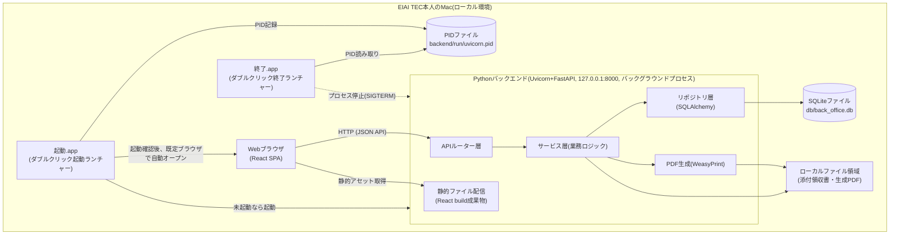
```mermaid
graph TB
    subgraph PC["EIAI TEC本人のMac(ローカル環境)"]
        StartApp["起動.app<br/>(ダブルクリック起動ランチャー)"]
        StopApp["終了.app<br/>(ダブルクリック終了ランチャー)"]
        Browser["Webブラウザ<br/>(React SPA)"]
        subgraph Backend["Pythonバックエンド(Uvicorn+FastAPI, 127.0.0.1:8000, バックグラウンドプロセス)"]
            API["APIルーター層"]
            Static["静的ファイル配信<br/>(React build成果物)"]
            Service["サービス層(業務ロジック)"]
            Repo["リポジトリ層(SQLAlchemy)"]
            PDF["PDF生成(WeasyPrint)"]
        end
        Pid[("PIDファイル<br/>backend/run/uvicorn.pid")]
        DB[("SQLiteファイル<br/>db/back_office.db")]
        Files["ローカルファイル領域<br/>(添付領収書・生成PDF)"]
    end

    StartApp -->|"未起動なら起動"| Backend
    StartApp -->|"PID記録"| Pid
    StartApp -->|"起動確認後、既定ブラウザで自動オープン"| Browser
    StopApp -->|"PID読み取り"| Pid
    StopApp -.->|"プロセス停止(SIGTERM)"| Backend
    Browser -->|"HTTP (JSON API)"| API
    Browser -->|"静的アセット取得"| Static
    API --> Service
    Service --> Repo
    Service --> PDF
    Repo --> DB
    PDF --> Files
    Service --> Files
```

- 開発時はフロントエンドをVite開発サーバー(`localhost:5173`)で起動し、APIリクエストをバックエンド(`localhost:8000`)にプロキシする構成とする(これは開発フェーズのみの構成であり、EIAI TEC本人が日常利用する構成ではない)。
- 実運用時(EIAI TEC本人が日常利用する際)は、`npm run build`で生成したReact静的ファイルをFastAPIの`StaticFiles`機能で配信し、単一プロセス・単一ポート(`127.0.0.1:8000`)で完結させる。
- 外部ネットワークからのアクセスを避けるため、Uvicornのバインドアドレスは`127.0.0.1`に限定する(要件定義書7章のセキュリティ方針を踏まえた最低限の配慮)。
- 日常利用時の起動・終了は、デスクトップ等に配置した「起動.app」「終了.app」のダブルクリックのみで行い、ターミナル操作は不要とする。「起動.app」はバックエンド(Uvicorn)をバックグラウンドプロセスとして起動し、起動確認後に既定のWebブラウザで自動的に画面を開く。既に起動済みの場合は再起動せずブラウザを開くのみとする。「終了.app」はバックグラウンドで動作中のバックエンドプロセスを停止する。実現方式(ランチャースクリプトの内部処理、ビルド・パッケージング手順)の詳細は詳細設計書4.7章を参照。
- データ保存場所(SQLiteファイル・添付ファイル・生成PDF)は、EIAI TEC本人の希望によりプロジェクトフォルダ配下の`db/`・`data/`とする(2026-09-15確定。5章・詳細設計書6章参照)。

### 3.1 財務ダッシュボード(F-07)追加によるシステム構成への影響(イテレーション2)

- 上記のシステム構成図・構成要素(単一プロセスのFastAPIバックエンド、React SPA、SQLiteファイル1つ)に変更はない。F-07は既存の`Backend`プロセス内に、集計用のAPIルーター・サービス層(詳細設計書5章参照)を追加するのみであり、新規プロセス・新規ミドルウェア・外部サービス連携は発生しない。
- 新規テーブルは追加しない。F-07は、イテレーション1で構築済みの`invoices`・`invoice_items`・`quotes`・`quote_items`・`expenses`・`payments`(詳細設計書6章)を読み取り、月次に集計して返すAPIを追加するのみである。
- 集計クエリの性能を考慮し、既存テーブルの日付列(`invoices.issue_date`、`quotes.issue_date`、`payments.payment_date`)に対するインデックス追加を検討する(詳細設計書6.4章参照)。これはテーブル定義自体の変更ではなく、既存テーブルへのインデックス追加(Alembicマイグレーション)にとどまる。
- 本機能は読み取り専用であり、ダッシュボード画面からのデータ編集・書き込みは行わない(機能仕様書F-07入力仕様)。

### 3.2 F-08〜F-11追加によるシステム構成への影響(イテレーション3)

- システム構成図・構成要素(単一プロセスのFastAPIバックエンド、React SPA、SQLiteファイル1つ)に変更はない。新規プロセス・ミドルウェア・外部サービス連携は発生しない。
- バックエンドに、案件・通知・レポート・経営管理のルーター/サービスを追加する。F-07の集計ロジックは、F-10・F-11から共用するため「月次集計サービス」として切り出す(詳細設計書5章)。F-07の画面・APIの外部仕様は変えない。
- PDF(月次損益集計レポート)は既存のWeasyPrint + Jinja2を用いる。CSVはPython標準ライブラリで生成する。出力ファイルはサーバーに保存せず、HTTPレスポンスとして返却し、ブラウザのダウンロード機能でEIAI TEC本人のPCへ保存する(保存先はブラウザの設定・保存ダイアログで本人が指定する)。
- 通知は、画面表示時のAPI呼び出しでサーバーが都度算出する。アプリ(バックエンド)が起動していない間は通知されない(機能仕様書F-09、★21で確定)。
- DBは、既存3テーブルへの列追加と新規4テーブルの追加を、Alembicマイグレーションで行う(詳細設計書6.5章)。段階1(`projects`・`project_id`列)と段階2(`reminder_deadlines`・`notification_acknowledgements`)は実装済みである。
- スキーマの作成・変更はAlembicマイグレーションのみで行い、アプリ(バックエンド)の起動時にテーブルを自動作成する処理(`create_all`)は持たない(2026-09-19確定)。「起動.app」がUvicorn起動の前にマイグレーションを自動適用する(適用前のDBを退避コピー。詳細設計書4.7.3.1・4.7.3.4)。開発時に`uvicorn`を直接起動する場合は、先にマイグレーションのコマンド(`python -m app.migrate`)を実行する。DBファイルの場所は既定`db/back_office.db`で、環境変数`BACK_OFFICE_DB_PATH`で差し替えできる。自動テストは実DBに接触しない(テスト用のDBパスへ差し替えて実行。詳細設計書4.13.3)。

---

## 4. 画面設計

### 4.0 画面一覧とモックアップ方針

| 画面ID | 画面名 | 対応機能 |
|---|---|---|
| SC-01 | ホーム画面 | F-06 |
| SC-02 | 請求書一覧画面 | F-01、F-05(入金状況表示) |
| SC-03 | 請求書詳細・編集画面 | F-01、F-04(変換後の編集)、F-05(入金記録セクション) |
| SC-04 | 見積書一覧画面 | F-03 |
| SC-05 | 見積書詳細・編集画面 | F-03、F-04(変換操作の起点) |
| SC-06 | 経費一覧・検索画面 | F-02 |
| SC-07 | 経費登録・編集画面 | F-02 |
| SC-08 | 経費集計画面 | F-02 |
| SC-09 | 売掛金一覧画面 | F-05 |
| SC-10 | 取引先マスタ管理画面 | F-01・F-03の前提(共通マスタ) |
| SC-11 | システム設定画面(発行者情報) | F-01の前提(共通設定) |
| SC-12 | 財務ダッシュボード画面 | F-07(イテレーション2) |
| SC-13 | 案件一覧画面 | F-08(イテレーション3・段階1) |
| SC-14 | 案件カンバン画面 | F-08(イテレーション3・段階1) |
| SC-15 | 案件詳細・編集画面 | F-08(イテレーション3・段階1) |
| SC-16 | 通知一覧画面 | F-09(イテレーション3・段階2) |
| SC-17 | 期限一覧・登録・編集画面 | F-09(イテレーション3・段階2) |
| SC-18 | レポート出力画面 | F-10(イテレーション3・段階2) |
| SC-19 | 目標と実績の対比画面 | F-11(イテレーション3・段階3) |
| SC-20 | 案件別採算一覧画面 | F-11(イテレーション3・段階3) |

イテレーション3で変更する既存画面は、SC-01(導線カード・通知エリアの追加)、SC-02(案件名の表示)、SC-03(案件選択欄の追加)、SC-04(案件名の表示)、SC-05(案件選択欄の追加)、SC-07(案件選択欄の追加。★20で確定)である。上記以外の既存画面(SC-06・SC-08〜SC-12)に変更はない。

画面レイアウトのHTML/CSSモックアップは`docs/02_architect/mockups/`にdesignerサブエージェントが作成済みである(2026-09-15、SC-01〜SC-11)。各画面の「画面レイアウト」節に、対応するモックアップ画像・HTMLへの相対リンクを付す。モックアップは本章の確定内容(操作と実現内容、詳細設計書3章の入力項目定義表)の可視化であり、新規仕様の追加は行っていない。ダミーデータは実在の個人名等を避けたサンプル値である。SC-12(財務ダッシュボード)のモックアップは2.0版の後続作業で作成済みである。イテレーション3で追加・変更する画面のモックアップは、3.0版時点では未作成であったが、その後、段階1分(SC-13〜15、SC-01〜05・07)をdesignerサブエージェントが作成済みである(3.1版)。段階2分(SC-16〜18)も作成済みである(3.3版)。SC-19・20は未作成であり、4.20・4.21章の内容を入力として、designerサブエージェントに作成を依頼する(モックアップの要否は下表の「モックアップ」列を参照)。

| 画面ID | モックアップファイル |
|---|---|
| SC-01 | [SC-01_home.html](./mockups/SC-01_home.html) / [SC-01_home.png](./mockups/SC-01_home.png) |
| SC-02 | [SC-02_invoice-list.html](./mockups/SC-02_invoice-list.html) / [SC-02_invoice-list.png](./mockups/SC-02_invoice-list.png) |
| SC-03 | [SC-03_invoice-detail.html](./mockups/SC-03_invoice-detail.html) / [SC-03_invoice-detail.png](./mockups/SC-03_invoice-detail.png) |
| SC-04 | [SC-04_quote-list.html](./mockups/SC-04_quote-list.html) / [SC-04_quote-list.png](./mockups/SC-04_quote-list.png) |
| SC-05 | [SC-05_quote-detail.html](./mockups/SC-05_quote-detail.html) / [SC-05_quote-detail.png](./mockups/SC-05_quote-detail.png) |
| SC-06 | [SC-06_expense-list.html](./mockups/SC-06_expense-list.html) / [SC-06_expense-list.png](./mockups/SC-06_expense-list.png) |
| SC-07 | [SC-07_expense-form.html](./mockups/SC-07_expense-form.html) / [SC-07_expense-form.png](./mockups/SC-07_expense-form.png) |
| SC-08 | [SC-08_expense-summary.html](./mockups/SC-08_expense-summary.html) / [SC-08_expense-summary.png](./mockups/SC-08_expense-summary.png) |
| SC-09 | [SC-09_receivable-list.html](./mockups/SC-09_receivable-list.html) / [SC-09_receivable-list.png](./mockups/SC-09_receivable-list.png) |
| SC-10 | [SC-10_client-master.html](./mockups/SC-10_client-master.html) / [SC-10_client-master.png](./mockups/SC-10_client-master.png) |
| SC-11 | [SC-11_settings.html](./mockups/SC-11_settings.html) / [SC-11_settings.png](./mockups/SC-11_settings.png) |
| SC-12 | [SC-12_financial-dashboard.html](./mockups/SC-12_financial-dashboard.html) / [SC-12_financial-dashboard.png](./mockups/SC-12_financial-dashboard.png) |
| SC-16 | [SC-16_notification-list.html](./mockups/SC-16_notification-list.html) / [SC-16_notification-list.png](./mockups/SC-16_notification-list.png) |
| SC-17 | [SC-17_deadline-list.html](./mockups/SC-17_deadline-list.html) / [SC-17_deadline-list.png](./mockups/SC-17_deadline-list.png) |
| SC-18 | [SC-18_report-export.html](./mockups/SC-18_report-export.html) / [SC-18_report-export.png](./mockups/SC-18_report-export.png) |

イテレーション3のモックアップ要否(designerへの依頼対象)は次のとおり。

| 画面ID | 区分 | モックアップ | 理由・依頼内容 |
|---|---|---|---|
| SC-13 案件一覧 | 新規 | 作成済み(段階1) | 新規画面。一覧テーブルと絞り込みの構成確認のため |
| SC-14 案件カンバン | 新規 | 作成済み(段階1) | 新規かつ本システム初のドラッグ操作画面。列構成・カードの表示要素(納期の超過/接近の表示)の確認が必須 |
| SC-15 案件詳細・編集 | 新規 | 作成済み(段階1) | 新規。案件情報+紐付け一覧+件数・金額・入金状況サマリーの配置確認のため |
| SC-16 通知一覧 | 新規 | 作成済み(段階2) | 新規。超過/接近の状態表示、確認済みの操作の配置確認のため |
| SC-17 期限一覧・登録・編集 | 新規 | 作成済み(段階2) | 新規。一覧+登録ダイアログの構成確認のため |
| SC-18 レポート出力 | 新規 | 作成済み(段階2) | 新規。種類選択・期間指定・出力形式の操作構成確認のため |
| SC-19 目標と実績の対比 | 新規 | 要作成(段階3) | 新規。月次の表+グラフ、目標登録の構成確認のため |
| SC-20 案件別採算一覧 | 新規 | 要作成(段階3) | 新規。案件別一覧と「案件なし」合計行の構成確認のため |
| SC-01 ホーム | 変更 | 更新済み | 導線カード(案件・通知/期限・レポート・経営管理)の追加と通知エリアの新設で全体レイアウトが変わる |
| SC-03 請求書詳細・編集 | 変更 | 更新済み | 案件選択欄の追加のみ。基本情報エリアの配置確認のため更新を推奨 |
| SC-05 見積書詳細・編集 | 変更 | 更新済み | 同上 |
| SC-02 請求書一覧 | 変更 | 更新済み | 一覧に「案件」列を1列追加。列幅の確認のため |
| SC-04 見積書一覧 | 変更 | 更新済み | 同上 |
| SC-07 経費登録・編集 | 変更 | 更新済み(★20確定のため案件欄を含む) | 経費の案件紐付けは★20で「紐付ける」に確定。案件選択欄の追加のみ |

段階ごとに実装・確認するため、モックアップも段階1(SC-13〜15、SC-02〜05、SC-07)→段階2(SC-16〜18)→段階3(SC-19・20)の順で依頼してよい。SC-01は最終形(全カード+通知エリア)を1回で作成し、実装時は当該段階で利用可能な機能のカードのみを表示する。

各画面の「画面レイアウト」節には、モックアップ作成の入力となった表示要素を箇条書きで示す。

### 4.1 全体画面遷移図

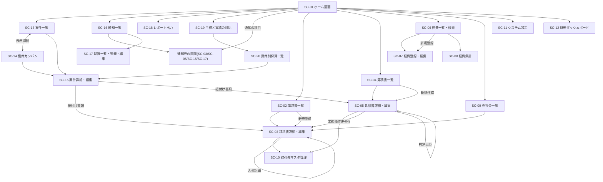
```mermaid
flowchart TD
    Home["SC-01 ホーム画面"]
    InvList["SC-02 請求書一覧"]
    InvDetail["SC-03 請求書詳細・編集"]
    QuoteList["SC-04 見積書一覧"]
    QuoteDetail["SC-05 見積書詳細・編集"]
    ExpList["SC-06 経費一覧・検索"]
    ExpForm["SC-07 経費登録・編集"]
    ExpSummary["SC-08 経費集計"]
    Receivable["SC-09 売掛金一覧"]
    ClientMaster["SC-10 取引先マスタ管理"]
    Settings["SC-11 システム設定"]
    Dashboard["SC-12 財務ダッシュボード"]
    ProjList["SC-13 案件一覧"]
    Kanban["SC-14 案件カンバン"]
    ProjDetail["SC-15 案件詳細・編集"]
    NotifList["SC-16 通知一覧"]
    DeadlineList["SC-17 期限一覧・登録・編集"]
    Report["SC-18 レポート出力"]
    GoalVsActual["SC-19 目標と実績の対比"]
    ProjProfit["SC-20 案件別採算一覧"]

    Home --> ProjList
    Home --> NotifList
    Home --> Report
    Home --> GoalVsActual
    Home -->|通知の項目| NotifTargets["通知元の画面(SC-03/SC-05/SC-15/SC-17)"]
    ProjList <-->|表示切替| Kanban
    ProjList --> ProjDetail
    Kanban --> ProjDetail
    ProjDetail -->|紐付け書類| InvDetail
    ProjDetail -->|紐付け書類| QuoteDetail
    NotifList --> NotifTargets
    NotifList --> DeadlineList
    GoalVsActual --> ProjProfit
    ProjProfit --> ProjDetail

    Home --> InvList
    Home --> QuoteList
    Home --> ExpList
    Home --> Receivable
    Home --> Settings
    Home --> Dashboard

    InvList --> InvDetail
    InvList -->|新規作成| InvDetail
    InvDetail --> ClientMaster
    InvDetail -->|PDF出力| InvDetail

    QuoteList --> QuoteDetail
    QuoteList -->|新規作成| QuoteDetail
    QuoteDetail --> ClientMaster
    QuoteDetail -->|"変換操作(F-04)"| InvDetail
    QuoteDetail -->|PDF出力| QuoteDetail

    ExpList --> ExpForm
    ExpList -->|新規登録| ExpForm
    ExpList --> ExpSummary

    Receivable --> InvDetail
    InvDetail -->|入金記録| InvDetail
```

イテレーション3では、ホーム画面から案件・通知・レポート・経営管理への導線を追加し、案件詳細から紐付いた請求書・見積書へ遷移できる。通知の各項目は、種類に応じて元データの画面(請求書はSC-03、見積書はSC-05、案件はSC-15、手動登録の期限はSC-17)へ遷移する。案件一覧(SC-13)とカンバン(SC-14)は同じ案件データの表示切替(タブ)であり、相互に行き来できる。

上図が全画面に共通する遷移関係である。各画面の節では、この図を前提として当該画面からの主要な遷移のみを箇条書きで補足する。

### 4.2 ホーム画面(SC-01)

#### 画面レイアウト

モックアップ: [HTML](./mockups/SC-01_home.html) / 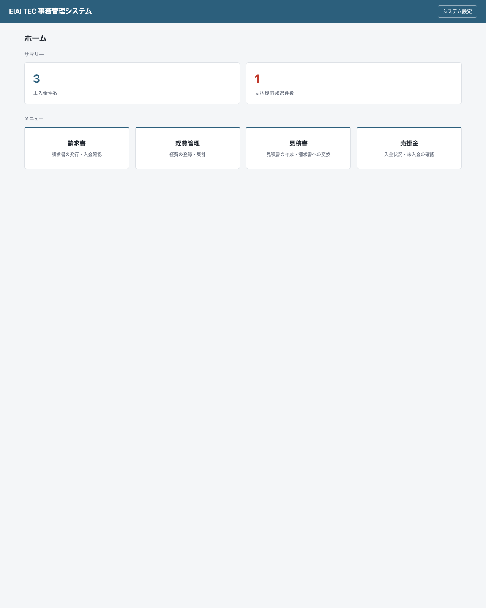

- ヘッダー(システム名表示)
- 各機能への導線カード(請求書発行、経費管理、見積書作成、入金・売掛金管理、財務ダッシュボードの5枚。見積→請求変換は独立カードを設けない。財務ダッシュボードカードはイテレーション2で追加)
- サマリー表示エリア(未入金件数、支払期限超過件数)
- システム設定への導線(ヘッダーまたはフッター等、目立ちすぎない位置)

#### 操作と実現内容

| 操作 | 実現内容 |
|---|---|
| 「請求書」カードをクリック | SC-02(請求書一覧画面)へ遷移する |
| 「経費管理」カードをクリック | SC-06(経費一覧・検索画面)へ遷移する |
| 「見積書」カードをクリック | SC-04(見積書一覧画面)へ遷移する |
| 「売掛金」カードをクリック | SC-09(売掛金一覧画面)へ遷移する |
| 「財務ダッシュボード」カードをクリック | SC-12(財務ダッシュボード画面)へ遷移する(機能仕様書F-06処理内容1、イテレーション2で追加) |
| 画面表示時(自動) | 未入金件数・支払期限超過件数をAPIから取得し表示する。取得失敗時は当該箇所にエラー表示を行い、他のカード導線の表示・操作には影響させない(機能仕様書F-06例外仕様) |
| 「システム設定」導線をクリック | SC-11(システム設定画面)へ遷移する |

#### イテレーション3変更(機能仕様書F-06追記。★21で確定)

- 導線カードを追加する: 「案件管理」(SC-14カンバンを既定として開く。SC-13へ切替可)、「通知・期限」(SC-16)、「レポート出力」(SC-18)、「経営管理」(SC-19)。既存5枚のカードの配置・遷移は変更しない。
- 通知エリアを新設する(サマリー表示エリアの下)。表示内容は、未確認の通知件数(うち期限超過の件数)と、通知の上位5件(種類・内容・期限日・超過/接近の状態)。5件を超える場合は「すべての通知を見る」でSC-16へ遷移する。既存のサマリー(未入金件数・支払期限超過件数)は変更しない。
- 通知の上位件数は5件とする(機能仕様書F-06の仮置きを設計で確定。並び順は「超過が先頭、期限日の近い順」で、SC-16と同じ)。
- 通知エリアは独立したAPIから取得し、取得に失敗した場合は通知エリアのみエラー表示とする。種類ごとの元データ取得失敗は、その種類のみ「取得できませんでした」の表示とする(詳細設計書4.10章)。
- 通知の項目をクリックすると元データの画面へ遷移する。項目上の「確認済み」ボタンで、その通知をホーム画面・SC-16の既定表示から非表示にする。

### 4.3 請求書一覧画面(SC-02)

#### 画面レイアウト

モックアップ: [HTML](./mockups/SC-02_invoice-list.html) / 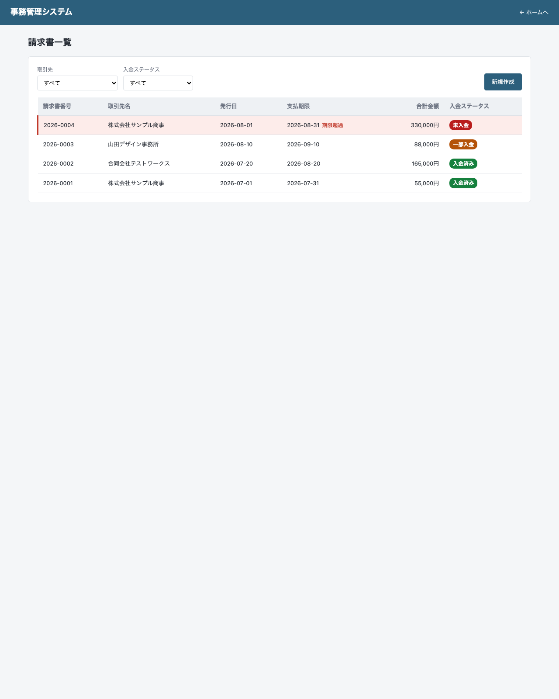

- 請求書一覧テーブル(請求書番号・取引先名・発行日・支払期限・合計金額・入金ステータス)
- 支払期限超過の請求書は行を強調表示(背景色・アイコン等)
- 「新規作成」ボタン
- 取引先・入金ステータスによる絞り込み(任意項目として用意)

#### 操作と実現内容

| 操作 | 実現内容 |
|---|---|
| 「新規作成」ボタン押下 | SC-03(請求書詳細・編集画面)を新規作成モードで開く |
| 一覧の行をクリック | 対象請求書のSC-03(詳細画面)を表示する |
| 画面表示時(自動) | 請求書一覧をAPIから取得し、入金ステータス(未入金/一部入金/入金済み)を算出・表示する。支払期限を過ぎても未入金・一部入金の請求書は強調表示する(機能仕様書F-05処理内容2・3) |

**イテレーション3変更(★19)**: 一覧テーブルに「案件」列(案件名。案件なしの請求書は空欄)を追加する。絞り込み条件・操作は変更しない。

### 4.4 請求書詳細・編集画面(SC-03)

#### 画面レイアウト

モックアップ: [HTML](./mockups/SC-03_invoice-detail.html) / 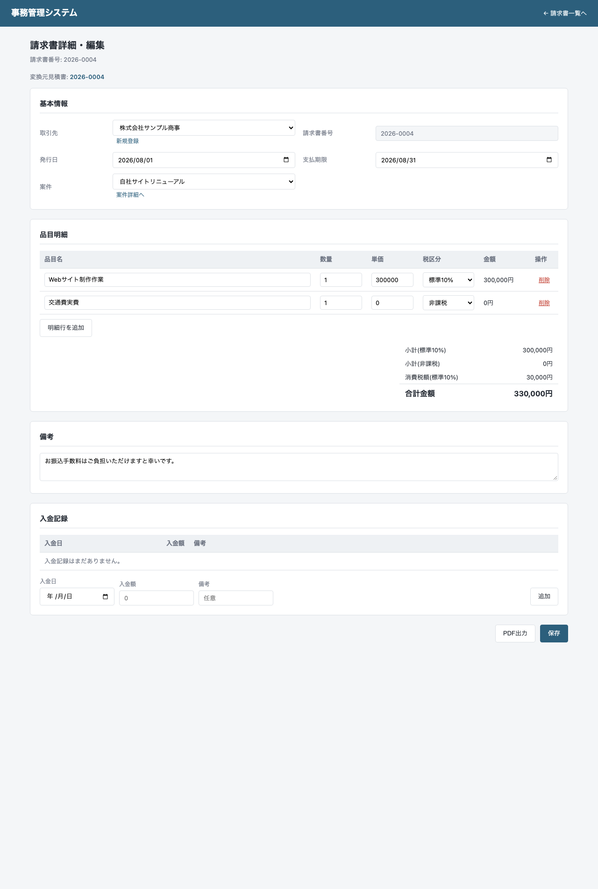

- 基本情報エリア(取引先選択、発行日、支払期限、請求書番号(自動採番・表示のみ))
- 品目明細テーブル(品目名・数量・単価・税区分・金額。行の追加/削除が可能)
- 税区分ごとの小計・消費税額、合計金額の自動表示エリア
- 備考欄
- 変換元見積書がある場合、その見積書番号を表示するリンク(F-04)
- 入金記録セクション(入金日・入金額・備考の一覧、入金追加フォーム)。F-05参照
- 「保存」「PDF出力」ボタン

#### 操作と実現内容

| 操作 | 実現内容 |
|---|---|
| 品目明細の数量・単価を入力 | 行ごとの金額、税区分ごとの小計・消費税額、合計金額をリアルタイムに自動計算して表示する(機能仕様書F-01処理内容1〜3) |
| 「明細行を追加」ボタン押下 | 空の明細行を1行追加する |
| 明細行の「削除」ボタン押下 | 当該行を削除する(残り0件になる場合は保存時にエラーとする) |
| 取引先欄で「新規登録」を選択 | SC-10(取引先マスタ管理画面)を開き、登録後に本画面へ戻り選択状態にする |
| 「保存」ボタン押下 | 品目明細0件、取引先未選択、数量・単価が0以下または数値以外の場合はエラーメッセージを表示し保存しない。新規作成時は請求書番号を自動採番して保存する(機能仕様書F-01例外仕様) |
| 「PDF出力」ボタン押下 | 保存済みの請求書データをもとにPDFを生成し、画面から保存・印刷できるようにする。インボイス対応レイアウト(登録番号欄・税率ごとの区分記載)を含む(機能仕様書F-01処理内容5・6) |
| 変換元見積書リンクをクリック | SC-05(見積書詳細・編集画面)へ遷移する(F-04) |
| 入金記録セクションで入金を追加 | 入金日・入金額を入力し保存する。入金額が0以下・数値以外はエラーとする。入金額合計が請求金額を超過する場合は確認メッセージを表示し、登録可否をユーザーに委ねる(機能仕様書F-05例外仕様) |

**イテレーション3変更(★19)**: 基本情報エリアに「案件」選択欄(任意、未選択可)を追加する。F-04で変換された請求書は、変換元見積書の案件が初期選択される(変更・解除可)。既存の請求書は「案件なし」で表示され、後から選択して保存できる。案件の選択肢には完了済みの案件も含める(警告なし。機能仕様書F-08例外仕様)。発行日・支払期限が未設定のF-04変換直後の請求書でも、案件の紐付け変更のみを行えるようにする(詳細設計書4.9.5章)。

### 4.5 見積書一覧画面(SC-04)

#### 画面レイアウト

モックアップ: [HTML](./mockups/SC-04_quote-list.html) / 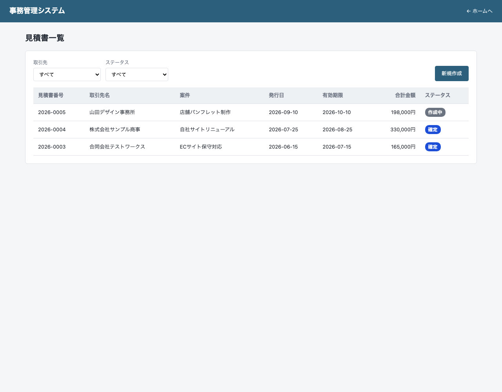

- 見積書一覧テーブル(見積書番号・取引先名・発行日・有効期限・合計金額・ステータス「作成中/確定」)
- 「新規作成」ボタン

#### 操作と実現内容

| 操作 | 実現内容 |
|---|---|
| 「新規作成」ボタン押下 | SC-05(見積書詳細・編集画面)を新規作成モードで開く |
| 一覧の行をクリック | 対象見積書のSC-05(詳細画面)を表示する |

**イテレーション3変更(★19)**: 一覧テーブルに「案件」列を追加する(SC-02と同様)。

### 4.6 見積書詳細・編集画面(SC-05)

#### 画面レイアウト

モックアップ: [HTML](./mockups/SC-05_quote-detail.html) / 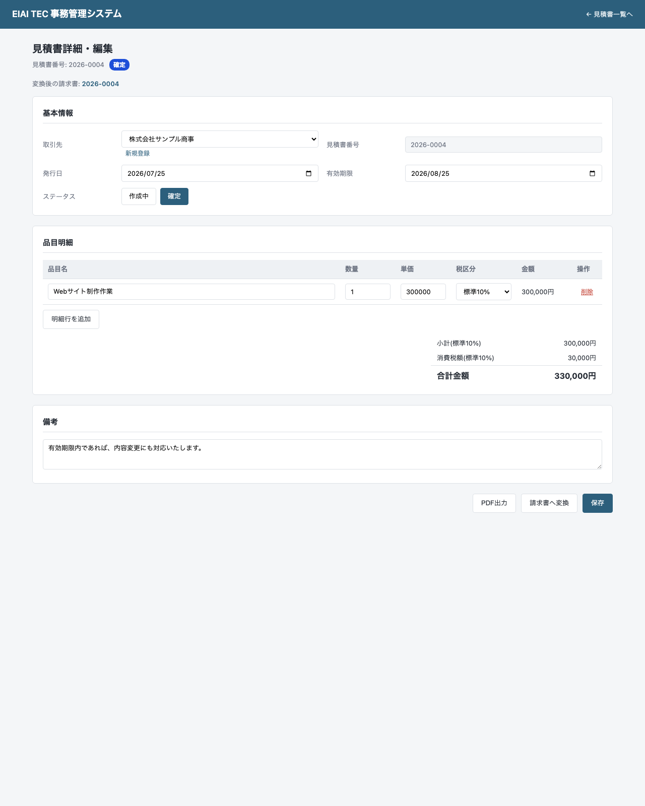

- 基本情報エリア(取引先選択、発行日、有効期限、見積書番号(自動採番・表示のみ)、ステータス「作成中/確定」の切替)
- 品目明細テーブル(SC-03と同様)
- 税区分ごとの小計・消費税額、合計金額の自動表示エリア
- 備考欄
- 「保存」「PDF出力」「請求書へ変換」ボタン
- 変換済みの場合、変換後の請求書番号を表示するリンク

#### 操作と実現内容

| 操作 | 実現内容 |
|---|---|
| 品目明細入力 | SC-03と同様のロジックで小計・消費税額・合計金額を自動計算する(機能仕様書F-03処理内容1) |
| 「保存」ボタン押下 | 品目明細0件、取引先未選択、数量・単価が不正な場合はエラーとする。新規作成時は見積書番号を自動採番する |
| ステータスを「確定」に切替 | 見積書のステータスを「確定」で保存する(承認等の詳細ワークフローは持たない) |
| 「PDF出力」ボタン押下 | 見積書PDFを生成し、保存・印刷できるようにする |
| 「請求書へ変換」ボタン押下 | 取引先情報・品目明細を複製した新規請求書を作成し、SC-03(請求書詳細・編集画面)へ遷移する。発行日・支払期限は未設定のまま遷移し、ユーザーが入力する(機能仕様書F-04処理内容1〜4)。ステータスが「作成中」であっても変換可能とする |
| 変換済み見積書で「請求書へ変換」ボタン押下 | 1対1の対応関係を維持するため再変換は行わず、既に変換済みである旨の確認ダイアログを表示する(機能仕様書F-04例外仕様) |

**イテレーション3変更(★19)**: 基本情報エリアに「案件」選択欄(任意)を追加する。「請求書へ変換」時、この見積書に案件が紐付いていれば、作成される請求書にも同じ案件を引き継ぐ(未設定なら案件なし)。

### 4.7 経費一覧・検索画面(SC-06)

#### 画面レイアウト

モックアップ: [HTML](./mockups/SC-06_expense-list.html) / 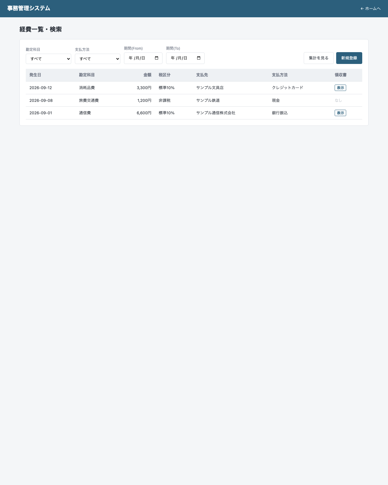

- 経費一覧テーブル(発生日・勘定科目・金額・税区分・支払先・支払方法。領収書添付有無のアイコン表示)
- 勘定科目・支払方法・期間による絞り込みフォーム
- 「新規登録」ボタン、「集計を見る」ボタン(SC-08への導線)

#### 操作と実現内容

| 操作 | 実現内容 |
|---|---|
| 画面表示時(自動) | 経費一覧を発生日の新しい順に表示する(機能仕様書F-02処理内容2) |
| 勘定科目・支払方法・期間で絞り込み | 条件に合致する経費のみ一覧に表示する(機能仕様書F-02処理内容3) |
| 「新規登録」ボタン押下 | SC-07(経費登録・編集画面)を新規登録モードで開く |
| 一覧の行をクリック | 対象経費のSC-07(編集画面)を表示する |
| 領収書アイコンをクリック | 添付済みの領収書ファイルをプレビュー・ダウンロードできる(機能仕様書F-02処理内容5) |
| 「集計を見る」ボタン押下 | SC-08(経費集計画面)へ遷移する |

### 4.8 経費登録・編集画面(SC-07)

#### 画面レイアウト

モックアップ: [HTML](./mockups/SC-07_expense-form.html) / 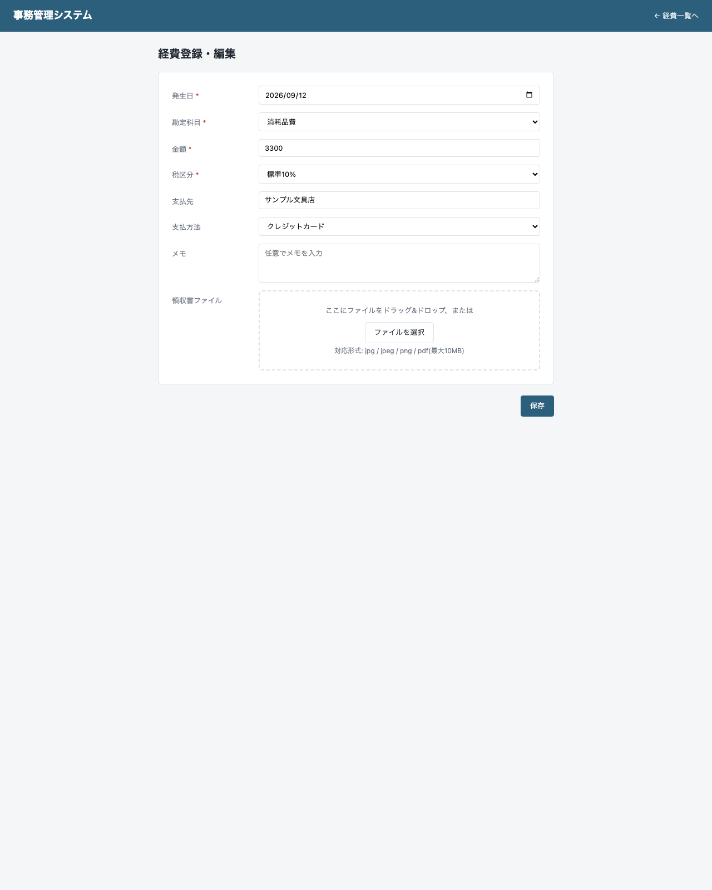

- 発生日、勘定科目(選択式リスト+「その他」自由入力)、金額、税区分の入力欄
- 支払先、支払方法、メモの入力欄(任意)
- 領収書ファイル添付欄(ドラッグ&ドロップ/ファイル選択)
- 「保存」ボタン

#### 操作と実現内容

| 操作 | 実現内容 |
|---|---|
| 「保存」ボタン押下 | 金額が0以下・数値以外、勘定科目・発生日未入力の場合はエラーメッセージを表示し保存しない(機能仕様書F-02例外仕様) |
| 領収書ファイルを選択・添付 | 対応形式(jpg/jpeg/png/pdf)以外、またはサイズ上限超過の場合はエラーメッセージを表示し添付を受け付けない(対応形式は5章参照) |

**イテレーション3変更(★20で確定)**: 経費を案件に紐付ける方針(★20確定)に従い、入力欄に「案件」選択欄(任意)を追加する。既存の経費は「案件なし」のまま利用でき、後から選択できる。経費の案件紐付けはF-07・SC-08の集計結果に影響しない。

### 4.9 経費集計画面(SC-08)

#### 画面レイアウト

モックアップ: [HTML](./mockups/SC-08_expense-summary.html) / 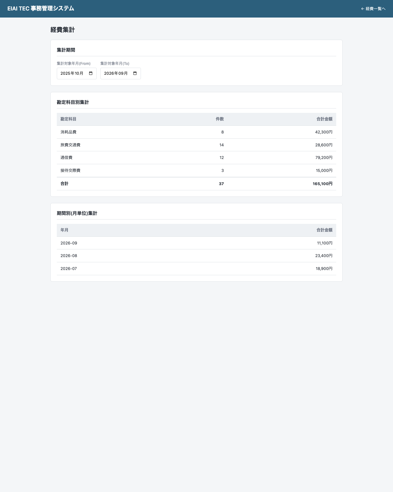

- 集計期間(月単位)の選択
- 勘定科目別集計テーブル(勘定科目・件数・合計金額)
- 期間別(月単位)集計テーブル

#### 操作と実現内容

| 操作 | 実現内容 |
|---|---|
| 画面表示時(自動)/期間変更時 | 勘定科目別・月単位の集計結果をAPIから取得して表示する(機能仕様書F-02処理内容4) |

### 4.10 売掛金一覧画面(SC-09)

#### 画面レイアウト

モックアップ: [HTML](./mockups/SC-09_receivable-list.html) / 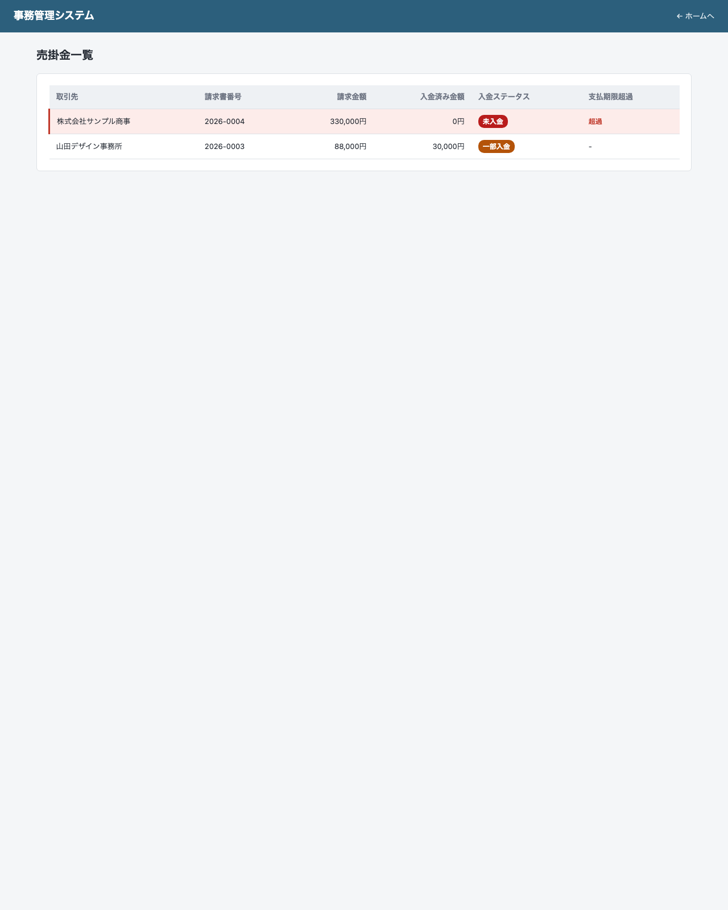

- 売掛金一覧テーブル(取引先・請求書番号・請求金額・入金済み金額・入金ステータス・支払期限超過有無)
- 支払期限超過の行を強調表示

#### 操作と実現内容

| 操作 | 実現内容 |
|---|---|
| 画面表示時(自動) | 入金ステータス・支払期限超過を算出し、未入金または一部入金の請求書を中心に一覧表示する。支払期限超過は強調表示する(機能仕様書F-05処理内容2・3) |
| 一覧の行をクリック | 対象請求書のSC-03(詳細画面)へ遷移し、入金記録セクションを確認・編集できる |

### 4.11 取引先マスタ管理画面(SC-10)

#### 画面レイアウト

モックアップ: [HTML](./mockups/SC-10_client-master.html) / 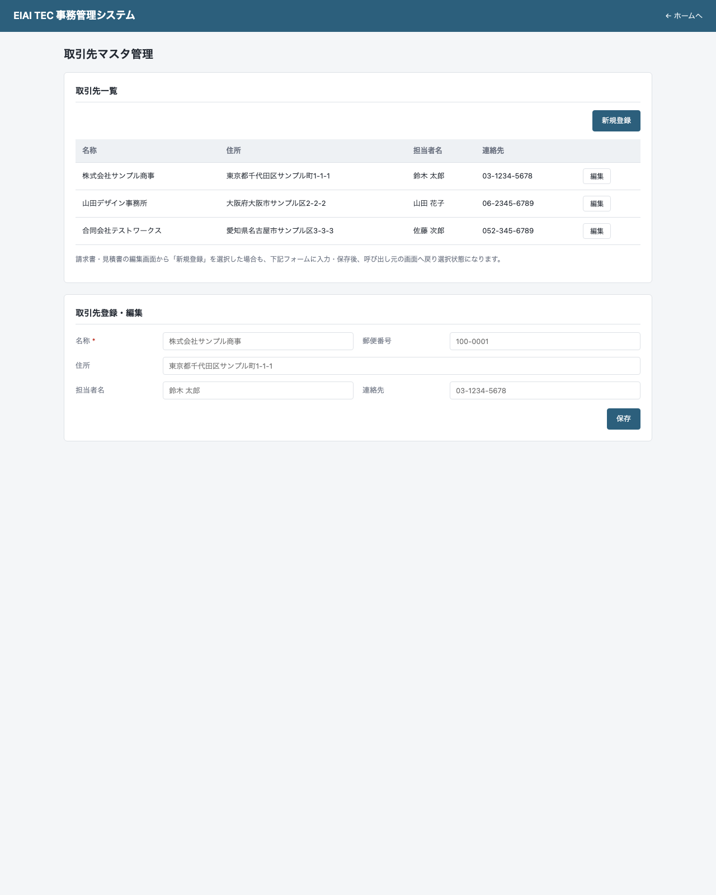

- 取引先一覧テーブル(名称・住所・担当者名・連絡先)
- 「新規登録」ボタン、各行の「編集」操作
- 登録・編集フォーム(名称・郵便番号・住所・担当者名(任意)・連絡先(任意))

#### 操作と実現内容

| 操作 | 実現内容 |
|---|---|
| 「新規登録」ボタン押下、または請求書/見積書編集画面からの遷移 | 取引先登録フォームを表示し、保存後は呼び出し元画面(SC-03/SC-05)へ戻り選択状態にする |
| 一覧の「編集」操作 | 取引先情報を編集・保存する |

### 4.12 システム設定画面(発行者情報)(SC-11)

#### 画面レイアウト

モックアップ: [HTML](./mockups/SC-11_settings.html) / 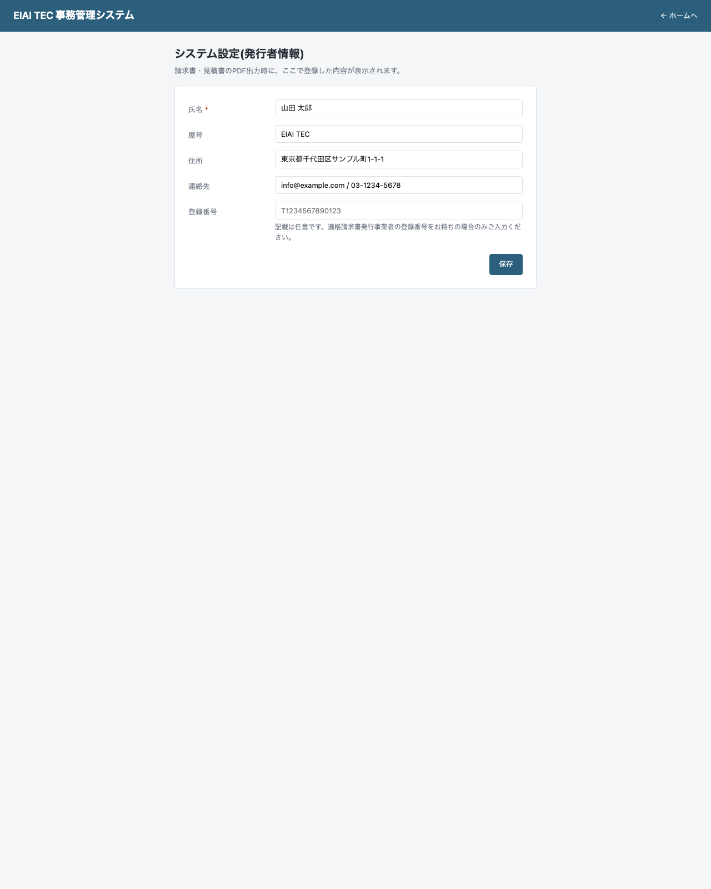

- 発行者情報フォーム(氏名、屋号、住所、連絡先、適格請求書発行事業者登録番号)
- 登録番号欄には「記載は任意です」等の補足を表示

#### 操作と実現内容

| 操作 | 実現内容 |
|---|---|
| 発行者情報を入力し「保存」ボタン押下 | システム設定として1件のみ保存する。請求書・見積書のPDF出力時にこの情報を参照する(機能仕様書F-01入力仕様)。登録番号は未入力のままでも保存できる |

### 4.13 財務ダッシュボード画面(SC-12、イテレーション2)

#### 画面レイアウト

モックアップ: [HTML](./mockups/SC-12_financial-dashboard.html) / 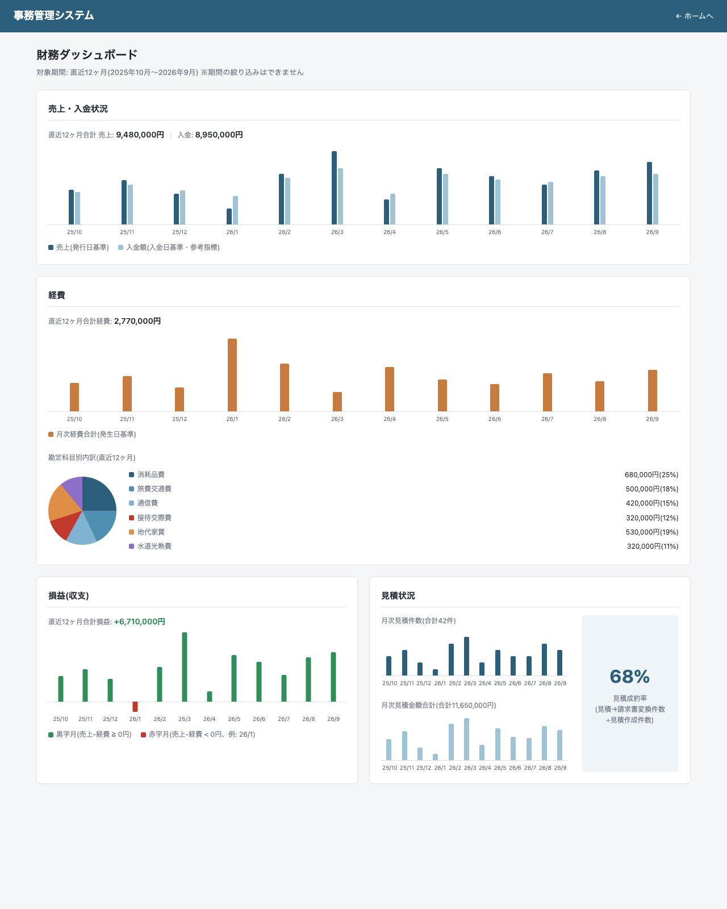(作成済み)。以下はモックアップ作成の入力となったレイアウト方針。

- ヘッダー: 画面タイトル「財務ダッシュボード」、対象期間の固定表示(例: 「直近12ヶ月(YYYY年MM月〜YYYY年MM月)」)。期間の絞り込みUIは設けない(機能仕様書F-07入力仕様、要件定義書10.2★13)。
- 画面全体を4区画(カードまたはパネル)で構成し、各区画は独立してデータ取得・表示を行う。
  1. 売上・入金状況区画: 月次の売上金額・入金額の推移を折れ線グラフまたは棒グラフ(2系列)で表示する。
  2. 経費区画: 月次経費合計の推移を折れ線グラフまたは棒グラフで表示し、あわせて勘定科目別の内訳を円グラフまたは棒グラフで表示する(2つのグラフを1区画内に配置)。
  3. 損益(収支)区画: 月次の損益(売上-経費)の推移を折れ線グラフまたは棒グラフで表示する。黒字・赤字が視覚的に区別できる配色とする。
  4. 見積状況区画: 月次の見積作成件数・見積金額合計の推移を折れ線グラフまたは棒グラフで表示し、あわせて見積成約率を数値(パーセンテージ)で表示する。
- いずれの区画も表示専用であり、グラフ・数値からのデータ編集操作は設けない(機能仕様書F-07入力仕様)。
- 各区画のデータ取得に失敗した場合は、当該区画内にのみエラー表示を行い、他の区画の表示・操作には影響させない(機能仕様書F-07例外仕様)。
- 直近12ヶ月のうち実績のない月も0円・0件として表示し、期間全体を連続したグラフとして表示する(機能仕様書F-07処理内容6)。

#### 操作と実現内容

| 操作 | 実現内容 |
|---|---|
| 画面表示時(自動) | 4区画それぞれが独立したAPIからデータを取得し、グラフ・数値を表示する。取得に失敗した区画のみエラー表示を行い、他の区画には影響させない(機能仕様書F-07例外仕様。詳細設計書4.8章参照) |

本画面は表示専用のため、他画面への遷移操作は設けない(4.1全体画面遷移図のとおり、ホーム画面からの一方向の導線のみを持つ)。

### 4.14 案件一覧画面(SC-13、イテレーション3・段階1)

#### 画面レイアウト

モックアップ: [HTML](./mockups/SC-13_project-list.html) / 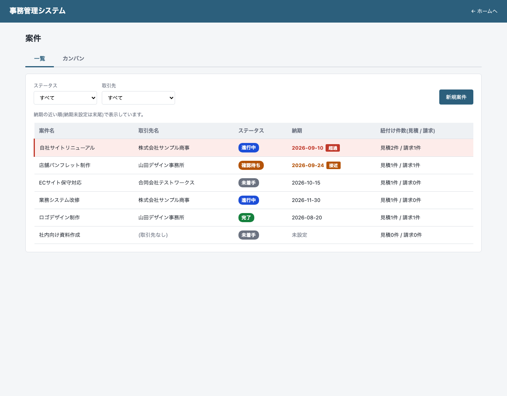(作成済み)。以下はモックアップ作成の入力となった表示要素。

- 表示切替タブ(「一覧」「カンバン」。SC-13/SC-14の切替)
- 案件一覧テーブル(案件名・取引先名・ステータス・納期・紐付け件数(見積N件/請求N件))。納期超過(完了以外)・納期接近の案件は納期欄を強調表示する
- 絞り込み(ステータス、取引先)
- 「新規案件」ボタン

#### 操作と実現内容

| 操作 | 実現内容 |
|---|---|
| 画面表示時(自動)・絞り込み変更 | 案件一覧をAPIから取得して表示する。既定の並びは納期の近い順(納期未設定は末尾)(機能仕様書F-08処理内容1) |
| 「新規案件」ボタン押下 | SC-15を新規作成モードで開く |
| 行クリック | SC-15(案件詳細)へ遷移する |
| 「カンバン」タブ押下 | SC-14へ切り替える |

### 4.15 案件カンバン画面(SC-14、イテレーション3・段階1)

#### 画面レイアウト

モックアップ: [HTML](./mockups/SC-14_project-kanban.html) / 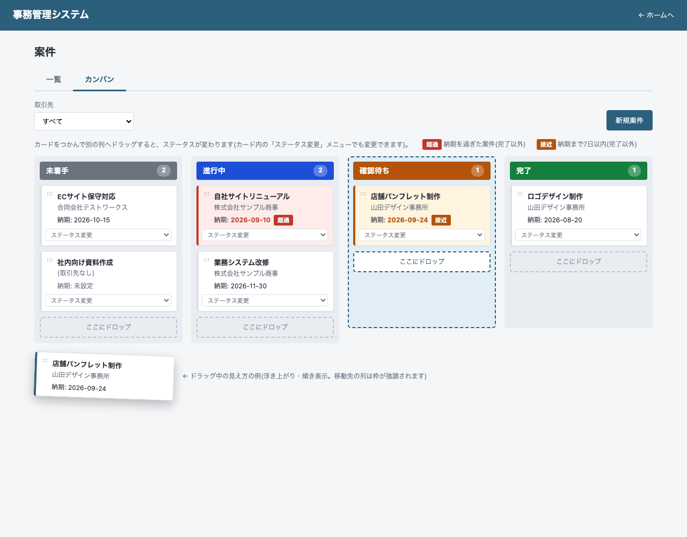(作成済み)。

- 表示切替タブ(SC-13と共通)
- 4つの列: 「未着手」「進行中」「確認待ち」「完了」(列=進捗ステータス。★19で確定)。列見出しに件数を表示
- 案件カード: 案件名、取引先名、納期。納期が過ぎた(完了以外)カードは「超過」、納期が近い(7日以内。完了以外)カードは「接近」として色・ラベルで識別できるようにする。納期未設定・完了のカードは識別表示の対象外
- カード上の「ステータス変更」メニュー(ドラッグ操作が使えない場合の代替)
- 絞り込み(取引先)、「新規案件」ボタン

#### 操作と実現内容

| 操作 | 実現内容 |
|---|---|
| 画面表示時(自動) | 案件をステータス別の列に振り分けて表示する。同一列内は納期の近い順(納期未設定は末尾)。列内での手動並べ替えは行わない(順序を保存しない) |
| カードを別の列へドラッグ&ドロップ | 移動先の列のステータスへ変更する。画面は即時に移動を反映し、保存に失敗した場合は元の列へ戻してエラーを表示する(機能仕様書F-08処理内容2) |
| カードの「ステータス変更」メニュー | 選択したステータスへ変更する(ドラッグと同じ処理) |
| カードをクリック | SC-15へ遷移する |

### 4.16 案件詳細・編集画面(SC-15、イテレーション3・段階1)

#### 画面レイアウト

モックアップ: [HTML](./mockups/SC-15_project-detail.html) / 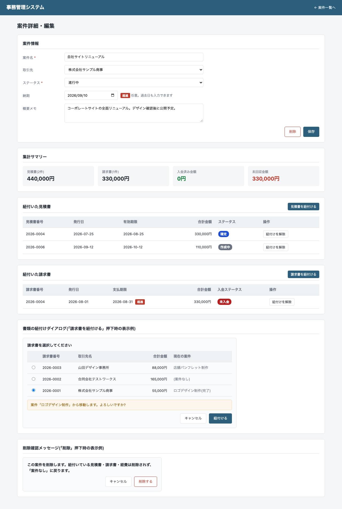(作成済み)。

- 案件情報エリア: 案件名(必須)、取引先(任意)、ステータス、納期(任意)、概要メモ(任意)。「保存」「削除」ボタン(削除は既存案件のみ)
- 集計サマリー: 紐付いた見積書の件数・金額合計、請求書の件数・金額合計、入金済み金額、未回収金額
- 紐付いた見積書一覧(見積書番号・発行日・有効期限・合計金額・ステータス)と、請求書一覧(請求書番号・発行日・支払期限・合計金額・入金ステータス)。各行から「紐付けを解除」操作
- 「見積書を紐付ける」「請求書を紐付ける」ボタン(既存の書類から選択するダイアログ)

#### 操作と実現内容

| 操作 | 実現内容 |
|---|---|
| 「保存」ボタン押下 | 案件名が未入力ならエラーを表示し保存しない。新規は案件を作成、既存は更新する(機能仕様書F-08例外仕様)。納期は未設定でも保存できる |
| 「削除」ボタン押下 | 「この案件を削除します。紐付いている見積書・請求書・経費は削除されず、「案件なし」に戻ります。」の確認メッセージを表示し、承認された場合のみ削除する(機能仕様書F-08処理内容6) |
| 「請求書を紐付ける」「見積書を紐付ける」 | 書類選択ダイアログで選んだ書類を本案件に紐付ける。選んだ書類が別の案件に紐付いている場合は「現在の案件(案件名)から移動します」と確認する(1件の書類が紐付く案件は1つ。機能仕様書F-08処理内容4)。完了済みの案件でも警告なく紐付けられる |
| 行の「紐付けを解除」 | 当該書類を「案件なし」に戻す(書類自体は削除しない) |
| 紐付いた書類の行クリック | 請求書はSC-03、見積書はSC-05へ遷移する |

### 4.17 通知一覧画面(SC-16、イテレーション3・段階2。実装済み)

#### 画面レイアウト

モックアップ: [HTML](./mockups/SC-16_notification-list.html) / 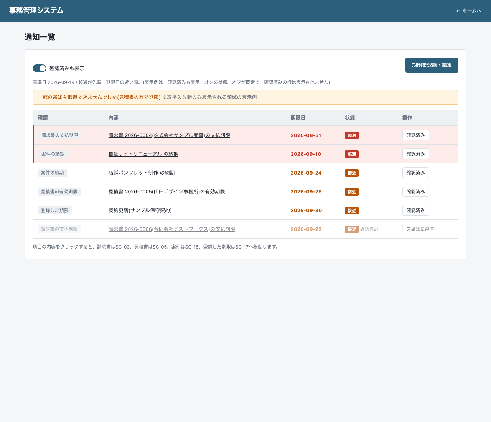(作成済み)。以下はモックアップ作成の入力となった表示要素。

- 通知テーブル(種類、内容、期限日、状態、「確認済み」ボタン)。状態は塗りつぶしバッジ「超過」「接近」で表示する(実装。詳細設計書4.10.2)。種類は「請求書の支払期限」「見積書の有効期限」「案件の納期」「登録した期限」
- 「内容」の文言: 請求書=`請求書 {番号}({取引先名})の支払期限`、見積書=`見積書 {番号}({取引先名})の有効期限`、案件=`案件「{案件名}」の納期`。手動登録の期限は、名称と種別(確定申告/契約更新/その他)の表示名が同一なら`{名称}`のみ、異なれば`{名称}({種別})`(2026-09-19確定)。モックアップの通知例(SC-01・SC-16)は画面構成確認用のダミー表示で、括弧の内外や案件の文言が上記と表記上異なる。文言は詳細設計書4.10.2の定義を正とする
- 並び順は「超過が先頭、期限日の近い順」
- 「確認済みも表示」切替(既定はオフ)。オンの場合、確認済みの通知を薄く表示し、「未確認に戻す」操作を出す
- 「期限を登録・編集」ボタン(SC-17への導線)
- 種類ごとの取得失敗表示エリア(取得できなかった種類のみ「取得できませんでした」を表示)

#### 操作と実現内容

| 操作 | 実現内容 |
|---|---|
| 画面表示時(自動) | 4種類の元データから通知を算出して表示する。元データが解消された通知(入金済み、案件完了、見積の変換済み、期限の削除等)は自動で表示されない(機能仕様書F-09処理内容3) |
| 通知の項目をクリック | 元データの画面へ遷移する(請求書=SC-03、見積書=SC-05、案件=SC-15、登録した期限=SC-17) |
| 「確認済み」ボタン押下 | 当該通知を非表示にする。再表示の条件は次のとおり(機能仕様書F-09処理内容4の設計確定事項)。(a)「期限が近い」状態で確認済みにした通知が「期限超過」に変わった場合は再表示する。(b)元データの期限日が変更された場合は、新しい期限の通知として再表示の対象になる。(c)「期限超過」で確認済みにした通知は、元データが解消されるまで再表示しない。(d)毎年繰り返す期限は、期限日を過ぎて確認済みにすると翌年の同じ月日が次の期限になり、その時点までは通知されない(機能仕様書F-09処理内容5) |
| 「未確認に戻す」 | 確認済みの記録を削除し、通知を再び通常表示にする(設計補足。誤操作の救済のため。毎年繰り返す期限で既に翌年へ更新済みの場合は元に戻らない) |

### 4.18 期限一覧・登録・編集画面(SC-17、イテレーション3・段階2。実装済み)

#### 画面レイアウト

モックアップ: [HTML](./mockups/SC-17_deadline-list.html) / 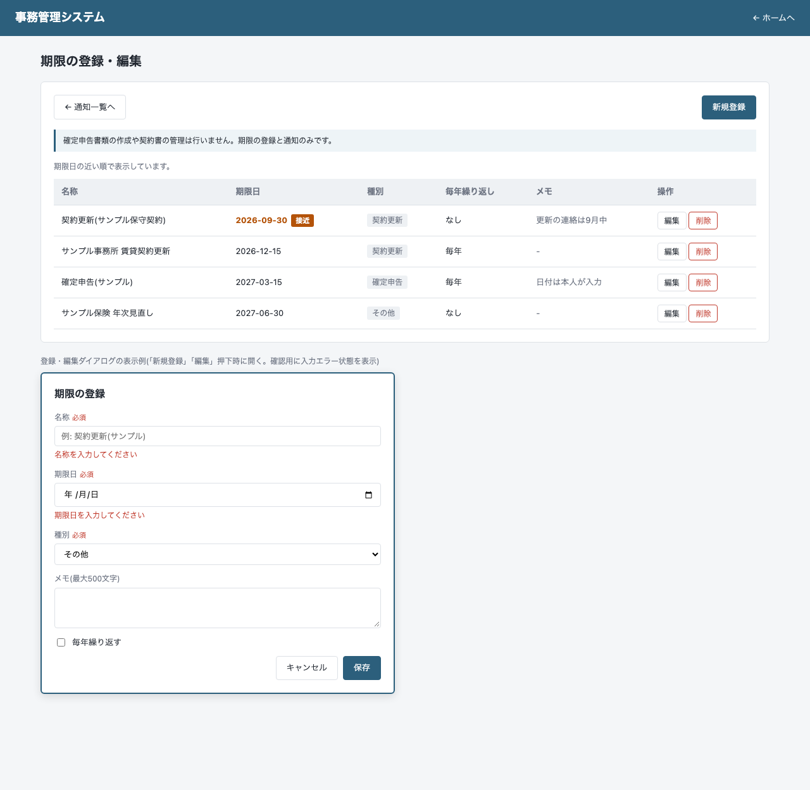(作成済み)。以下はモックアップ作成の入力となった表示要素。

- 登録済みの期限一覧(名称・期限日・種別(確定申告/契約更新/その他)・毎年繰り返し・メモ)。期限日の近い順
- 「新規登録」ボタン。登録・編集は同一画面内のダイアログまたはフォーム(名称・期限日・種別・メモ・毎年繰り返し)
- 各行の「編集」「削除」操作
- 補足表示: 「確定申告書類の作成や契約書の管理は行いません。期限の登録と通知のみです。」

#### 操作と実現内容

| 操作 | 実現内容 |
|---|---|
| 「保存」ボタン押下 | 名称または期限日が未入力の場合はエラーを表示し保存しない(機能仕様書F-09例外仕様)。確定申告期限の日付は初期登録せず、本人が入力する(★22で確定) |
| 「削除」ボタン押下 | 確認メッセージの後、期限を削除する。対応する通知(確認済みの記録を含む)も表示されなくなる |

### 4.19 レポート出力画面(SC-18、イテレーション3・段階2。実装済み)

#### 画面レイアウト

モックアップ: [HTML](./mockups/SC-18_report-export.html) / 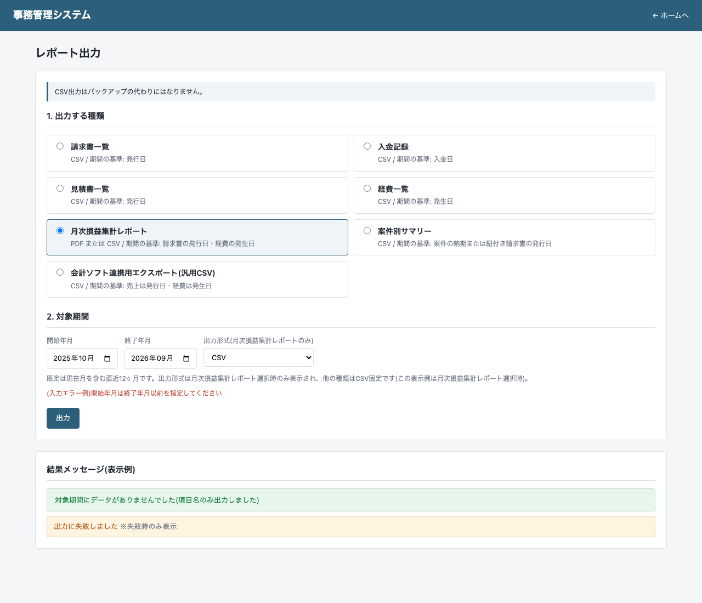(作成済み)。以下はモックアップ作成の入力となった表示要素。

- 出力する種類の選択(請求書一覧・入金記録・見積書一覧・経費一覧・月次損益集計レポート・案件別サマリー・会計ソフト連携用エクスポートの7種)。種類ごとに出力形式(CSV、月次損益集計レポートのみPDF/CSV)と「期間の基準」(発行日、入金日等)を補足表示する
- 対象期間(開始年月〜終了年月の月選択。既定は現在月を含む直近12ヶ月)
- 出力形式の選択(月次損益集計レポートの場合のみ表示)
- 「出力」ボタン、結果メッセージ表示欄

#### 操作と実現内容

| 操作 | 実現内容 |
|---|---|
| 「出力」ボタン押下 | 開始が終了より後の場合はエラーを表示し出力しない(機能仕様書F-10例外仕様)。それ以外は、選択した種類・期間のファイルを生成し、ブラウザのダウンロードとして本人のPCへ保存する(保存先はブラウザの保存設定に従う。機能仕様書F-10処理内容4の設計確定事項) |
| 対象期間にデータがない場合 | 項目名のみのCSV(月次損益集計レポートは全月0円のレポート)を出力し、画面に種類別の通知を表示する。明細系CSV:「対象期間にデータがありませんでした。項目名のみ出力しました」、月次損益集計:「対象期間にデータがありませんでした。全月0円のレポートを出力しました」(設計上の取扱い。要確認事項ではない。3.4版で種類別に変更) |
| 期間の指定範囲(3.4版) | 年は2000〜2099、期間は最大120か月(10年)。範囲外・超過は入力エラー(詳細設計書4.11.1)。CSV・PDF共通 |
| 出力に失敗した場合 | 「出力に失敗しました」を表示する。元データには影響しない |

画面の注意書きとして「CSV出力はバックアップの代わりにはなりません」を表示する(機能仕様書F-10例外仕様)。

### 4.20 目標と実績の対比画面(SC-19、イテレーション3・段階3)

#### 画面レイアウト

モックアップ: 未作成(designerへ依頼。要)。

- 対象年の選択(暦年。既定は当年。★25で確定)
- 月次の対比表(1月〜12月。売上・経費・損益それぞれについて、目標/予算・実績・差額・達成率)
- 月次の対比グラフ(目標と実績の棒グラフ。指標(売上/経費/損益)を切り替えて表示)
- 「目標を登録・編集」ボタン(月ごとの売上目標・経費予算の入力フォームを開く)
- 「案件別採算を見る」導線(SC-20)

#### 操作と実現内容

| 操作 | 実現内容 |
|---|---|
| 画面表示時(自動)・対象年変更 | 対象年の各月について、実績(F-07と同じ集計定義=発生主義)と目標を取得して表示する。目標が未登録の月は対比の対象外とし、実績のみ表示する。今月より後の月は実績が未発生のため、目標のみ表示し実績・差額・達成率は「-」とする(設計確定事項) |
| 「目標を登録・編集」→「保存」 | 月ごとの売上目標・経費予算を保存する。0以下・数値以外の場合はエラーを表示し保存しない。売上目標・経費予算は月ごとにセットで登録する(片方のみの入力はエラー。★25で「両方を登録」と確定)。損益の目標は「売上目標-経費予算」を自動表示する(機能仕様書F-11処理内容1) |
| 達成率の表示 | 目標が0以下の場合は「-」と表示する |
| 取得失敗時 | 表/グラフの区画にエラー表示を行う(機能仕様書F-11例外仕様) |

### 4.21 案件別採算一覧画面(SC-20、イテレーション3・段階3)

#### 画面レイアウト

モックアップ: 未作成(designerへ依頼。要)。

- 案件別採算テーブル(案件名・取引先・ステータス・売上(紐付く請求書の合計)・経費(紐付く経費の合計)・差額(採算))。差額がマイナスの行は赤字として識別できるようにする
- 最終行に「案件なし」の合計(売上・経費・差額)を別掲する
- ステータスによる絞り込み
- 補足表示: 「集計期間は案件全体の累計です」「売上は請求書の発行日基準です(発行日が未設定の請求書は含みません)」

#### 操作と実現内容

| 操作 | 実現内容 |
|---|---|
| 画面表示時(自動)・絞り込み変更 | 全案件について、紐付いた請求書の合計金額(売上。機能仕様書F-07と同じ発生主義=発行日が設定されている請求書)、紐付いた経費の合計金額、差額を算出して表示する(機能仕様書F-11処理内容2)。案件なしの請求書・経費は案件一覧に混ぜず、最終行に合計のみ表示する(処理内容3) |
| 行クリック | SC-15(案件詳細)へ遷移する |

案件が紐付いていない既存の請求書・経費(イテレーション1・2のデータ)は「案件なし」に集計されるため、紐付け作業が進むまで「案件なし」の金額が大きく表示される。この旨を画面の補足表示に含める。

---

## 5. データ設計

本章ではデータの意味・関連のみを扱う。型・桁数等の物理設計は詳細設計書6章に譲る。

### 5.1 ER図

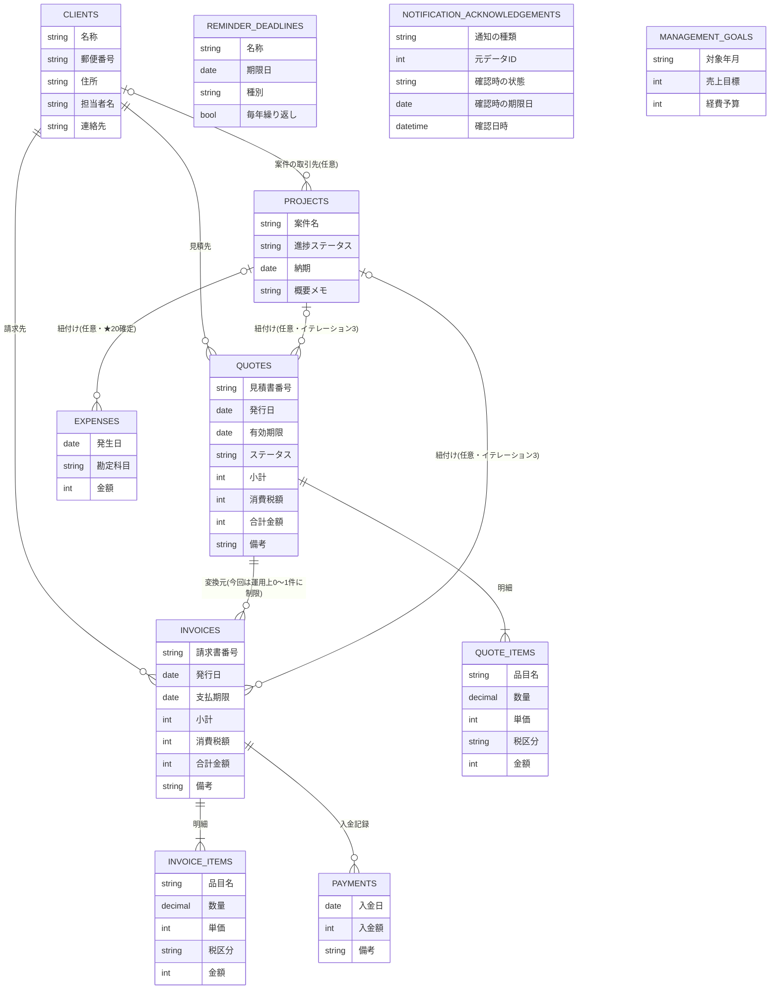
```mermaid
erDiagram
    CLIENTS ||--o{ INVOICES : "請求先"
    CLIENTS ||--o{ QUOTES : "見積先"
    QUOTES ||--o{ INVOICES : "変換元(今回は運用上0〜1件に制限)"
    INVOICES ||--|{ INVOICE_ITEMS : "明細"
    QUOTES ||--|{ QUOTE_ITEMS : "明細"
    INVOICES ||--o{ PAYMENTS : "入金記録"
    CLIENTS |o--o{ PROJECTS : "案件の取引先(任意)"
    PROJECTS |o--o{ INVOICES : "紐付け(任意・イテレーション3)"
    PROJECTS |o--o{ QUOTES : "紐付け(任意・イテレーション3)"
    PROJECTS |o--o{ EXPENSES : "紐付け(任意・★20確定)"

    PROJECTS {
        string 案件名
        string 進捗ステータス
        date 納期
        string 概要メモ
    }
    EXPENSES {
        date 発生日
        string 勘定科目
        int 金額
    }
    REMINDER_DEADLINES {
        string 名称
        date 期限日
        string 種別
        bool 毎年繰り返し
    }
    NOTIFICATION_ACKNOWLEDGEMENTS {
        string 通知の種類
        int 元データID
        string 確認時の状態
        date 確認時の期限日
        datetime 確認日時
    }
    MANAGEMENT_GOALS {
        string 対象年月
        int 売上目標
        int 経費予算
    }

    CLIENTS {
        string 名称
        string 郵便番号
        string 住所
        string 担当者名
        string 連絡先
    }
    INVOICES {
        string 請求書番号
        date 発行日
        date 支払期限
        int 小計
        int 消費税額
        int 合計金額
        string 備考
    }
    INVOICE_ITEMS {
        string 品目名
        decimal 数量
        int 単価
        string 税区分
        int 金額
    }
    QUOTES {
        string 見積書番号
        date 発行日
        date 有効期限
        string ステータス
        int 小計
        int 消費税額
        int 合計金額
        string 備考
    }
    QUOTE_ITEMS {
        string 品目名
        decimal 数量
        int 単価
        string 税区分
        int 金額
    }
    PAYMENTS {
        date 入金日
        int 入金額
        string 備考
    }
```

- イテレーション3で追加したエンティティは、`PROJECTS`(案件)、`REMINDER_DEADLINES`(手動登録の期限)、`NOTIFICATION_ACKNOWLEDGEMENTS`(確認済みの通知の状態)、`MANAGEMENT_GOALS`(経営目標)である。`REMINDER_DEADLINES`・`NOTIFICATION_ACKNOWLEDGEMENTS`・`MANAGEMENT_GOALS`は他テーブルと外部キーで直接関連しない(確認済みの記録は元データを「種類+ID」で指す論理参照であり、5.4章参照)。なお`EXPENSES`は従来ER図に記載していなかったため、案件との関連を示す範囲で項目を抜粋して追記している。
- 「COMPANY_PROFILE(発行者情報・システム設定)」は他テーブルと外部キーで直接関連しない単独の設定値であるため、上記ER図には含めていない。請求書・見積書のPDF生成時に参照する。
- 「QUOTES ||--o{ INVOICES」は本イテレーションでは運用上0件または1件に制限する(1対1)。制限の実現方法は詳細設計書6章のUNIQUE制約を参照。見積書側(QUOTES)には請求書との対応関係を固定する制約を持たせず、請求書側(INVOICES)が見積書を一方向に参照する構造とすることで、将来の分割請求(1対多)拡張時にINVOICES側のUNIQUE制約を解除するのみで対応できるようにする(要件定義書7章・機能仕様書7章参照)。

### 5.2 データの意味・関連

| データ | 意味・関連 |
|---|---|
| 取引先マスタ | 請求書・見積書の発行先。1取引先に対し、請求書・見積書を複数件紐づけられる。 |
| 発行者情報(システム設定) | EIAI TEC本人の氏名・屋号・住所・連絡先・適格請求書発行事業者登録番号。システム全体で1件のみ保持し、請求書・見積書PDF生成時に参照する。 |
| 請求書 | 取引先1件に対して発行する請求。品目明細を1件以上持つ。見積書から変換された場合、変換元の見積書を参照情報として保持する(任意)。入金ステータスは保存せず、入金記録から都度算出する。 |
| 請求書明細 | 請求書に紐づく品目単位の内訳。品目名・数量・単価・税区分から金額を算出する。 |
| 見積書 | 取引先1件に対して発行する見積。品目明細を1件以上持つ。ステータス(作成中/確定)を持つ。 |
| 見積書明細 | 見積書に紐づく品目単位の内訳。請求書明細と同じ構成。 |
| 経費 | EIAI TECが日々記録する支出。勘定科目・税区分で分類し、領収書ファイルを任意で添付できる。イテレーション3で、案件への任意の紐付け(★20で確定)を持てるようにする。 |
| 入金記録 | 請求書1件に対する入金の記録。1請求書に対して複数件の入金記録を持てる(一部入金の積み重ねに対応)。 |
| 案件(イテレーション3) | 取引先から受けた仕事のまとまり。案件名・取引先(任意)・進捗ステータス(未着手/進行中/確認待ち/完了)・納期(任意)・概要メモを持つ。請求書・見積書・経費から任意に参照される(多対1)。1件の書類が紐付く案件は1つ。 |
| 手動登録の期限(イテレーション3) | 確定申告期限・契約更新日など、本人が登録する通知用の期限。名称・期限日・種別・メモ・毎年繰り返しを持つ。 |
| 確認済みの通知の状態(イテレーション3) | 通知本体は保存せず、「確認済みにした」事実のみ、通知の種類・元データID・確認時の状態・確認時の期限日・確認日時として保存する。再表示条件の判定に使う。 |
| 経営目標(イテレーション3) | 月ごとの売上目標・経費予算。1年月につき1件。損益の目標は両者の差として算出し保存しない。 |

### 5.3 財務ダッシュボード(F-07)のデータ参照(イテレーション2)

財務ダッシュボードは新規のエンティティ・テーブルを持たない。5.1のER図・5.2の各データをそのまま参照し、月次に集計して表示するのみであり、テーブル間のリレーションにも変更を加えない。

| 表示区画 | 参照するデータ | 集計の考え方 |
|---|---|---|
| 売上・入金状況 | 請求書、入金記録 | 請求書の発行日を基準に月次売上を集計し(発生主義)、参考指標として入金記録の入金日を基準に月次入金額を集計する。 |
| 経費 | 経費 | 経費の発生日を基準に月次合計を集計し(発生主義)、あわせて勘定科目区分(F-02で定義済み)ごとの内訳を集計する。 |
| 損益(収支) | 請求書、経費 | 月次売上から月次経費を差し引いて算出する。売上・経費とも発生主義(発行日・発生日基準)で計上する。 |
| 見積状況 | 見積書、請求書(元見積書ID) | 見積書の発行日を基準に月次件数・金額合計を集計する。見積成約率は、見積書のうち請求書から元見積書IDとして参照されている件数の割合として算出する。 |

集計処理の具体的なSQL・算出ロジックは詳細設計書4.8章・6.4章を参照。

### 5.4 イテレーション3のデータ設計方針と既存機能への影響

#### 5.4.1 通知・レポート・経営管理のデータの持ち方

| 機能 | 参照する既存データ | 新規に保存するデータ | 考え方 |
|---|---|---|---|
| F-09 通知 | 請求書(支払期限・入金ステータス)、見積書(有効期限・変換済みか)、案件(納期・ステータス)、手動登録の期限 | 手動登録の期限、確認済みの状態 | 通知は画面表示のたびに元データから算出する。元データが解消すれば自動で消える。保存するのは確認済みの事実のみ |
| F-10 レポート | 請求書・入金記録・見積書・経費・案件 | なし | 出力時に集計し、ファイルとして返す。ファイル自体は保存しない |
| F-11 経営管理 | F-07と同じ集計、請求書・経費・案件 | 月ごとの目標(売上目標・経費予算) | 実績は保存せず都度集計する。損益目標・達成率・差額も保存せず算出する |

F-07・F-10・F-11は「月次の売上・経費・損益」を同じ定義(発生主義。売上=請求書の発行日、経費=経費の発生日、勘定科目区分=F-02)で算出する。定義が画面ごとに食い違うことを防ぐため、集計ロジックは1つの共通サービスに集約して共用する(詳細設計書5.2章)。

#### 5.4.2 案件ID追加に伴う既存機能への影響と回帰リスク

`invoices`・`quotes`・`expenses`に`project_id`(NULL可)を追加する。既存データは全件NULL(案件なし)のまま移行し、値の自動設定は行わない(機能仕様書F-08処理内容7)。

| 影響箇所 | 内容 | リスク | 対策 |
|---|---|---|---|
| DBマイグレーション | 既存3テーブルへの列追加(NULL可、既定NULL)とインデックス追加。既存行・既存列は変更しない | 適用失敗・データ破損の場合に既存データを失う | 起動時のマイグレーション自動適用(詳細設計書4.7.3.1)が、適用前に`db/back_office.db`を`db/back_office.db.before-<リビジョン>`へ自動で退避コピーし、失敗時はアプリを起動せず復元方法を案内する(3.3版で実装に合わせ更新。従来はEIAI TEC本人が`db/`をコピーする手順としていた)。マイグレーションは列追加のみとし、テスト用DBで既存データの件数・金額が不変であることを確認する |
| F-01 請求書保存(PUT) | 更新リクエストに`project_id`を追加 | F-04変換直後の請求書(発行日・支払期限がNULL)は通常の更新では日付必須のバリデーションに阻まれ、案件だけを紐付けられない | 案件の紐付け専用のAPIを設ける(詳細設計書4.9.5章)。通常の保存の日付バリデーションは変更しない |
| F-03 見積書保存 | 同上 | 既存の見積書は日付必須を満たすため影響は小さい | 同じ紐付け専用APIを用意 |
| F-04 変換 | 変換時に`project_id`を引き継ぐ | 引き継ぎ漏れ、案件未設定時にNULLではなく誤った値が入る | 変換処理のテストで「案件あり」「案件なし」の両方を確認する |
| F-02 経費保存 | 保存リクエストに`project_id`を追加(★20で確定) | 既存の集計(SC-08、F-07)への影響 | 集計クエリは`project_id`を参照しないため結果は変わらない。回帰テストで集計値が変化しないことを確認する |
| F-07 財務ダッシュボード | 集計ロジックを共通サービスへ切り出す | 切り出しによる集計値の変化 | 外部仕様(API・レスポンス)を変えない。切り出し前後で同一データの結果が一致することを回帰テストで確認する |
| F-05・F-06 | 入金ステータス・支払期限超過の算出は変更しない。通知(F-09)は同じ算出結果を参照する | 通知側で独自に判定して食い違う | 通知は入金ステータス・支払期限超過の既存の算出処理を呼び出して利用する |
| 案件の削除 | 削除時に3テーブルの`project_id`をNULLへ戻す | 紐付いた書類が削除される、または外部キーエラーで削除できない | 削除時の外部キー動作を`ON DELETE SET NULL`とし、アプリ側でも同一トランザクションで明示的にNULLへ戻す。書類は削除しない |
| 取引先の削除 | `projects.client_id`が取引先を参照する | 案件のある取引先の削除がエラーになる | 請求書・見積書と同じ扱い(削除不可)とし、既存の取引先削除のエラー表示に案件を含める |
| ホーム画面(SC-01) | カード・通知エリアの追加 | 既存のサマリー取得(未入金・超過件数)が通知の失敗に巻き込まれる | 通知は独立したAPIで取得し、失敗を通知エリア内に閉じ込める |
| 画面・型定義 | 請求書・見積書・経費のレスポンスに`project_id`・案件名が増える | 既存画面が想定外の項目で壊れる | 項目の追加のみで既存項目は変更しない。一覧に案件名を含める際も既存の並び・絞り込みを変えない |

#### 5.4.3 設計で確定した委任事項(機能仕様書7章)

| 委任事項 | 設計での確定内容 | 記載箇所 |
|---|---|---|
| 確認済みにした通知の再表示条件(F-09) | 「期限が近い」で確認済み→「期限超過」に変わったら再表示。期限日が変更されたら再表示の対象。「期限超過」で確認済みなら元データが解消されるまで再表示しない。毎年繰り返す期限は過ぎて確認済みにすると翌年へ更新 | 4.17章、詳細設計書4.10.4章 |
| 案件別サマリー出力の期間基準(F-10) | 対象案件は「期間内に納期がある案件」または「期間内に発行日がある紐付き請求書を持つ案件」(いずれかを満たせば対象)。件数・金額は、対象期間内に発行日がある紐付き見積書・請求書のみを集計する(発行日が未設定の書類は含まない) | 詳細設計書4.11.4章 |
| ホーム画面の通知表示件数(F-06) | 上位5件を表示。超過を先頭、期限日の近い順。5件を超える分は「すべての通知を見る」からSC-16で確認 | 4.2章 |

---

## 6. 外部連携

- 本システムは外部システム・外部APIとの連携を行わない(ローカル完結。要件定義書7章)。
- 請求書・見積書のPDF出力はシステム内(WeasyPrint)で完結し、外部サービスを利用しない。
- 領収書ファイルの添付、PDFの保存・印刷は、いずれもEIAI TEC本人のPC上のローカルファイル操作(ブラウザの保存・印刷機能を含む)として実現する。
- イテレーション3のレポート出力(F-10)のPDF/CSVも、ブラウザのダウンロード機能によるローカル保存とする。会計ソフトとの自動連携・送信は行わない。連携先ソフトは未定のため(★24で確定。汎用の売上・経費明細CSVを出力)、連携先が決まった時点で、その取り込み形式に合わせた出力形式の変更を将来課題として行う(9章の将来課題を参照。8.5章)。
- 通知(F-09)はアプリ内表示のみとし、メール・OS通知等の外部への送信は行わない。

---

## 7. 非機能設計方針

- 性能: 単一ユーザー・小規模データ量を前提とし、一覧系APIは原則全件取得としてページングは実装しない。データ量増加時は将来イテレーションでページング追加を検討する(要件定義書7章)。財務ダッシュボード(F-07)の月次集計処理も同様に小規模データ量を前提とし、対象期間を直近12ヶ月に固定することで1回あたりの集計範囲を限定する(詳細設計書4.8章・6.4章参照)。
- データ整合性: SQLiteの外部キー制約(`PRAGMA foreign_keys = ON`)を有効化し、リレーションの不整合を防ぐ。金額計算を伴う保存処理はトランザクション内で実行する。
- ファイル管理: 添付ファイル・生成PDFはローカルファイルシステムに保存し、DBには相対パスのみを保持する(可搬性の確保)。
- セキュリティ: ログイン認証は実装しない(要件定義書7章確定事項)。ただしUvicornのバインドアドレスを`127.0.0.1`に限定し、同一PC以外からのアクセスを遮断する。
- データ保全: システムによる自動バックアップは行わない(要件定義書7章確定事項)。SQLiteファイル(`db/back_office.db`)および添付ファイル領域(`data/`)はプロジェクトフォルダ配下に保存すること、およびEIAI TEC本人が当該フォルダを手動でコピーする運用とすることを2026-09-15に確定した(詳細設計書6章でファイルパスを明確化)。
- 拡張性: 見積→請求の1対1制約は詳細設計書のDB制約(UNIQUE制約)のみで実現し、業務ロジック側に固定的な前提を作り込まない。将来の分割請求拡張時の手戻りを抑える(要件定義書7章)。
- ログ: Uvicornの標準アクセスログ・エラーログのみとし、監査ログ等の特別な仕組みは設けない(個人利用のため)。
- イテレーション3の性能・整合性方針: 通知の算出・レポート出力・案件別採算の集計は、いずれも小規模データ量を前提に画面表示・出力の都度算出する(ページング・キャッシュ・バックグラウンドジョブは設けない)。CSV出力は表計算ソフトでの数式実行を避けるため、文字列項目の先頭が`=`・`+`・`-`・`@`・タブ・CRの場合は先頭に`'`を付与して出力する(数値型の金額等は対象外。3.4版でタブ・CRを追加)。案件の削除・書類との紐付け変更はトランザクション内で行う。
- 段階的な提供: 段階1(F-08)〜段階3(F-11)は段階ごとに設計〜テストを行い、段階ごとに利用開始できる。段階2・3の機能は、前段の機能(F-09はF-08の納期、F-11はF-08の案件・F-07の集計)に依存するが、前段のデータ構造を変更しない追加のみで構成する。

---

## 8. 要確認事項・未解決事項

技術選定(2.1章)はベンダー側で確定済みのため、確認事項はインフラ運用面(実行環境・設置場所等)に限定する。

### 8.1 確定事項(2026-09-15 EIAI TEC本人より回答)

以下3点は、メインセッションでのユーザー確認により確定した。反映済みの箇所を示す。

| ★ | 内容 | 回答・確定内容 | 反映箇所 |
|---|---|---|---|
| 1 | 本システムを実行するPCのOS種別 | Macのみ。Windows対応は不要。 | 2.1章(実行環境OS)、3章 |
| 2 | SQLiteファイル・添付ファイル・生成PDFの保存場所 | 既定案どおり、プロジェクトフォルダ配下の`db/`・`data/`とする。 | 3章、7章(データ保全)、詳細設計書6章 |
| 3 | 起動方法 | ターミナルからのスクリプト起動ではなく、ダブルクリックで起動できる実行ファイル化(パッケージング)を希望。 | 2.1章(アプリケーション起動方式)、3章、詳細設計書4.7章 |

### 8.2 現時点の未解決事項

現時点で未解決の要確認事項はない。財務ダッシュボード(F-07、イテレーション2)についても、機能仕様書2.1版で業務仕様(グラフ種類・対象期間・計上基準・集計軸・欠損期間の扱い)がすべて確定済みであり、新規テーブルを持たない読み取り専用機能であるためインフラ運用面への影響もなく、新たな要確認事項は生じていない。

なお、本システムはローカル完結でありクラウドサービスを利用しないため、月額コスト等のランニングコストに関する確認事項は発生しない。

上記はインフラ運用面の要確認事項についてであり、イテレーション3(F-08〜F-11)の業務仕様に関する要確認事項(★17〜26)は、8.3章のとおりすべて確定済みである。

### 8.3 イテレーション3の要確認事項の確定内容(確定: 2026-09-19)

要件定義書10.3の★17〜26は、2026-09-19にEIAI TEC本人へ確認し、すべて仮置き案どおりで確定した(★19・★20は先行して同日確認済みで、3.1版までに反映済み)。本書の設計は仮置き案のまま確定となるため、**仕様変更は生じない**。確認方法・確認先・期限目安は要件定義書10.3を参照し、ここでは重複記載しない。

「確定により不要」の列は、確認結果次第で生じ得た分岐案が不要になったことを示す(記録のため削除せず残す)。

| ★ | 確定内容(2026-09-19) | 設計箇所 | 確定により不要となった分岐案 |
|---|---|---|---|
| 17 | F-11は案D(案A 目標・予算管理+案B 案件別収益性)。案C(振り返りメモ)・取引先別分析は含めない | 4.20・4.21章(SC-19・20)、詳細設計書3.19・3.20・4.12章、テーブル`management_goals`、`ManagementService` | 案Cの追加(新規テーブル・画面)は不要 |
| 18 | 着手順は段階1 F-08(実装完了)→段階2 F-09・F-10→段階3 F-11。段階ごとに利用開始可 | 2.0章、4.0章のモックアップ依頼順、7章 | 着手順の変更は不要 |
| 19 | 案件の項目(案件名・取引先・ステータス4区分・納期1つ・概要メモ)、請求書・見積書への任意紐付け、F-04での引き継ぎ、既存データは未紐付け(確定済み・実装済み) | 4.14〜4.16章、`projects`定義、`invoices`・`quotes`の`project_id`、4.4・4.6章、詳細設計書4.4・4.9章 | ステータス区分・納期・紐付け位置の変更は不要 |
| 20 | 経費に`project_id`を追加(紐付ける)。案件別採算=紐付く請求書合計(発生主義)-紐付く経費合計、期間は案件全体の累計(確定済み・実装済み) | 4.8章(SC-07)、4.21章(SC-20)、`expenses.project_id`、詳細設計書3.7・4.12.3章、`ExpenseService` | 「紐付けない」場合の`expenses.project_id`不採用、採算の経費0円・非表示案は不要 |
| 21 | 通知は4種類(請求の支払期限・見積の有効期限・案件の納期・手動登録の期限)、アプリ内表示のみ、7日前から表示し超過後も解消まで表示。F-05の強調表示は維持し重複させない。表示開始日数(7日)は定数でよく設定可能にしない | 4.2章(SC-01の通知エリア)、4.17章、詳細設計書4.10章、定数`NOTIFICATION_LEAD_DAYS`(=7) | 表示開始日数の設定化(設定テーブル・設定画面)、通知種類の増減は不要 |
| 22 | 手動登録の期限の項目は名称・期限日・種別・メモ・毎年繰り返し。確定申告日の初期値登録はしない | 4.18章、テーブル`reminder_deadlines`、詳細設計書3.17・4.10.5章 | 初期データ投入マイグレーション、種別・繰り返しの持ち方の変更は不要 |
| 23 | 請求・入金・見積・経費のCSV、月次損益PDF/CSV、案件別サマリーCSV(計7種)、期間指定あり、UTF-8 BOM付きカンマ区切り | 4.19章、詳細設計書3.18・4.11章、`ReportService`と各出力クラス | 出力対象・形式の追加変更は不要 |
| 24 | 会計ソフト連携先は未定。汎用の売上・経費明細CSV(請求書1件=1行、経費1件=1行)を出力する。連携先決定後に`AccountingExportReport`のみ将来変更 | 詳細設計書4.11.6章、`AccountingExportReport` | 現時点での列構成(仕訳形式等)変更は不要。将来課題は8.5章 |
| 25 | 暦年で、月ごとの売上目標と経費予算の両方を登録(片方のみは不可)。損益目標は差として表示 | 4.20章、詳細設計書3.19・4.12.2章、`management_goals`(`target_month`、両金額NOT NULL) | 年度区切り・年間目標・片方のみ登録可への変更は不要 |
| 26 | 完了条件はF-08>F-09>F-10>F-11の順で、必須機能が動作し既存機能に回帰なし | 5.4.2章(回帰リスク)、テスト範囲 | 設計への影響なし(テストフェーズの合格基準) |
確定により、従来「確認後に段階ごとの実装着手前に反映する」としていた運用(★22・★25の実装前確認)は不要となった。段階2・段階3は、上表の確定内容のまま実装に着手できる。

### 8.4 設計上の補足事項(確認不要と判断したもの)

機能仕様書で仕様が定まっておらず、設計で取扱いを決めた事項。業務上の影響が小さいため要確認事項とはしていないが、意図と異なる場合は指摘を受けて見直す。

- 通知の「未確認に戻す」操作と「確認済みも表示」切替(誤操作の救済。4.17章)
- カンバンの列内の並びは納期の近い順とし、手動の並べ替えは保存しない(4.15章)
- 納期が「近い」の判定日数は、通知の表示開始日数(7日)と同じ値を用いる(★21で「定数でよい」と確定)
- 今月より後の月は、目標対比の実績を「-」表示にする(4.20章)
- 月次損益集計レポートのCSVは、年月・区分・勘定科目・金額の縦持ち形式とする(詳細設計書4.11.5章)
- 手動登録の期限の通知の文言は、名称と種別表示名が同一の場合は名称のみとする(4.17章)

### 8.5 将来課題(要確認事項ではない)

現時点の設計・実装には影響せず、条件が整った時点または利用状況を見て判断する事項。

| # | 内容 | 判断の契機 | 影響範囲 |
|---|---|---|---|
| 1 | 会計ソフトの連携先が未定(★24)。連携先決定後に、汎用の売上・経費明細CSVを取り込み形式(列構成・文字コード・行の粒度)へ変更する | 連携先ソフトの決定 | 詳細設計書4.11.6の`AccountingExportReport`のみ。他の出力に影響しない |
| 2 | 型不正(日付・列挙・真偽値・JSON形式・ボディ形式)の422メッセージがPydantic標準の英語のまま残る(詳細設計書8.1章) | 利用状況を見て、EIAI TEC本人と相談のうえ判断(優先度は低い) | 共通のエラー変換処理。通常の画面操作では発生しにくい |
| 3 | 請求書・見積書の発行日・支払期限・有効期限に日付形式の検証がない(案件の納期にはある)。API直接呼出しで不正な文字列が保存され得る(テスト結果報告書 フォローアップ#14) | 発行日等にも納期と同様の検証を追加するか、新規仕様として検討 | 請求書・見積書の保存API(F-01・F-04関連)。画面は日付ピッカーのため通常は発生しない |

---

## 9. 変更履歴

| 版数 | 日付 | 内容 | 対応イテレーション |
|---|---|---|---|
| 1.0 | 2026-09-15 | 初版作成。機能仕様書1.1・要件定義書1.1をもとに、採用技術(2.1)、システム構成、F-01〜F-06および付随する取引先マスタ・システム設定を含む画面設計(11画面)、データ設計(ER図)、非機能設計方針を策定。インフラ運用面の要確認事項3件を整理。 | イテレーション1(初回) |
| 1.1 | 2026-09-15 | EIAI TEC本人からの回答を反映。(1)実行環境OSをMac専用に確定、(2)データ保存場所をプロジェクトフォルダ配下`db/`・`data/`に確定、(3)起動方式をダブルクリック起動の`.app`バンドル(起動.app/終了.app)に確定し、PyInstaller単一バイナリ化を不採用とした選定理由を2.1章に明記。3章のシステム構成図・7章・8章を改訂。8章の要確認事項3件はすべて確定済みに更新。 | イテレーション1(初回) |
| 1.2 | 2026-09-15 | designerサブエージェントがSC-01〜SC-11のHTML/CSSモックアップを`docs/02_architect/mockups/`に作成。4章の各画面節・4.0章に、対応するモックアップ(HTML/画像)への相対リンクを追記。新規仕様の追加は行っていない。 | イテレーション1(初回) |
| 2.0 | 2026-09-16 | イテレーション2分を改訂。機能仕様書2.1版(F-07財務ダッシュボード追加)を反映。2章にF-07の位置づけ(新規テーブル不要・既存データ集計の読み取り専用機能)を追記。2.1章にグラフ描画ライブラリ(Recharts)を追加。3章に3.1「F-07追加によるシステム構成への影響」を新設し、システム構成・技術スタックへの影響がないことを明記。4章に画面SC-12(財務ダッシュボード画面)を追加し、4.0画面一覧・4.1全体画面遷移図・4.13(画面レイアウト・操作と実現内容)を新設。SC-01(ホーム画面)にSC-12への導線カードを追加。5章に5.3「財務ダッシュボード(F-07)のデータ参照」を新設し、新規テーブルを持たず既存データを月次集計するのみである旨を整理。7章に集計処理の性能方針を追記。8章にF-07関連の要確認事項なしである旨を追記。 | イテレーション2 |
| 3.0 | 2026-09-19 | イテレーション3分を改訂。機能仕様書3.0版(F-08案件・プロジェクト管理、F-09リマインダー/通知、F-10レポート出力、F-11経営管理の追加)を、要件定義書10.3★17〜26が未確認の「仮置き前提」で反映。冒頭に仮置き前提の注記、2.0章(イテレーション3の位置づけ)、2.1章に採用技術(@hello-pangea/dnd、標準csv、通知の算出方式)を追加。3.2章(システム構成への影響なし)を新設。4.0章に画面SC-13〜SC-20とモックアップ要否表を追加し、4.1遷移図を更新。既存画面SC-01〜05・07にイテレーション3変更を追記し、4.14〜4.21章に新規8画面を新設。5章のER図に案件・期限・確認済み状態・経営目標を追加し、5.4章(データの持ち方、案件ID追加に伴う回帰リスク、機能仕様書7章の設計委任3事項の確定)を新設。6章・7章に出力・通知・性能方針を追記。8.3章(★17〜26の仮置きと影響箇所)、8.4章(設計上の補足事項)を新設。SC-12のモックアップ作成済みを反映。 | イテレーション3 |
| 3.1 | 2026-09-19 | 実装確定事項の反映(軽微改訂)。4.0章および4.13〜4.16章のモックアップ記述を更新(SC-13〜15、SC-01〜05・07は作成済み。SC-12のリンクも作成済みに整合。SC-16〜20は未作成のまま)。設計内容の変更なし。 | イテレーション3 |
| 3.2 | 2026-09-19 | 要確認事項★17〜26の確認結果(2026-09-19、EIAI TEC本人。すべて仮置き案どおり)を反映。冒頭注記を「確定済み」に改め、8.3章を確定内容の一覧に更新(確認結果次第の分岐案は「確定により不要」と明記)。本文中の「仮置き」表記(★17〜25関連、4.8・4.11・4.20章、5章ほか)を「確定」へ修正。8.4章の★21連動の記述を確定に更新。8.5章(将来課題: 会計ソフト連携先、型不正メッセージの日本語化、請求書日付形式の検証)を新設。仕様変更なし。 | イテレーション3 |
| 3.3 | 2026-09-19 | 段階2の実装(F-09・F-10、SC-16〜18)と、起動時`create_all`廃止の実装に合わせて改訂。3.2章に段階1・2の実装済みと、スキーマ作成はマイグレーション(起動時自動適用)のみ・`create_all`なし・`BACK_OFFICE_DB_PATH`でDB場所を差し替え可・uvicorn直接起動前に`python -m app.migrate`・テストは実DBに接触しない旨を追記。4.0章・4.17〜4.19章にSC-16〜18のモックアップ作成済み(リンク追加)と実装済みを反映。4.17章に通知の「内容」文言を追記(手動登録の期限は名称と種別表示名が同一なら名称のみ、異なれば`{名称}({種別})`。モックアップ例示との表記差は詳細設計書4.10.2を正とする旨)。SC-16の状態表示を実装の「超過」「接近」バッジに合わせた。5.4.2のマイグレーション対策を起動時自動退避コピーに更新。8.4章に補足を追加。仕様変更なし。 | イテレーション3 |
| 3.4 | 2026-09-19 | 段階2レビュー(指摘30〜36・★A・★B)を受け、詳細設計書3.7版と整合。レポート期間の年範囲(2000〜2099)・上限(120か月)、CSV数式対策へのタブ・CR追加、空データ通知の種類別文言を反映(該当行のみ)。通知確認の通知元なし(404)、モックアップ表記差、実装整理は詳細設計書に記載。 | イテレーション3 |
