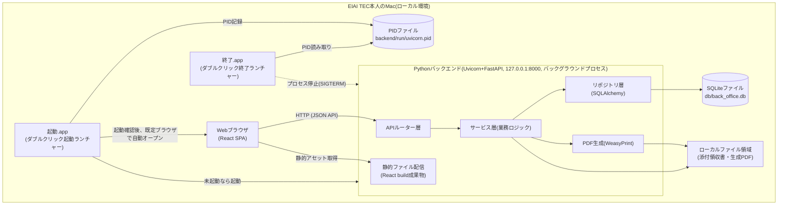
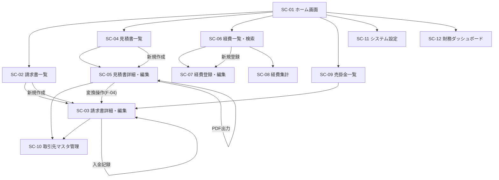
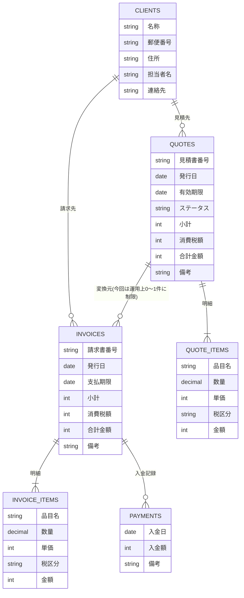

# 個人事業(EIAI TEC)向け事務管理システム 基本設計書

## 1. 文書情報

- 作成日: 2026-09-15 / 改訂日: 2026-09-16(2.0版)
- 版数: 2.0
- 参照元: `docs/01_requirements/機能仕様書.md`(版数2.1)、`docs/01_requirements/要件定義書.md`(版数2.1)
- 対応イテレーション: イテレーション1(初回。1.1は初回イテレーション内での確認事項反映、1.2はモックアップ作成の反映)、イテレーション2(2.0、財務ダッシュボード追加)

---

## 2. システム概要

本システムは、EIAI TEC本人が個人事業の事務作業(請求書発行・経費管理・見積書作成・見積→請求変換・入金/売掛金管理)を1つの画面から行えるようにする、ローカル完結型の業務管理システムである。利用者はEIAI TEC本人のみであり、ログイン認証は行わない。

対象機能は機能仕様書F-01〜F-07(請求書発行、経費管理、見積書作成、見積→請求の自動変換、入金・売掛金管理、ホーム画面・共通UI、財務ダッシュボード)である。このうちF-01〜F-06はイテレーション1で設計・実装済みであり、F-07(財務ダッシュボード)がイテレーション2での追加対象である。

F-07は、イテレーション1で構築済みの請求書・見積書・経費・入金記録の各データを月次で集計・可視化する表示専用機能であり、新規のデータ入力・編集機能ではない。そのため新規テーブルの追加は行わず、既存テーブルに対する集計処理(参照系のAPI・サービス)を追加する位置づけとなる。システム構成(3章)・技術スタックへの影響はなく、既存のバックエンド/フロントエンド構成の中に、集計用のルーター・サービス層と、ダッシュボード表示用のフロントエンド画面を追加する。

機能仕様書5.1「取引先マスタ」は独立機能としては要件定義書のスコープに明記されていないが、F-01・F-03の入力仕様(「取引先マスタから選択、または新規登録」)を実現するために、取引先マスタの一覧・登録・編集画面が必須となる。同様にF-01の発行者情報(氏名・屋号・住所・連絡先・登録番号)も「システム設定として別途登録」と機能仕様書に明記されているため、システム設定画面が必要となる。本書ではこれらを4章の画面設計に含める。いずれも機能仕様書の記載範囲を具体化したものであり、新たな業務仕様の追加ではない。

### 2.1 採用技術

技術スタック(Python+React+SQLite)は要件定義書7章・8章で確定済みである。以下はその内訳として、本設計フェーズでベンダー側(本エージェント)が確定する具体的な言語バージョン・フレームワーク・ライブラリである。クライアント確認は不要とし、確認が必要な事項(実行環境の設置場所等)は8章「要確認事項」に限定して整理する。

| 分類 | 採用技術 | 選定理由 |
|---|---|---|
| バックエンド言語 | Python 3.12 | 要件定義書で確定済み。個人開発・保守のしやすさを優先し、最新の安定版を採用。 |
| Webフレームワーク | FastAPI | 型ヒットに基づく自動バリデーション(Pydantic)とAPIドキュメント自動生成により、単独開発での実装・保守効率が高い。ASGIベースで軽量。 |
| ASGIサーバー | Uvicorn | FastAPIの標準的な実行サーバーであり、ローカル単一プロセスでの起動に適する。 |
| ORM | SQLAlchemy 2.0(宣言的マッピング) | Python標準的なORMであり、SQLiteとの親和性が高く、将来的なDB製品変更(要件定義書上は想定していないが)にも耐性がある。 |
| マイグレーション管理 | Alembic | SQLAlchemyと組み合わせて使う標準的なマイグレーションツール。スキーマ変更履歴を管理する。 |
| バリデーション | Pydantic v2 | FastAPI標準。リクエスト/レスポンスのスキーマ定義とバリデーションを一体化できる。 |
| PDF生成 | WeasyPrint + Jinja2 | HTML/CSSで帳票レイアウトを組めるため、インボイス対応レイアウト(税率ごとの区分記載等)の実装・調整がしやすい。 |
| ローカルDB | SQLite 3 | 要件定義書で確定済み。単一ファイルで完結し、バックアップ(手動コピー)運用にも適する。 |
| フロントエンド言語 | TypeScript | 型安全性により、画面数・データ項目が多い本システムでの実装ミスを減らす。 |
| フロントエンドフレームワーク | React 18 | 要件定義書で確定済み。 |
| ビルドツール | Vite | 開発時のホットリロードが高速で、単独開発での生産性が高い。本番ビルドの静的ファイル出力も容易。 |
| UIコンポーネント | MUI(Material UI) v5 | フォーム・テーブル・ダイアログ等、本システムで多用するUI部品が標準提供されており、独自実装コストを抑えられる。 |
| API通信/状態管理 | TanStack Query(React Query) + Axios | サーバー状態(一覧・詳細データ)のキャッシュ・再取得管理を簡潔に実装できる。 |
| ルーティング | React Router v6 | React標準的なクライアントサイドルーティングライブラリ。 |
| フォーム制御 | React Hook Form + Zod | 入力フォームのバリデーションをスキーマベースで一元管理できる。 |
| グラフ描画ライブラリ | Recharts | 財務ダッシュボード(F-07)で必要な折れ線・棒・円グラフを宣言的なReactコンポーネントとして実装でき、MUIとの組み合わせ実績も多い。個人開発での学習コスト・保守コストが低いことを優先して選定した(2026-09-16、イテレーション2で追加確定)。 |
| バックエンド依存管理 | venv + pip(requirements.txt) | 個人利用規模であり、シンプルな標準ツールで十分。 |
| フロントエンド依存管理 | npm | Node.js標準のパッケージ管理。 |
| 実行環境OS | macOS専用(Windows対応なし) | EIAI TEC本人が使用するPCはMacのみであるため(2026-09-15確定)。Windows向けの起動スクリプト・依存パッケージ手順・動作検証を不要とし、実装・保守コストを抑える。 |
| アプリケーション起動方式 | カスタムmacOS `.app`バンドル(シェルスクリプトランチャー)によるダブルクリック起動 | EIAI TEC本人はターミナル操作を行わず、ダブルクリックで起動・終了できることを希望(2026-09-15確定)。PyInstaller等によるPythonバックエンド単体の実行ファイル化(単一バイナリ化)は、PDF生成ライブラリ(WeasyPrint)がPango/Cairo/GDK-PixBuf等のネイティブ共有ライブラリをHomebrew経由・実行時動的読み込み(dlopen)で利用する構成であるため、PyInstallerの静的解析による依存検出・同梱が不安定になりやすく、個人開発での保守負荷が高いと判断し採用しない(py2appも同様の理由で不採用)。本システムは配布を想定しない単一Mac・単一ユーザー向けのため、完全自己完結型バイナリである必要はなく、既存のvenv環境(Homebrew導入済みのネイティブライブラリを含む)をそのまま実行させる軽量な`.app`ラッパーの方が実現性・保守性の面で優れると判断した。実現方式の詳細は詳細設計書4.7章を参照。 |

---

## 3. システム構成図

本システムは、EIAI TEC本人のMac内で完結するローカルWebアプリケーションとして構成する。バックエンド(FastAPI)が単一プロセスとして起動し、フロントエンド(Reactビルド成果物)の静的配信とAPI提供の両方を担う。ブラウザから`http://127.0.0.1:8000`にアクセスして利用する。

実行環境はEIAI TEC本人のMacのみを対象とし(Windows対応は行わない)、起動・終了はターミナル操作を伴わない`.app`バンドル(「起動.app」「終了.app」)のダブルクリックで行う。

- 開発時はフロントエンドをVite開発サーバー(`localhost:5173`)で起動し、APIリクエストをバックエンド(`localhost:8000`)にプロキシする構成とする(これは開発フェーズのみの構成であり、EIAI TEC本人が日常利用する構成ではない)。
- 実運用時(EIAI TEC本人が日常利用する際)は、`npm run build`で生成したReact静的ファイルをFastAPIの`StaticFiles`機能で配信し、単一プロセス・単一ポート(`127.0.0.1:8000`)で完結させる。
- 外部ネットワークからのアクセスを避けるため、Uvicornのバインドアドレスは`127.0.0.1`に限定する(要件定義書7章のセキュリティ方針を踏まえた最低限の配慮)。
- 日常利用時の起動・終了は、デスクトップ等に配置した「起動.app」「終了.app」のダブルクリックのみで行い、ターミナル操作は不要とする。「起動.app」はバックエンド(Uvicorn)をバックグラウンドプロセスとして起動し、起動確認後に既定のWebブラウザで自動的に画面を開く。既に起動済みの場合は再起動せずブラウザを開くのみとする。「終了.app」はバックグラウンドで動作中のバックエンドプロセスを停止する。実現方式(ランチャースクリプトの内部処理、ビルド・パッケージング手順)の詳細は詳細設計書4.7章を参照。
- データ保存場所(SQLiteファイル・添付ファイル・生成PDF)は、EIAI TEC本人の希望によりプロジェクトフォルダ配下の`db/`・`data/`とする(2026-09-15確定。5章・詳細設計書6章参照)。

### 3.1 財務ダッシュボード(F-07)追加によるシステム構成への影響(イテレーション2)

- 上記のシステム構成図・構成要素(単一プロセスのFastAPIバックエンド、React SPA、SQLiteファイル1つ)に変更はない。F-07は既存の`Backend`プロセス内に、集計用のAPIルーター・サービス層(詳細設計書5章参照)を追加するのみであり、新規プロセス・新規ミドルウェア・外部サービス連携は発生しない。
- 新規テーブルは追加しない。F-07は、イテレーション1で構築済みの`invoices`・`invoice_items`・`quotes`・`quote_items`・`expenses`・`payments`(詳細設計書6章)を読み取り、月次に集計して返すAPIを追加するのみである。
- 集計クエリの性能を考慮し、既存テーブルの日付列(`invoices.issue_date`、`quotes.issue_date`、`payments.payment_date`)に対するインデックス追加を検討する(詳細設計書6.4章参照)。これはテーブル定義自体の変更ではなく、既存テーブルへのインデックス追加(Alembicマイグレーション)にとどまる。
- 本機能は読み取り専用であり、ダッシュボード画面からのデータ編集・書き込みは行わない(機能仕様書F-07入力仕様)。

---

## 4. 画面設計

### 4.0 画面一覧とモックアップ方針

| 画面ID | 画面名 | 対応機能 |
|---|---|---|
| SC-01 | ホーム画面 | F-06 |
| SC-02 | 請求書一覧画面 | F-01、F-05(入金状況表示) |
| SC-03 | 請求書詳細・編集画面 | F-01、F-04(変換後の編集)、F-05(入金記録セクション) |
| SC-04 | 見積書一覧画面 | F-03 |
| SC-05 | 見積書詳細・編集画面 | F-03、F-04(変換操作の起点) |
| SC-06 | 経費一覧・検索画面 | F-02 |
| SC-07 | 経費登録・編集画面 | F-02 |
| SC-08 | 経費集計画面 | F-02 |
| SC-09 | 売掛金一覧画面 | F-05 |
| SC-10 | 取引先マスタ管理画面 | F-01・F-03の前提(共通マスタ) |
| SC-11 | システム設定画面(発行者情報) | F-01の前提(共通設定) |
| SC-12 | 財務ダッシュボード画面 | F-07(イテレーション2) |

画面レイアウトのHTML/CSSモックアップは`docs/02_architect/mockups/`にdesignerサブエージェントが作成済みである(2026-09-15、SC-01〜SC-11)。各画面の「画面レイアウト」節に、対応するモックアップ画像・HTMLへの相対リンクを付す。モックアップは本章の確定内容(操作と実現内容、詳細設計書3章の入力項目定義表)の可視化であり、新規仕様の追加は行っていない。ダミーデータは実在の個人名等を避けたサンプル値である。SC-12(財務ダッシュボード)のモックアップは本改訂(2.0版)時点では未作成であり、本章4.13の内容を入力として次工程でdesignerサブエージェントに作成を依頼する。

| 画面ID | モックアップファイル |
|---|---|
| SC-01 | [SC-01_home.html](./mockups/SC-01_home.html) / [SC-01_home.png](./mockups/SC-01_home.png) |
| SC-02 | [SC-02_invoice-list.html](./mockups/SC-02_invoice-list.html) / [SC-02_invoice-list.png](./mockups/SC-02_invoice-list.png) |
| SC-03 | [SC-03_invoice-detail.html](./mockups/SC-03_invoice-detail.html) / [SC-03_invoice-detail.png](./mockups/SC-03_invoice-detail.png) |
| SC-04 | [SC-04_quote-list.html](./mockups/SC-04_quote-list.html) / [SC-04_quote-list.png](./mockups/SC-04_quote-list.png) |
| SC-05 | [SC-05_quote-detail.html](./mockups/SC-05_quote-detail.html) / [SC-05_quote-detail.png](./mockups/SC-05_quote-detail.png) |
| SC-06 | [SC-06_expense-list.html](./mockups/SC-06_expense-list.html) / [SC-06_expense-list.png](./mockups/SC-06_expense-list.png) |
| SC-07 | [SC-07_expense-form.html](./mockups/SC-07_expense-form.html) / [SC-07_expense-form.png](./mockups/SC-07_expense-form.png) |
| SC-08 | [SC-08_expense-summary.html](./mockups/SC-08_expense-summary.html) / [SC-08_expense-summary.png](./mockups/SC-08_expense-summary.png) |
| SC-09 | [SC-09_receivable-list.html](./mockups/SC-09_receivable-list.html) / [SC-09_receivable-list.png](./mockups/SC-09_receivable-list.png) |
| SC-10 | [SC-10_client-master.html](./mockups/SC-10_client-master.html) / [SC-10_client-master.png](./mockups/SC-10_client-master.png) |
| SC-11 | [SC-11_settings.html](./mockups/SC-11_settings.html) / [SC-11_settings.png](./mockups/SC-11_settings.png) |
| SC-12 | 未作成(次工程でdesignerサブエージェントに依頼予定) |

各画面の「画面レイアウト」節には、モックアップ作成の入力となった表示要素を箇条書きで示す。

### 4.1 全体画面遷移図

上図が全画面に共通する遷移関係である。各画面の節では、この図を前提として当該画面からの主要な遷移のみを箇条書きで補足する。

### 4.2 ホーム画面(SC-01)

#### 画面レイアウト

モックアップ: [HTML](./mockups/SC-01_home.html) / 

- ヘッダー(システム名表示)
- 各機能への導線カード(請求書発行、経費管理、見積書作成、入金・売掛金管理、財務ダッシュボードの5枚。見積→請求変換は独立カードを設けない。財務ダッシュボードカードはイテレーション2で追加)
- サマリー表示エリア(未入金件数、支払期限超過件数)
- システム設定への導線(ヘッダーまたはフッター等、目立ちすぎない位置)

#### 操作と実現内容

| 操作 | 実現内容 |
|---|---|
| 「請求書」カードをクリック | SC-02(請求書一覧画面)へ遷移する |
| 「経費管理」カードをクリック | SC-06(経費一覧・検索画面)へ遷移する |
| 「見積書」カードをクリック | SC-04(見積書一覧画面)へ遷移する |
| 「売掛金」カードをクリック | SC-09(売掛金一覧画面)へ遷移する |
| 「財務ダッシュボード」カードをクリック | SC-12(財務ダッシュボード画面)へ遷移する(機能仕様書F-06処理内容1、イテレーション2で追加) |
| 画面表示時(自動) | 未入金件数・支払期限超過件数をAPIから取得し表示する。取得失敗時は当該箇所にエラー表示を行い、他のカード導線の表示・操作には影響させない(機能仕様書F-06例外仕様) |
| 「システム設定」導線をクリック | SC-11(システム設定画面)へ遷移する |

### 4.3 請求書一覧画面(SC-02)

#### 画面レイアウト

モックアップ: [HTML](./mockups/SC-02_invoice-list.html) / 

- 請求書一覧テーブル(請求書番号・取引先名・発行日・支払期限・合計金額・入金ステータス)
- 支払期限超過の請求書は行を強調表示(背景色・アイコン等)
- 「新規作成」ボタン
- 取引先・入金ステータスによる絞り込み(任意項目として用意)

#### 操作と実現内容

| 操作 | 実現内容 |
|---|---|
| 「新規作成」ボタン押下 | SC-03(請求書詳細・編集画面)を新規作成モードで開く |
| 一覧の行をクリック | 対象請求書のSC-03(詳細画面)を表示する |
| 画面表示時(自動) | 請求書一覧をAPIから取得し、入金ステータス(未入金/一部入金/入金済み)を算出・表示する。支払期限を過ぎても未入金・一部入金の請求書は強調表示する(機能仕様書F-05処理内容2・3) |

### 4.4 請求書詳細・編集画面(SC-03)

#### 画面レイアウト

モックアップ: [HTML](./mockups/SC-03_invoice-detail.html) / 

- 基本情報エリア(取引先選択、発行日、支払期限、請求書番号(自動採番・表示のみ))
- 品目明細テーブル(品目名・数量・単価・税区分・金額。行の追加/削除が可能)
- 税区分ごとの小計・消費税額、合計金額の自動表示エリア
- 備考欄
- 変換元見積書がある場合、その見積書番号を表示するリンク(F-04)
- 入金記録セクション(入金日・入金額・備考の一覧、入金追加フォーム)。F-05参照
- 「保存」「PDF出力」ボタン

#### 操作と実現内容

| 操作 | 実現内容 |
|---|---|
| 品目明細の数量・単価を入力 | 行ごとの金額、税区分ごとの小計・消費税額、合計金額をリアルタイムに自動計算して表示する(機能仕様書F-01処理内容1〜3) |
| 「明細行を追加」ボタン押下 | 空の明細行を1行追加する |
| 明細行の「削除」ボタン押下 | 当該行を削除する(残り0件になる場合は保存時にエラーとする) |
| 取引先欄で「新規登録」を選択 | SC-10(取引先マスタ管理画面)を開き、登録後に本画面へ戻り選択状態にする |
| 「保存」ボタン押下 | 品目明細0件、取引先未選択、数量・単価が0以下または数値以外の場合はエラーメッセージを表示し保存しない。新規作成時は請求書番号を自動採番して保存する(機能仕様書F-01例外仕様) |
| 「PDF出力」ボタン押下 | 保存済みの請求書データをもとにPDFを生成し、画面から保存・印刷できるようにする。インボイス対応レイアウト(登録番号欄・税率ごとの区分記載)を含む(機能仕様書F-01処理内容5・6) |
| 変換元見積書リンクをクリック | SC-05(見積書詳細・編集画面)へ遷移する(F-04) |
| 入金記録セクションで入金を追加 | 入金日・入金額を入力し保存する。入金額が0以下・数値以外はエラーとする。入金額合計が請求金額を超過する場合は確認メッセージを表示し、登録可否をユーザーに委ねる(機能仕様書F-05例外仕様) |

### 4.5 見積書一覧画面(SC-04)

#### 画面レイアウト

モックアップ: [HTML](./mockups/SC-04_quote-list.html) / 

- 見積書一覧テーブル(見積書番号・取引先名・発行日・有効期限・合計金額・ステータス「作成中/確定」)
- 「新規作成」ボタン

#### 操作と実現内容

| 操作 | 実現内容 |
|---|---|
| 「新規作成」ボタン押下 | SC-05(見積書詳細・編集画面)を新規作成モードで開く |
| 一覧の行をクリック | 対象見積書のSC-05(詳細画面)を表示する |

### 4.6 見積書詳細・編集画面(SC-05)

#### 画面レイアウト

モックアップ: [HTML](./mockups/SC-05_quote-detail.html) / 

- 基本情報エリア(取引先選択、発行日、有効期限、見積書番号(自動採番・表示のみ)、ステータス「作成中/確定」の切替)
- 品目明細テーブル(SC-03と同様)
- 税区分ごとの小計・消費税額、合計金額の自動表示エリア
- 備考欄
- 「保存」「PDF出力」「請求書へ変換」ボタン
- 変換済みの場合、変換後の請求書番号を表示するリンク

#### 操作と実現内容

| 操作 | 実現内容 |
|---|---|
| 品目明細入力 | SC-03と同様のロジックで小計・消費税額・合計金額を自動計算する(機能仕様書F-03処理内容1) |
| 「保存」ボタン押下 | 品目明細0件、取引先未選択、数量・単価が不正な場合はエラーとする。新規作成時は見積書番号を自動採番する |
| ステータスを「確定」に切替 | 見積書のステータスを「確定」で保存する(承認等の詳細ワークフローは持たない) |
| 「PDF出力」ボタン押下 | 見積書PDFを生成し、保存・印刷できるようにする |
| 「請求書へ変換」ボタン押下 | 取引先情報・品目明細を複製した新規請求書を作成し、SC-03(請求書詳細・編集画面)へ遷移する。発行日・支払期限は未設定のまま遷移し、ユーザーが入力する(機能仕様書F-04処理内容1〜4)。ステータスが「作成中」であっても変換可能とする |
| 変換済み見積書で「請求書へ変換」ボタン押下 | 1対1の対応関係を維持するため再変換は行わず、既に変換済みである旨の確認ダイアログを表示する(機能仕様書F-04例外仕様) |

### 4.7 経費一覧・検索画面(SC-06)

#### 画面レイアウト

モックアップ: [HTML](./mockups/SC-06_expense-list.html) / 

- 経費一覧テーブル(発生日・勘定科目・金額・税区分・支払先・支払方法。領収書添付有無のアイコン表示)
- 勘定科目・支払方法・期間による絞り込みフォーム
- 「新規登録」ボタン、「集計を見る」ボタン(SC-08への導線)

#### 操作と実現内容

| 操作 | 実現内容 |
|---|---|
| 画面表示時(自動) | 経費一覧を発生日の新しい順に表示する(機能仕様書F-02処理内容2) |
| 勘定科目・支払方法・期間で絞り込み | 条件に合致する経費のみ一覧に表示する(機能仕様書F-02処理内容3) |
| 「新規登録」ボタン押下 | SC-07(経費登録・編集画面)を新規登録モードで開く |
| 一覧の行をクリック | 対象経費のSC-07(編集画面)を表示する |
| 領収書アイコンをクリック | 添付済みの領収書ファイルをプレビュー・ダウンロードできる(機能仕様書F-02処理内容5) |
| 「集計を見る」ボタン押下 | SC-08(経費集計画面)へ遷移する |

### 4.8 経費登録・編集画面(SC-07)

#### 画面レイアウト

モックアップ: [HTML](./mockups/SC-07_expense-form.html) / 

- 発生日、勘定科目(選択式リスト+「その他」自由入力)、金額、税区分の入力欄
- 支払先、支払方法、メモの入力欄(任意)
- 領収書ファイル添付欄(ドラッグ&ドロップ/ファイル選択)
- 「保存」ボタン

#### 操作と実現内容

| 操作 | 実現内容 |
|---|---|
| 「保存」ボタン押下 | 金額が0以下・数値以外、勘定科目・発生日未入力の場合はエラーメッセージを表示し保存しない(機能仕様書F-02例外仕様) |
| 領収書ファイルを選択・添付 | 対応形式(jpg/jpeg/png/pdf)以外、またはサイズ上限超過の場合はエラーメッセージを表示し添付を受け付けない(対応形式は5章参照) |

### 4.9 経費集計画面(SC-08)

#### 画面レイアウト

モックアップ: [HTML](./mockups/SC-08_expense-summary.html) / 

- 集計期間(月単位)の選択
- 勘定科目別集計テーブル(勘定科目・件数・合計金額)
- 期間別(月単位)集計テーブル

#### 操作と実現内容

| 操作 | 実現内容 |
|---|---|
| 画面表示時(自動)/期間変更時 | 勘定科目別・月単位の集計結果をAPIから取得して表示する(機能仕様書F-02処理内容4) |

### 4.10 売掛金一覧画面(SC-09)

#### 画面レイアウト

モックアップ: [HTML](./mockups/SC-09_receivable-list.html) / 

- 売掛金一覧テーブル(取引先・請求書番号・請求金額・入金済み金額・入金ステータス・支払期限超過有無)
- 支払期限超過の行を強調表示

#### 操作と実現内容

| 操作 | 実現内容 |
|---|---|
| 画面表示時(自動) | 入金ステータス・支払期限超過を算出し、未入金または一部入金の請求書を中心に一覧表示する。支払期限超過は強調表示する(機能仕様書F-05処理内容2・3) |
| 一覧の行をクリック | 対象請求書のSC-03(詳細画面)へ遷移し、入金記録セクションを確認・編集できる |

### 4.11 取引先マスタ管理画面(SC-10)

#### 画面レイアウト

モックアップ: [HTML](./mockups/SC-10_client-master.html) / 

- 取引先一覧テーブル(名称・住所・担当者名・連絡先)
- 「新規登録」ボタン、各行の「編集」操作
- 登録・編集フォーム(名称・郵便番号・住所・担当者名(任意)・連絡先(任意))

#### 操作と実現内容

| 操作 | 実現内容 |
|---|---|
| 「新規登録」ボタン押下、または請求書/見積書編集画面からの遷移 | 取引先登録フォームを表示し、保存後は呼び出し元画面(SC-03/SC-05)へ戻り選択状態にする |
| 一覧の「編集」操作 | 取引先情報を編集・保存する |

### 4.12 システム設定画面(発行者情報)(SC-11)

#### 画面レイアウト

モックアップ: [HTML](./mockups/SC-11_settings.html) / 

- 発行者情報フォーム(氏名、屋号、住所、連絡先、適格請求書発行事業者登録番号)
- 登録番号欄には「記載は任意です」等の補足を表示

#### 操作と実現内容

| 操作 | 実現内容 |
|---|---|
| 発行者情報を入力し「保存」ボタン押下 | システム設定として1件のみ保存する。請求書・見積書のPDF出力時にこの情報を参照する(機能仕様書F-01入力仕様)。登録番号は未入力のままでも保存できる |

### 4.13 財務ダッシュボード画面(SC-12、イテレーション2)

#### 画面レイアウト

モックアップ: 未作成(次工程でdesignerサブエージェントに作成を依頼する。以下は依頼時の入力となるレイアウト方針)。

- ヘッダー: 画面タイトル「財務ダッシュボード」、対象期間の固定表示(例: 「直近12ヶ月(YYYY年MM月〜YYYY年MM月)」)。期間の絞り込みUIは設けない(機能仕様書F-07入力仕様、要件定義書10.2★13)。
- 画面全体を4区画(カードまたはパネル)で構成し、各区画は独立してデータ取得・表示を行う。
  1. 売上・入金状況区画: 月次の売上金額・入金額の推移を折れ線グラフまたは棒グラフ(2系列)で表示する。
  2. 経費区画: 月次経費合計の推移を折れ線グラフまたは棒グラフで表示し、あわせて勘定科目別の内訳を円グラフまたは棒グラフで表示する(2つのグラフを1区画内に配置)。
  3. 損益(収支)区画: 月次の損益(売上-経費)の推移を折れ線グラフまたは棒グラフで表示する。黒字・赤字が視覚的に区別できる配色とする。
  4. 見積状況区画: 月次の見積作成件数・見積金額合計の推移を折れ線グラフまたは棒グラフで表示し、あわせて見積成約率を数値(パーセンテージ)で表示する。
- いずれの区画も表示専用であり、グラフ・数値からのデータ編集操作は設けない(機能仕様書F-07入力仕様)。
- 各区画のデータ取得に失敗した場合は、当該区画内にのみエラー表示を行い、他の区画の表示・操作には影響させない(機能仕様書F-07例外仕様)。
- 直近12ヶ月のうち実績のない月も0円・0件として表示し、期間全体を連続したグラフとして表示する(機能仕様書F-07処理内容6)。

#### 操作と実現内容

| 操作 | 実現内容 |
|---|---|
| 画面表示時(自動) | 4区画それぞれが独立したAPIからデータを取得し、グラフ・数値を表示する。取得に失敗した区画のみエラー表示を行い、他の区画には影響させない(機能仕様書F-07例外仕様。詳細設計書4.8章参照) |

本画面は表示専用のため、他画面への遷移操作は設けない(4.1全体画面遷移図のとおり、ホーム画面からの一方向の導線のみを持つ)。

---

## 5. データ設計

本章ではデータの意味・関連のみを扱う。型・桁数等の物理設計は詳細設計書6章に譲る。

### 5.1 ER図

- 「COMPANY_PROFILE(発行者情報・システム設定)」は他テーブルと外部キーで直接関連しない単独の設定値であるため、上記ER図には含めていない。請求書・見積書のPDF生成時に参照する。
- 「QUOTES ||--o{ INVOICES」は本イテレーションでは運用上0件または1件に制限する(1対1)。制限の実現方法は詳細設計書6章のUNIQUE制約を参照。見積書側(QUOTES)には請求書との対応関係を固定する制約を持たせず、請求書側(INVOICES)が見積書を一方向に参照する構造とすることで、将来の分割請求(1対多)拡張時にINVOICES側のUNIQUE制約を解除するのみで対応できるようにする(要件定義書7章・機能仕様書7章参照)。

### 5.2 データの意味・関連

| データ | 意味・関連 |
|---|---|
| 取引先マスタ | 請求書・見積書の発行先。1取引先に対し、請求書・見積書を複数件紐づけられる。 |
| 発行者情報(システム設定) | EIAI TEC本人の氏名・屋号・住所・連絡先・適格請求書発行事業者登録番号。システム全体で1件のみ保持し、請求書・見積書PDF生成時に参照する。 |
| 請求書 | 取引先1件に対して発行する請求。品目明細を1件以上持つ。見積書から変換された場合、変換元の見積書を参照情報として保持する(任意)。入金ステータスは保存せず、入金記録から都度算出する。 |
| 請求書明細 | 請求書に紐づく品目単位の内訳。品目名・数量・単価・税区分から金額を算出する。 |
| 見積書 | 取引先1件に対して発行する見積。品目明細を1件以上持つ。ステータス(作成中/確定)を持つ。 |
| 見積書明細 | 見積書に紐づく品目単位の内訳。請求書明細と同じ構成。 |
| 経費 | EIAI TECが日々記録する支出。勘定科目・税区分で分類し、領収書ファイルを任意で添付できる。他エンティティとの関連は持たない。 |
| 入金記録 | 請求書1件に対する入金の記録。1請求書に対して複数件の入金記録を持てる(一部入金の積み重ねに対応)。 |

### 5.3 財務ダッシュボード(F-07)のデータ参照(イテレーション2)

財務ダッシュボードは新規のエンティティ・テーブルを持たない。5.1のER図・5.2の各データをそのまま参照し、月次に集計して表示するのみであり、テーブル間のリレーションにも変更を加えない。

| 表示区画 | 参照するデータ | 集計の考え方 |
|---|---|---|
| 売上・入金状況 | 請求書、入金記録 | 請求書の発行日を基準に月次売上を集計し(発生主義)、参考指標として入金記録の入金日を基準に月次入金額を集計する。 |
| 経費 | 経費 | 経費の発生日を基準に月次合計を集計し(発生主義)、あわせて勘定科目区分(F-02で定義済み)ごとの内訳を集計する。 |
| 損益(収支) | 請求書、経費 | 月次売上から月次経費を差し引いて算出する。売上・経費とも発生主義(発行日・発生日基準)で計上する。 |
| 見積状況 | 見積書、請求書(元見積書ID) | 見積書の発行日を基準に月次件数・金額合計を集計する。見積成約率は、見積書のうち請求書から元見積書IDとして参照されている件数の割合として算出する。 |

集計処理の具体的なSQL・算出ロジックは詳細設計書4.8章・6.4章を参照。

---

## 6. 外部連携

- 本システムは外部システム・外部APIとの連携を行わない(ローカル完結。要件定義書7章)。
- 請求書・見積書のPDF出力はシステム内(WeasyPrint)で完結し、外部サービスを利用しない。
- 領収書ファイルの添付、PDFの保存・印刷は、いずれもEIAI TEC本人のPC上のローカルファイル操作(ブラウザの保存・印刷機能を含む)として実現する。

---

## 7. 非機能設計方針

- 性能: 単一ユーザー・小規模データ量を前提とし、一覧系APIは原則全件取得としてページングは実装しない。データ量増加時は将来イテレーションでページング追加を検討する(要件定義書7章)。財務ダッシュボード(F-07)の月次集計処理も同様に小規模データ量を前提とし、対象期間を直近12ヶ月に固定することで1回あたりの集計範囲を限定する(詳細設計書4.8章・6.4章参照)。
- データ整合性: SQLiteの外部キー制約(`PRAGMA foreign_keys = ON`)を有効化し、リレーションの不整合を防ぐ。金額計算を伴う保存処理はトランザクション内で実行する。
- ファイル管理: 添付ファイル・生成PDFはローカルファイルシステムに保存し、DBには相対パスのみを保持する(可搬性の確保)。
- セキュリティ: ログイン認証は実装しない(要件定義書7章確定事項)。ただしUvicornのバインドアドレスを`127.0.0.1`に限定し、同一PC以外からのアクセスを遮断する。
- データ保全: システムによる自動バックアップは行わない(要件定義書7章確定事項)。SQLiteファイル(`db/back_office.db`)および添付ファイル領域(`data/`)はプロジェクトフォルダ配下に保存すること、およびEIAI TEC本人が当該フォルダを手動でコピーする運用とすることを2026-09-15に確定した(詳細設計書6章でファイルパスを明確化)。
- 拡張性: 見積→請求の1対1制約は詳細設計書のDB制約(UNIQUE制約)のみで実現し、業務ロジック側に固定的な前提を作り込まない。将来の分割請求拡張時の手戻りを抑える(要件定義書7章)。
- ログ: Uvicornの標準アクセスログ・エラーログのみとし、監査ログ等の特別な仕組みは設けない(個人利用のため)。

---

## 8. 要確認事項・未解決事項

技術選定(2.1章)はベンダー側で確定済みのため、確認事項はインフラ運用面(実行環境・設置場所等)に限定する。

### 8.1 確定事項(2026-09-15 EIAI TEC本人より回答)

以下3点は、メインセッションでのユーザー確認により確定した。反映済みの箇所を示す。

| ★ | 内容 | 回答・確定内容 | 反映箇所 |
|---|---|---|---|
| 1 | 本システムを実行するPCのOS種別 | Macのみ。Windows対応は不要。 | 2.1章(実行環境OS)、3章 |
| 2 | SQLiteファイル・添付ファイル・生成PDFの保存場所 | 既定案どおり、プロジェクトフォルダ配下の`db/`・`data/`とする。 | 3章、7章(データ保全)、詳細設計書6章 |
| 3 | 起動方法 | ターミナルからのスクリプト起動ではなく、ダブルクリックで起動できる実行ファイル化(パッケージング)を希望。 | 2.1章(アプリケーション起動方式)、3章、詳細設計書4.7章 |

### 8.2 現時点の未解決事項

現時点で未解決の要確認事項はない。財務ダッシュボード(F-07、イテレーション2)についても、機能仕様書2.1版で業務仕様(グラフ種類・対象期間・計上基準・集計軸・欠損期間の扱い)がすべて確定済みであり、新規テーブルを持たない読み取り専用機能であるためインフラ運用面への影響もなく、新たな要確認事項は生じていない。

なお、本システムはローカル完結でありクラウドサービスを利用しないため、月額コスト等のランニングコストに関する確認事項は発生しない。

---

## 9. 変更履歴

| 版数 | 日付 | 内容 | 対応イテレーション |
|---|---|---|---|
| 1.0 | 2026-09-15 | 初版作成。機能仕様書1.1・要件定義書1.1をもとに、採用技術(2.1)、システム構成、F-01〜F-06および付随する取引先マスタ・システム設定を含む画面設計(11画面)、データ設計(ER図)、非機能設計方針を策定。インフラ運用面の要確認事項3件を整理。 | イテレーション1(初回) |
| 1.1 | 2026-09-15 | EIAI TEC本人からの回答を反映。(1)実行環境OSをMac専用に確定、(2)データ保存場所をプロジェクトフォルダ配下`db/`・`data/`に確定、(3)起動方式をダブルクリック起動の`.app`バンドル(起動.app/終了.app)に確定し、PyInstaller単一バイナリ化を不採用とした選定理由を2.1章に明記。3章のシステム構成図・7章・8章を改訂。8章の要確認事項3件はすべて確定済みに更新。 | イテレーション1(初回) |
| 1.2 | 2026-09-15 | designerサブエージェントがSC-01〜SC-11のHTML/CSSモックアップを`docs/02_architect/mockups/`に作成。4章の各画面節・4.0章に、対応するモックアップ(HTML/画像)への相対リンクを追記。新規仕様の追加は行っていない。 | イテレーション1(初回) |
| 2.0 | 2026-09-16 | イテレーション2分を改訂。機能仕様書2.1版(F-07財務ダッシュボード追加)を反映。2章にF-07の位置づけ(新規テーブル不要・既存データ集計の読み取り専用機能)を追記。2.1章にグラフ描画ライブラリ(Recharts)を追加。3章に3.1「F-07追加によるシステム構成への影響」を新設し、システム構成・技術スタックへの影響がないことを明記。4章に画面SC-12(財務ダッシュボード画面)を追加し、4.0画面一覧・4.1全体画面遷移図・4.13(画面レイアウト・操作と実現内容)を新設。SC-01(ホーム画面)にSC-12への導線カードを追加。5章に5.3「財務ダッシュボード(F-07)のデータ参照」を新設し、新規テーブルを持たず既存データを月次集計するのみである旨を整理。7章に集計処理の性能方針を追記。8章にF-07関連の要確認事項なしである旨を追記。 | イテレーション2 |
