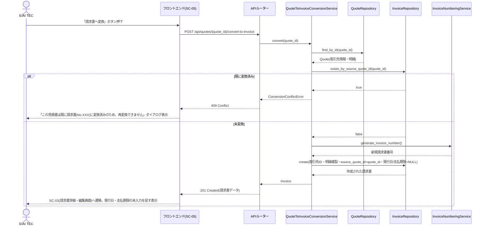
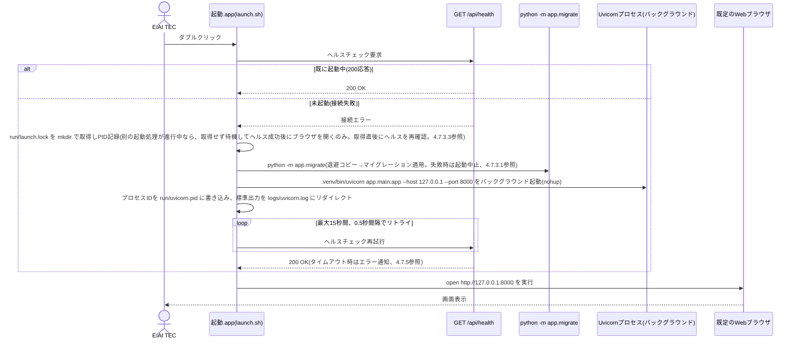
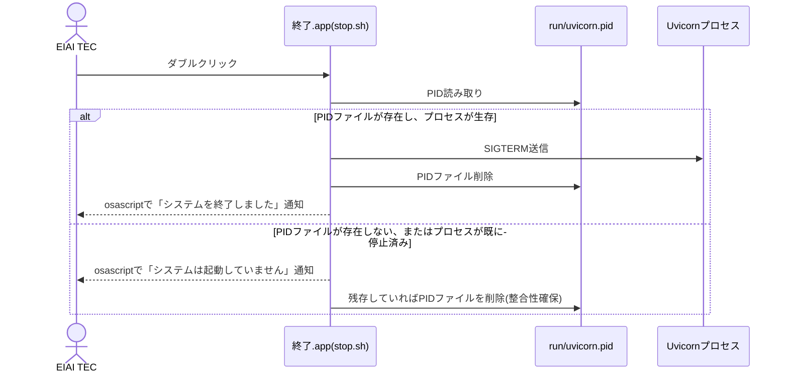
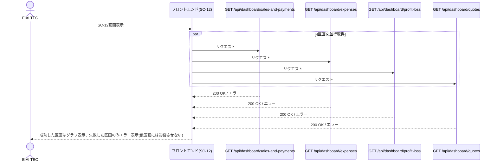
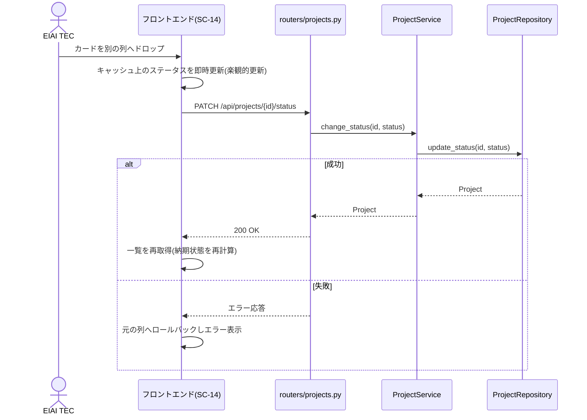
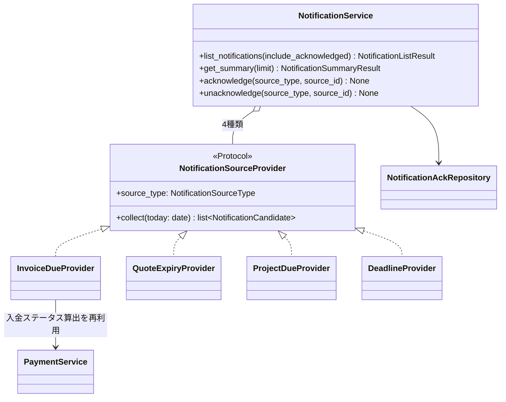
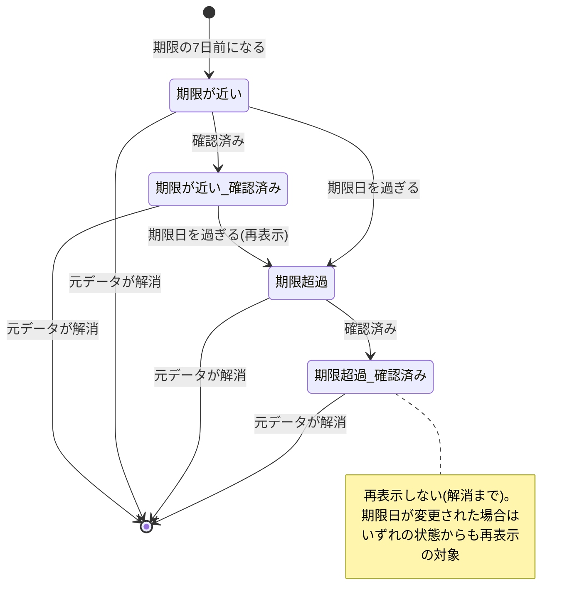
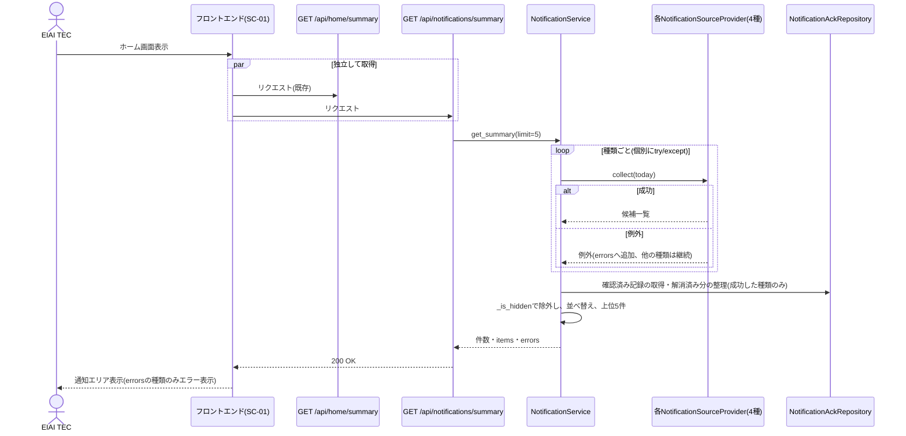
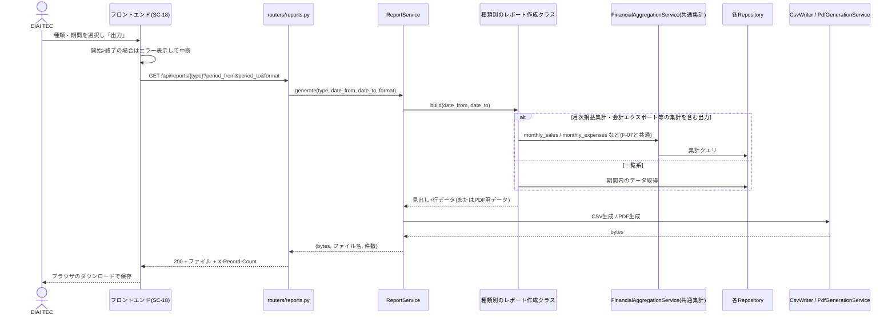
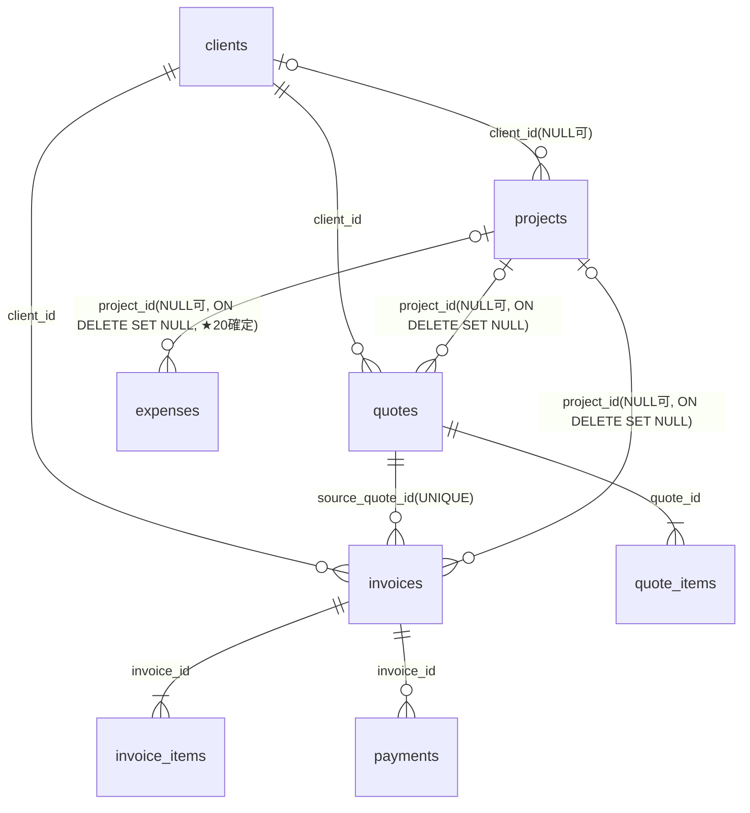

# 個人事業(EIAI TEC)向け事務管理システム 詳細設計書

## 1. 文書情報

- 作成日: 2026-09-15 / 改訂日: 2026-09-16(2.0版)、2026-09-19(3.0版〜3.8版)
- 版数: 3.8
- 参照元: `docs/02_architect/基本設計書.md`(版数3.4)
- 対応イテレーション: イテレーション1(初回。1.1は初回イテレーション内での確認事項反映)、イテレーション2(2.0、財務ダッシュボード追加)、イテレーション3(3.0、案件管理・通知・レポート出力・経営管理の追加)

> **【2026-09-19更新(3.5版)】要件定義書10.3の要確認事項★17〜26は、2026-09-19にEIAI TEC本人へ確認し、すべて仮置き案どおりで確定した(★19・★20は先行して確認済み)。** 3.0版の設計は仮置き案を前提としており、確認結果と一致したため設計内容の変更はない。本書各節の「★n」の付記は、確定した要確認事項の項番を示す(旧「(仮置き ★n)」は確定として読み、表記を「★nで確定」等に改めた)。確定内容の一覧は基本設計書8.3章を参照する。実装は段階ごと(段階1: F-08〔実装済み〕、段階2: F-09・F-10、段階3: F-11)に行い、段階2・3は確定内容のまま着手できる。

> **【2026-09-19更新(3.6版)】段階2(F-09・F-10、SC-16〜18、マイグレーション`c4d8e2f6a715`)は実装済みであり、実装と照合して本書を改訂した(該当の節・表題に「実装済み」を付記)。あわせて、起動時の`Base.metadata.create_all`を廃止し、スキーマ作成をAlembicマイグレーション(起動時自動適用)のみに一本化した内容(4.7.3.4、4.13.3)と、手動登録の期限の通知タイトルの確定内容(4.10.2)を反映した。段階3(F-11、SC-19・20)は未実装である。**

> **【2026-09-19更新(3.7版)】段階2のレビュー指摘30〜36・★A・★Bを受け、方針A(EIAI TEC本人が了承済み)で次を設計として確定した。実装側の修正はdeveloperが本書に沿って行う。(1)レポート期間の検証: 年は2000〜2099、期間は最大120か月(4.11.1)。(2)CSV数式対策の対象にタブ・CRを追加(4.11.1、4.11.2)。(3)通知確認APIの通知元取得失敗・削除済みは404(4.10.4、8章)。(4)SC-18の空データ通知文言を種類別に定義(4.11.3、3.18)。(5)モックアップとの表記差の明記(4.10.2)と、モックアップ更新・実装の整理事項(9章)。回帰確認観点を4.13.2に追加。**

---

## 2. 対象範囲

基本設計書で定義した画面SC-01〜SC-20、機能F-01〜F-11を対象とする。本書は次フェーズ(developer)がそのまま実装に着手できる粒度で、画面詳細・処理フロー・クラス設計・DB定義・API設計・エラーハンドリングを定める。SC-12(財務ダッシュボード画面)・F-07(財務ダッシュボード)はイテレーション2での追加分、SC-13〜SC-20・F-08〜F-11はイテレーション3での追加分である。

イテレーション3の記載場所: 画面はSC-13〜20を3.13〜3.20章、既存画面SC-01〜07の変更を3.21章、処理フローはF-08を4.9章、F-09を4.10章、F-10を4.11章、F-11を4.12章、既存テーブルへの`project_id`追加に伴う移行・回帰対策を4.13章、DBは6.5章に記載する。イテレーション1・2で確定した既存の節(3.1〜3.12、4.1〜4.8、6.1〜6.4)は、外部仕様を変えない範囲で本書の該当箇所から追記・参照する形とし、書き換えていない。

採用技術は基本設計書2.1章のとおり(Python 3.12 + FastAPI + SQLAlchemy 2.0 + SQLite、React 18 + TypeScript + Vite + MUI)。本書ではこれに基づき、実際のクラス名・関数名・型で設計を記述する。

実行環境はEIAI TEC本人のMac専用とする(Windows対応は行わない。基本設計書2.1章参照)。日常利用時の起動・終了はターミナル操作を伴わない`.app`バンドル(「起動.app」「終了.app」)のダブルクリックで行う。実現方式の詳細は4.7章を参照。データ保存場所(SQLiteファイル・添付ファイル・生成PDF)はプロジェクトフォルダ配下の`db/`・`data/`とする(基本設計書8.1章、本書6章参照)。

---

## 3. 画面詳細設計

各画面の入力項目定義表・操作定義表を示す。UI部品はすべてMUIコンポーネントを用いる。金額表示は3桁カンマ区切り、日付は`YYYY-MM-DD`形式で統一する。

### 3.1 SC-01 ホーム画面

表示専用画面のため入力項目定義表はなし。

**操作定義表**

| 操作 | 種別 | トリガー条件 | 対応する処理の節番号 |
|---|---|---|---|
| 画面初期表示 | 自動 | 画面遷移直後 | 4.6(F-06) |
| 各機能カードのクリック | 画面遷移 | クリック | 3.2/3.6/3.9/3.10 |
| 「財務ダッシュボード」カードのクリック | 画面遷移 | クリック | 3.12(F-07、イテレーション2) |
| システム設定リンクのクリック | 画面遷移 | クリック | 3.11 |

### 3.2 SC-02 請求書一覧画面

**入力項目定義表(検索条件)**

| 項目名 | UI要素 | 型・桁数 | 必須 | 初期値 | バリデーション |
|---|---|---|---|---|---|
| 取引先 | セレクトボックス(オートコンプリート) | 取引先ID(整数) | 任意 | 未選択(全件) | なし |
| 入金ステータス | セレクトボックス | 列挙値(UNPAID/PARTIALLY_PAID/PAID) | 任意 | 未選択(全件) | なし |

**操作定義表**

| 操作 | 種別 | トリガー条件 | 対応する処理の節番号 |
|---|---|---|---|
| 画面初期表示・検索条件変更 | 自動/API呼出 | 画面表示時、検索条件変更時 | 4.1 ステップ9 |
| 「新規作成」ボタン | 画面遷移 | クリック | 3.3 |
| 一覧行クリック | 画面遷移 | クリック | 3.3 |

### 3.3 SC-03 請求書詳細・編集画面

**入力項目定義表**

| 項目名 | UI要素 | 型・桁数 | 必須 | 初期値 | バリデーション |
|---|---|---|---|---|---|
| 取引先 | セレクト(オートコンプリート) | 取引先ID(整数) | 必須 | 未選択 | 必須選択。未選択時「取引先を選択してください」 |
| 発行日 | 日付ピッカー | 日付(YYYY-MM-DD) | 必須(注1) | 空欄。F-04変換時は空欄のまま作成される | 未入力時「発行日を入力してください」 |
| 支払期限 | 日付ピッカー | 日付(YYYY-MM-DD) | 必須(注1) | 空欄 | 未入力時「支払期限を入力してください」 |
| 請求書番号 | テキスト(表示専用) | 文字列(例: `2026-0001`) | - | 自動採番値 | 編集不可 |
| 品目名 | テキスト | 文字列(最大100文字) | 必須 | 空欄 | 未入力時「品目名を入力してください」 |
| 数量 | 数値入力 | 小数(小数第2位まで、10桁) | 必須 | 1 | 0以下または数値以外はエラー「数量は0より大きい数値で入力してください」 |
| 単価 | 数値入力 | 整数(円、最大10桁) | 必須 | 空欄 | 0以下または数値以外はエラー「単価は0より大きい数値で入力してください」 |
| 税区分 | セレクト | 列挙値(STANDARD_10/NON_TAXABLE/OUT_OF_SCOPE) | 必須 | STANDARD_10 | 未選択時エラー |
| 金額(行) | 数値(表示専用) | 整数 | - | 自動計算 | 編集不可 |
| 備考 | テキストエリア | 文字列(最大1000文字) | 任意 | 空欄 | 上限超過時エラー |
| 入金日(入金記録行) | 日付ピッカー | 日付 | 必須 | 当日 | 未入力時エラー |
| 入金額(入金記録行) | 数値入力 | 整数(円) | 必須 | 空欄 | 0以下または数値以外はエラー「入金額は0より大きい数値で入力してください」 |
| 入金備考 | テキスト | 文字列(最大200文字) | 任意 | 空欄 | なし |

(注1)発行日・支払期限は通常保存時は必須。ただしF-04変換直後に作成された請求書レコードは例外的にNULL状態で保存される(4.4章参照)。この場合、画面上に「発行日・支払期限が未設定です」という注意表示を行い、ユーザーが値を入力して保存した時点で通常のバリデーションが適用される。

(注2)既存の請求書・見積書(SC-05も同様)を開いて編集する際の明細の数量・単価の扱い(3.4版、不具合#1修正)。`quantity`は`NUMERIC(10,2)`でありAPIは`Decimal`をJSON文字列(例: `"1.00"`)で返すため、取得した明細は`frontend/src/utils/items.ts`の`toItemInputs(items: ItemResponse[]): ItemInput[]`で`quantity`・`unit_price`を`Number()`で数値へ正規化してから編集画面の状態(`setItems`)に保持する(`InvoiceDetailPage.tsx`・`QuoteDetailPage.tsx`が呼ぶ。`clientKey`は`String(id)`)。これにより数量入力欄の表示・0以下判定(`Number.isFinite`)・行金額と税の再計算(`calculateItemAmount`)が文字列のまま誤動作しない。`NUMERIC(10,2)`の値は`double`で桁が崩れない。保存時は数値で送信し、サーバー側で`Decimal`として再検証する。API型(`ItemResponse.quantity: number | string`)・APIの応答形式は変更しない。

**操作定義表**

| 操作 | 種別 | トリガー条件 | 対応する処理の節番号 |
|---|---|---|---|
| 数量・単価の変更 | 自動計算 | 入力値変更時 | 4.1 ステップ1〜5 |
| 「明細行を追加」ボタン | 画面内操作 | クリック | - |
| 明細行「削除」ボタン | 画面内操作 | クリック | - |
| 取引先「新規登録」リンク | 画面遷移 | クリック | 3.11(取引先マスタ管理) |
| 「保存」ボタン | API呼出(POST/PUT) | クリック | 4.1 ステップ6〜8 |
| 「PDF出力」ボタン | API呼出(GET) | クリック(保存済みの場合のみ活性) | 4.1 ステップ9 |
| 変換元見積書リンク | 画面遷移 | `source_quote_id`が設定されている場合に表示、クリック | 3.6 |
| 入金記録「追加」ボタン | API呼出(POST) | クリック | 4.5 |

### 3.4 SC-04 見積書一覧画面

**入力項目定義表(検索条件)**

| 項目名 | UI要素 | 型・桁数 | 必須 | 初期値 | バリデーション |
|---|---|---|---|---|---|
| 取引先 | セレクト(オートコンプリート) | 取引先ID | 任意 | 未選択 | なし |
| ステータス | セレクト | 列挙値(DRAFT/CONFIRMED) | 任意 | 未選択 | なし |

**操作定義表**

| 操作 | 種別 | トリガー条件 | 対応する処理の節番号 |
|---|---|---|---|
| 画面初期表示・検索 | 自動/API呼出 | 画面表示時、検索条件変更時 | 4.3 |
| 「新規作成」ボタン | 画面遷移 | クリック | 3.5 |
| 一覧行クリック | 画面遷移 | クリック | 3.5 |

### 3.5 SC-05 見積書詳細・編集画面

**入力項目定義表**

| 項目名 | UI要素 | 型・桁数 | 必須 | 初期値 | バリデーション |
|---|---|---|---|---|---|
| 取引先 | セレクト(オートコンプリート) | 取引先ID | 必須 | 未選択 | 未選択時エラー |
| 発行日 | 日付ピッカー | 日付 | 必須 | 空欄 | 未入力時エラー |
| 有効期限 | 日付ピッカー | 日付 | 必須 | 空欄 | 未入力時エラー |
| 見積書番号 | テキスト(表示専用) | 文字列(例: `2026-0001`) | - | 自動採番値 | 編集不可 |
| ステータス | セレクト(トグル) | 列挙値(DRAFT/CONFIRMED) | 必須 | DRAFT(作成中) | なし |
| 品目名・数量・単価・税区分 | SC-03に同じ | SC-03に同じ | SC-03に同じ | SC-03に同じ | SC-03に同じ |
| 備考 | テキストエリア | 文字列(最大1000文字) | 任意 | 空欄 | 上限超過時エラー |

**操作定義表**

| 操作 | 種別 | トリガー条件 | 対応する処理の節番号 |
|---|---|---|---|
| 品目明細入力 | 自動計算 | 入力値変更時 | 4.3 |
| 「保存」ボタン | API呼出 | クリック | 4.3 |
| ステータス切替 | 画面内操作 | クリック | 4.3 |
| 「PDF出力」ボタン | API呼出 | クリック(保存済みのみ活性) | 4.3 |
| 「請求書へ変換」ボタン | API呼出(POST) | クリック | 4.4(F-04) |

### 3.6 SC-06 経費一覧・検索画面

**入力項目定義表(検索条件)**

| 項目名 | UI要素 | 型・桁数 | 必須 | 初期値 | バリデーション |
|---|---|---|---|---|---|
| 勘定科目 | セレクト | 列挙値(13科目) | 任意 | 未選択 | なし |
| 支払方法 | セレクト | 列挙値(CASH/CREDIT_CARD/BANK_TRANSFER/OTHER) | 任意 | 未選択 | なし |
| 期間(From/To) | 日付ピッカー×2 | 日付 | 任意 | 未設定 | FromがToより後の場合エラー |

**操作定義表**

| 操作 | 種別 | トリガー条件 | 対応する処理の節番号 |
|---|---|---|---|
| 画面初期表示・検索 | 自動/API呼出 | 画面表示時、検索条件変更時 | 4.2 ステップ4 |
| 「新規登録」ボタン | 画面遷移 | クリック | 3.7 |
| 一覧行クリック | 画面遷移 | クリック | 3.7 |
| 領収書アイコンクリック | ファイル表示 | 添付ありの行でクリック | 4.2 ステップ6 |
| 「集計を見る」ボタン | 画面遷移 | クリック | 3.8 |

### 3.7 SC-07 経費登録・編集画面

**入力項目定義表**

| 項目名 | UI要素 | 型・桁数 | 必須 | 初期値 | バリデーション |
|---|---|---|---|---|---|
| 発生日 | 日付ピッカー | 日付 | 必須 | 当日 | 未入力時「発生日を入力してください」 |
| 勘定科目 | セレクト(13科目、「その他」選択時は自由入力欄を表示) | 文字列 | 必須 | 未選択 | 未選択時「勘定科目を選択してください」 |
| 金額 | 数値入力 | 整数(円、最大10桁) | 必須 | 空欄 | 0以下または数値以外はエラー「金額は0より大きい数値で入力してください」 |
| 税区分 | セレクト | 列挙値(STANDARD_10/NON_TAXABLE/OUT_OF_SCOPE/NOT_APPLICABLE) | 必須 | STANDARD_10 | 未選択時エラー |
| 支払先 | テキスト | 文字列(最大100文字) | 任意 | 空欄 | 上限超過時エラー |
| 支払方法 | セレクト | 列挙値(CASH/CREDIT_CARD/BANK_TRANSFER/OTHER) | 任意 | 未選択 | なし |
| メモ | テキストエリア | 文字列(最大500文字) | 任意 | 空欄 | 上限超過時エラー |
| 領収書ファイル | ファイル選択(ドラッグ&ドロップ対応) | ファイル(jpg/jpeg/png/pdf、最大10MB) | 任意 | なし | 対応形式外・サイズ超過はエラー「対応していないファイル形式、またはサイズが上限(10MB)を超えています」 |

**操作定義表**

| 操作 | 種別 | トリガー条件 | 対応する処理の節番号 |
|---|---|---|---|
| 「保存」ボタン | API呼出(POST/PUT、添付ありの場合は続けてPOST attachment) | クリック | 4.2 ステップ1〜3 |
| ファイル選択/ドロップ | 画面内バリデーション+API呼出 | ファイル選択時 | 4.2 ステップ2 |

### 3.8 SC-08 経費集計画面

**入力項目定義表(検索条件)**

| 項目名 | UI要素 | 型・桁数 | 必須 | 初期値 | バリデーション |
|---|---|---|---|---|---|
| 集計対象年月(From/To) | 月選択ピッカー×2 | 年月(YYYY-MM) | 任意 | 当月を含む直近12か月 | なし |

**操作定義表**

| 操作 | 種別 | トリガー条件 | 対応する処理の節番号 |
|---|---|---|---|
| 画面初期表示・期間変更 | 自動/API呼出 | 画面表示時、期間変更時 | 4.2 ステップ7 |

### 3.9 SC-09 売掛金一覧画面

入力項目(検索条件)はSC-02の入金ステータスに準ずる。

**操作定義表**

| 操作 | 種別 | トリガー条件 | 対応する処理の節番号 |
|---|---|---|---|
| 画面初期表示 | 自動/API呼出 | 画面表示時 | 4.5 |
| 一覧行クリック | 画面遷移 | クリック | 3.3 |

### 3.10 SC-10 取引先マスタ管理画面

**入力項目定義表**

| 項目名 | UI要素 | 型・桁数 | 必須 | 初期値 | バリデーション |
|---|---|---|---|---|---|
| 名称 | テキスト | 文字列(最大100文字) | 必須 | 空欄 | 未入力時「名称を入力してください」 |
| 郵便番号 | テキスト | 文字列(最大8桁、ハイフン任意) | 任意 | 空欄 | 数字とハイフン以外はエラー |
| 住所 | テキスト | 文字列(最大200文字) | 任意 | 空欄 | 上限超過時エラー |
| 担当者名 | テキスト | 文字列(最大50文字) | 任意 | 空欄 | 上限超過時エラー |
| 連絡先 | テキスト | 文字列(最大200文字) | 任意 | 空欄 | 上限超過時エラー |

**操作定義表**

| 操作 | 種別 | トリガー条件 | 対応する処理の節番号 |
|---|---|---|---|
| 「新規登録」ボタン | 画面内操作 | クリック | - |
| 「保存」ボタン | API呼出(POST/PUT) | クリック | - |

### 3.11 SC-11 システム設定画面(発行者情報)

**入力項目定義表**

| 項目名 | UI要素 | 型・桁数 | 必須 | 初期値 | バリデーション |
|---|---|---|---|---|---|
| 氏名 | テキスト | 文字列(最大50文字) | 必須 | 空欄 | 未入力時「氏名を入力してください」 |
| 屋号 | テキスト | 文字列(最大100文字) | 任意 | 空欄 | 上限超過時エラー |
| 住所 | テキスト | 文字列(最大200文字) | 任意 | 空欄 | 上限超過時エラー |
| 連絡先 | テキスト | 文字列(最大200文字) | 任意 | 空欄 | 上限超過時エラー |
| 登録番号 | テキスト | 文字列(`T`+数字13桁、任意) | 任意 | 空欄 | 入力時のみ形式チェック(`^T\d{13}$`)。空欄は許容 |

**操作定義表**

| 操作 | 種別 | トリガー条件 | 対応する処理の節番号 |
|---|---|---|---|
| 「保存」ボタン | API呼出(PUT) | クリック | - |

### 3.12 SC-12 財務ダッシュボード画面(イテレーション2)

表示専用画面のため入力項目定義表はなし(期間の絞り込みUIも設けない。基本設計書4.13章)。

**操作定義表**

| 操作 | 種別 | トリガー条件 | 対応する処理の節番号 |
|---|---|---|---|
| 画面初期表示 | 自動/API呼出(4本、並行) | 画面遷移直後 | 4.8.2〜4.8.5 |

画面表示時、フロントエンドは以下4本のAPIを並行して呼び出し、各レスポンスを対応する区画に独立して描画する。いずれか1本が失敗しても、他の区画の表示・データ取得には影響させない(機能仕様書F-07例外仕様、4.8.6章参照)。

| 区画 | 呼び出すAPI | 対応する処理の節番号 |
|---|---|---|
| 売上・入金状況 | `GET /api/dashboard/sales-and-payments` | 4.8.2 |
| 経費 | `GET /api/dashboard/expenses` | 4.8.3 |
| 損益(収支) | `GET /api/dashboard/profit-loss` | 4.8.4 |
| 見積状況 | `GET /api/dashboard/quotes` | 4.8.5 |

### 3.13 SC-13 案件一覧画面(イテレーション3・段階1)

**入力項目定義表(検索条件)**

| 項目名 | UI要素 | 型・桁数 | 必須 | 初期値 | バリデーション |
|---|---|---|---|---|---|
| ステータス | セレクトボックス | 列挙値(NOT_STARTED/IN_PROGRESS/WAITING_REVIEW/DONE) | 任意 | 未選択(全件) | なし |
| 取引先 | セレクト(オートコンプリート) | 取引先ID(整数) | 任意 | 未選択(全件) | なし |

**操作定義表**

| 操作 | 種別 | トリガー条件 | 対応する処理の節番号 |
|---|---|---|---|
| 画面初期表示・検索条件変更 | 自動/API呼出(`GET /api/projects`) | 画面表示時、条件変更時 | 4.9.3 |
| 「新規案件」ボタン | 画面遷移 | クリック | 3.15 |
| 一覧行クリック | 画面遷移 | クリック | 3.15 |
| 「カンバン」タブ | 画面遷移 | クリック | 3.14 |

表示項目: 案件名、取引先名、ステータス(日本語ラベル)、納期、納期状態(`due_state`が`OVERDUE`なら「超過」、`UPCOMING`なら「接近」を強調表示)、見積件数、請求件数。

### 3.14 SC-14 案件カンバン画面(イテレーション3・段階1)

**入力項目定義表(検索条件)**

| 項目名 | UI要素 | 型・桁数 | 必須 | 初期値 | バリデーション |
|---|---|---|---|---|---|
| 取引先 | セレクト(オートコンプリート) | 取引先ID(整数) | 任意 | 未選択(全件) | なし |

**操作定義表**

| 操作 | 種別 | トリガー条件 | 対応する処理の節番号 |
|---|---|---|---|
| 画面初期表示・取引先変更 | 自動/API呼出(`GET /api/projects`) | 画面表示時 | 4.9.3 |
| カードのドラッグ&ドロップ | API呼出(`PATCH /api/projects/{id}/status`) | 別の列へドロップ(同一列内のドロップは何もしない) | 4.9.3 |
| カードの「ステータス変更」メニュー | API呼出(同上) | メニュー項目選択 | 4.9.3 |
| カードクリック | 画面遷移 | クリック(ドラッグ操作時は遷移しない) | 3.15 |
| 「新規案件」ボタン | 画面遷移 | クリック | 3.15 |

実装: `@hello-pangea/dnd`の`DragDropContext`・`Droppable`(列。`droppableId`=ステータス値)・`Draggable`(カード。`draggableId`=案件ID文字列)を用いる。`onDragEnd`で`destination.droppableId !== source.droppableId`の場合のみ、TanStack Queryの楽観的更新(`onMutate`でキャッシュ上のステータスを更新、`onError`でロールバック、`onSettled`で再取得)によりステータス変更を行う。

### 3.15 SC-15 案件詳細・編集画面(イテレーション3・段階1)

**入力項目定義表**

| 項目名 | UI要素 | 型・桁数 | 必須 | 初期値 | バリデーション |
|---|---|---|---|---|---|
| 案件名 | テキスト | 文字列(最大100文字) | 必須 | 空欄 | 未入力(空白のみを含む)時「案件名を入力してください」。上限超過時エラー |
| 取引先 | セレクト(オートコンプリート) | 取引先ID(整数) | 任意 | 未選択 | なし |
| ステータス | セレクト | 列挙値(NOT_STARTED/IN_PROGRESS/WAITING_REVIEW/DONE) | 必須 | NOT_STARTED(未着手) | 列挙値以外はエラー |
| 納期 | 日付ピッカー | 日付(YYYY-MM-DD) | 任意 | 空欄 | 日付形式以外はエラー。過去日も入力可 |
| 概要メモ | テキストエリア | 文字列(最大1000文字) | 任意 | 空欄 | 上限超過時エラー |

**操作定義表**

| 操作 | 種別 | トリガー条件 | 対応する処理の節番号 |
|---|---|---|---|
| 画面初期表示(既存案件) | 自動/API呼出(`GET /api/projects/{id}`) | 画面表示時 | 4.9.4 |
| 「保存」ボタン | API呼出(POST/PUT) | クリック | 4.9.2 |
| 「削除」ボタン | API呼出(DELETE) | クリック→確認ダイアログで承認(既存案件のみ活性) | 4.9.6 |
| 「請求書を紐付ける」「見積書を紐付ける」 | ダイアログ表示+API呼出(`PUT /api/invoices/{id}/project`、`PUT /api/quotes/{id}/project`) | ダイアログで書類を選択し確定 | 4.9.5 |
| 行の「紐付けを解除」 | API呼出(同上、`project_id: null`) | クリック | 4.9.5 |
| 紐付け書類の行クリック | 画面遷移 | クリック | 3.3/3.5 |

紐付け選択ダイアログには、全請求書(または全見積書)を書類番号・取引先・合計金額・現在の案件名とともに表示する(完了済み案件への紐付けも警告なしで可能。現在別の案件に紐付いている書類を選んだ場合は「案件(案件名)から移動します。よろしいですか?」を確認する)。

### 3.16 SC-16 通知一覧画面(イテレーション3・段階2。実装済み)

**入力項目定義表(表示条件)**

| 項目名 | UI要素 | 型・桁数 | 必須 | 初期値 | バリデーション |
|---|---|---|---|---|---|
| 確認済みも表示 | スイッチ | 真偽値 | 任意 | オフ | なし |

**操作定義表**

| 操作 | 種別 | トリガー条件 | 対応する処理の節番号 |
|---|---|---|---|
| 画面初期表示・表示条件変更 | 自動/API呼出(`GET /api/notifications?include_acknowledged=`) | 画面表示時 | 4.10.2〜4.10.3, 4.10.6 |
| 通知項目クリック | 画面遷移(`link`の値のパスへ) | クリック | 3.3/3.5/3.15/3.17 |
| 「確認済み」ボタン | API呼出(`POST /api/notifications/acknowledge`) | クリック | 4.10.4 |
| 「未確認に戻す」 | API呼出(`DELETE /api/notifications/acknowledge`) | クリック(確認済み表示中のみ) | 4.10.4 |
| 「期限を登録・編集」ボタン | 画面遷移 | クリック | 3.17 |

`errors`(取得に失敗した通知の種類)が空でない場合、その種類名を挙げて「一部の通知を取得できませんでした(請求書の支払期限)」を表示する。取得できた種類の通知は通常表示する。

実装での表示(README差異#18): 状態は塗りつぶしバッジ「超過」「接近」、種類は「請求書の支払期限」「見積書の有効期限」「案件の納期」「登録した期限」で表示する。通知の文言(`title`)は4.10.2のとおり。

### 3.17 SC-17 期限一覧・登録・編集画面(イテレーション3・段階2。実装済み)

**入力項目定義表(登録・編集フォーム。★22で確定)**

| 項目名 | UI要素 | 型・桁数 | 必須 | 初期値 | バリデーション |
|---|---|---|---|---|---|
| 名称 | テキスト | 文字列(最大100文字) | 必須 | 空欄 | 未入力(空白のみを含む)時「名称を入力してください」 |
| 期限日 | 日付ピッカー | 日付(YYYY-MM-DD) | 必須 | 空欄 | 未入力時「期限日を入力してください」。日付形式以外はエラー |
| 種別 | セレクト | 列挙値(TAX_FILING=確定申告/CONTRACT_RENEWAL=契約更新/OTHER=その他) | 必須 | OTHER | 列挙値以外はエラー |
| メモ | テキストエリア | 文字列(最大500文字) | 任意 | 空欄 | 上限超過時エラー |
| 毎年繰り返す | チェックボックス | 真偽値 | 任意 | オフ | なし |

**操作定義表**

| 操作 | 種別 | トリガー条件 | 対応する処理の節番号 |
|---|---|---|---|
| 画面初期表示 | 自動/API呼出(`GET /api/deadlines`) | 画面表示時 | 4.10.5 |
| 「新規登録」ボタン | ダイアログ表示 | クリック | - |
| 「保存」ボタン | API呼出(POST/PUT) | クリック | 4.10.5 |
| 「削除」ボタン | API呼出(DELETE) | クリック→確認ダイアログで承認 | 4.10.5 |

### 3.18 SC-18 レポート出力画面(イテレーション3・段階2。実装済み)

**入力項目定義表(★23で確定)**

| 項目名 | UI要素 | 型・桁数 | 必須 | 初期値 | バリデーション |
|---|---|---|---|---|---|
| 出力する種類 | ラジオボタン(または選択リスト) | 列挙値(invoices/payments/quotes/expenses/monthly-pl/projects/accounting-export) | 必須 | 未選択 | 未選択時「出力する種類を選択してください」 |
| 開始年月 | 月選択ピッカー | 年月(YYYY-MM) | 必須 | 現在月の11か月前 | 未入力時エラー。年が2000〜2099の範囲外の場合「期間の年は2000〜2099の範囲で指定してください」。終了年月より後の場合「開始年月は終了年月以前を指定してください」。期間が120か月超の場合「期間は最大120か月(10年)以内で指定してください」(3.7版。判定順・文言は4.11.1) |
| 終了年月 | 月選択ピッカー | 年月(YYYY-MM) | 必須 | 現在月 | 未入力時エラー。年の範囲・期間上限は開始年月と同じ(3.7版) |
| 出力形式 | セレクト(月次損益集計レポート選択時のみ表示) | 列挙値(csv/pdf) | 必須(表示時) | csv | なし。他の種類ではcsv固定で非表示 |

初期の期間は`build_last_12_months`(4.8.1)と同じ算出とする。

**操作定義表**

| 操作 | 種別 | トリガー条件 | 対応する処理の節番号 |
|---|---|---|---|
| 「出力」ボタン | API呼出(`GET /api/reports/{type}`)→レスポンスをBlobとしてダウンロード | クリック(入力エラーがない場合) | 4.11 |
| 種類の変更 | 画面内操作 | 選択時(期間の基準・出力形式の表示を更新) | 4.11.1 |

種類ごとに画面へ表示する「期間の基準」の文言: 請求書一覧=発行日、入金記録=入金日、見積書一覧=発行日、経費一覧=発生日、月次損益集計レポート=請求書の発行日・経費の発生日、案件別サマリー=案件の納期または紐付き請求書の発行日、会計ソフト連携用エクスポート=売上は発行日・経費は発生日。

### 3.19 SC-19 目標と実績の対比画面(イテレーション3・段階3)

**入力項目定義表(表示条件・目標登録。★17・★25で確定)**

| 項目名 | UI要素 | 型・桁数 | 必須 | 初期値 | バリデーション |
|---|---|---|---|---|---|
| 対象年 | セレクト | 整数(西暦4桁。当年-5〜当年+1) | 必須 | 当年 | なし |
| 表示指標(グラフ用) | トグル | 列挙値(sales/expense/profit) | 必須 | sales | なし |
| 売上目標(1〜12月の各行) | 数値入力 | 整数(円、最大10桁) | 月ごとにセット(注) | 登録済みの値、なければ空欄 | 入力時は0より大きい整数。0以下・数値以外は「目標は0より大きい数値で入力してください」 |
| 経費予算(1〜12月の各行) | 数値入力 | 整数(円、最大10桁) | 月ごとにセット(注) | 同上 | 同上 |

(注)売上目標と経費予算は月ごとにセットで登録する。両方空欄の月は「未登録」として扱い(既存の登録は削除される)、片方のみ入力された月は「売上目標と経費予算の両方を入力してください」のエラーとする(★25で「売上目標・経費予算の両方を登録」と確定)。

**操作定義表**

| 操作 | 種別 | トリガー条件 | 対応する処理の節番号 |
|---|---|---|---|
| 画面初期表示・対象年変更 | 自動/API呼出(`GET /api/management/goals-vs-actuals?year=`) | 画面表示時 | 4.12.2 |
| 「目標を登録・編集」ボタン | ダイアログ表示(`GET /api/management/goals/{year}`で現在値を取得) | クリック | 4.12.2 |
| 目標「保存」ボタン | API呼出(`PUT /api/management/goals/{year}`)→対比を再取得 | クリック | 4.12.2 |
| 「案件別採算を見る」 | 画面遷移 | クリック | 3.20 |

### 3.20 SC-20 案件別採算一覧画面(イテレーション3・段階3)

**入力項目定義表(検索条件)**

| 項目名 | UI要素 | 型・桁数 | 必須 | 初期値 | バリデーション |
|---|---|---|---|---|---|
| ステータス | セレクトボックス | 列挙値(案件の4区分) | 任意 | 未選択(全件) | なし |

**操作定義表**

| 操作 | 種別 | トリガー条件 | 対応する処理の節番号 |
|---|---|---|---|
| 画面初期表示・絞り込み変更 | 自動/API呼出(`GET /api/management/project-profitability`) | 画面表示時 | 4.12.3 |
| 案件行クリック | 画面遷移 | クリック | 3.15 |

### 3.21 既存画面の変更(イテレーション3)

| 画面 | 変更内容 | 対応する処理の節番号 |
|---|---|---|
| SC-01 ホーム(3.1) | 操作定義表に次を追加する。「案件管理」カード→SC-14、「通知・期限」カード→SC-16、「レポート出力」カード→SC-18、「経営管理」カード→SC-19(いずれも画面遷移・クリック)。画面初期表示時、既存の`GET /api/home/summary`に加えて`GET /api/notifications/summary`を独立して呼び出し、通知エリアに未確認件数・超過件数・上位5件を表示する。通知の「確認済み」ボタン(API呼出、4.10.4)、通知項目クリック(元データ画面へ遷移)、「すべての通知を見る」(SC-16へ遷移)を追加する。通知エリアの取得失敗は通知エリアのみエラー表示とする。**実装状況**: 「案件管理」「通知・期限」「レポート出力」カードと通知エリアは実装済み(段階1・2)。「経営管理」カードは段階3のため未追加(README差異#25) | 4.10.6 |
| SC-02 請求書一覧(3.2) | 表示列に「案件」(案件名。案件なしは空欄)を追加する。検索条件・操作は変更しない | 4.13 |
| SC-03 請求書詳細・編集(3.3) | 入力項目定義表に次を追加する。**案件**: セレクト(オートコンプリート。全案件を表示、完了済みも選択可)、型=案件ID(整数)、必須=任意、初期値=未選択(F-04変換直後は変換元見積書の案件)、バリデーション=存在しない案件IDはエラー。「保存」時のリクエストに`project_id`を含める。F-04変換直後で発行日・支払期限が未設定の請求書について、案件選択欄の変更は`PUT /api/invoices/{id}/project`(4.9.5)で即時保存できる(通常の「保存」は従来どおり日付必須) | 4.9.5, 4.4 |
| SC-04 見積書一覧(3.4) | 表示列に「案件」を追加する | 4.13 |
| SC-05 見積書詳細・編集(3.5) | 入力項目定義表に「案件」(SC-03と同仕様。任意)を追加する。「保存」時のリクエストに`project_id`を含める。「請求書へ変換」時は変換元の案件を請求書へ引き継ぐ | 4.4, 4.9.5 |
| SC-07 経費登録・編集(3.7、★20で確定) | 入力項目定義表に「案件」(セレクト。任意。初期値=未選択。バリデーションは存在しない案件IDのみエラー)を追加する。「保存」時のリクエストに`project_id`を含める | 4.9.5 |
| SC-06・SC-08〜SC-12 | 変更なし | - |

---

## 4. 処理フロー設計

### 4.1 F-01 請求書発行

税額計算ロジックはF-03(見積書)と共通(`TaxCalculationService`)。処理順序は以下のとおり。

1. 品目明細ごとに行金額を算出する。
   `amount_i = floor(quantity_i * unit_price_i)`(小数点以下切り捨て)
2. 税区分ごとに小計を集計する。
   `subtotal_by_tax[tax] = Σ amount_i (tax_i = tax であるものの合計)`
3. 消費税額を税区分ごとに計算する。標準10%区分のみ課税対象とし、非課税・不課税は0円とする。
   `tax_amount = floor(subtotal_by_tax[STANDARD_10] * 0.10)`(小数点以下切り捨て。要件定義書10章★2)
4. 小計合計を算出する。`subtotal_amount = Σ subtotal_by_tax`(全税区分の合計)
5. 合計金額を算出する。`total_amount = subtotal_amount + tax_amount`
6. 画面上に小計・消費税額(税区分別)・合計金額をリアルタイム表示する(サーバー呼び出し不要、フロントエンドで同一ロジックを再計算して表示。保存時にサーバー側でも同じロジックにより再計算し、サーバー側の計算結果を正とする)。
7. 「保存」実行時、以下を判定する。
   - 品目明細が0件 → エラー(3.3参照)
   - 取引先未選択 → エラー
   - いずれかの明細行で数量・単価が0以下または数値以外 → エラー
   - 通常保存(新規作成または既存編集)の場合、発行日・支払期限が未入力 → エラー。ただし4.4節のF-04変換による作成直後の初回状態はこの限りではない(発行日・支払期限NULLのまま作成される)
8. 新規作成時は`InvoiceNumberingService`により請求書番号を採番する(4.1.1参照)。
9. 上記1〜5の計算結果とともに、`invoices`・`invoice_items`テーブルへトランザクション内で保存する。
10. 「PDF出力」実行時、保存済みの請求書データと`company_profile`(発行者情報)を`PdfGenerationService`に渡し、Jinja2テンプレートをレンダリングした上でWeasyPrintによりPDFを生成する。生成したPDFはブラウザのダウンロード/印刷機能から保存・印刷できるようにする。PDFレイアウトには登録番号欄(未入力時は空欄表示)、税率ごとの区分記載(標準10%/非課税/不課税それぞれの小計・税額)、適用税率を含める。

#### 4.1.1 請求書番号・見積書番号の採番ルール

- 形式: `{年(西暦4桁)}-{連番(4桁ゼロ埋め)}`(例: `2026-0001`)。請求書番号と見積書番号は別カウンタとする。
- 「年」は、採番処理を実行した時点のシステム日付の年とする。F-04変換時点では発行日が未確定であるため、請求書の発行日ではなく採番実行時点の年を用いる解釈とした(実装レベルの体裁決定。機能仕様書に採番タイミングの厳密な定義がないため、architectureエージェントが本書にて確定する)。
- 連番は、対象年の既存の番号のうち最大値+1とする。年が変わった場合は1から再開する。
- 発行済みの番号は変更しない(機能仕様書F-01例外仕様)。

### 4.2 F-02 経費管理

1. 「保存」実行時、以下を判定する。
   - 金額が0以下または数値以外 → エラー(3.7参照)
   - 発生日・勘定科目が未入力 → エラー
2. 領収書ファイルが選択されている場合、以下を判定する。
   - 拡張子が`jpg`/`jpeg`/`png`/`pdf`以外 → エラー
   - ファイルサイズが10MBを超過 → エラー
   - 上記を満たす場合、まず経費レコード(`expenses`)を作成・更新し、確定した経費IDを用いて`POST /api/expenses/{id}/attachment`を呼び出し、ファイルをサーバーへアップロードする。サーバーは`backend/data/attachments/expenses/{expense_id}/{uuid4}_{元ファイル名}`にファイルを保存し、`expenses.attachment_path`(相対パス)・`attachment_original_name`を更新する。一連の処理はフロントエンドから見ると「保存」ボタン1回の操作で完結する。
3. 「保存」ボタン押下時の全体順序: (1)入力値バリデーション → (2)経費レコードの作成/更新 → (3)添付ファイルがあればアップロード実行、の順で行う。いずれかの段階でエラーが発生した場合は、それ以降の処理を行わず画面にエラーを表示する。
4. 経費一覧は`expense_date`の降順で取得する(機能仕様書F-02処理内容2)。検索条件(勘定科目・支払方法・期間)が指定された場合はSQL上の`WHERE`条件として付加する。
5. 領収書アイコンクリック時、`GET /api/expenses/{id}/attachment`でファイルを取得し、ブラウザでプレビュー表示またはダウンロードする。
6. 集計処理(SC-08)は、指定された期間内の経費を対象に以下を算出する。
   - 勘定科目別集計: `account_category`ごとの件数・金額合計
   - 期間別(月単位)集計: `strftime('%Y-%m', expense_date)`単位での金額合計

### 4.3 F-03 見積書作成

税額計算は4.1のステップ1〜6と共通ロジック(`TaxCalculationService`)を用いる。相違点は以下のとおり。

1. 保存時のバリデーション対象に発行日・有効期限の必須チェックを含む(見積書にはF-04のような未設定例外は存在しない)。
2. 新規作成時は`QuoteNumberingService`により見積書番号を採番する(採番ルールは4.1.1参照)。
3. ステータスは`DRAFT`(作成中)/`CONFIRMED`(確定)の2値のみとし、画面上のトグル操作で切替可能とする。ステータス変更に伴う特別な業務処理(承認フロー等)は行わない。
4. 「PDF出力」は4.1ステップ10と同様のロジックで見積書PDFを生成する。

### 4.4 F-04 見積→請求の自動変換

以下のシーケンスで処理する。



処理の要点は以下のとおり。

1. 変換元見積書のステータスが`DRAFT`(作成中)であっても変換は可能とする(機能仕様書F-04例外仕様)。
2. 複製対象は取引先ID・品目明細(品目名・数量・単価・税区分)のみとし、明細IDは新規採番する。
3. 変換により作成された請求書は、変換元見積書と完全に独立したレコードとして扱う。以後、一方を編集しても他方には影響しない。`invoices.source_quote_id`は参照情報としてのみ保持する。
4. 「変換済みかどうか」の判定は、`invoices`テーブルの`source_quote_id`が対象の`quote_id`と一致するレコードが存在するかどうかで行う。
5. 1対1制約はDB上の`invoices.source_quote_id`列に付与する`UNIQUE`制約によって保証する(6.3節参照)。アプリケーション層での事前チェック(上記ステップ)は、UNIQUE制約違反によるDBエラーを待たずにユーザーへ分かりやすいエラーメッセージを返すための冗長化である。
6. (イテレーション3・★19)複製対象に`project_id`を加える。`QuoteToInvoiceConversionService.convert`は、`IRepo.create`へ渡す際に`project_id=quote.project_id`を設定する(見積書に案件がなければNULLのまま)。変換後の請求書の案件は、通常の請求書編集や4.9.5の紐付けAPIで変更・解除でき、変換元見積書の案件には影響しない(変換後は独立したデータ)。上記シーケンス図の`IRepo.create`の引数に`project_id`が追加されるのみで、処理順序・409応答の条件は変わらない。

### 4.5 F-05 入金・売掛金管理

1. 入金記録保存時、以下を判定する。
   - 入金額が0以下または数値以外 → エラー(3.3参照)
   - 保存対象請求書の既存入金額合計 + 今回入金額 > 請求金額(`total_amount`) の場合 → 確認メッセージ「入金額の合計が請求金額を超過します。登録しますか?」を表示し、ユーザーが「はい」を選択した場合のみ登録する(機能仕様書F-05例外仕様)。
2. 入金ステータスの算出ロジック(`PaymentService.calculate_status(invoice)`)。
   ```
   paid_total = SUM(payments.amount WHERE payments.invoice_id = invoice.id)
   if paid_total == 0:
       status = UNPAID(未入金)
   elif paid_total < invoice.total_amount:
       status = PARTIALLY_PAID(一部入金)
   else:
       status = PAID(入金済み)
   ```
   このステータスはDBに保存せず、一覧・詳細取得のたびに都度算出する(算出元は常に`payments`テーブルの実データ)。
3. 支払期限超過判定(`PaymentService.is_overdue(invoice)`)。
   ```
   is_overdue = (invoice.due_date is not null)
                and (today > invoice.due_date)
                and (status in [UNPAID, PARTIALLY_PAID])
   ```
   「今日」はサーバー実行時点のシステム日付とする。
4. SC-02(請求書一覧)・SC-09(売掛金一覧)では、上記2・3の算出結果に基づき、支払期限超過の行を強調表示する。
5. アラートは画面表示のみとし、メール送信・デスクトップ通知等のプッシュ型通知は行わない(要件定義書10章★6)。

### 4.6 F-06 ホーム画面・共通UI

1. `GET /api/home/summary`呼び出し時、以下を算出して返却する。
   - `unpaid_count`: 入金ステータスが`UNPAID`または`PARTIALLY_PAID`である請求書の件数
   - `overdue_count`: 上記のうち、4.5ステップ3の`is_overdue`が真である請求書の件数
2. サマリー取得APIがエラーを返した場合、フロントエンドは該当エリアにエラー表示を行い、各機能への導線カードの表示・操作には影響させない(機能仕様書F-06例外仕様)。
3. (イテレーション3)`GET /api/home/summary`の仕様・レスポンスは変更しない。通知エリアは別API`GET /api/notifications/summary`(4.10.6)から取得し、失敗しても3.1のサマリー表示・カード導線に影響させない。導線カード(案件管理・通知・期限・レポート出力・経営管理)は静的なリンクでありAPI依存はない。

### 4.7 アプリケーション起動・終了処理(共通、パッケージング設計)

基本設計書2.1章・3章のとおり、実行環境はEIAI TEC本人のMac専用とし、日常利用時の起動・終了はターミナル操作を伴わない`.app`バンドルのダブルクリックで行う。本節では、その実現方式・内部処理・ビルド手順を定める。

#### 4.7.1 方式選定の補足

- PyInstaller等によるPythonバックエンドの単一バイナリ化は採用しない。理由は基本設計書2.1章に記載のとおり、PDF生成ライブラリ(WeasyPrint)がPango/Cairo/GDK-PixBuf等のネイティブ共有ライブラリを実行時動的読み込み(dlopen)で利用する構成であり、PyInstallerの静的解析による依存同梱が不安定になりやすいためである。
- 代わりに、初回セットアップ時に構築したvenv環境(Homebrew導入済みのネイティブライブラリを利用可能な状態)を、`.app`バンドル内のシェルスクリプトから起動するだけの軽量な方式を採用する。バックエンド自体の実装(FastAPI/Uvicorn)は変更しない。

#### 4.7.2 ディレクトリ構成(起動関連の追加分)

```
back-office/
  backend/
    app/                   … 既存のFastAPIアプリケーション
    .venv/                 … 初回セットアップ時に作成するvenv(git管理外)
    run/
      uvicorn.pid           … 起動中プロセスのPIDファイル(git管理外)
    logs/
      uvicorn.log            … バックエンドの標準出力・エラーログ(git管理外)
    scripts/
      launch.sh              … 起動.appから呼び出されるランチャースクリプト
      stop.sh                 … 終了.appから呼び出されるストップスクリプト
  dist/
    起動.app/                … ビルド生成物(git管理外)。Contents/MacOS/launcher が scripts/launch.sh を実行
    終了.app/                … ビルド生成物(git管理外)。Contents/MacOS/stopper が scripts/stop.sh を実行
  scripts/
    build_apps.sh            … 起動.app/終了.appを生成するビルドスクリプト
```

`run/`・`logs/`・`dist/`・`.venv/`は`.gitignore`に追加し、バージョン管理対象外とする。

#### 4.7.3 起動処理(起動.app)



処理の要点は以下のとおり。

1. `launch.sh`はプロジェクトルートからの相対パスでバックエンドディレクトリを解決し、`GET http://127.0.0.1:8000/api/health`(5.1章・7章参照)への到達可否で起動済み判定を行う。
2. `launch.sh`は冒頭でUTF-8ロケールを設定する(`locale -a`の結果から`en_US.UTF-8`→`ja_JP.UTF-8`→`C.UTF-8`の順に最初に存在するものを`LC_ALL`・`LANG`へ設定し、いずれも無ければ`en_US.UTF-8`とする)。日本語のログ・ダイアログが文字の途中で切れないようにするためで、`起動.app`は`launch.sh`を呼ぶだけのため、Finderからの起動でも有効である。
3. 未起動の場合のみ、二重起動の排他(4.7.3.3)を取得し、マイグレーション自動適用(4.7.3.1)を実行してから、`.venv/bin/uvicorn`をバックグラウンドプロセスとして起動する。二重起動を避けるため、起動判定と起動処理の間はスクリプト内で直列に実行する。
4. 起動確認後、`open http://127.0.0.1:8000`コマンドでEIAI TEC本人の既定Webブラウザを自動的に開く。
5. 起動確認が15秒でタイムアウトした場合は、`osascript`によるダイアログ表示で「起動に失敗しました。logs/uvicorn.logを確認してください」を通知し、ブラウザは開かない(4.7.5参照)。

##### 4.7.3.1 起動時マイグレーション自動適用(イテレーション3で確定)

`launch.sh`はUvicorn起動の前に`python -m app.migrate`(`.venv`のPython)を実行し、DBスキーマを最新のAlembicリビジョンへ自動で揃える。実装は`backend/app/migration_runner.py`(適用ロジック)、`backend/app/migrate.py`(コマンド入口)、`backend/scripts/launch.sh`(呼び出し)である。

1. 現在のリビジョンが最新(適用済み)であれば何もしない(冪等。退避コピーも作らない)。
2. 未適用のリビジョンがある場合、適用前に`db/back_office.db`を`db/back_office.db.before-<適用後リビジョン>`へコピーして退避する。同名ファイルが既にある場合は上書きしない(先に取られた退避を保全する)。
   - 退避コピーは一時名(`.tmp`)で作成し、コピー成功後に`os.replace`で正式名へリネームする(途中失敗で不完全な退避が正式名で残らないようにするため)。前回中断で残った`.tmp`は除去して作り直す。
3. 退避後に`alembic upgrade head`相当を適用する。
   - `alembic_version`が無いDBで構造が既知リビジョンと一致した場合は、退避後にstampしてからupgradeする(4.7.3.2)。
   - 適用(upgrade)に失敗した場合の案内文言は状況で異なる(`MigrationError`の要約として標準エラーへ出力)。
     - stamp済みの場合: 「更新履歴の登録(stamp)は済んでいますが更新は完了していません。アプリを停止したうえで、適用前の退避コピー(<パス>)をデータベースファイルへ上書きコピーして復元し、サポートへご連絡ください。」(stamp後は再実行しても更新済み扱いとならないため、復元を必須の手順として案内する)。
     - 退避済み(stampなし)の場合: 「適用前の退避コピー(<パス>)から復元できます。」
     - DBファイルが新規作成(退避前)の場合: 「データベースファイルは退避コピー前のため変更されていません。」
4. 失敗した場合の出力と通知は次のとおり分ける。終了コードは1で、Uvicornは起動せず、ブラウザも開かない。
   - `migrate.py`は、失敗理由の要約(要点)を標準エラー、詳細(トレースバック等)を標準出力へ出力する。`launch.sh`は標準出力を`logs/uvicorn.log`へ記録し、標準エラーをダイアログ用に取得する。
   - `osascript`のダイアログには、要約(改行・引用符を除去し200字まで)と「`logs/uvicorn.log`を確認してください」の案内のみを表示する(詳細は表示しない)。
   - ダイアログ表示自体に失敗した場合も、その旨を`logs/uvicorn.log`へ記録する。
   - AlembicのログはAlembic既定のロガー設定で出力されダイアログ・ログを汚さないよう、`alembic/env.py`で`config.attributes["configure_logger"]`がFalseのときはログ設定(`fileConfig`)を行わず抑止する(`migration_runner.py`はFalseを指定して呼び出す)。
5. 開発時にターミナルから`uvicorn`を直接起動する場合は、`launch.sh`を経由しないため、事前に`python -m app.migrate`を手動で実行する必要がある。アプリ本体(`app.main`)は起動時にテーブルを作成しないため(4.7.3.4)、マイグレーション未実施のDBではAPIが失敗する。

4.13.1のダウングレード非提供・手動コピー運用は、本処理の自動退避コピーにより代替される(復元は退避ファイルを`db/back_office.db`へ戻す)。

##### 4.7.3.2 `alembic_version`が無いDBの扱い(旧create_all由来DBの互換維持)

`alembic_version`テーブルが無く、テーブルだけが`create_all`で作られたDB(Alembic導入前、または`create_all`を廃止する前(4.7.3.4)の実行で作成された作成物)は、次の手順で判定・処理する。この互換処理は`create_all`廃止後も維持する(既存の利用者DBを安全に最新化するため)。旧`create_all`が後から一部のテーブルだけを作成済みで`alembic_version`が旧リビジョンのままのDB(例: `projects`・段階2の2表が先に存在し`project_id`列がない)も、マイグレーションが`IF NOT EXISTS`で冪等に実装されているため自動適用が成功する(テストで確認済み)。

1. 現DBの構造を取得する(`_schema_signature`。`PRAGMA table_info`・`foreign_key_list`・`index_list`・`index_info`を使用)。比較対象は次のとおり。
   - テーブル(`alembic_version`・`sqlite_*`を除く)。
   - 列: 名前・型・NOT NULL・既定値・主キー。型はSQLiteの型親和性(VARCHAR等→TEXT)に正規化して比較する(表記ゆれによる誤判定を避けるため)。
   - 外部キー: 参照先テーブル・列・ON DELETE。
   - UNIQUE: 制約由来・明示インデックス由来のいずれも「列の組」で比較する(自動インデックス名は実装差があるため名前では比較しない)。
   - 明示作成のインデックス(名前・UNIQUE有無・列の組)。制約由来の自動インデックス(`sqlite_autoindex_*`)は対象外。
   - 比較対象外: CHECK制約・ON UPDATE・トリガ。PRAGMAで取得できない、または表記差が大きく誤判定(不一致による停止)を招きやすいためである。これらのみが異なるDBは一致と判定され得るが、退避コピー後のstamp・upgradeで支障が出る変更は列・FK・インデックス側に現れるため、許容する。
2. 各リビジョンを空の一時DBへ順に適用し、リビジョンごとの構造を得る。現DBの構造を新しいリビジョンから順に比較する。
3. 一致するリビジョンがある場合のみ、4.7.3.1の手順2の方法で退避コピーを作成し、一致したリビジョンへ`stamp`し、続けて`upgrade head`を行う。
4. どのリビジョンとも一致しない場合は、DBを一切変更せず(stamp・退避・upgradeとも行わない)、日本語の専用案内(「データベースに更新履歴(alembic_version)がなく、構造も既知の版と一致しないため、自動更新を行いませんでした。データベースは変更していません。サポートへご連絡ください。」)を表示して終了コード1で停止する。手動での確認・対応を要する。
5. stamp後のupgradeに失敗した場合は、4.7.3.1手順3のstamp済み用の案内(アプリ停止→退避コピーの上書きコピーで復元→サポート連絡)を表示する。

##### 4.7.3.3 二重起動の排他(`run/launch.lock`)

`launch.sh`の同時実行(短時間のダブルクリック等)でマイグレーションとUvicorn起動が競合しないよう、`backend/run/launch.lock`ディレクトリを排他ロックとして使う。

1. `mkdir backend/run/launch.lock`の成否でロックを取得する(mkdirは原子的)。取得できたら、ロック内の`pid`ファイルにPIDを記録する。
2. `trap EXIT`でロックを解放する。`INT`・`TERM`・`HUP`は`exit 130`を経由して`EXIT`トラップを実行させる。ロックを取得していない実行(下記5)は、他者のロックを解放しない。
3. ロックが残っている場合は、次の順で古いロックかどうかを判定する。
   1. `pid`ファイルが空(他者がmkdir直後でPID書き込み前の可能性)の場合は、猶予`LAUNCH_LOCK_GRACE`秒(既定1秒)待って再確認する。
   2. PIDが記録されており、かつそのプロセスが生存しており、かつ`pid`ファイルの更新時刻が`LAUNCH_LOCK_STALE_SECONDS`秒(既定300秒)以内であれば、別の起動処理が進行中とみなす(下記5)。
   3. 上記以外(PIDが空のまま・プロセスが停止・更新時刻が300秒より古い)は古いロックとみなす。300秒超は、異常終了後にPIDが別プロセスへ再利用され「生存」と誤判定されることへの対策である。
4. 古いロックの解除と再取得は次の方式で行い、解除した旨を`logs/uvicorn.log`へ記録する。
   1. `mv launch.lock launch.lock.stale.<自プロセスPID>`で自分専用名へ退避する(renameは原子的で、複数の起動が同時に試みても成功するのは1つのみ。失敗した側は断念して待機側に回る)。
   2. 退避したロック内のPIDが、手順3で観測したPIDと異なる場合(判定後に他者が取得し直した新しいロックを退避してしまった場合)は、元の名前へ戻し(`mv -n`)、解除を断念して待機側に回る。
   3. 一致した場合は退避したロックを削除し、`mkdir`で改めて取得を競う(取得に失敗すれば待機側に回る)。
   - 制約(許容事項): 解除と再取得は完全な原子操作ではなく、解除直後に他者が取得し直す極めて短い窓は残る(単一利用者の運用では実害は想定しない)。
5. 別の起動処理が進行中とみなした場合は、マイグレーション・Uvicorn起動は行わず、ヘルスチェックの成功まで待機し(最大15秒)、成功後にブラウザを開くだけで終了する。タイムアウト時は「別の起動処理が完了しませんでした。logs/uvicorn.logを確認してください」をダイアログで通知し終了コード1とする。
6. ロックを取得できた場合は、マイグレーションの前に`is_healthy`を再確認する。既に200応答であれば(最初の判定後に先行プロセスが起動を完了していた場合)、ロックを解除し、ブラウザだけを開いて終了する。2つ目のUvicornの起動と`run/uvicorn.pid`の上書きを防ぐためである。

環境変数`LAUNCH_LOCK_GRACE`(PID未記入の猶予秒)・`LAUNCH_LOCK_STALE_SECONDS`(古いロック扱いの秒数)は、値を変えたい場合の上書き用の任意設定であり、通常運用では設定不要(既定値で動作する)。

##### 4.7.3.4 スキーマ作成のAlembicへの一本化(`create_all`廃止)とDBパス(2026-09-19確定)

- **`create_all`の廃止**: `backend/app/main.py`は、起動時(import時)に`Base.metadata.create_all`を実行しない。スキーマの作成・変更はAlembicマイグレーション(`launch.sh`による起動時自動適用。4.7.3.1)のみで行う。`app.main`のimport時にはDBへ接続しない。理由: `create_all`は既存テーブルへの列追加等を反映せず、Alembicとの併用ではコードとDBのスキーマが静かに乖離するため(README 6.1章の運用ルールと同じ)。また、テストやツールが`app.main`をimportしただけで実DBを作成・変更する副作用を避けるため。
- **新規DBの作成**: DBファイルが存在しない場合は、`python -m app.migrate`(`migration_runner.upgrade_to_head`)がDBの親ディレクトリを作成し、全リビジョンを適用して作成する(退避コピーは作らない)。`database.py`はimport時にDBディレクトリを作成しない(従来あった作成処理を廃止)。
- **DBファイルの場所**: 既定は`db/back_office.db`(プロジェクトルート直下)。環境変数`BACK_OFFICE_DB_PATH`にファイルパスを指定すると差し替えられる(`app/config.py`の`DB_PATH`・`SQLALCHEMY_DATABASE_URL`に反映。未指定または空文字なら既定)。主な用途はテストが実DBへ接触しないことの保証である(4.13.3)。`python -m app.migrate`も同じ設定を参照するため、指定したDBに対して適用・退避コピー(`<DBファイル名>.before-<リビジョン>`)が行われる。
- **uvicornの直接起動**: 開発時に`launch.sh`を経由せず`uvicorn`を起動する場合は、先に`python -m app.migrate`を実行する(4.7.3.1手順5)。
- **互換維持**: `alembic_version`が無い旧`create_all`由来DBのstamp互換は維持する(4.7.3.2)。

#### 4.7.4 終了処理(終了.app)



- バックエンドプロセスは、ブラウザのタブを閉じただけでは終了しない(バックグラウンドで動作し続ける)。EIAI TEC本人が明示的に「終了.app」をダブルクリックすることで停止する運用とする。終了せずMacをシャットダウン・再起動した場合も、OS終了時にプロセスは停止する。

#### 4.7.5 ビルド・パッケージング手順(初回セットアップ時、ターミナルで実施)

以下は開発・導入時に1度だけ実施する手順であり、EIAI TEC本人の日常利用では発生しない(日常利用は4.7.3・4.7.4のダブルクリックのみ)。

1. Homebrewで、WeasyPrintの実行時依存ライブラリをインストールする: `brew install pango gdk-pixbuf libffi cairo`
2. バックエンドのvenvを作成し依存関係をインストールする: `python3.12 -m venv backend/.venv && backend/.venv/bin/pip install -r backend/requirements.txt`
3. フロントエンドをビルドする: `cd frontend && npm install && npm run build`(生成物をバックエンドの静的配信ディレクトリに配置し、`StaticFiles`で配信する)
4. `scripts/build_apps.sh`を実行し、`dist/起動.app`・`dist/終了.app`を生成する。当該スクリプトは、`Info.plist`(`CFBundleExecutable`に`launcher`/`stopper`を指定)と`Contents/MacOS/`配下の実行スクリプト(`scripts/launch.sh`/`scripts/stop.sh`を呼び出すラッパー)を含む最小限の`.app`バンドル構造を組み立てる。
5. 生成された`起動.app`・`終了.app`を、EIAI TEC本人が使いやすい場所(デスクトップ等)にコピーする。以降はダブルクリックのみで日常利用できる。

### 4.8 F-07 財務ダッシュボード(イテレーション2)

対象期間(直近12ヶ月)の決定、月次集計(発生主義)、見積成約率の算出、4区画への分割APIについて定める。読み取り専用機能であり、書き込み処理は一切行わない(機能仕様書F-07処理内容7)。

#### 4.8.1 対象期間の決定

`DashboardService`が、リクエストごとにサーバーの実行時点のシステム日付(4.5章の「今日」と同じ考え方)を基準に対象期間を算出する。

```
today = サーバー実行時点のシステム日付
end_month = today の年月(YYYY-MM)
start_month = end_month の11か月前(YYYY-MM)
date_from = start_month の1日(YYYY-MM-01)
date_to = today が属する月の末日(YYYY-MM-DD)
month_keys = [start_month, start_monthの翌月, ..., end_month]  ※12個、昇順
```

`month_keys`は、4.8.2〜4.8.5の4APIすべてで共通のユーティリティ`build_last_12_months(base_date) -> list[str]`(`app/utils/date_range.py`)により生成する。この関数はSC-08(経費集計画面)の初期表示期間「当月を含む直近12か月」(3.8章)とも算出方法が同一であり、共通化する。

各集計は`date_from <= 対象日 <= date_to`の範囲でSQLの`WHERE`句により絞り込み、`strftime('%Y-%m', 対象日)`で月ごとにグルーピングする。`month_keys`に含まれるがグルーピング結果に存在しない月は、集計値0(0円/0件)として補完する(機能仕様書F-07処理内容6・例外仕様)。

#### 4.8.2 売上・入金状況の集計(`GET /api/dashboard/sales-and-payments`)

1. 月次売上(発生主義): `invoices`テーブルから、`issue_date IS NOT NULL AND date_from <= issue_date <= date_to`を満たす行を対象に、`strftime('%Y-%m', issue_date)`ごとに`total_amount`を合計する。
   ```
   月次売上[m] = Σ invoices.total_amount
                 WHERE invoices.issue_date IS NOT NULL
                   AND date_from <= invoices.issue_date <= date_to
                   AND strftime('%Y-%m', invoices.issue_date) = m
   ```
   F-04変換直後で`issue_date`がNULLのままの請求書(4.4章参照)は、発行日が確定するまで集計対象に含めない。
2. 月次入金額(参考指標): `payments`テーブルから、`payment_date`を基準に月次で`amount`を合計する。損益(収支)の計上基準には用いない(機能仕様書F-07処理内容3、要件定義書10.2★14)。
   ```
   月次入金額[m] = Σ payments.amount
                   WHERE date_from <= payments.payment_date <= date_to
                     AND strftime('%Y-%m', payments.payment_date) = m
   ```
3. `month_keys`の12か月分について、売上・入金額をそれぞれ0円補完した上で、月昇順の配列として返却する。

#### 4.8.3 経費の集計(`GET /api/dashboard/expenses`)

既存の`ExpenseRepository.aggregate_by_month(period)`・`aggregate_by_category(period)`(4.2章ステップ6、SC-08と同一ロジック)を、`period = (date_from, date_to)`(直近12ヶ月固定)で呼び出す形で再利用する。

1. 月次経費合計: `expenses.expense_date`を基準に月次で`amount`を合計する(発生主義、機能仕様書F-07処理内容2)。
   ```
   月次経費合計[m] = Σ expenses.amount
                     WHERE date_from <= expenses.expense_date <= date_to
                       AND strftime('%Y-%m', expenses.expense_date) = m
   ```
2. 勘定科目別内訳: 直近12ヶ月全期間を対象に、`account_category`(F-02で定義済みの13科目、要件定義書10.1★4)ごとに`amount`を合計する。ダッシュボード独自の区分は設けない(要件定義書10.2★15)。
   ```
   勘定科目別内訳[category] = Σ expenses.amount
                              WHERE date_from <= expenses.expense_date <= date_to
                                AND expenses.account_category = category
   ```
3. 月次経費合計は`month_keys`の12か月分を0円補完して返却し、勘定科目別内訳は金額0円の科目を除いた配列として返却する(円グラフ描画上、0円区分は表示しなくてよいため。月次推移側の0円補完とは扱いが異なる点に留意する)。

#### 4.8.4 損益(収支)の集計(`GET /api/dashboard/profit-loss`)

4.8.2の月次売上・4.8.3の月次経費合計を、内部的に`InvoiceRepository`・`ExpenseRepository`から取得し、月ごとに差し引く。

```
月次損益[m] = 月次売上[m] - 月次経費合計[m]
```

月次損益が負の場合はそのまま負の値として返却する(フロントエンド側で黒字/赤字を配色等により視覚的に区別する。基本設計書4.13章)。

#### 4.8.5 見積状況の集計(`GET /api/dashboard/quotes`)

1. 月次見積件数・金額: `quotes`テーブルから、`issue_date IS NOT NULL AND date_from <= issue_date <= date_to`を満たす行を対象に、月ごとに件数・`total_amount`合計を集計する。
   ```
   月次見積件数[m] = COUNT(quotes.id)
                     WHERE quotes.issue_date IS NOT NULL
                       AND date_from <= quotes.issue_date <= date_to
                       AND strftime('%Y-%m', quotes.issue_date) = m
   月次見積金額[m] = Σ quotes.total_amount (同条件)
   ```
2. 見積成約率: 直近12ヶ月に発行された見積書のうち、請求書から`source_quote_id`として参照されている(=変換済みの)件数の割合を、期間全体で1つの値として算出する(機能仕様書5.7、要件定義書10.2★12〜16)。
   ```
   対象見積件数 = COUNT(quotes.id)
                 WHERE quotes.issue_date IS NOT NULL
                   AND date_from <= quotes.issue_date <= date_to
   変換済み見積件数 = COUNT(quotes.id)
                     WHERE 上記条件
                       AND EXISTS (SELECT 1 FROM invoices WHERE invoices.source_quote_id = quotes.id)
   見積成約率 = 対象見積件数 が 0 の場合: 算出不能(null)として返却し、フロントエンドは「-」等を表示する(0除算回避)
              対象見積件数 が 1以上の場合: 変換済み見積件数 / 対象見積件数
   ```
3. 月次見積件数・金額は`month_keys`の12か月分を0件・0円補完して返却する。見積成約率は期間全体の単一値として、月次配列とは別にレスポンスに含める。

#### 4.8.6 区画ごとの独立したエラーハンドリング



4区画を単一のAPIに統合せず4本に分割している理由は、機能仕様書F-07例外仕様「参照元データの取得に失敗した場合は、該当する区画にエラー表示を行い、他の区画の表示には影響させない」を素直に実現するためである。1本のAPIに統合した場合、いずれか1つの集計処理(例: 見積状況)で例外が発生すると他区画分のデータも含めて丸ごとエラーになってしまい、機能仕様書の要求を満たせない。

### 4.9 F-08 案件・プロジェクト管理(イテレーション3・段階1。実装済み。★19・★20で確定)

#### 4.9.1 共通定義

- 進捗ステータス`ProjectStatus`(Python `enum.StrEnum`): `NOT_STARTED`(未着手)、`IN_PROGRESS`(進行中)、`WAITING_REVIEW`(確認待ち)、`DONE`(完了)。カンバンの列順は宣言順。
- 定数(`app/core/constants.py`): `NOTIFICATION_LEAD_DAYS = 7`(納期・期限が「近い」とみなす日数。F-09と共用。★21)。
- 納期状態判定関数(`app/utils/due_state.py`。F-08の表示とF-09の通知で同一関数を使い、判定の食い違いを防ぐ)。

```python
def judge_due_state(due_date: date | None, today: date, lead_days: int = NOTIFICATION_LEAD_DAYS) -> DueState | None:
    """DueState = 'OVERDUE' | 'UPCOMING'。表示対象外はNone。"""
    if due_date is None:
        return None
    diff = (due_date - today).days
    if diff < 0:
        return "OVERDUE"          # today > due_date
    if diff <= lead_days:
        return "UPCOMING"         # 期限当日(diff=0)を含む
    return None
```

案件の納期状態は、`status != DONE`の場合のみ`judge_due_state(project.due_date, today)`を適用し、`DONE`の場合は常にNoneとする(完了以外の案件が対象。機能仕様書F-08処理内容2)。「今日」は4.5章と同様、サーバー実行時点のシステム日付(`date.today()`)とする。

#### 4.9.2 案件の登録・更新

1. リクエスト(`ProjectCreateRequest`/`ProjectUpdateRequest`): `name`、`client_id`(任意)、`status`(既定`NOT_STARTED`)、`due_date`(任意)、`description`(任意)。
2. `name`は前後の空白を除去し、空文字ならエラー「案件名を入力してください」(422)。100文字超もエラー。
3. `client_id`が指定された場合、`clients`に存在しなければ422。
3-2. 存在しない案件IDの指定(`project_id`)は、新設の`UnprocessableError`(`app/exceptions.py`)で422を返す。既存の`ValidationFailedError`(400)の挙動は変更しない。
3-3. `due_date`はYYYY-MM-DD形式の文字列のみ受理し、`date.fromisoformat`で解釈して`isoformat()`に正規化して保存する。他の形式(スラッシュ区切り等)は422とする。
4. `projects`へINSERT/UPDATEし、`updated_at`を更新する。納期未設定はNULLのまま保存できる。
5. 完了済み(`DONE`)への変更・完了済み案件への書類の紐付けに制限・警告は設けない(機能仕様書F-08例外仕様)。

#### 4.9.3 一覧・カンバン・ステータス変更

1. `GET /api/projects?status=&client_id=`: `projects`を`clients`とLEFT JOINして取得する。並びは`ORDER BY due_date IS NULL, due_date ASC, id ASC`(納期の近い順、未設定は末尾)。見積・請求の件数は相関サブクエリ(`SELECT COUNT(*) FROM quotes WHERE project_id = projects.id`等)で付与する。各要素に`due_state`(4.9.1)を付与して返す。
2. カンバンは同じ`GET /api/projects`の結果をフロントエンドで`status`ごとに列へ振り分ける(専用のAPIは設けない)。
3. `PATCH /api/projects/{id}/status`(リクエスト: `{"status": "IN_PROGRESS"}`): `status`が列挙値であることを検証し、`projects.status`と`updated_at`のみを更新して`ProjectResponse`を返す。存在しないIDは404。
4. フロントエンドは楽観的更新を行い、APIが失敗した場合(通信エラー・500等)は元の列へ戻して「ステータスを変更できませんでした」を表示する。



#### 4.9.4 案件詳細の集計

`GET /api/projects/{id}`は、案件情報と次を返す(`ProjectDetailResponse`)。

- `quotes`: 紐付いた見積書(`quotes.project_id = id`)の一覧(id・見積書番号・発行日・有効期限・合計金額・ステータス)
- `invoices`: 紐付いた請求書(`invoices.project_id = id`)の一覧(id・請求書番号・発行日・支払期限・合計金額・入金ステータス。入金ステータスは`PaymentService.calculate_status`で算出)
- `summary`:
  ```
  quote_count   = 紐付いた見積書の件数
  quote_total   = Σ quotes.total_amount
  invoice_count = 紐付いた請求書の件数
  invoice_total = Σ invoices.total_amount
  paid_total    = Σ payments.amount (紐付いた請求書の入金記録)
  unpaid_total  = Σ max(invoices.total_amount - 当該請求書の入金額合計, 0)
  ```
  発行日が未設定(F-04変換直後)の請求書・見積書も、案件詳細の件数・合計には含める(F-11の売上集計、4.12.3は発行日設定済みのみ対象である点と異なる。詳細画面は「その案件に紐付いている書類の全体像」を示すため)。

#### 4.9.5 書類の案件紐付け・解除

- API: `PUT /api/invoices/{id}/project`、`PUT /api/quotes/{id}/project`、`PUT /api/expenses/{id}/project`(★20で確定)。リクエスト: `{"project_id": 12}`または`{"project_id": null}`(解除)。
- 処理: 対象書類が存在しなければ404。`project_id`が非nullで案件が存在しなければ422。対象書類の`project_id`と`updated_at`のみを更新する(他項目・明細・バリデーションには触れない)。更新後の書類を返す(`InvoiceResponse`等)。
- 専用APIとする理由: F-04変換直後の請求書は`issue_date`・`due_date`がNULLであり、通常の`PUT /api/invoices/{id}`は日付必須のバリデーションを行うため、案件の紐付けだけを保存できない。紐付け・解除を独立させることで、通常保存のバリデーション(4.1ステップ7)を変更せずに済む。
- 1件の書類が紐付く案件は1つ(`project_id`列が単一値)。別案件へ紐付けた場合は上書き(移動)となる。
- 通常の作成・更新API(`POST/PUT /api/invoices`、`/api/quotes`、`/api/expenses`)のリクエストにも任意の`project_id`を含め、SC-03・05・07の「保存」で案件も同時に保存できる。`project_id`が省略された場合は現在値を維持せず**リクエストの値(null含む)で更新**する(画面は常に現在の選択値を送るため)。既存クライアントとの互換のため、リクエストスキーマ上`project_id`は省略可・既定null(未指定=案件なし)とし、フロントエンドは編集時に必ず現在値を送る実装とする(回帰テスト対象、4.13章)。

#### 4.9.6 案件の削除

`DELETE /api/projects/{id}`を、1トランザクション内で次の順に実行する。

1. `UPDATE invoices SET project_id = NULL WHERE project_id = :id`(`quotes`・`expenses`も同様。`updated_at`は更新しない)
2. `DELETE FROM notification_acknowledgements WHERE source_type = 'PROJECT_DUE' AND source_id = :id`(段階2実装後。段階1のみの場合は省略)
3. `DELETE FROM projects WHERE id = :id`

紐付いた書類は削除しない。DB側も`ON DELETE SET NULL`(6.5章)としており、アプリ側の1が失敗・漏れた場合でも書類が削除されたり外部キーエラーになることはない(二重の担保)。削除前の確認メッセージはフロントエンドで表示する(3.15章)。存在しないIDは404。

### 4.10 F-09 リマインダー/通知(イテレーション3・段階2。実装済み。★21・★22で確定)

#### 4.10.1 全体方針

- 通知は`GET`の都度、元データから算出する(通知本体は保存しない。基本設計書5.4.1)。スケジューラ・バックグラウンド処理は設けない。
- 通知の種類`NotificationSourceType`: `INVOICE_DUE`(請求書の支払期限)、`QUOTE_EXPIRY`(見積書の有効期限)、`PROJECT_DUE`(案件の納期)、`DEADLINE`(手動登録の期限)。
- 通知の状態`NotificationState`: `OVERDUE`(期限超過)、`UPCOMING`(期限が近い)。判定は4.9.1の`judge_due_state`を全種類で共用する。表示開始日数は`NOTIFICATION_LEAD_DAYS`(7。定数。設定画面は設けない。★21で確定)。
- 通知の重複防止: 通知は「元データ1件につき最大1件」を各提供クラスが保証する(種類+元データIDが一意)。同一請求書について、F-05の強調表示・件数サマリー(別の表示)とF-09の通知は併存するが、通知一覧内で同じ請求書が複数出ることはない(機能仕様書F-09処理内容6)。



補足: 通知の元データ提供を種類ごとのクラスに分けるのは、機能仕様書F-09の例外仕様(種類ごとの取得失敗を他の種類に波及させない)を実現しやすくするためと、将来の通知種類の増減に追随しやすくするためである(★21で4種類に確定)。

#### 4.10.2 通知候補の算出(`NotificationSourceProvider.collect`)

`NotificationCandidate`: `source_type`、`source_id`、`title`(表示文言)、`due_date`、`state`、`days_diff`(`due_date - today`の日数。超過は負)、`link`(フロントエンドの遷移先パス)、`category`(`DEADLINE`のみ。種別)。各提供クラスは、まず`due_date <= today + NOTIFICATION_LEAD_DAYS`をSQLで絞り込み、`judge_due_state`でNoneでないものを候補とする。

| 種類 | 元データの抽出条件 | `title`の形式 | `link` |
|---|---|---|---|
| `INVOICE_DUE` | `invoices.due_date IS NOT NULL`かつ`due_date <= today + 7日`で、`PaymentService.calculate_status`が`UNPAID`または`PARTIALLY_PAID`の請求書。入金済みは除外(機能仕様書F-09処理内容1、F-05) | `請求書 {invoice_number}({取引先名})の支払期限` | `/invoices/{id}` |
| `QUOTE_EXPIRY` | `quotes.expiry_date IS NOT NULL`かつ`expiry_date <= today + 7日`で、`NOT EXISTS (SELECT 1 FROM invoices WHERE source_quote_id = quotes.id)`(請求書へ変換済みでない)見積書。`DRAFT`・`CONFIRMED`とも対象 | `見積書 {quote_number}({取引先名})の有効期限` | `/quotes/{id}` |
| `PROJECT_DUE` | `projects.status != 'DONE'`かつ`due_date IS NOT NULL`かつ`due_date <= today + 7日`の案件。納期未設定は対象外(機能仕様書F-08例外仕様) | `案件「{name}」の納期` | `/projects/{id}` |
| `DEADLINE` | `reminder_deadlines.due_date <= today + 7日`の全件。過去日のままの期限も、削除されるか確認済みにされるまで超過として出る | 名称と種別表示名が同一なら`{name}`のみ、異なれば`{name}({種別表示名})`(下記) | `/deadlines` |

`INVOICE_DUE`の「支払期限を過ぎた」判定は、4.5章の`is_overdue`(`today > due_date`)と同じ基準であり、F-05の支払期限超過と通知の「期限超過」が一致する。

**`DEADLINE`の`title`(2026-09-19確定・実装済み。`DeadlineProvider.collect`)**: 種別表示名は`TAX_FILING`=確定申告、`CONTRACT_RENEWAL`=契約更新、`OTHER`=その他(`DEADLINE_CATEGORY_LABELS`)。`title = name if name == 種別表示名 else f"{name}({種別表示名})"`とする。名称が種別表示名と同じ場合に「確定申告(確定申告)」のように重複表示されることを避けるための規則である。例: 名称「サンプル保守契約」・種別=契約更新 → `サンプル保守契約(契約更新)`、名称「確定申告」・種別=確定申告 → `確定申告`。案件・請求書・見積書の`title`(上表)は変更していない。

モックアップとの整合(`mockups/SC-01_home.html`・`SC-16_notification-list.html`の通知例): 名称と種別が異なる期限で種別を括弧書きで併記する点は、上記の規則と整合する。一方、モックアップの例示は括弧の内外(「契約更新(サンプル保守契約)」)や案件の文言(「{案件名} の納期」)が上記の`title`と表記上異なる。モックアップは画面構成の確認用のダミー表示であり、文言は本節の定義(実装)を正とする(README 6章差異#18・#19)。差異の一覧(3.7版で明記):

| 対象 | モックアップの例示 | 設計・実装(正) |
|---|---|---|
| 手動登録の期限 | `契約更新(サンプル保守契約)`(種別が括弧の外、名称が括弧内) | `{名称}({種別表示名})`(名称が先、種別が括弧内)。例: `サンプル保守契約(契約更新)` |
| 案件の納期 | `{案件名} の納期` | `案件「{案件名}」の納期` |

モックアップ(SC-01・SC-16)の例示文言の更新は、designerへの依頼事項として9章に記載する(軽微。更新までの間も実装は本節を正とする)。SC-16・SC-01の状態表示は、実装ではモックアップに合わせ塗りつぶしバッジ「超過」「接近」、種類は「請求書の支払期限」「見積書の有効期限」「案件の納期」「登録した期限」で表示する(判定ロジックは4.10.1・4.10.4のとおりで不変。README差異#18)。

#### 4.10.3 並び順

```python
candidates.sort(key=lambda c: (0 if c.state == "OVERDUE" else 1, c.due_date, TYPE_ORDER[c.source_type], c.source_id))
```

超過を先頭に、期限日の近い順(超過グループ内は期限日の古い順=経過日数の大きい順)。`TYPE_ORDER`は同日の場合の安定化用で、`INVOICE_DUE`、`QUOTE_EXPIRY`、`PROJECT_DUE`、`DEADLINE`の順とする。

#### 4.10.4 確認済みと再表示条件(機能仕様書F-09処理内容4・5の設計確定)

**保存する内容**: `notification_acknowledgements`(6.5章)に、通知の種類・元データID・確認時の状態(`acknowledged_state`)・確認時の期限日(`acknowledged_due_date`)・確認日時を保存する。種類+元データIDで一意(再確認時は上書き)。

**非表示判定**(`NotificationService._is_hidden`):

```python
def _is_hidden(ack: NotificationAck | None, cand: NotificationCandidate) -> bool:
    if ack is None:
        return False
    if ack.acknowledged_due_date != cand.due_date.isoformat():   # DBはTEXT(YYYY-MM-DD)、候補はdate
        return False                      # 期限日が変更された(新しい期限として扱う)→再表示
    if ack.acknowledged_state == "UPCOMING" and cand.state == "OVERDUE":
        return False                      # 状態が進んだ(近い→超過)→再表示
    return True                           # それ以外は確認済みとして非表示
```

`OVERDUE`で確認済みの通知は、元データが解消される(候補でなくなる)まで再表示しない。



**確認済みの操作**(`POST /api/notifications/acknowledge`、リクエスト: `{"source_type": "INVOICE_DUE", "source_id": 3}`):

1. 対象種類の提供クラスで現在の候補を再算出し、`source_type`+`source_id`に該当する候補を探す(状態・期限日はサーバー側の算出値を正とし、クライアントの値は受け取らない)。候補がなければ、次のとおり404を返し、フロントエンドはいずれも一覧を再取得する(3.7版で通知元なしの扱いを確定。指摘33)。
   - 通知元のデータ(請求書・見積書・案件・期限)が存在しない(削除済み)、または提供クラスの`collect`が例外を送出して通知元を取得できない場合: 404「通知の元データが見つかりません」。未処理の500にしない(`collect`の例外は捕捉してログに記録し、この404へ変換する)。あわせて、削除済みの場合は同じ`source_type`+`source_id`の確認済み記録が残っていれば削除する(下記「解消済みの確認済み記録の整理」と整合。取得失敗の場合は整理しない)。判定は、候補がなかった場合に提供クラスの`source_exists(source_id)`(元データの存在確認)が偽であることによる。
   - 元データは存在するが通知の候補ではない(入金済み・変換済み・完了済み、または期限まで7日超などで既に解消済み): 404「対象の通知は既に解消されています」(従来どおり)。
2. 候補が`DEADLINE`で`is_recurring = 1`かつ`state == OVERDUE`の場合(期限日を過ぎて確認済みにした繰り返し期限): 期限日を翌年へ更新する(4.10.5)。確認済みの記録は作成せず、既存の記録があれば削除する(期限日が変わるため新しい期限として扱う)。
3. それ以外は、`notification_acknowledgements`に`acknowledged_state = 候補の状態`、`acknowledged_due_date = 候補の期限日`、`acknowledged_at = 現在日時`でupsertする。
4. 204を返す。

**未確認に戻す**(`DELETE /api/notifications/acknowledge`、リクエスト同形式): 該当する確認済みの記録を削除する(なければ何もしない。204)。繰り返し期限で既に翌年へ更新済みの場合は元の期限日には戻らない(設計補足、基本設計書8.4)。

**解消済みの確認済み記録の整理**: `list_notifications`・`get_summary`の実行時、提供クラスが正常に取得できた種類について、その種類の確認済み記録のうち今回の候補に含まれない`source_id`のものを削除する(元データが解消された通知の記録を残さない)。これにより、例えば入金の削除で請求書が再び未入金・期限超過になった場合に、以前の確認済みが残って通知が出ない事態を防ぐ。取得に失敗した種類は整理しない。元データ(請求書・見積書・案件・期限)の削除時にも、対応する記録を削除する(実装: 請求書・見積書・案件はサービス層ではなく`InvoiceRepository.delete`・`QuoteRepository.delete`・`ProjectRepository.delete`の内部で確認済み記録の削除を行い、既存サービスのコンストラクタ・DIを変えない。期限は`DeadlineService`。README差異#24)。

#### 4.10.5 手動登録の期限(`reminder_deadlines`)と毎年繰り返し

1. 登録・更新(`DeadlineCreateRequest`/`DeadlineUpdateRequest`): `name`(必須、空白除去後1〜100文字)、`due_date`(必須、日付)、`category`(`TAX_FILING`/`CONTRACT_RENEWAL`/`OTHER`)、`memo`(任意、500文字以内)、`is_recurring`(bool)。名称または期限日が未入力なら422(機能仕様書F-09例外仕様)。確定申告期限の日付は初期登録しない(★22で確定)。実装では、名称・期限日はリクエストのキー欠落でも「名称を入力してください」「期限日を入力してください」となり、期限日は`YYYY-MM-DD`形式に厳格化して(`isoformat()`で正規化して保存)不正形式は「期限日は日付(YYYY-MM-DD)で入力してください」(422)とする(4.9.2の納期と同方針。8章)。レスポンス`DeadlineResponse`には、画面の「接近」タグ表示のため`due_state`(`OVERDUE`/`UPCOMING`/`null`。`judge_due_state`による算出値)を含める(README差異#22)。
2. 期限日を更新した場合、その期限の確認済み記録を削除する(新しい期限として通知するため。4.10.4の再表示条件と整合)。
3. 削除: `reminder_deadlines`を削除し、対応する確認済み記録も削除する。
4. 毎年繰り返しの更新(4.10.4のステップ2から呼ばれる`DeadlineService.roll_forward(deadline, today)`):
   ```python
   def roll_forward(d: ReminderDeadline, today: date) -> None:
       n = 1
       new_due = add_years(d.due_date, n)
       while new_due < today:          # 長期間放置されていても、今日以降の直近の同月日にする
           n += 1
           new_due = add_years(d.due_date, n)
       d.due_date = new_due            # updated_atも更新
   ```
   `add_years`は同じ月日の翌年を返す。2月29日は、翌年が平年の場合2月28日とする。`is_recurring = 0`の期限は自動更新せず、削除されるまで(確認済みにしても)残る。

#### 4.10.6 一覧・サマリーAPIと種類ごとのエラー分離

- `GET /api/notifications?include_acknowledged=false`: 4種類の候補を算出し、確認済みを除外(または`include_acknowledged=true`で含めて`acknowledged: true`を付与)して、4.10.3の順で返す。レスポンス(`NotificationListResponse`): `items`、`errors`(取得に失敗した種類の`source_type`の配列)。
- `GET /api/notifications/summary`: ホーム画面用。未確認の通知のみを対象に、`unacknowledged_count`(全件数)、`overdue_count`(うち`OVERDUE`)、`items`(上位5件。4.10.3の順)、`errors`を返す。件数の5は`HOME_NOTIFICATION_LIMIT = 5`(定数)とする(機能仕様書F-06の仮置き値を設計で確定)。
- 種類ごとの分離: `NotificationService`は各提供クラスの`collect`を個別に`try/except`で実行し、例外が発生した種類は候補に含めず`errors`にその種類を追加する(他の種類の算出・整理・返却は継続する)。全種類が失敗した場合もHTTP 200で`items=[]`・`errors`に4種類を返す(ホームの通知エリアはエラー表示にする)。



### 4.11 F-10 レポート出力(イテレーション3・段階2。実装済み。★23・★24で確定)

#### 4.11.1 共通仕様

- API: `GET /api/reports/{report_type}?period_from=YYYY-MM&period_to=YYYY-MM&format=csv|pdf`。`report_type`は`invoices`・`payments`・`quotes`・`expenses`・`monthly-pl`・`projects`・`accounting-export`。`format`の既定は`csv`で、`pdf`は`monthly-pl`のみ有効(他の種類で`pdf`を指定した場合は422)。
- 期間: `date_from = period_fromの月初日`、`date_to = period_toの月末日`とする。`period_from > period_to`の場合は422「開始年月は終了年月以前を指定してください」(機能仕様書F-10例外仕様。従来どおり)。指定がない場合は`build_last_12_months`(4.8.1)による直近12ヶ月。
- 期間の年範囲と上限(3.7版で確定。指摘30・31、★A。CSV・PDFの両方、全種類に適用):
  - 年の範囲: `period_from`・`period_to`の年は**2000〜2099のみ**許容する。範囲外(`0000-01`、`1999-12`、`2100-01`、`9999-12`等)は422「期間の年は2000〜2099の範囲で指定してください」。`0000-01`が`date.fromisoformat`の`ValueError`で500にならないよう、日付へ変換する前に判定する(`0000`等は形式の正規表現は通過するため、年範囲の判定が必要)。
  - 期間の上限: 開始月〜終了月(両端を含む)の月数を`months = (to.year - from.year) * 12 + (to.month - from.month) + 1`とし、`months > 120`(**最大120か月=10年**)の場合は422「期間は最大120か月(10年)以内で指定してください」。例: `2000-01`〜`2009-12`は120か月で可、`2000-01`〜`2010-01`は121か月で不可。
  - 定数: `REPORT_MIN_YEAR = 2000`、`REPORT_MAX_YEAR = 2099`、`REPORT_MAX_MONTHS = 120`(`core/constants.py`)。判定は`period_to_dates`より前の`_check_period`で行い、日付変換は判定後にのみ行う。
  - 開始>終了の扱いは従来どおり維持する(上限判定より先に判定し、逆順の期間は上限超過でなく開始>終了のメッセージを返す)。
  - 片方のみ指定の補完との整合: 補完(下記)の後に、前後・上限の判定を行う。補完値(現在月から算出)は年範囲内である。例: `period_from=2000-01`のみ指定→終了は現在月に補完され、120か月を超えるため422(上限)。`period_to=2099-12`のみ指定→開始は現在月の11か月前に補完される。補完した開始は2099-12より前のため開始>終了にはならず、期間が120か月を超えるため上限超過の422「期間は最大120か月(10年)以内で指定してください」となる(3.8版で例示を訂正。README差異#27)。開始>終了の422となるのは、`period_from=2099-12`のみ指定して終了が現在月に補完される場合のように、補完後に開始が終了より後になるときである。年範囲の判定は、利用者が指定した値に対して補完前に行う。
- 入力検証の補完(実装で確定。README差異#23):
  - `period_from`・`period_to`の片方のみ指定された場合は、指定のない側に直近12ヶ月の端(開始=現在月の11か月前、終了=現在月)を補完する。補完後に開始が終了より後になる場合は422(上記)。
  - 年月が`YYYY-MM`形式でない(月が01〜12でない等)場合は422「年月はYYYY-MM形式で指定してください」。
  - `format`が`csv`・`pdf`以外の場合は422「出力形式はcsvまたはpdfを指定してください」。
  - `report_type`が未知の種類の場合は404(メッセージは英語の`report type {種類} not found`。画面の種類選択からは発生しないため、8.1章の既知の制約と同様に容認する)。
  - 判定順(3.7版で年範囲・上限を追加): (1)年月形式(`period_from`、`period_to`の順)→(2)年の範囲(2000〜2099。同順)→(3)片方のみ指定の補完→(4)開始・終了の前後→(5)期間の上限(120か月)→(6)種類(404)→(7)出力形式(`format`)→(8)PDF可否(`monthly-pl`以外のPDFは422)。先に該当した1件のみを返す。
- 実装構成: 一覧系・案件別サマリー・会計エクスポートの読み取りクエリは`ReportRepository`(`invoices_in_period`・`payments_in_period`・`quotes_in_period`・`expenses_in_period`・`project_summaries`)に集約し、月次損益は`FinancialAggregationService`(4.12.1)を用いる。種類別の作成クラスは`services/report_builders.py`、CSV生成は`utils/csv_writer.py`、PDFは`PdfGenerationService.render_monthly_pl_report_pdf`と`templates/monthly_pl_report.html`(README差異#21)。
- CSV仕様(`app/utils/csv_writer.py`の`CsvWriter`。★23で確定): 文字コードUTF-8(BOM付き=先頭に``)、区切りはカンマ、改行はCRLF、1行目に項目名、値は`csv.QUOTE_MINIMAL`(カンマ・改行・二重引用符を含む値は二重引用符で囲む)。日付は`YYYY-MM-DD`、金額は桁区切りなしの整数、列挙値は日本語ラベルで出力する。文字列項目の先頭が`=`・`+`・`-`・`@`・タブ(`\t`)・CR(`\r`)のいずれかの場合は先頭に`'`を付ける(表計算ソフトでの数式実行の防止。タブ・CRは3.7版で追加。指摘32・★B)。判定は値の先頭1文字のみ(先頭の空白は除去せず、そのまま判定する)。**型が数値(`int`・`Decimal`等)の値は対象外**とし、文字列(`str`)のみを対象とする。したがって、金額・数量・件数などの数値列は負数(`-12000`)も含めて`'`を付与しない(数値として出力する)。数値列は必ず数値型のままCsvWriterへ渡すこと(事前に文字列へ変換しない)。取引先名・メモ・摘要など利用者入力を含む文字列列は、値が`-12000`のような数字表現でも文字列であれば`'`を付与する。CRを含む値は`csv.QUOTE_MINIMAL`により二重引用符で囲まれ、`'`は引用符の内側の先頭に付く。
- 期間の基準: 発行日・入金日・発生日がNULLのデータは期間に該当しないため出力対象外とする(F-04変換直後で発行日が未設定の請求書はこれに該当する。F-07の集計と同じ扱い)。
- 並び順: 各出力の期間基準日の昇順、同日は番号・ID昇順。
- レスポンス: 生成したバイト列を`Response`で返す(サーバー側にファイルは保存しない)。ヘッダー: `Content-Type`(CSV=`text/csv; charset=utf-8`、PDF=`application/pdf`)、`Content-Disposition: attachment; filename*=UTF-8''{URLエンコードしたファイル名}`、`X-Record-Count`(出力したデータ行数。月次損益集計レポートは0円・0件のみの場合0)。ファイル名は`{種類の日本語名}_{YYYYMM}-{YYYYMM}.{csv|pdf}`(例: `請求書一覧_202510-202609.csv`)。フロントエンドは`X-Record-Count`が0の場合に、種類別の空データ通知を表示する(4.11.3。3.7版で種類別に変更)。



#### 4.11.2 一覧系4種の出力内容(★23で確定)

| 種類 | 1行目の項目名(この順) | 抽出元・条件 | 期間の基準 |
|---|---|---|---|
| `invoices` 請求書一覧 | 請求書番号,取引先,案件,発行日,支払期限,小計,消費税額,合計,入金ステータス | `invoices`+`clients`+`projects`(LEFT JOIN)。`issue_date`が期間内。取引先=`clients.name`、案件=`projects.name`(なしは空)、小計=`subtotal_amount`、消費税額=`tax_amount`、合計=`total_amount`、入金ステータス=`PaymentService.calculate_status`(未入金/一部入金/入金済み) | 発行日 |
| `payments` 入金記録 | 請求書番号,入金日,入金額,備考 | `payments`+`invoices`。`payment_date`が期間内 | 入金日 |
| `quotes` 見積書一覧 | 見積書番号,取引先,案件,発行日,有効期限,合計,ステータス | `quotes`+`clients`+`projects`。`issue_date`が期間内。ステータス=作成中/確定 | 発行日 |
| `expenses` 経費一覧 | 発生日,勘定科目,金額,税区分,支払先,支払方法,メモ | `expenses`。`expense_date`が期間内。税区分=標準10%/非課税/不課税/対象外、支払方法=現金/クレジットカード/銀行振込/その他(未設定は空) | 発生日 |

経費一覧に案件列は含めない(設計上の取扱い。★20は「紐付ける」で確定したが、★23の出力項目に案件は含まれない。出力にも案件が必要になった場合は列を追加する)。

#### 4.11.3 空データ・失敗時

- 対象期間にデータがない場合: 一覧系・案件別サマリー・会計エクスポートは項目名の1行のみのCSV(`X-Record-Count: 0`)。月次損益集計レポートは全月0円のレポート(CSVは全月の売上・経費合計・損益の行が0、PDFは0円の表)を出力し、`X-Record-Count: 0`とする(設計上の取扱い。要確認事項ではない)。
- 空データ時の画面通知文言(3.7版で種類別に確定。指摘36。SC-18の`emptyNotice`。`X-Record-Count`が0のとき表示):

| 種類 | 通知文言 |
|---|---|
| `invoices`・`payments`・`quotes`・`expenses`・`projects`・`accounting-export`(明細系CSV) | 「対象期間にデータがありませんでした。項目名のみ出力しました」 |
| `monthly-pl`(CSV・PDFとも) | 「対象期間にデータがありませんでした。全月0円のレポートを出力しました」 |
- 出力処理で例外が発生した場合: 500を返し、フロントエンドは「出力に失敗しました」を表示する。本機能は読み取り専用のため元データには影響しない。

#### 4.11.4 案件別サマリー(`projects`。期間基準の設計確定)

機能仕様書F-10「案件別サマリー」の期間基準(設計委任事項)を次のとおり確定する。

- **対象案件**: 次のいずれかを満たす案件。(a)`due_date`が期間内、(b)期間内に`issue_date`がある請求書が紐付いている。
- **件数・金額**: 各対象案件について、`issue_date`が期間内である紐付き見積書・請求書のみを集計する。発行日が未設定の書類、期間外の書類は含めない。したがって、案件別サマリーの件数・金額は、同期間の「見積書一覧」「請求書一覧」CSVの案件別合計と一致する。
- 完了済みの案件も対象になり得る(納期または請求発行日が期間内であれば出力する)。納期が期間内にあっても書類がない案件は、件数・金額0で出力する。案件全体の累計はF-11の案件別採算(4.12.3)で確認する(基準が異なる旨を画面の補足に記載する)。

項目名: `案件名,取引先,ステータス,納期,見積件数,見積金額,請求件数,請求金額`。並びは納期昇順(未設定は末尾)、同一は案件ID昇順。

```sql
-- 対象案件の抽出(:from, :to は date_from, date_to)
SELECT p.id, p.name, c.name AS client_name, p.status, p.due_date,
       (SELECT COUNT(*) FROM quotes q   WHERE q.project_id = p.id AND q.issue_date BETWEEN :from AND :to) AS quote_count,
       (SELECT COALESCE(SUM(q.total_amount),0) FROM quotes q WHERE q.project_id = p.id AND q.issue_date BETWEEN :from AND :to) AS quote_amount,
       (SELECT COUNT(*) FROM invoices i WHERE i.project_id = p.id AND i.issue_date BETWEEN :from AND :to) AS invoice_count,
       (SELECT COALESCE(SUM(i.total_amount),0) FROM invoices i WHERE i.project_id = p.id AND i.issue_date BETWEEN :from AND :to) AS invoice_amount
FROM projects p LEFT JOIN clients c ON c.id = p.client_id
WHERE p.due_date BETWEEN :from AND :to
   OR EXISTS (SELECT 1 FROM invoices i WHERE i.project_id = p.id AND i.issue_date BETWEEN :from AND :to)
ORDER BY p.due_date IS NULL, p.due_date, p.id;
```

#### 4.11.5 月次損益集計レポート(`monthly-pl`。CSV/PDF)

F-07と同一の集計定義(発生主義。売上=請求書の発行日、経費=経費の発生日、勘定科目区分=F-02)で算出する。`FinancialAggregationService`(4.12.1)を呼び出し、F-07向けに再実装しない(機能仕様書F-10処理内容2)。対象期間の各月について、`build_month_keys(date_from, date_to)`で月の一覧を作り、データのない月は0円で出力する。

- 算出: `月次売上[m]`、`月次経費[m][勘定科目]`、`月次経費合計[m]`、`月次損益[m] = 月次売上[m] - 月次経費合計[m]`(4.8.2〜4.8.4と同一)。
- CSV(縦持ち形式): 項目名`年月,区分,勘定科目,金額`。各月について次の行を出力する: `区分=売上`(勘定科目は空)、経費のある勘定科目ごとに`区分=経費`(勘定科目名)、`区分=経費合計`、`区分=損益`。経費のない月は`売上`・`経費合計`(0)・`損益`のみを出す。金額の損益は負の値を許容する(`-12000`のように出力)。
- PDF: `PdfGenerationService.render_monthly_pl_report_pdf(report)`(Jinja2テンプレート`monthly_pl_report.html`、WeasyPrint)。A4縦、タイトル「月次損益集計レポート」、対象期間、発行者情報(`company_profile`の屋号または氏名)、作成日、月ごとの表(年月・売上・経費合計・損益)、期間合計行、勘定科目別経費の表(勘定科目・期間合計)を含める。グラフは含めない。
- `X-Record-Count`は、対象期間の売上・経費のいずれかが0円でない月の数とする。

#### 4.11.6 会計ソフト連携用エクスポート(`accounting-export`。★24で確定。連携先は未定で汎用CSV)

連携先ソフト未定のため、仕訳形式ではない汎用の明細CSVとする。項目名: `区分,日付,勘定科目,取引先・支払先,摘要,金額,うち消費税額,税区分,書類番号`。

| 区分 | 抽出元 | 行の内容 |
|---|---|---|
| 売上 | `invoices`(`issue_date`が期間内)。1請求書=1行 | 日付=発行日、勘定科目=`売上高`(固定)、取引先=取引先名、摘要=請求書番号+(案件があれば「 / 案件名」)、金額=`total_amount`(税込。F-07の月次売上と同じ値)、うち消費税額=`tax_amount`、税区分=空(請求書は複数税区分を含み得るため)、書類番号=請求書番号 |
| 経費 | `expenses`(`expense_date`が期間内)。1経費=1行 | 日付=発生日、勘定科目=`account_category`、支払先=`payee`、摘要=メモ、金額=`amount`、うち消費税額=空(経費は税額を保持しないため)、税区分=日本語ラベル、書類番号=空 |

並びは日付昇順、同日は区分(売上→経費)、書類番号・ID昇順。売上の合計はF-07の月次売上と一致し、経費の合計はF-07の月次経費と一致する(回帰テストの確認項目)。連携先が決まった時点(将来課題。9章)で、本節の列構成・行の粒度・文字コードを取り込み形式に合わせて変更する。他の出力には影響しない。

### 4.12 F-11 経営管理(イテレーション3・段階3。★17・★20・★25で確定)

#### 4.12.1 集計ロジックの共通化(`FinancialAggregationService`)

F-07(4.8)・F-10(4.11.5、4.11.6)・F-11で月次の売上・経費・損益を同一の定義で算出するため、4.8で`DashboardService`が保持していた集計呼び出しを、期間を引数に取る共通サービスへ移す。**外部仕様(API・レスポンス・集計結果)は変えない**。

| メソッド | 内容 | 既存の実体 |
|---|---|---|
| `monthly_sales(date_from, date_to) -> dict[str, int]` | 月次売上(発行日基準・発生主義)。4.8.2ステップ1と同一 | `InvoiceRepository.aggregate_total_by_issue_month` |
| `monthly_payments(date_from, date_to) -> dict[str, int]` | 月次入金額(参考指標)。4.8.2ステップ2と同一 | `PaymentRepository.aggregate_amount_by_payment_month` |
| `monthly_expenses(date_from, date_to) -> dict[str, int]` | 月次経費合計(発生日基準)。4.8.3ステップ1と同一 | `ExpenseRepository.aggregate_by_month` |
| `expense_by_category(date_from, date_to) -> dict[str, int]` | 勘定科目別内訳。4.8.3ステップ2と同一 | `ExpenseRepository.aggregate_by_category` |
| `expense_category_rows(date_from, date_to) -> list[tuple[str, int, int]]`(実装で追加。README差異#20) | 勘定科目・件数・合計。F-07の勘定科目別内訳の応答が`count`を含むため、`DashboardService`はこちらを使用する(F-07の外部仕様は不変) | `ExpenseRepository.aggregate_by_category` |
| `monthly_expenses_by_category(date_from, date_to) -> dict[str, dict[str, int]]` | 月×勘定科目の経費(F-10の月次損益集計用。新規のリポジトリメソッド`ExpenseRepository.aggregate_by_month_and_category`を追加) | 新規 |
| `monthly_profit_loss(date_from, date_to) -> dict[str, int]` | 月次損益=売上-経費(4.8.4) | - |

`DashboardService`は、`date_from`・`date_to`に4.8.1の直近12ヶ月を渡してこれらを呼び出す形に変更する(算出ロジックの中身は移設のみ)。0円補完は呼び出し側が月一覧(`month_keys`)に対して行う(F-07は`build_last_12_months`、F-10・F-11は指定期間から`build_month_keys(date_from, date_to)`で生成。`app/utils/date_range.py`に関数を追加する)。4.8.6のAPI分割・エラーハンドリングは変更しない。

#### 4.12.2 目標と実績の対比(案A。★17・★25で確定)

**目標の保存**(`PUT /api/management/goals/{year}`、リクエスト: `{"items": [{"month": 4, "sales_target": 500000, "expense_budget": 200000}, ...]}`):

1. `year`は西暦4桁。`items`の各`month`は1〜12で重複不可。
2. 各項目の`sales_target`・`expense_budget`は両方とも0より大きい整数であること。片方のみの指定、0以下、数値以外は422(3.19章のメッセージ)。
3. 1トランザクション内で、対象年(`target_month`が`{year}-`で始まる)の既存行をすべて削除し、`items`の内容をINSERTする(置き換え)。`items`に含まれない月は未登録となる。

`GET /api/management/goals/{year}`は、対象年の登録済みの行(未登録の月は含めない)を返す。

**対比の算出**(`GET /api/management/goals-vs-actuals?year=YYYY`。`ManagementService.get_goals_vs_actuals(year)`):

1. 対象年の1月1日〜12月31日を`date_from`〜`date_to`として、`FinancialAggregationService`で`monthly_sales`・`monthly_expenses`・`monthly_profit_loss`を取得し、12か月分を0補完する。
2. 現在の年月(`today`の`YYYY-MM`)より後の月は「未来月」(`is_future = true`)とし、実績・差額・達成率をnullで返す(実績が未発生であり、達成率0%と誤解されるのを避ける)。現在月は「途中」の実績をそのまま返す。
3. 各月について次を算出する(目標未登録の月は目標・差額・達成率をnull、実績のみ返す)。
   ```
   profit_target   = sales_target - expense_budget
   sales_diff      = sales_actual   - sales_target       # 正=目標超過(良)
   expense_diff    = expense_actual - expense_budget     # 正=予算超過(注意)
   profit_diff     = profit_actual  - profit_target
   *_rate(%)       = 実績 / 目標(予算) * 100 、小数第1位に四捨五入(ROUND_HALF_UP)
                     目標(予算)が 0以下 の場合は null(画面は「-」表示)
   ```
   損益の目標は「売上目標-経費予算」(機能仕様書F-11処理内容1)。損益目標が0以下の月は達成率をnull(「-」)とする(目標が0の場合の「-」表示と同じ扱い)。
4. レスポンス(`GoalsVsActualsResponse`): `year`、`months`(12要素。`month`(`YYYY-MM`)、`registered: bool`、`is_future: bool`、`sales_target`、`expense_budget`、`profit_target`、`sales_actual`、`expense_actual`、`profit_actual`、`sales_diff`、`expense_diff`、`profit_diff`、`sales_rate`、`expense_rate`、`profit_rate`)。

#### 4.12.3 案件別採算(案B。★17・★20で確定)

`GET /api/management/project-profitability?status=`(`ManagementService.get_project_profitability(status)`)。集計期間は案件全体の累計(期間指定なし。機能仕様書F-11処理内容2。★20で確定)。

```sql
-- 案件ごとの売上(発生主義: 発行日が設定済みの請求書のみ。F-07と同じ扱い)
SELECT project_id, SUM(total_amount) FROM invoices
 WHERE project_id IS NOT NULL AND issue_date IS NOT NULL GROUP BY project_id;
-- 案件ごとの経費
SELECT project_id, SUM(amount) FROM expenses WHERE project_id IS NOT NULL GROUP BY project_id;
-- 案件なし(合計のみ別掲)
SELECT SUM(total_amount) FROM invoices WHERE project_id IS NULL AND issue_date IS NOT NULL;
SELECT SUM(amount)       FROM expenses WHERE project_id IS NULL;
```

1. 全案件(`status`指定時はそのステータスのみ)を対象に、`sales`(紐付く請求書の合計)、`expense`(紐付く経費の合計)、`margin = sales - expense`を算出する。売上・経費が0の案件も行として含める。
2. 並びは`margin`の昇順(赤字の案件を先頭)、同値は案件ID昇順。
3. `no_project`(案件なし)に`sales`・`expense`・`margin`を合計のみ返す(ステータスの絞り込みの影響を受けない)。
4. 検算: 全案件の`sales`合計(絞り込みなし)+`no_project.sales`が、発行日設定済みの全請求書の`total_amount`合計と一致する(テスト項目)。経費も同様。
5. (★20は「紐付ける」で確定したため、「経費を紐付けない」場合の`expense`を0・非表示とする分岐案は確定により不要。)

### 4.13 案件ID追加に伴う移行手順と回帰確認事項(イテレーション3)

#### 4.13.1 移行(Alembic)

段階ごとにマイグレーションを分ける(段階1: 案件テーブル+`project_id`列追加〔`a1c3f5e7b901`。実装済み〕、段階2: 期限・確認済みテーブル〔`c4d8e2f6a715`。実装済み。新規2テーブルとインデックス`idx_reminder_deadlines_due_date`のみを`CREATE ... IF NOT EXISTS`で作成し、既存テーブルは変更しない〕、段階3: 経営目標テーブル〔未実装〕)。スキーマの作成・変更は本章のAlembicマイグレーションのみで行い、アプリ起動時の`create_all`は行わない(4.7.3.4)。段階1のマイグレーション実装上の注意は次のとおり。

1. `invoices`・`quotes`・`expenses`への列追加は、`op.batch_alter_table`(テーブル再作成)を使わず、`op.execute("ALTER TABLE invoices ADD COLUMN project_id INTEGER REFERENCES projects(id) ON DELETE SET NULL")`の直接SQLで行う。理由: SQLiteのバッチ変更はテーブルの再作成(旧テーブル削除)を伴い、`PRAGMA foreign_keys = ON`の状態では`invoice_items`・`payments`(`ON DELETE CASCADE`)の子データが削除される恐れがあるため。`ALTER TABLE ... ADD COLUMN`(既定値NULL)は既存行を変更しないため安全である。
2. `projects`テーブルを先に作成し、続けて3テーブルへ列追加、最後にインデックス(`idx_invoices_project_id`等)を作成する。
3. 既存行の`project_id`はNULLのまま(データの自動紐付けは行わない。機能仕様書F-08処理内容7)。
4. ダウングレードは提供しない(SQLiteの列削除は外部キー付き列で制限があるため)。適用前の`db/back_office.db`は起動時マイグレーション(4.7.3.1)が一時名(`.tmp`)で作成後にリネームして`db/back_office.db.before-<適用後リビジョン>`へ自動退避するため、必要な場合はその退避ファイルから復元する(手動コピーは不要。ただし開発時に`python -m app.migrate`を使わず別手段で適用する場合は手動でコピーしておく)。
5. マイグレーションの適用は、`launch.sh`が起動時に`python -m app.migrate`で自動適用する(4.7.3.1。3.1版で確定。適用済みなら何もしない冪等な動作。失敗時はアプリを起動しない)。`alembic_version`が無く旧`create_all`だけで作られたDB(現在は`create_all`を実行しないため、過去の作成物のみが対象)は、構造が既知のリビジョンと一致した場合のみstamp後に適用し、一致しなければ何も変更せず停止する(4.7.3.2)。二重起動は`run/launch.lock`で排他する(4.7.3.3。古いロックの回復・取得後のヘルス再確認を含む)。stamp後のupgradeに失敗した場合は、退避コピーの上書きコピーによる復元を案内して停止する(4.7.3.1)。開発時にuvicornを直接起動する場合は事前に`python -m app.migrate`が必要である(`app.main`は起動時にテーブルを作成しない。4.7.3.4)。
6. テスト: 既存データを持つDBに対して適用し、適用前後で`invoices`・`quotes`・`expenses`・`payments`・`invoice_items`・`quote_items`の件数と金額合計が一致すること、`project_id`が全件NULLであること、F-07の集計結果が適用前後で一致することを確認する。

#### 4.13.2 回帰確認事項(テスト・実装時のチェックリスト)

| 対象 | 確認内容 |
|---|---|
| F-01 請求書 | `project_id`なしのリクエストで従来どおり作成・更新できる。既存請求書の一覧・詳細・PDFが変わらない。PDFに案件名は出さない(帳票レイアウト変更なし) |
| F-01/F-03 更新時の`project_id` | 4.9.5のとおり通常のPUTは`project_id`をリクエスト値で更新する。フロントエンドが編集時に現在値を送ること(送り忘れると案件が外れる)を画面テストで確認する |
| F-04 変換 | 案件あり・なしの両方で、請求書の`project_id`が変換元と一致/NULLになる。409(変換済み)の挙動が従来どおり。変換後の請求書の案件変更が見積書に影響しない |
| F-02 経費 | `project_id`なしで従来どおり保存できる。SC-08の集計・F-07の経費集計の結果が変わらない |
| F-05・F-06 | 入金ステータス・支払期限超過・`GET /api/home/summary`の値が変わらない |
| F-07 | 共通集計サービスへの切り出し後、4本のAPIの結果が切り出し前と同一(同一データで比較)。区画ごとのエラー分離が維持される |
| 案件削除 | 紐付いた請求書・見積書・経費が残り、`project_id`がNULLになる。関連する`payments`・`invoice_items`が消えない |
| 取引先削除 | 現行に取引先削除APIがないため未実装(3.1版)。DB側は`projects.client_id`のRESTRICTで削除を防ぐ。将来、取引先削除機能を追加する際の要件: 案件が紐付く取引先の削除は、既存の請求書・見積書が紐付く場合と同じ扱い(削除不可のエラー)とし、エラー表示の文言に「案件」を含める |
| 一覧の案件名表示 | SC-02・SC-04の並び・絞り込み・件数が変わらない(LEFT JOINで行が減らない) |
| 通知(F-09) | 同一請求書の通知が重複しない。入金済み・変換済み・完了案件・削除した期限の通知が出ない |
| ID範囲検証(3.4版) | パスID・`client_id`クエリ・リクエストボディの`client_id`/`project_id`(紐付けAPI含む)に、0・負数・2^63以上の巨大値(例: `9999999999999999999`)を指定すると、500ではなく422「IDの値が正しくありません」になる。パスIDの0・負数は従来の404ではなく422となる(存在しない正のIDは従来どおり404)。数値以外(`abc`等)も同文言の422(8章) |
| 数量の文字列正規化(3.4版) | 既存の請求書・見積書を開いた際、数量が`"1.00"`等の文字列でも数値として表示・再計算され、金額・税額が変わらない。開いて何も変更せず保存しても、数量・金額が変わらず保存に成功する(`toItemInputs`のユニットテスト`utils/__tests__/items.test.ts`と画面テストで確認) |
| 巨大な数値入力 | 数量・単価・金額に桁数上限を超える値を入力しても500にならず、日本語メッセージの422/入力エラーになる |
| 検証メッセージの日本語化(3.4版) | 8章の変換規則の各パターン(ID型エラー・必須欠落・文字数超過・ボディ空・複数エラー時は先頭のみ)が、`backend/tests/test_validation_messages_ja.py`・`test_id_range.py`のとおり返る |
| 実DBへの非接触(3.6版) | テスト実行が`db/back_office.db`を参照・作成・変更しない(4.13.3) |
| レポート期間の年範囲(3.7版) | `period_from=0000-01`・`1999-12`・`2100-01`・`9999-12`(および`period_to`側)が500でなく422「期間の年は2000〜2099の範囲で指定してください」になる(CSV・PDF両方)。`2000-01`・`2099-12`は受理される |
| レポート期間の上限(3.7版) | `2000-01`〜`2009-12`(120か月)は受理、`2000-01`〜`2010-01`(121か月)は422「期間は最大120か月(10年)以内で指定してください」。片方のみ指定(例: `period_from=2000-01`のみ)も補完後に上限判定される。逆順は上限でなく「開始年月は終了年月以前…」。判定順(4.11.1)どおり、年範囲違反と上限超過が同時の場合は年範囲が先。PDFで上限超過を指定しても生成処理へ進まない |
| CSVのタブ・CR(3.7版) | 文字列の先頭が`=`・`+`・`-`・`@`・タブ・CRの値に`'`が付与される(取引先名・メモ・摘要で確認)。数値列(金額・数量・件数)の負数(`-12000`)や損益の負値には`'`が付かず数値のまま出力される。先頭以外に含まれるタブ・CRには付与しない |
| 通知確認の通知元なし(3.7版) | 削除済みの請求書・見積書・案件・期限の`source_id`、および`collect`が例外を送出する場合に、確認済みAPIが500でなく404「通知の元データが見つかりません」になる。元データが存在し候補でない場合は従来どおり404「対象の通知は既に解消されています」。削除済みの場合は残っていた確認済み記録が削除される |
| SC-18の空データ通知(3.7版) | 明細系CSVは「…項目名のみ出力しました」、月次損益集計は「…全月0円のレポートを出力しました」が表示される |

#### 4.13.3 テスト方針: 実DBへ接触しない(3.6版、2026-09-19確定)

- `backend/tests/conftest.py`は、`app`のimportより前に環境変数`BACK_OFFICE_DB_PATH`を存在しない場所(`/nonexistent-back-office-guard/back_office.db`)へ設定する。テストが誤って既定のエンジン・`DB_PATH`を使うと「unable to open database file」で失敗し、実DBが参照・作成されることはない。
- 各テストのDBは、`db_session`フィクスチャ(インメモリSQLite)または`app_client`フィクスチャ(`tmp_path`配下の一時ファイル。`config.DB_PATH`・`database.engine`・`SessionLocal`を`monkeypatch`で差し替え)で分離する。これらのフィクスチャがテスト用スキーマの作成に使う`Base.metadata.create_all`は、テストDB専用でありアプリ本体の起動処理ではない(4.7.3.4)。
- 非接触の検証テスト(`tests/test_no_real_db_access.py`): (1)テスト実行時の`config.DB_PATH`が実DBでなく、その親ディレクトリも存在しないこと、(2)サブプロセスで`app.main`をimportしても、指定したDBのファイル・ディレクトリが作成されないこと、(3)DBが無い状態から`upgrade_to_head`で全リビジョンが適用でき、結果のテーブル一覧と各テーブルの列(名前・型)がORMモデル(`create_all`相当)と一致すること。加えて`tests/test_migration_notifications.py`が、旧`create_all`由来で一部のテーブルが先に作成済み・`alembic_version`が旧リビジョンのDBへ自動適用が成功すること(4.7.3.2)を確認する。

---

## 5. クラス設計

バックエンドは「ルーター層 → サービス層 → リポジトリ層 → モデル層」の4層構成とする。各機能で共通利用するロジック(税計算・採番)は独立したサービスクラスとして切り出し、複数機能から再利用する。クラス設計は本システムの中核ロジック(税計算・採番・入金判定・変換)を持つため必須章とし、省略しない。

### 5.1 ルーター層(FastAPI `APIRouter`)

| クラス/モジュール名 | 責務 | 主なエンドポイント | 関連処理フロー |
|---|---|---|---|
| `routers/clients.py` | 取引先マスタのCRUD API定義 | `GET/POST /api/clients`, `GET/PUT/DELETE /api/clients/{id}` | - |
| `routers/company_profile.py` | システム設定(発行者情報)API定義 | `GET/PUT /api/company-profile` | - |
| `routers/invoices.py` | 請求書のCRUD・PDF出力API定義 | `GET/POST /api/invoices`, `GET/PUT/DELETE /api/invoices/{id}`, `GET /api/invoices/{id}/pdf` | 4.1 |
| `routers/quotes.py` | 見積書のCRUD・PDF出力・変換API定義 | `GET/POST /api/quotes`, `GET/PUT/DELETE /api/quotes/{id}`, `GET /api/quotes/{id}/pdf`, `POST /api/quotes/{id}/convert-to-invoice` | 4.3, 4.4 |
| `routers/expenses.py` | 経費のCRUD・集計・添付API定義 | `GET/POST /api/expenses`, `GET/PUT/DELETE /api/expenses/{id}`, `GET /api/expenses/summary`, `POST/GET /api/expenses/{id}/attachment` | 4.2 |
| `routers/payments.py` | 入金記録API定義 | `GET/POST /api/invoices/{id}/payments`, `DELETE /api/payments/{id}` | 4.5 |
| `routers/home.py` | ホーム画面サマリーAPI定義 | `GET /api/home/summary` | 4.6 |
| `routers/health.py` | 稼働確認用ヘルスチェックAPI定義(起動.appの起動判定に使用) | `GET /api/health` | 4.7 |
| `routers/dashboard.py` | 財務ダッシュボード(F-07)向け集計API定義(区画ごとに4エンドポイント、イテレーション2) | `GET /api/dashboard/sales-and-payments`, `GET /api/dashboard/expenses`, `GET /api/dashboard/profit-loss`, `GET /api/dashboard/quotes` | 4.8 |
| `routers/projects.py`(イテレーション3・段階1) | 案件のCRUD・ステータス変更API定義 | `GET/POST /api/projects`, `GET/PUT/DELETE /api/projects/{id}`, `PATCH /api/projects/{id}/status` | 4.9 |
| `routers/invoices.py`・`routers/quotes.py`・`routers/expenses.py`(変更) | 案件紐付け専用APIを各ルーターに追加(既存エンドポイントは`project_id`が項目として増えるのみ) | `PUT /api/invoices/{id}/project`, `PUT /api/quotes/{id}/project`, `PUT /api/expenses/{id}/project` | 4.9.5 |
| `routers/notifications.py`(段階2。実装済み) | 通知一覧・サマリー・確認済み操作API定義 | `GET /api/notifications`, `GET /api/notifications/summary`, `POST/DELETE /api/notifications/acknowledge` | 4.10 |
| `routers/deadlines.py`(段階2。実装済み) | 手動登録の期限のCRUD API定義 | `GET/POST /api/deadlines`, `GET/PUT/DELETE /api/deadlines/{id}` | 4.10.5 |
| `routers/reports.py`(段階2。実装済み) | レポート出力(ファイル返却)API定義 | `GET /api/reports/{report_type}` | 4.11 |
| `routers/management.py`(段階3) | 経営管理(目標・対比・案件別採算)API定義 | `GET/PUT /api/management/goals/{year}`, `GET /api/management/goals-vs-actuals`, `GET /api/management/project-profitability` | 4.12 |

### 5.2 サービス層

| クラス名 | 責務 | 主なメソッド | 関連処理フロー |
|---|---|---|---|
| `TaxCalculationService` | 品目明細の金額計算、税区分ごとの小計・消費税額計算(F-01/F-03共通) | `calculate_item_amount(quantity, unit_price) -> int`<br>`aggregate_by_tax_category(items) -> dict[TaxCategory, int]`<br>`calculate_tax_amount(subtotal_by_tax) -> int` | 4.1, 4.3 |
| `NumberingService` | 請求書番号・見積書番号の採番(共通ロジック、対象テーブル・プレフィックスを引数化) | `generate_number(target: Literal["invoice","quote"]) -> str` | 4.1.1 |
| `InvoiceService` | 請求書の作成・更新・取得・削除・バリデーション統括 | `create_invoice(dto) -> Invoice`<br>`update_invoice(id, dto) -> Invoice`<br>`get_invoice(id) -> Invoice`<br>`list_invoices(filters) -> list[Invoice]`<br>`delete_invoice(id) -> None` | 4.1 |
| `QuoteService` | 見積書の作成・更新・取得・削除・バリデーション統括 | `create_quote(dto) -> Quote`<br>`update_quote(id, dto) -> Quote`<br>`get_quote(id) -> Quote`<br>`list_quotes(filters) -> list[Quote]` | 4.3 |
| `QuoteToInvoiceConversionService` | 見積書から請求書への変換処理、1対1制約の事前チェック | `convert(quote_id) -> Invoice` | 4.4 |
| `ExpenseService` | 経費の作成・更新・取得・一覧・集計 | `create_expense(dto) -> Expense`<br>`update_expense(id, dto) -> Expense`<br>`list_expenses(filters) -> list[Expense]`<br>`get_summary_by_category(period) -> list[CategorySummary]`<br>`get_summary_by_month(period) -> list[MonthSummary]` | 4.2 |
| `AttachmentService` | 添付ファイルの拡張子/サイズ検証、保存、取得 | `validate(file) -> None`<br>`save(expense_id, file) -> str`<br>`get_file_path(expense_id) -> str` | 4.2 |
| `PaymentService` | 入金記録の登録、入金ステータス・支払期限超過の算出 | `record_payment(invoice_id, dto) -> Payment`<br>`calculate_status(invoice) -> PaymentStatus`<br>`is_overdue(invoice) -> bool` | 4.5 |
| `HomeSummaryService` | ホーム画面向けサマリー集計 | `get_summary() -> HomeSummaryDto` | 4.6 |
| `PdfGenerationService` | 請求書・見積書PDFの生成 | `render_invoice_pdf(invoice) -> bytes`<br>`render_quote_pdf(quote) -> bytes` | 4.1, 4.3 |
| `ClientService` | 取引先マスタのCRUD | `create_client(dto) -> Client`<br>`update_client(id, dto) -> Client`<br>`list_clients() -> list[Client]` | - |
| `CompanyProfileService` | システム設定(発行者情報)の取得・更新 | `get_profile() -> CompanyProfile`<br>`update_profile(dto) -> CompanyProfile` | - |
| `DashboardService`(イテレーション2) | 財務ダッシュボード(F-07)向けの月次集計・発生主義での計上・見積成約率算出を統括。新規データの書き込みは行わない(読み取り専用) | `get_sales_and_payments_summary() -> SalesAndPaymentsSummaryResponse`<br>`get_expense_summary() -> DashboardExpenseSummaryResponse`<br>`get_profit_loss_summary() -> ProfitLossSummaryResponse`<br>`get_quote_status_summary() -> QuoteStatusSummaryResponse` | 4.8 |
| `FinancialAggregationService`(イテレーション3・段階2で新設) | 月次の売上・入金・経費・損益の集計を期間引数で提供する共通サービス。F-07・F-10・F-11から共用し、集計定義(発生主義、勘定科目区分=F-02)を一元化する。読み取り専用 | `monthly_sales(date_from, date_to)`<br>`monthly_payments(date_from, date_to)`<br>`monthly_expenses(date_from, date_to)`<br>`expense_by_category(date_from, date_to)`<br>`monthly_expenses_by_category(date_from, date_to)`<br>`monthly_profit_loss(date_from, date_to)` | 4.12.1, 4.8 |
| `ProjectService`(段階1) | 案件のCRUD、ステータス変更、詳細サマリー算出、削除(書類の紐付け解除を含む) | `create_project(dto)`<br>`update_project(id, dto)`<br>`change_status(id, status)`<br>`list_projects(filters) -> list[ProjectListItem]`<br>`get_project_detail(id) -> ProjectDetail`<br>`delete_project(id)` | 4.9 |
| `ProjectLinkService`(段階1) | 請求書・見積書・経費の案件紐付け・解除(`project_id`のみ更新) | `link_invoice(invoice_id, project_id \| None)`<br>`link_quote(quote_id, project_id \| None)`<br>`link_expense(expense_id, project_id \| None)` | 4.9.5 |
| `NotificationService`(段階2。実装済み) | 4種類の通知候補の集約、確認済み判定・再表示条件、解消済み記録の整理、種類ごとのエラー分離 | `list_notifications(include_acknowledged) -> NotificationListResult`<br>`get_summary(limit) -> NotificationSummaryResult`<br>`acknowledge(source_type, source_id) -> None`<br>`unacknowledge(source_type, source_id) -> None`<br>`_is_hidden(ack, cand) -> bool` | 4.10 |
| `InvoiceDueProvider` / `QuoteExpiryProvider` / `ProjectDueProvider` / `DeadlineProvider`(段階2) | 通知の元データ提供(`NotificationSourceProvider`プロトコルの実装)。各1件の元データにつき最大1候補 | `collect(today) -> list[NotificationCandidate]` | 4.10.2 |
| `DeadlineService`(段階2) | 手動登録の期限のCRUD、毎年繰り返しの翌年更新 | `create_deadline(dto)`<br>`update_deadline(id, dto)`<br>`delete_deadline(id)`<br>`list_deadlines()`<br>`roll_forward(deadline, today)` | 4.10.5 |
| `ReportService`(段階2。実装済み) | レポート種類の振り分け、期間・形式の検証、ファイル名・件数の付与 | `generate(report_type, date_from, date_to, fmt) -> ReportFile` | 4.11 |
| `InvoiceListReport` / `PaymentListReport` / `QuoteListReport` / `ExpenseListReport` / `ProjectSummaryReport` / `MonthlyPlReport` / `AccountingExportReport`(段階2) | 種類別のレポート内容作成(見出し+行、`MonthlyPlReport`はPDF用データも)。共通の`ReportBuilder`プロトコル(`build(date_from, date_to) -> ReportData`)を実装。将来の会計連携先変更(★24。連携先は未定)は`AccountingExportReport`内で完結 | `build(date_from, date_to)` | 4.11.2〜4.11.6 |
| `ManagementService`(段階3) | 目標の保存・取得、目標と実績の対比算出、案件別採算算出 | `save_goals(year, items)`<br>`get_goals(year)`<br>`get_goals_vs_actuals(year)`<br>`get_project_profitability(status)` | 4.12 |

変更するサービス(イテレーション3): `QuoteToInvoiceConversionService.convert`(`project_id`の引き継ぎ、4.4ステップ6)、`InvoiceService`・`QuoteService`・`ExpenseService`(作成・更新で`project_id`を保存、存在チェック。`project_repository`はコンストラクタの必須引数とし、案件存在検証を省略できない構成とする。3.1版で確定)、`DashboardService`(集計呼び出しを`FinancialAggregationService`へ委譲。外部仕様は不変)、`PdfGenerationService`(`render_monthly_pl_report_pdf(report) -> bytes`を追加)、`ClientService`(取引先削除時に案件が紐付く場合のエラー処理は、取引先削除APIが現行にないため未実装。将来の削除機能追加時の要件、4.13.2参照)。

共通ユーティリティ(`app/utils/`): `csv_writer.py`(`CsvWriter.write(header, rows) -> bytes`。BOM付きUTF-8・CRLF・数式防止)、`due_state.py`(`judge_due_state`、4.9.1)、`date_range.py`(既存の`build_last_12_months`に加え`build_month_keys(date_from, date_to)`、`add_years(d, n)`を追加)。定数`NOTIFICATION_LEAD_DAYS`・`HOME_NOTIFICATION_LIMIT`は`app/core/constants.py`に置く。

`DashboardService`が対象期間(直近12ヶ月)を算出するために用いる`build_last_12_months(base_date: date) -> list[str]`は、特定のサービスに属さない共通ユーティリティ関数として`app/utils/date_range.py`に配置する(4.8.1章参照。SC-08の初期表示期間算出と共用)。

### 5.3 リポジトリ層(SQLAlchemy `Session`を介したDBアクセス)

| クラス名 | 責務 | 主なメソッド |
|---|---|---|
| `ClientRepository` | `clients`テーブルへのCRUD | `find_by_id`, `list_all`, `create`, `update` |
| `CompanyProfileRepository` | `company_profile`テーブル(単一行)へのアクセス | `get`, `upsert` |
| `InvoiceRepository` | `invoices`・`invoice_items`テーブルへのCRUD | `find_by_id`, `list_all(filters)`, `create`, `update`, `delete`, `exists_by_source_quote_id`, `max_number_seq(year)`, `aggregate_total_by_issue_month(date_from, date_to)`(イテレーション2追加、4.8.2) |
| `QuoteRepository` | `quotes`・`quote_items`テーブルへのCRUD | `find_by_id`, `list_all(filters)`, `create`, `update`, `delete`, `max_number_seq(year)`, `aggregate_count_and_amount_by_issue_month(date_from, date_to)`, `count_in_period(date_from, date_to)`, `count_converted_in_period(date_from, date_to)`(イテレーション2追加、4.8.5) |
| `ExpenseRepository` | `expenses`テーブルへのCRUD・集計クエリ | `find_by_id`, `list_all(filters)`, `create`, `update`, `aggregate_by_category(period)`, `aggregate_by_month(period)`(いずれもF-02(SC-08)・F-07(SC-12)で共用。F-07からは`period`に直近12ヶ月固定の期間を渡して呼び出す、4.8.3) |
| `PaymentRepository` | `payments`テーブルへのCRUD | `list_by_invoice(invoice_id)`, `create`, `delete`, `sum_by_invoice(invoice_id)`, `aggregate_amount_by_payment_month(date_from, date_to)`(イテレーション2追加、4.8.2) |
| `ProjectRepository`(段階1) | `projects`テーブルへのCRUD・一覧(取引先名・件数付き)・ステータス更新 | `find_by_id`, `list_all(filters)`, `create`, `update`, `update_status`, `delete`, `list_due_before(date)`(通知用) |
| `DeadlineRepository`(段階2) | `reminder_deadlines`テーブルへのCRUD | `find_by_id`, `list_all`, `create`, `update`, `delete`, `list_due_before(date)` |
| `NotificationAckRepository`(段階2) | `notification_acknowledgements`テーブルの取得・upsert・削除 | `find(source_type, source_id)`, `list_by_type(source_type)`, `upsert(...)`, `delete(source_type, source_id)`, `delete_not_in(source_type, keep_ids)`。モジュール関数`delete_acknowledgement(session, source_type, source_id)`は、`InvoiceRepository.delete`・`QuoteRepository.delete`・`ProjectRepository.delete`から元データ削除時に呼ばれる(4.10.4) |
| `ReportRepository`(段階2。実装で新設。README差異#21) | F-10の出力用の読み取り専用クエリを1か所に集約(一覧系4種・案件別サマリー) | `invoices_in_period(date_from, date_to)`, `payments_in_period(...)`, `quotes_in_period(...)`, `expenses_in_period(...)`, `project_summaries(...)` |
| `ManagementGoalRepository`(段階3) | `management_goals`テーブルの年単位の取得・置き換え | `list_by_year(year)`, `replace_year(year, items)` |

実装での差異(3.1版で容認): 上記`set_project`・`clear_project`(および`ProjectRepository`側を含む案件ID書き換え用メソッド)は作らない。案件削除時の書類の`project_id` NULL化は`ProjectRepository.delete`内で行い、書類の紐付け・解除は紐付け専用サービス`ProjectLinkService`で行う(4.9.5)。

既存リポジトリへの追加(イテレーション3): `InvoiceRepository` = `list_all`に案件名のLEFT JOIN、`set_project(id, project_id)`、`clear_project(project_id)`(上記差異により実装なし)、`sum_total_by_project()`、`sum_total_without_project()`、`list_due_before(date)`(通知用)。`QuoteRepository` = `set_project`、`clear_project`、`list_expiring_before(date)`(未変換のみ、通知用)。`ExpenseRepository` = `set_project`、`clear_project`、`sum_amount_by_project()`、`sum_amount_without_project()`、`aggregate_by_month_and_category(period)`(F-10用の新規メソッド。既存の`aggregate_by_month`・`aggregate_by_category`は変更しない)。

### 5.4 モデル層(SQLAlchemy宣言的モデル)

| クラス名 | 対応テーブル |
|---|---|
| `Client` | `clients` |
| `CompanyProfile` | `company_profile` |
| `Invoice` | `invoices` |
| `InvoiceItem` | `invoice_items` |
| `Quote` | `quotes` |
| `QuoteItem` | `quote_items` |
| `Expense` | `expenses` |
| `Payment` | `payments` |
| `Project`(イテレーション3・段階1) | `projects` |
| `ReminderDeadline`(段階2) | `reminder_deadlines` |
| `NotificationAcknowledgement`(段階2) | `notification_acknowledgements` |
| `ManagementGoal`(段階3) | `management_goals` |

既存の`Invoice`・`Quote`・`Expense`モデルに`project_id: Mapped[int | None] = mapped_column(ForeignKey("projects.id", ondelete="SET NULL"), nullable=True)`と`project: Mapped["Project | None"] = relationship()`を追加する。`Project`側には`invoices`等の逆方向`relationship`は持たせず(削除は4.9.6の明示的な更新で行う)、集計はリポジトリの明示的クエリで行う。

### 5.5 スキーマ層(Pydanticモデル、`schemas/`)

リクエスト/レスポンスごとに`XxxCreateRequest` / `XxxUpdateRequest` / `XxxResponse`の命名規則で統一する(例: `InvoiceCreateRequest`, `InvoiceResponse`)。バリデーションルールは3章の入力項目定義表に準拠し、Pydanticの`Field`制約・カスタムバリデータ(`field_validator`)で実装する。

財務ダッシュボード(F-07、イテレーション2)は読み取り専用のためリクエストスキーマを持たず、レスポンススキーマのみを追加する。`DashboardMonthlyAmountItem`(`month: str`, `amount: int`)のような月次データの共通アイテム型を用意した上で、`SalesAndPaymentsSummaryResponse`(月次売上・入金の配列)、`DashboardExpenseSummaryResponse`(月次経費合計の配列+勘定科目別内訳の配列。F-02の`ExpenseSummaryResponse`とは別クラスとし、命名の衝突を避ける)、`ProfitLossSummaryResponse`(月次損益の配列)、`QuoteStatusSummaryResponse`(月次見積件数・金額の配列+`conversion_rate: float | None`)を定義する。

共通型・共通部品(3.4版): `schemas/common.py`に共通型`EntityId = Annotated[int, AfterValidator(_check_id)]`(1〜2^63-1。SQLite INTEGERの範囲。範囲外は`ValueError("IDの値が正しくありません")`、定数`ID_ERROR_MESSAGE`)を置き、次に適用する。(a)リクエストの`client_id`(`InvoiceCreate/UpdateRequest`・`QuoteCreate/UpdateRequest`・`ProjectCreate/UpdateRequest`)・`project_id`(請求書・見積書・経費・`ProjectLinkRequest`)、(b)全ルーターのパスID(`clients`・`invoices`・`quotes`・`expenses`・`payments`・`projects`の`{xxx_id}`)、(c)一覧APIの`client_id`クエリ(請求書・見積書・案件)。範囲外を許すとDB層で`OverflowError`(500)となるため、入力検証(422)で防ぐ。`schemas/field_labels.py`に検証メッセージ用の項目名対応表(`FIELD_LABELS`、リクエストパスで上書きする`PATH_LABEL_OVERRIDES`、`resolve_label(path, field)`)を置く。変換処理は`main.py`の`RequestValidationError`ハンドラが行う(8章)。

イテレーション3のスキーマ: `ProjectCreateRequest`/`ProjectUpdateRequest`/`ProjectStatusChangeRequest`、`ProjectListItemResponse`(`due_state: Literal["OVERDUE","UPCOMING"] | None`を含む)、`ProjectDetailResponse`(`quotes`・`invoices`・`summary`を含む)、`ProjectLinkRequest`(`project_id: EntityId | None`)、`DeadlineCreateRequest`/`DeadlineUpdateRequest`/`DeadlineResponse`、`NotificationItemResponse`(`source_type`・`source_id`・`title`・`due_date`・`state`・`days_diff`・`link`・`category`・`acknowledged`)、`NotificationListResponse`/`NotificationSummaryResponse`(いずれも`errors: list[str]`を含む)、`NotificationAcknowledgeRequest`、`GoalsSaveRequest`/`GoalsResponse`、`GoalsVsActualsResponse`、`ProjectProfitabilityResponse`(`items`・`no_project`)。既存の`InvoiceCreateRequest`/`InvoiceUpdateRequest`/`QuoteCreateRequest`/`QuoteUpdateRequest`/`ExpenseCreateRequest`/`ExpenseUpdateRequest`に`project_id: EntityId | None = None`を追加し、`InvoiceResponse`/`InvoiceListItemResponse`/`QuoteResponse`/`QuoteListItemResponse`/`ExpenseResponse`に`project_id: int | None`・`project_name: str | None`を追加する(既存項目は変更しない)。

---

## 6. データベース詳細設計

DB製品はSQLite 3。日付・日時は`TEXT`型でISO8601形式(`YYYY-MM-DD`、日時は`YYYY-MM-DDTHH:MM:SS`)を用いる。金額は円単位の`INTEGER`。数量は小数第2位までを扱うため`NUMERIC(10,2)`(SQLAlchemy `Numeric(10,2)`によりPython側は`decimal.Decimal`として扱う)。起動時に`PRAGMA foreign_keys = ON`を設定する。

### 6.1 物理ER図



イテレーション3で追加するテーブルの詳細は6.5章を参照する。`reminder_deadlines`・`notification_acknowledgements`・`management_goals`は外部キーで他テーブルと関連しないため、上図には含めない。

### 6.2 テーブル定義

#### clients(取引先マスタ)

| カラム名 | 型 | 制約 | 説明 |
|---|---|---|---|
| id | INTEGER | PRIMARY KEY AUTOINCREMENT | 取引先ID |
| name | TEXT | NOT NULL | 名称 |
| postal_code | TEXT | NULL | 郵便番号 |
| address | TEXT | NULL | 住所 |
| contact_person | TEXT | NULL | 担当者名 |
| contact_info | TEXT | NULL | 連絡先 |
| created_at | TEXT | NOT NULL | 作成日時 |
| updated_at | TEXT | NOT NULL | 更新日時 |

#### company_profile(発行者情報・システム設定、単一行)

| カラム名 | 型 | 制約 | 説明 |
|---|---|---|---|
| id | INTEGER | PRIMARY KEY, CHECK(id = 1) | 固定値1(単一行制約) |
| name | TEXT | NOT NULL | 氏名 |
| business_name | TEXT | NULL | 屋号 |
| address | TEXT | NULL | 住所 |
| contact_info | TEXT | NULL | 連絡先 |
| invoice_registration_number | TEXT | NULL | 適格請求書発行事業者登録番号 |
| updated_at | TEXT | NOT NULL | 更新日時 |

#### quotes(見積書)

| カラム名 | 型 | 制約 | 説明 |
|---|---|---|---|
| id | INTEGER | PRIMARY KEY AUTOINCREMENT | 見積書ID |
| quote_number | TEXT | NOT NULL, UNIQUE | 見積書番号 |
| client_id | INTEGER | NOT NULL, FOREIGN KEY → clients(id) | 見積先 |
| issue_date | TEXT | NULL | 発行日 |
| expiry_date | TEXT | NULL | 有効期限 |
| status | TEXT | NOT NULL, CHECK(status IN ('DRAFT','CONFIRMED')), DEFAULT 'DRAFT' | ステータス |
| subtotal_amount | INTEGER | NOT NULL, DEFAULT 0 | 小計 |
| tax_amount | INTEGER | NOT NULL, DEFAULT 0 | 消費税額 |
| total_amount | INTEGER | NOT NULL, DEFAULT 0 | 合計金額 |
| remarks | TEXT | NULL | 備考 |
| created_at | TEXT | NOT NULL | 作成日時 |
| updated_at | TEXT | NOT NULL | 更新日時 |

インデックス: `idx_quotes_client_id (client_id)`

#### quote_items(見積書明細)

| カラム名 | 型 | 制約 | 説明 |
|---|---|---|---|
| id | INTEGER | PRIMARY KEY AUTOINCREMENT | 明細ID |
| quote_id | INTEGER | NOT NULL, FOREIGN KEY → quotes(id) ON DELETE CASCADE | 紐づく見積書 |
| item_name | TEXT | NOT NULL | 品目名 |
| quantity | NUMERIC(10,2) | NOT NULL, CHECK(quantity > 0) | 数量 |
| unit_price | INTEGER | NOT NULL, CHECK(unit_price > 0) | 単価 |
| tax_category | TEXT | NOT NULL, CHECK(tax_category IN ('STANDARD_10','NON_TAXABLE','OUT_OF_SCOPE')) | 税区分 |
| amount | INTEGER | NOT NULL | 金額(数量×単価の切り捨て) |
| sort_order | INTEGER | NOT NULL, DEFAULT 0 | 表示順 |

インデックス: `idx_quote_items_quote_id (quote_id)`

#### invoices(請求書)

| カラム名 | 型 | 制約 | 説明 |
|---|---|---|---|
| id | INTEGER | PRIMARY KEY AUTOINCREMENT | 請求書ID |
| invoice_number | TEXT | NOT NULL, UNIQUE | 請求書番号 |
| client_id | INTEGER | NOT NULL, FOREIGN KEY → clients(id) | 請求先 |
| issue_date | TEXT | NULL | 発行日(F-04変換直後はNULL、4.1ステップ7参照) |
| due_date | TEXT | NULL | 支払期限(同上) |
| source_quote_id | INTEGER | NULL, UNIQUE, FOREIGN KEY → quotes(id) | 変換元見積書(1対1をUNIQUE制約で担保。将来の分割請求拡張時はこのUNIQUE制約を解除する) |
| subtotal_amount | INTEGER | NOT NULL, DEFAULT 0 | 小計 |
| tax_amount | INTEGER | NOT NULL, DEFAULT 0 | 消費税額 |
| total_amount | INTEGER | NOT NULL, DEFAULT 0 | 合計金額 |
| remarks | TEXT | NULL | 備考 |
| created_at | TEXT | NOT NULL | 作成日時 |
| updated_at | TEXT | NOT NULL | 更新日時 |

インデックス: `idx_invoices_client_id (client_id)`。`source_quote_id`のUNIQUE制約は自動的にインデックスを兼ねる。
備考: 入金ステータスはこのテーブルには保持しない(4.5節のとおり`payments`から都度算出する派生値のため)。

#### invoice_items(請求書明細)

quote_itemsと同様の構成。`quote_id`の代わりに`invoice_id`(FOREIGN KEY → invoices(id) ON DELETE CASCADE)を持つ。

| カラム名 | 型 | 制約 | 説明 |
|---|---|---|---|
| id | INTEGER | PRIMARY KEY AUTOINCREMENT | 明細ID |
| invoice_id | INTEGER | NOT NULL, FOREIGN KEY → invoices(id) ON DELETE CASCADE | 紐づく請求書 |
| item_name | TEXT | NOT NULL | 品目名 |
| quantity | NUMERIC(10,2) | NOT NULL, CHECK(quantity > 0) | 数量 |
| unit_price | INTEGER | NOT NULL, CHECK(unit_price > 0) | 単価 |
| tax_category | TEXT | NOT NULL, CHECK(tax_category IN ('STANDARD_10','NON_TAXABLE','OUT_OF_SCOPE')) | 税区分 |
| amount | INTEGER | NOT NULL | 金額 |
| sort_order | INTEGER | NOT NULL, DEFAULT 0 | 表示順 |

インデックス: `idx_invoice_items_invoice_id (invoice_id)`

#### expenses(経費)

| カラム名 | 型 | 制約 | 説明 |
|---|---|---|---|
| id | INTEGER | PRIMARY KEY AUTOINCREMENT | 経費ID |
| expense_date | TEXT | NOT NULL | 発生日 |
| account_category | TEXT | NOT NULL | 勘定科目(13科目の文字列。「その他」選択時は自由入力文字列をそのまま格納) |
| amount | INTEGER | NOT NULL, CHECK(amount > 0) | 金額 |
| tax_category | TEXT | NOT NULL, CHECK(tax_category IN ('STANDARD_10','NON_TAXABLE','OUT_OF_SCOPE','NOT_APPLICABLE')) | 税区分 |
| payee | TEXT | NULL | 支払先 |
| payment_method | TEXT | NULL, CHECK(payment_method IN ('CASH','CREDIT_CARD','BANK_TRANSFER','OTHER') OR payment_method IS NULL) | 支払方法 |
| memo | TEXT | NULL | メモ |
| attachment_path | TEXT | NULL | 領収書ファイルの保存先相対パス |
| attachment_original_name | TEXT | NULL | 領収書ファイルの元ファイル名 |
| created_at | TEXT | NOT NULL | 作成日時 |
| updated_at | TEXT | NOT NULL | 更新日時 |

インデックス: `idx_expenses_expense_date (expense_date)`, `idx_expenses_account_category (account_category)`

#### payments(入金記録)

| カラム名 | 型 | 制約 | 説明 |
|---|---|---|---|
| id | INTEGER | PRIMARY KEY AUTOINCREMENT | 入金ID |
| invoice_id | INTEGER | NOT NULL, FOREIGN KEY → invoices(id) ON DELETE CASCADE | 紐づく請求書 |
| payment_date | TEXT | NOT NULL | 入金日 |
| amount | INTEGER | NOT NULL, CHECK(amount > 0) | 入金額 |
| remarks | TEXT | NULL | 備考 |
| created_at | TEXT | NOT NULL | 作成日時 |

インデックス: `idx_payments_invoice_id (invoice_id)`

### 6.3 主要な制約・設計判断の補足

- `invoices.source_quote_id`のUNIQUE制約により、1件の見積書につき請求書は最大1件までしか変換作成できない(要件定義書10章★8)。将来イテレーションで分割請求・部分請求(1対多)へ拡張する際は、このUNIQUE制約を解除するのみでデータモデル上の変更が完結するよう設計している。`quotes`テーブル側には請求書との対応関係を制限する列・制約を一切持たせていない。
- `invoice_items`・`quote_items`の`tax_category`は3区分(標準10%/非課税/不課税)に限定するCHECK制約とし、`expenses.tax_category`は4区分(標準10%/非課税/不課税/対象外)を許容するCHECK制約とする。両者で許容値が異なる点に注意する。
- `company_profile`は`id = 1`固定のCHECK制約により、システム全体で1行のみを許容する(擬似シングルトン)。初期データとして`id=1`の空レコードをマイグレーション時に投入する。

### 6.4 財務ダッシュボード(F-07)集計に使用する既存カラム・インデックス方針(イテレーション2)

F-07は新規テーブルを一切追加しない。6.2で定義済みの既存テーブル・既存カラムを読み取り、4.8章の集計ロジックに用いるのみである。

| 集計対象 | 使用する既存テーブル・カラム |
|---|---|
| 月次売上(発生主義) | `invoices.issue_date`(月グルーピング)、`invoices.total_amount`(集計対象) |
| 月次入金額(参考指標) | `payments.payment_date`(月グルーピング)、`payments.amount`(集計対象) |
| 月次経費・勘定科目別内訳 | `expenses.expense_date`(月グルーピング)、`expenses.account_category`(内訳区分)、`expenses.amount`(集計対象) |
| 月次損益 | 上記「月次売上」「月次経費」の差分(新規カラムなし) |
| 月次見積件数・金額 | `quotes.issue_date`(月グルーピング)、`quotes.total_amount`(集計対象) |
| 見積成約率 | `quotes.id`、`invoices.source_quote_id`(変換済み判定に既存の`EXISTS`結合を利用) |

上記のとおりテーブル定義(6.2)・ER図(6.1)の変更は不要である。一方で、`invoices.issue_date`・`quotes.issue_date`・`payments.payment_date`は現状インデックスが付与されておらず(`expenses.expense_date`のみ`idx_expenses_expense_date`が既存)、F-07により新たに月次グルーピングでの全件走査が発生する。EIAI TEC本人の運用データ量(個人事業主単位)では必須ではないが、将来のデータ増加時の性能劣化を防ぐため、以下のインデックスをAlembicマイグレーションで追加することを推奨する(テーブル定義自体の変更や列追加は伴わない)。

- `idx_invoices_issue_date (issue_date)`
- `idx_quotes_issue_date (issue_date)`
- `idx_payments_payment_date (payment_date)`

### 6.5 イテレーション3のテーブル定義・既存テーブルの変更

段階ごとに別のAlembicマイグレーションとする(4.13.1章)。型は6章冒頭の規約(日付・日時=`TEXT`のISO8601、金額=`INTEGER`)に従う。

#### projects(案件。段階1。実装済み。★19で確定)

| カラム名 | 型 | 制約 | 説明 |
|---|---|---|---|
| id | INTEGER | PRIMARY KEY AUTOINCREMENT | 案件ID |
| name | TEXT | NOT NULL | 案件名(100文字以内。アプリ側で検証) |
| client_id | INTEGER | NULL, FOREIGN KEY → clients(id) | 取引先(任意。取引先削除は不可=既定のRESTRICT) |
| status | TEXT | NOT NULL, CHECK(status IN ('NOT_STARTED','IN_PROGRESS','WAITING_REVIEW','DONE')), DEFAULT 'NOT_STARTED' | 進捗ステータス |
| due_date | TEXT | NULL | 納期(任意) |
| description | TEXT | NULL | 概要メモ(1000文字以内) |
| created_at | TEXT | NOT NULL | 作成日時 |
| updated_at | TEXT | NOT NULL | 更新日時 |

インデックス: `idx_projects_status (status)`、`idx_projects_client_id (client_id)`、`idx_projects_due_date (due_date)`

#### 既存テーブルへの追加列(段階1)

| テーブル | 追加カラム | 定義 | 備考 |
|---|---|---|---|
| invoices | project_id | INTEGER NULL, FOREIGN KEY → projects(id) ON DELETE SET NULL | 既存行はNULL。インデックス`idx_invoices_project_id (project_id)` |
| quotes | project_id | 同上 | インデックス`idx_quotes_project_id (project_id)` |
| expenses | project_id | 同上(★20で確定。実装済み) | インデックス`idx_expenses_project_id (project_id)` |

追加は`ALTER TABLE ... ADD COLUMN`の直接SQLで行い、テーブル再作成は行わない(4.13.1)。既存の制約・インデックス・`source_quote_id`のUNIQUE制約は変更しない。

#### reminder_deadlines(手動登録の期限。段階2。実装済み〔マイグレーション`c4d8e2f6a715`〕。★22で確定)

| カラム名 | 型 | 制約 | 説明 |
|---|---|---|---|
| id | INTEGER | PRIMARY KEY AUTOINCREMENT | 期限ID |
| name | TEXT | NOT NULL | 名称(100文字以内) |
| due_date | TEXT | NOT NULL | 期限日 |
| category | TEXT | NOT NULL, CHECK(category IN ('TAX_FILING','CONTRACT_RENEWAL','OTHER')), DEFAULT 'OTHER' | 種別 |
| memo | TEXT | NULL | メモ(500文字以内) |
| is_recurring | INTEGER | NOT NULL, CHECK(is_recurring IN (0,1)), DEFAULT 0 | 毎年繰り返し |
| created_at | TEXT | NOT NULL | 作成日時 |
| updated_at | TEXT | NOT NULL | 更新日時 |

インデックス: `idx_reminder_deadlines_due_date (due_date)`

#### notification_acknowledgements(確認済みの通知の状態。段階2。実装済み〔マイグレーション`c4d8e2f6a715`〕。★21で確定)

| カラム名 | 型 | 制約 | 説明 |
|---|---|---|---|
| id | INTEGER | PRIMARY KEY AUTOINCREMENT | ID |
| source_type | TEXT | NOT NULL, CHECK(source_type IN ('INVOICE_DUE','QUOTE_EXPIRY','PROJECT_DUE','DEADLINE')) | 通知の種類 |
| source_id | INTEGER | NOT NULL | 元データのID(種類ごとに`invoices.id`/`quotes.id`/`projects.id`/`reminder_deadlines.id`。種類により参照先が変わるため外部キーは設けない) |
| acknowledged_state | TEXT | NOT NULL, CHECK(acknowledged_state IN ('UPCOMING','OVERDUE')) | 確認時の通知状態 |
| acknowledged_due_date | TEXT | NOT NULL | 確認時の期限日 |
| acknowledged_at | TEXT | NOT NULL | 確認日時 |

制約: `UNIQUE (source_type, source_id)`。外部キーを持たないため、元データの削除・解消時の整理はアプリケーション側で行う(4.9.6、4.10.4、4.10.5)。通知の内容そのものは保存しない。

#### management_goals(経営目標。段階3。★25で確定)

| カラム名 | 型 | 制約 | 説明 |
|---|---|---|---|
| id | INTEGER | PRIMARY KEY AUTOINCREMENT | 目標ID |
| target_month | TEXT | NOT NULL, UNIQUE, CHECK(length(target_month) = 7) | 対象年月(`YYYY-MM`) |
| sales_target | INTEGER | NOT NULL, CHECK(sales_target > 0) | 売上目標 |
| expense_budget | INTEGER | NOT NULL, CHECK(expense_budget > 0) | 経費予算 |
| created_at | TEXT | NOT NULL | 作成日時 |
| updated_at | TEXT | NOT NULL | 更新日時 |

損益目標・差額・達成率は保存せず、4.12.2で算出する。

#### 集計で使用する既存カラムとインデックス(F-10・F-11)

F-10・F-11は、6.4章と同じ既存カラム(`invoices.issue_date`・`total_amount`、`expenses.expense_date`・`amount`、`payments.payment_date`、`quotes.issue_date`)に加え、案件別の集計で`invoices.project_id`・`expenses.project_id`・`quotes.project_id`を使用する。6.4章で推奨したインデックス(`idx_invoices_issue_date`・`idx_payments_payment_date`・`idx_quotes_issue_date`。`idx_expenses_expense_date`は初期スキーマから存在)は、イテレーション2のマイグレーション`2e1e85c3b7cc`で追加済みである。段階2で追加のインデックス用マイグレーションは不要であり、実装していない(3.5版までの「段階2で必須として追加する」の記述を実装に合わせて修正)。

---

## 7. API/インターフェース設計

ベースパスは`/api`。リクエスト/レスポンスはJSON形式。認証は行わない(要件定義書7章確定事項)。

| メソッド | パス | 概要 | 主なリクエスト | 主なレスポンス |
|---|---|---|---|---|
| GET | `/api/clients` | 取引先一覧取得 | - | `ClientResponse[]` |
| POST | `/api/clients` | 取引先新規登録 | `ClientCreateRequest` | `ClientResponse` |
| GET | `/api/clients/{id}` | 取引先詳細取得 | - | `ClientResponse` |
| PUT | `/api/clients/{id}` | 取引先更新 | `ClientUpdateRequest` | `ClientResponse` |
| GET | `/api/company-profile` | 発行者情報取得 | - | `CompanyProfileResponse` |
| PUT | `/api/company-profile` | 発行者情報更新 | `CompanyProfileUpdateRequest` | `CompanyProfileResponse` |
| GET | `/api/invoices` | 請求書一覧取得(入金ステータス算出値を含む) | クエリ: `client_id`, `payment_status` | `InvoiceListItemResponse[]` |
| POST | `/api/invoices` | 請求書新規作成 | `InvoiceCreateRequest` | `InvoiceResponse`(201) |
| GET | `/api/invoices/{id}` | 請求書詳細取得 | - | `InvoiceResponse` |
| PUT | `/api/invoices/{id}` | 請求書更新 | `InvoiceUpdateRequest` | `InvoiceResponse` |
| DELETE | `/api/invoices/{id}` | 請求書削除 | - | 204 |
| GET | `/api/invoices/{id}/pdf` | 請求書PDF取得 | - | `application/pdf` |
| GET | `/api/quotes` | 見積書一覧取得 | クエリ: `client_id`, `status` | `QuoteListItemResponse[]` |
| POST | `/api/quotes` | 見積書新規作成 | `QuoteCreateRequest` | `QuoteResponse`(201) |
| GET | `/api/quotes/{id}` | 見積書詳細取得 | - | `QuoteResponse` |
| PUT | `/api/quotes/{id}` | 見積書更新 | `QuoteUpdateRequest` | `QuoteResponse` |
| DELETE | `/api/quotes/{id}` | 見積書削除 | - | 204 |
| GET | `/api/quotes/{id}/pdf` | 見積書PDF取得 | - | `application/pdf` |
| POST | `/api/quotes/{id}/convert-to-invoice` | 見積→請求変換(4.4節) | - | `InvoiceResponse`(201)、変換済みの場合は409 |
| GET | `/api/expenses` | 経費一覧取得 | クエリ: `account_category`, `payment_method`, `date_from`, `date_to` | `ExpenseResponse[]` |
| POST | `/api/expenses` | 経費新規登録 | `ExpenseCreateRequest` | `ExpenseResponse`(201) |
| GET | `/api/expenses/{id}` | 経費詳細取得 | - | `ExpenseResponse` |
| PUT | `/api/expenses/{id}` | 経費更新 | `ExpenseUpdateRequest` | `ExpenseResponse` |
| DELETE | `/api/expenses/{id}` | 経費削除 | - | 204 |
| GET | `/api/expenses/summary` | 勘定科目別・期間別集計取得 | クエリ: `period_from`, `period_to` | `ExpenseSummaryResponse` |
| POST | `/api/expenses/{id}/attachment` | 領収書ファイルアップロード | `multipart/form-data` | `ExpenseResponse` |
| GET | `/api/expenses/{id}/attachment` | 領収書ファイル取得 | - | ファイル本体(`Content-Type`は実ファイルに応じる) |
| GET | `/api/invoices/{id}/payments` | 入金記録一覧取得 | - | `PaymentResponse[]` |
| POST | `/api/invoices/{id}/payments` | 入金記録登録 | `PaymentCreateRequest`(超過時は`force: bool`を含めてよい) | `PaymentResponse`(201) |
| DELETE | `/api/payments/{id}` | 入金記録削除 | - | 204 |
| GET | `/api/home/summary` | ホーム画面サマリー取得 | - | `HomeSummaryResponse`(`unpaid_count`, `overdue_count`) |
| GET | `/api/health` | ヘルスチェック(稼働確認。起動.appの起動判定に使用、4.7章参照) | - | `{"status": "ok"}`(200) |
| GET | `/api/dashboard/sales-and-payments` | 財務ダッシュボード: 売上・入金状況(直近12ヶ月、月次)取得(イテレーション2、4.8.2) | - | `SalesAndPaymentsSummaryResponse` |
| GET | `/api/dashboard/expenses` | 財務ダッシュボード: 経費(月次推移+勘定科目別内訳、直近12ヶ月)取得(イテレーション2、4.8.3) | - | `DashboardExpenseSummaryResponse` |
| GET | `/api/dashboard/profit-loss` | 財務ダッシュボード: 損益(収支、直近12ヶ月、月次)取得(イテレーション2、4.8.4) | - | `ProfitLossSummaryResponse` |
| GET | `/api/dashboard/quotes` | 財務ダッシュボード: 見積状況(月次件数・金額+見積成約率、直近12ヶ月)取得(イテレーション2、4.8.5) | - | `QuoteStatusSummaryResponse` |
| GET | `/api/projects` | 案件一覧取得(取引先名・見積/請求件数・`due_state`付き。カンバンも共用)(段階1、4.9.3) | クエリ: `status`, `client_id` | `ProjectListItemResponse[]` |
| POST | `/api/projects` | 案件新規登録(4.9.2) | `ProjectCreateRequest` | `ProjectResponse`(201) |
| GET | `/api/projects/{id}` | 案件詳細取得(紐付き書類・集計サマリー含む。4.9.4) | - | `ProjectDetailResponse` |
| PUT | `/api/projects/{id}` | 案件更新 | `ProjectUpdateRequest` | `ProjectResponse` |
| PATCH | `/api/projects/{id}/status` | 案件のステータス変更(カンバン。4.9.3) | `{"status": ...}` | `ProjectResponse` |
| DELETE | `/api/projects/{id}` | 案件削除(書類は案件なしに戻す。4.9.6) | - | 204 |
| PUT | `/api/invoices/{id}/project` | 請求書の案件紐付け・解除(4.9.5) | `ProjectLinkRequest` | `InvoiceResponse` |
| PUT | `/api/quotes/{id}/project` | 見積書の案件紐付け・解除 | `ProjectLinkRequest` | `QuoteResponse` |
| PUT | `/api/expenses/{id}/project` | 経費の案件紐付け・解除(★20で確定) | `ProjectLinkRequest` | `ExpenseResponse` |
| GET | `/api/notifications` | 通知一覧取得(段階2。実装済み、4.10.6) | クエリ: `include_acknowledged`(既定false) | `NotificationListResponse` |
| GET | `/api/notifications/summary` | ホーム用の通知サマリー(未確認件数・超過件数・上位5件) | - | `NotificationSummaryResponse` |
| POST | `/api/notifications/acknowledge` | 通知を確認済みにする(4.10.4)。解消済みは404 | `NotificationAcknowledgeRequest` | 204 |
| DELETE | `/api/notifications/acknowledge` | 確認済みを未確認に戻す | `NotificationAcknowledgeRequest` | 204 |
| GET | `/api/deadlines` | 手動登録の期限一覧(期限日昇順)(実装済み。`DeadlineResponse`には`due_state`を含む。4.10.5) | - | `DeadlineResponse[]` |
| POST | `/api/deadlines` | 期限の登録(4.10.5) | `DeadlineCreateRequest` | `DeadlineResponse`(201) |
| GET | `/api/deadlines/{id}` | 期限の取得 | - | `DeadlineResponse` |
| PUT | `/api/deadlines/{id}` | 期限の更新 | `DeadlineUpdateRequest` | `DeadlineResponse` |
| DELETE | `/api/deadlines/{id}` | 期限の削除 | - | 204 |
| GET | `/api/reports/{report_type}` | レポート出力(段階2。実装済み、4.11)。`report_type`=`invoices`/`payments`/`quotes`/`expenses`/`monthly-pl`/`projects`/`accounting-export` | クエリ: `period_from`, `period_to`(YYYY-MM)、`format`(csv/pdf) | ファイル本体(CSVまたはPDF)。`X-Record-Count`ヘッダー付き |
| GET | `/api/management/goals/{year}` | 対象年の登録済み目標取得(段階3、4.12.2) | - | `GoalsResponse` |
| PUT | `/api/management/goals/{year}` | 対象年の目標の置き換え保存 | `GoalsSaveRequest` | `GoalsResponse` |
| GET | `/api/management/goals-vs-actuals` | 目標と実績の対比取得 | クエリ: `year` | `GoalsVsActualsResponse` |
| GET | `/api/management/project-profitability` | 案件別採算取得(4.12.3) | クエリ: `status` | `ProjectProfitabilityResponse` |

既存APIの変更(イテレーション3): `POST/PUT /api/invoices`・`/api/quotes`・`/api/expenses`のリクエストに任意の`project_id`が増え、`GET /api/invoices`・`/api/quotes`・`/api/expenses`(一覧・詳細)のレスポンスに`project_id`・`project_name`が増える。既存の項目・クエリ・ステータスコードは変更しない。

---

## 8. エラーハンドリング設計

| 発生条件 | 判定タイミング | 表示内容 |
|---|---|---|
| 請求書/見積書の品目明細が0件 | 保存(POST/PUT)実行時、サーバー側バリデーション | 「品目明細を1件以上入力してください」というエラーメッセージを画面上部に表示し、保存を中断する |
| 数量・単価が0以下または数値以外 | 保存実行時(フロント側の入力時点でも即時警告表示) | 該当明細行に「数量/単価は0より大きい数値で入力してください」を表示 |
| 取引先が未選択 | 保存実行時 | 「取引先を選択してください」を取引先欄付近に表示し、保存を中断する |
| 通常保存時の発行日・支払期限(請求書)/発行日・有効期限(見積書)未入力 | 保存実行時 | 該当欄に「入力してください」を表示。ただしF-04変換直後の初回状態はこのチェックを適用しない(4.4節) |
| 発行済みの請求書番号・見積書番号を変更しようとする操作 | UI上、番号欄は編集不可(表示専用)のため発生しない | 該当なし(そもそも編集操作を提供しない) |
| 経費の金額が0以下または数値以外 | 保存実行時 | 「金額は0より大きい数値で入力してください」を表示 |
| 経費の発生日・勘定科目が未入力 | 保存実行時 | 「発生日/勘定科目を入力してください」を表示 |
| 領収書ファイルが対応形式外(jpg/jpeg/png/pdf以外)、またはサイズ上限(10MB)超過 | ファイル選択時、およびアップロードAPI呼出時 | 「対応していないファイル形式、またはサイズが上限(10MB)を超えています」を表示し、添付を受け付けない |
| 見積書からの変換で、変換元見積書が既に他の請求書に変換済み | 変換API(`POST /api/quotes/{id}/convert-to-invoice`)実行時、409応答 | 「この見積書は既に請求書(No.XXX)に変換済みのため、再変換できません」の確認ダイアログを表示する |
| 入金額が0以下または数値以外 | 入金記録保存実行時 | 「入金額は0より大きい数値で入力してください」を表示 |
| 入金額合計が請求金額を超過する入力 | 入金記録保存実行時 | 「入金額の合計が請求金額を超過します。登録しますか?」の確認メッセージを表示し、ユーザーの選択(はい/いいえ)に応じて登録可否を決定する(拒否ではなく確認) |
| ホーム画面のサマリー取得API失敗 | ホーム画面表示時 | サマリー表示エリアのみに「情報を取得できませんでした」を表示し、他の導線カードの表示・操作には影響させない |
| その他のサーバーエラー(500系) | 全API共通 | 「処理に失敗しました。しばらくしてから再度お試しください」という汎用エラーメッセージを表示する |
| 「起動.app」実行時、15秒以内にヘルスチェック(`GET /api/health`)が200を返さない(起動失敗) | 起動.app(launch.sh)実行時 | `osascript`によるダイアログで「起動に失敗しました。logs/uvicorn.logを確認してください」を通知し、ブラウザは開かない(4.7.3参照) |
| 「終了.app」実行時、PIDファイルが存在しない、またはプロセスが既に停止済み | 終了.app(stop.sh)実行時 | `osascript`によるダイアログで「システムは起動していません」を通知する(4.7.4参照) |
| 財務ダッシュボード(SC-12)の4区画APIのいずれかが失敗(500系エラー、通信エラー等) | SC-12画面表示時(4本のAPIをそれぞれ独立して呼び出し) | 失敗したAPIに対応する区画内にのみ「情報を取得できませんでした」を表示する。他の区画の表示・データ取得には影響させない(機能仕様書F-07例外仕様、4.8.6章参照) |
| 見積成約率の算出対象(直近12ヶ月に発行された見積書)が0件で、分母が0になる | `GET /api/dashboard/quotes`処理時(4.8.5ステップ2) | 0除算を行わず`conversion_rate`を`null`として返却する。フロントエンドは見積状況区画に「-」等、算出不能である旨を表示する |
| 案件名が未入力(空白のみを含む) | 案件保存時(422) | 「案件名を入力してください」を表示し保存しない(機能仕様書F-08例外仕様) |
| 案件のステータス変更(ドラッグ&ドロップ・メニュー)が失敗 | `PATCH /api/projects/{id}/status`のエラー応答・通信エラー時 | カードを元の列へ戻し「ステータスを変更できませんでした」を表示する |
| ID(パス・クエリ・ボディ)が1〜2^63-1の範囲外(0・負数・過大値) | 各API(422、共通型`EntityId`。3.4版でパスID・`client_id`クエリ・ボディの`client_id`/`project_id`に適用) | 「IDの値が正しくありません」を返す(SQLite INTEGER範囲外による500を防ぐ)。パスIDの0・負数は従来の404から422へ変更(存在しない正のIDは404のまま) |
| リクエスト検証エラー全般(FastAPI/Pydanticの検証失敗) | 各API(422、`main.py`の`RequestValidationError`ハンドラ) | 8.1章の変換規則に従い、単一の文字列`detail`で返す |
| 紐付け先の案件が存在しない | 案件紐付け・書類保存時(422) | 「指定された案件が見つかりません。画面を再読み込みしてください」を表示 |
| 案件の削除 | 削除ボタン押下時 | 確認メッセージ「この案件を削除します。紐付いている見積書・請求書・経費は削除されず、「案件なし」に戻ります。」を表示し、承認時のみ実行 |
| 案件が紐付く取引先の削除(将来要件。現行は取引先削除APIがないため未実装、4.13.2参照) | 取引先削除時(外部キー違反、409) | 既存の「請求書・見積書がある取引先は削除できません」と同様に「請求書・見積書・案件のある取引先は削除できません」を表示 |
| 期限の名称・期限日が未入力 | 期限保存時(422) | 「名称を入力してください」「期限日を入力してください」を該当欄に表示し保存しない(機能仕様書F-09例外仕様) |
| 通知の元データ取得に失敗(種類単位) | 通知一覧・サマリー取得時 | 当該種類のみ「一部の通知を取得できませんでした(種類名)」を表示し、他の種類の通知は通常表示(4.10.6) |
| 通知エリア(ホーム)の取得API自体が失敗 | ホーム画面表示時 | 通知エリアのみ「通知を取得できませんでした」を表示し、他のサマリー・カードに影響させない |
| 既に解消された通知を確認済みにしようとした(元データは存在する) | `POST /api/notifications/acknowledge`(404) | 「対象の通知は既に解消されています」を表示し、一覧を再取得する |
| 通知の元データ(請求書・見積書・案件・期限)が削除済み、または取得に失敗した(3.7版) | `POST /api/notifications/acknowledge`(404) | 「通知の元データが見つかりません」を表示し、一覧を再取得する。取得失敗の例外はログに記録し、500にしない(4.10.4) |
| レポート出力の期間で開始年月が終了年月より後 | 画面入力時、およびAPI(422) | 「開始年月は終了年月以前を指定してください」を表示し出力しない |
| レポートの年が2000〜2099の範囲外(3.7版) | 画面入力時、およびAPI(422) | 「期間の年は2000〜2099の範囲で指定してください」を表示し出力しない(4.11.1) |
| レポートの期間が120か月を超える(3.7版) | 画面入力時、およびAPI(422) | 「期間は最大120か月(10年)以内で指定してください」を表示し出力しない(4.11.1) |
| レポート出力の対象期間にデータがない | 出力後(`X-Record-Count`が0) | 「対象期間にデータがありませんでした(項目名のみ出力しました)」を表示(ファイルは出力する)(設計上の取扱い) |
| レポート出力に失敗 | 出力API実行時(500) | 「出力に失敗しました」を表示する。元データには影響しない |
| 月次損益集計以外の種類でPDFを指定 | `GET /api/reports/{type}`(422) | 「この種類はCSVのみ出力できます」 |
| レポートの年月(`period_from`・`period_to`)が`YYYY-MM`形式でない(実装で確定) | `GET /api/reports/{type}`(422) | 「年月はYYYY-MM形式で指定してください」 |
| レポートの出力形式(`format`)が`csv`・`pdf`以外(実装で確定) | 同上(422) | 「出力形式はcsvまたはpdfを指定してください」 |
| 未知のレポート種類(実装で確定) | 同上(404) | 英語の`report type {種類} not found`(画面からは発生しない。8.1章と同様に容認) |
| 期限の期限日が`YYYY-MM-DD`形式でない(実装で確定) | 期限の登録・更新時(422) | 「期限日は日付(YYYY-MM-DD)で入力してください」。名称・期限日はキー欠落でも「名称を入力してください」「期限日を入力してください」 |
| 目標値が0以下・数値以外、または売上目標・経費予算の片方のみ入力 | 目標保存時(422) | 「目標は0より大きい数値で入力してください」「売上目標と経費予算の両方を入力してください」を該当行に表示し保存しない(機能仕様書F-11例外仕様) |
| 達成率の算出で目標(予算)が0以下 | 対比の算出時 | 例外とせず達成率をnullとし、画面は「-」を表示(機能仕様書F-11例外仕様) |
| 目標対比・案件別採算の取得に失敗 | SC-19・SC-20表示時 | 該当する区画(表・グラフ)内にのみ「情報を取得できませんでした」を表示(機能仕様書F-11例外仕様) |

### 8.1 リクエスト検証エラー(422)の変換規則(3.4版)

FastAPI/Pydantic v2は標準では`detail`を配列(`type`・`loc`・`msg`)で返すが、フロントエンドは`detail: string`を前提とするため、`main.py`の`RequestValidationError`ハンドラが単一の文字列へ変換する(ステータスは常に422)。先頭のエラー(`errors()[0]`)のみを対象とし、次の順に判定して後の規則が前の結果を上書きする。

| No | 対象エラー | 判定 | 返す`detail` |
|---|---|---|---|
| 1 | 標準(初期値) | エラーが1件以上 | Pydanticの`msg`。スキーマのバリデータが`raise ValueError("日本語")`した場合の接頭辞`Value error, `は取り除く(例: 「案件名を入力してください」) |
| 2 | ID項目の型エラー | 項目名(`loc`の最後の文字列)が`id`または`_id`で終わり、`type`が`int_parsing`・`int_type`・`int_from_float`・`int_parsing_size`のいずれか(例: パスIDが`abc`) | 「IDの値が正しくありません」(`ID_ERROR_MESSAGE`)。範囲外(0・負数・過大値)は`EntityId`のバリデータがNo.1の経路で同文言を返す |
| 3 | 必須欠落 | `type`が`missing`かつ項目名が`FIELD_LABELS`等に定義済み | 「◯◯は必須です」(◯◯=画面ラベル。例: 「取引先は必須です」) |
| 4 | 文字数超過 | `type`が`string_too_long`かつ項目名が定義済み(`ctx.max_length`を使用) | 「◯◯はN文字以内で入力してください」(例: 「備考は1000文字以内で入力してください」) |
| 5 | ボディ全体が空・メッセージ不明 | `errors()`が空、`msg`が空、または`Field required`のまま(項目名未定義の必須欠落。ボディ全体欠落は`loc`が`body`) | 「入力内容を確認してください」 |
| 6 | 複数エラー | 2件以上 | 先頭の1件のみを文字列の`detail`で返す(全件は返さない) |

項目名対応表は`schemas/field_labels.py`の`FIELD_LABELS`(フィールド名→画面ラベル)で一元管理する(例: `client_id`→取引先、`project_id`→案件、`item_name`→品目名、`quantity`→数量、`unit_price`→単価、`remarks`→備考、`payment_date`→入金日)。同名でも画面ラベルが異なるものは`PATH_LABEL_OVERRIDES`でリクエストパスの部分文字列により上書きする(`resolve_label(path, field)`)。

| フィールド名 | 既定のラベル | 上書き条件(リクエストパスに含まれる) | 上書き後のラベル |
|---|---|---|---|
| `name` | 名称(取引先) | `/company-profile` | 氏名 |
| `name` | 名称(取引先) | `/projects` | 案件名 |
| `due_date` | 支払期限 | `/projects` | 納期 |
| `amount` | 金額(経費) | `/payments` | 入金額 |
| `remarks` | 備考 | `/payments` | 備考(同一。実装に定義あり) |

#### 既知の制約(方針)

型不正(日付形式・列挙値・真偽値の不正、JSON形式不正、ボディの形式不正など)は、上記No.2〜4の対象外であり、Pydantic標準の英語メッセージ(例: `Input should be a valid date`)のまま返る。これは既知の制約として容認する。通常の画面では日付ピッカー・セレクト・入力制限により入力できないため、画面操作では起きにくく、直接API呼出しや改ざんされたリクエストで生じる場合に限られる。今後の日本語化は9章の将来課題として扱う。段階2で実装した通知確認API(`POST/DELETE /api/notifications/acknowledge`)の`source_type`が列挙値以外の場合も、この制約に該当し、Pydantic標準の英語メッセージのまま返る(`source_type`の欠落は「通知の種類は必須です」。README差異#26)。

---

## 9. 要確認事項・未解決事項

基本設計書8章に整理したインフラ運用面の要確認事項(実行環境OS、データ保存場所、起動方法)は、いずれも2026-09-15にEIAI TEC本人から回答を得て確定済みである(基本設計書8.1章参照)。確定内容は本書2章・4.7章・7章・8章に反映済みであり、本書時点で新たに生じた未解決事項はない。

本書の作成過程で新たに生じた設計判断(採番タイミングの解釈、添付ファイル形式・サイズ上限、番号フォーマット等)は、いずれも機能仕様書・要件定義書で「設計フェーズで確定してよい」とされた実装レベルの事項であるため、4章・6章内に確定内容として明記し、要確認事項としては扱っていない。

財務ダッシュボード(F-07、イテレーション2)についても、機能仕様書2.1版・基本設計書8章で業務仕様・インフラ運用面ともに確定済みであり、新規テーブルを持たない読み取り専用機能として設計したため、本書時点で新たに生じた要確認事項はない。集計対象期間の切り出し方(月初・月末の境界)、勘定科目別内訳の集計単位(直近12ヶ月全体か月次内訳か)、見積成約率の0件時の扱い等は、いずれも機能仕様書で「設計フェーズで具体化する」とされた実装レベルの事項であるため、4.8章に確定内容として明記した。

#### イテレーション3(F-08〜F-11)

要件定義書10.3の★17〜26は、2026-09-19にEIAI TEC本人へ確認し、すべて仮置き案どおりで確定した(3.5版で反映)。各★の内容は基本設計書8.3章を参照する(重複記載しない)。**確定による仕様変更はなく、本書の設計内容は3.4版のまま有効である。** 確定により、次の分岐案は不要となった(記録のため記載する)。

- ★20: 「経費を案件に紐付けない」場合の`expenses.project_id`・4.9.5(経費の紐付けAPI)・SC-07案件欄の不採用案は不要(「紐付ける」で確定・実装済み)。
- ★25: 目標を片方のみ登録可とする案(`management_goals`の`NOT NULL`変更)は不要(両方登録で確定)。
- ★21: 通知の表示開始日数を設定変更可能とする案(設定テーブル・設定画面)は不要(`NOTIFICATION_LEAD_DAYS = 7`の定数で確定)。案件カンバンの「接近」表示(4.9.1)も同じ定数を用いる。F-05の強調表示は維持し、通知と重複表示しない。
- ★24: 連携先は未定のため、4.11.6の汎用CSVのまま確定する(下記の将来課題)。

将来課題(要確認事項ではない。基本設計書8.5章と同一内容):

1. 会計ソフトの連携先が決まった時点で、4.11.6の`AccountingExportReport`のみを取り込み形式に合わせて変更する。他の出力には影響しない。
2. 型不正(日付・列挙・真偽値・JSON形式不正・ボディ形式不正)の422メッセージは、Pydantic標準の英語のまま残る既知の制約である(8.1章)。通常の画面操作では起きにくいため今回は対象外とした。日本語化の要否・範囲(例: 日付形式不正のみ先行して対応する等)は、利用状況を見てEIAI TEC本人と相談のうえ判断する(優先度は低い)。
3. 請求書・見積書の`issue_date`・`due_date`(有効期限)にはAPI側の日付形式検証がない(案件の納期`due_date`にはある。4.9.2)。API直接呼出しで不正な文字列が保存され得るが、画面は日付ピッカーのため通常は発生しない(テスト結果報告書のフォローアップ#14)。納期と同様の検証を追加するかは新規仕様として検討する(追加する場合、対象は請求書・見積書の保存API、および422メッセージは項目名対応表[8.1章]への追記が必要)。

3.6版で、段階2の実装内容(F-09・F-10、`c4d8e2f6a715`)、`create_all`廃止とDBパス(4.7.3.4)、手動期限の通知タイトル(4.10.2)を実装に合わせ確定した。これらはいずれも既存の確定仕様の範囲内の実装レベルの事項であり、新たな要確認事項はない。なお、実DB(`db/back_office.db`)への段階2マイグレーション未適用、および段階2画面の実機確認(ブラウザ表示・CSV/PDFダウンロード・Excelでの文字化けなし)はREADME要確認事項#15・#16として管理しており、本書では重複して起票しない。

3.7版で、段階2レビュー(レビュー結果報告書10章)の指摘30〜33・36と★A・★Bを、方針A(EIAI TEC本人が了承済み)として設計に確定した(レポート期間の年範囲2000〜2099・上限120か月=4.11.1、CSV数式対策へのタブ・CR追加=4.11.1、通知確認の通知元なしは404=4.10.4、空データ通知の種類別文言=4.11.3)。★A・★Bは解消した。新たな要確認事項はない。あわせて、次の実装・モックアップ側の事項を記載する(いずれも軽微。要確認事項ではない)。

- **実装で整理(指摘34)**: `create_all`廃止後に残る、(a)`alembic/versions/c4d8e2f6a715_*.py`・`a1c3f5e7b901_*.py`のdocstringの「main.pyのcreate_all()が先に…」等の記述を、「過去の`create_all`由来DBや再実行に備えて冪等に実装する」旨に改める、(b)`config.py`の未使用定数`DB_DIR`(参照が無ければ削除)、(c)READMEの3章の同趣旨の歴史的記述、を実装側で整理する。本書には該当する記述は無く(4.7.3.4・4.13.1・4.13.3は現行の実態と一致)、設計上の変更はない。
- **モックアップ更新のdesigner依頼事項(4.10.2の差異表)**: `mockups/SC-01_home.html`・`SC-16_notification-list.html`(およびPNG)の通知例示を、手動期限は`サンプル保守契約(契約更新)`(名称が先、種別が括弧内)、案件は`案件「{案件名}」の納期`に更新する。新規仕様は含めない。更新までの間、実装は設計書を正とする。
- **テスト(指摘35)**: 期間の年境界・上限、タブ・CR、通知元なしの回帰テストを追加する(観点は4.13.2)。

機能仕様書7章の設計委任事項は次のとおり本書で確定した(基本設計書5.4.3参照)。再表示条件=4.10.4、案件別サマリーの期間基準=4.11.4、ホームの通知表示件数=4.10.6(`HOME_NOTIFICATION_LIMIT = 5`)。

設計上の判断として置いた事項(要確認事項ではないが、意図と異なる場合は見直す): `project_id`の通常PUTでの扱い(リクエストの値で更新。4.9.5)、目標登録は片方のみ入力不可(3.19、4.12.2)、未来月の実績を表示しない(4.12.2)、案件別採算の並び(差額昇順。4.12.3)、会計エクスポートの行の粒度(4.11.6)、月次損益CSVの縦持ち形式(4.11.5)。マイグレーション適用方法は、3.1版で起動時自動適用(4.7.3.1)として確定した。3.2版で、失敗時の通知内容、`alembic_version`が無いDBの構造比較による扱い(4.7.3.2)、二重起動の排他(4.7.3.3)を実装に合わせ確定した。構造が既知リビジョンと一致しないDBは自動更新せず停止する仕様であり、該当した場合は手動対応となる(要確認事項ではなく運用上の留意点)。3.3版で、ロックの競合対策(4.7.3.3)、UTF-8ロケール設定(4.7.3手順2)、stamp判定の比較項目(4.7.3.2)、stamp後のupgrade失敗時の復元案内(4.7.3.1)を実装に合わせ確定した。ロック解除直後に他者が取得し直す極短い窓は許容する制約である(4.7.3.3)。なお、`launch.sh`のロック期限・PID猶予・ロケール選択、および`stat`の動作は開発環境での確認のみで、`起動.app`(Finder起動)実機での確認は未実施である。これはREADME要確認事項#12として管理しており(確認先: EIAI TEC本人、納品フェーズまで、影響度は低)、本書では重複して起票しない。

---

## 10. 変更履歴

| 版数 | 日付 | 内容 | 対応イテレーション |
|---|---|---|---|
| 1.0 | 2026-09-15 | 初版作成。基本設計書1.0をもとに、SC-01〜SC-11の画面詳細設計、F-01〜F-06の処理フロー(税計算・採番・変換シーケンス・入金判定ロジックを含む)、クラス設計(4層構成)、データベース詳細設計(SQLite、8テーブル)、API設計(29エンドポイント)、エラーハンドリング設計を策定。 | イテレーション1(初回) |
| 1.1 | 2026-09-15 | 基本設計書1.1の確定内容(実行環境Mac専用、データ保存場所`db/`・`data/`、ダブルクリック起動の`.app`バンドル化)を反映。4.7章「アプリケーション起動・終了処理」を新設し、起動.app/終了.appの内部処理(シーケンス図)・ディレクトリ構成・ビルド手順・PyInstaller不採用の理由を具体化。ヘルスチェックAPI(`GET /api/health`)を5.1章・7章に追加。8章にランチャー関連のエラーハンドリングを追加。9章を更新(要確認事項はすべて確定済み)。 | イテレーション1(初回) |
| 2.0 | 2026-09-16 | イテレーション2分を改訂。基本設計書2.0(SC-12財務ダッシュボード画面追加)を反映。2章の対象範囲にSC-12・F-07を追加。3.1章(SC-01)の操作定義表にSC-12への遷移を追加し、3.12章にSC-12の操作定義表(区画ごとの並行API呼出構成)を新設。4.8章「F-07 財務ダッシュボード」を新設し、対象期間(直近12ヶ月)の算出方法、月次売上・月次入金額・月次経費(勘定科目別内訳含む)・月次損益・月次見積件数金額・見積成約率の算出ロジック(発生主義、0円/0件補完、0除算回避を含む)、4区画独立API構成の理由をシーケンス図とともに具体化。5章に`DashboardService`・`routers/dashboard.py`・関連リポジトリメソッド(`InvoiceRepository.aggregate_total_by_issue_month`等)・レスポンススキーマを追加。6.4章「F-07集計に使用する既存カラム・インデックス方針」を新設し、新規テーブルが不要であることと、性能面で推奨するインデックス追加(`idx_invoices_issue_date`等)を整理。7章にダッシュボード向けAPI4本を追加。8章に区画別エラー表示・見積成約率0除算回避のエラーハンドリングを追加。9章にF-07関連の要確認事項なしである旨を追記。 | イテレーション2 |
| 3.0 | 2026-09-19 | イテレーション3分を改訂。基本設計書3.0(SC-13〜SC-20追加、F-08〜F-11、要確認事項★17〜26は仮置き前提)を反映。冒頭に仮置き前提の注記、2章に対象範囲と記載場所を追記。3.13〜3.20章に新規8画面、3.21章に既存画面(SC-01〜05・07)の変更を追加。4.4章にF-04での案件引き継ぎ、4.6章に通知エリアの独立取得を追記。4.9章(F-08: 納期状態判定、カンバンのステータス変更、詳細集計、専用の紐付けAPI、案件削除)、4.10章(F-09: 通知候補の算出、並び順、確認済みと再表示条件=設計委任事項の確定、繰り返し期限の翌年更新、種類ごとのエラー分離)、4.11章(F-10: CSV/PDF仕様、7種の出力内容、案件別サマリーの期間基準=設計委任事項の確定)、4.12章(F-11: 集計ロジックの共通化、目標対比、案件別採算)、4.13章(移行手順・回帰確認事項)を新設。5章にルーター・サービス・リポジトリ・モデル・スキーマを追加。6.1章のER図と6.5章(`projects`、既存3テーブルへの`project_id`追加、`reminder_deadlines`、`notification_acknowledgements`、`management_goals`)を追加。7章にAPI 23本を追加。8章にエラーハンドリングを追加。9章に仮置きの影響と設計上の判断事項を追記。 | イテレーション3 |
| 3.1 | 2026-09-19 | 実装で確定した事項を反映(README差異#13〜15、レビュー結果報告書9章)。4.7.3.1「起動時マイグレーション自動適用」を新設(`python -m app.migrate`、`db/back_office.db.before-<リビジョン>`への退避、冪等、失敗時は起動中止)、4.13.1の手順4・5を更新。4.9.2に納期のYYYY-MM-DD検証・`UnprocessableError`(422)を追記。5.2章に`project_repository`必須引数を明記。5.3章に`set_project`/`clear_project`不採用の差異容認を追記。取引先削除時の案件チェック(4.13.2、5.2章、8章)は削除APIがないため未実装・将来要件と明記。9章のマイグレーション方針を確定に更新。 | イテレーション3 |
| 3.2 | 2026-09-19 | 起動時マイグレーション自動適用の実装確定内容を反映。4.7.3.1: 失敗ダイアログを要約(改行・引用符除去、200字まで)+`logs/uvicorn.log`案内のみに変更、Alembicログ抑止(`env.py`の`configure_logger`)、`migrate.py`の標準エラー(要約)/標準出力(詳細)の分離、ダイアログ表示失敗時のログ記録、退避コピーの一時名(`.tmp`)作成後`os.replace`リネームと残存`.tmp`の再作成。4.7.3.2を新設(`alembic_version`が無いcreate_all由来DBの構造比較→一致時のみ退避後stamp→upgrade、不一致は無変更で専用案内停止)。4.7.3.3を新設(`run/launch.lock`のmkdir排他、PID記録、trap解放、残存ロックのPID生存判定、2回目起動は待機してブラウザを開くのみ)。4.7.3のシーケンス図にロック取得を追記。4.13.1の手順4・5、9章を追従。 | イテレーション3 |
| 3.3 | 2026-09-19 | 実装(`launch.sh`・`migration_runner.py`・`migrate.py`・`alembic/env.py`、README差異#13・#16・#17、レビュー結果報告書9.7・9.8節)と照合して起動処理を改訂。4.7.3: UTF-8ロケール設定を追加(手順2)、手順番号を繰り下げ。4.7.3.1: upgrade失敗時の3種の案内(stamp済みの復元案内を含む)を追記。4.7.3.2: stamp判定の比較項目を明確化(列の既定値・UNIQUEを追加、CHECK・ON UPDATE・トリガは対象外と理由)、不一致時の案内文言を実装に一致、stamp後失敗時の復元案内を追記。4.7.3.3: PID未記入の猶予、mvによる原子的な古いロック解除と再取得、300秒超過の古いロック扱い、取得後のヘルス再確認、許容する制約、環境変数(任意設定)を追記。4.13.1手順5・9章を追従。 | イテレーション3 |
| 3.4 | 2026-09-19 | 実装(`schemas/common.py`・`schemas/field_labels.py`・`main.py`・`utils/items.ts`)と照合し、不具合#1・#2の修正内容を反映。3.3章に(注2)を追加(取得した明細の数量・単価を`toItemInputs`で数値へ正規化して編集状態に保持、保存は数値送信・サーバー側でDecimal検証、API型は変更なし)。5.5章に共通型`EntityId`(1〜2^63-1)の適用範囲(ボディの`client_id`/`project_id`、全ルーターのパスID、`client_id`クエリ)と`field_labels.py`を追記。8章にID範囲外の表を更新(パスIDの0・負数は404から422へ変更)し、8.1章「リクエスト検証エラーの変換規則」(ID型エラー・必須欠落・文字数超過・ボディ空・複数エラーは先頭のみ、項目名対応表とパス別上書き)と型不正は英語のまま残る既知の制約を新設。9章に日本語化の将来課題を追記。4.13.2に回帰確認観点(ID範囲検証・数量の文字列正規化・巨大数値入力・検証メッセージ)を追加。 | イテレーション3 |
| 3.5 | 2026-09-19 | 要確認事項★17〜26の確認結果(2026-09-19、EIAI TEC本人。すべて仮置き案どおり)を反映。冒頭注記を「確定済み」に改め、各節・表題・ER図・API表の「(仮置き ★n)」を「★nで確定」に修正(段階1の4.9・`projects`・`expenses.project_id`は実装済みを明記)。4.12.3の「紐付けない場合」の分岐案は確定により不要と明記。4.11.2の経費一覧の案件列なし、4.11.3の空データ時の表示は要確認事項ではなく設計上の取扱いと表記。9章を確定内容と将来課題(会計ソフト連携先、型不正メッセージの日本語化、請求書・見積書の日付形式検証)に整理。参照元の基本設計書を3.2版に更新。仕様変更なし。 | イテレーション3 |
| 3.6 | 2026-09-19 | 段階2の実装(README差異#18〜26、要確認事項#13・#14、`main.py`・`database.py`・`config.py`・`migration_runner.py`・`notification_service.py`・`tests/conftest.py`)と照合して改訂。(1)`create_all`廃止: 4.7.3.4を新設(スキーマ作成はAlembicのみ、import時にDB接続・ディレクトリ作成なし、新規DBはmigrateが作成、環境変数`BACK_OFFICE_DB_PATH`でDB場所を差し替え、uvicorn直接起動前に`python -m app.migrate`)。4.7.3.1手順5・4.7.3.2(旧create_all由来DBの互換維持)・4.13.1(段階別リビジョン、手順5)を追従。4.13.3を新設(テストは実DBに接触しない: conftestのガードパス、非接触検証テスト)。(2)4.10.2: 手動期限の通知タイトルを「名称=種別表示名なら名称のみ、異なれば`{名称}({種別表示名})`」に確定し、モックアップ例示との整合・相違を記載。4.10.4の`_is_hidden`を実装(期限日はisoformat文字列比較)に合わせ、元データ削除時の確認済み記録削除の実装位置(リポジトリ)を追記。4.10.5に期限日検証・`due_state`を追記。(3)段階2の実装済みを付記(3.16〜3.18、4.10、4.11、4.13.1、5章、6.5、7章)。4.11.1にレポートAPIの入力検証の補完(年月形式不正・出力形式不正・未知の種類は404・片方のみ指定は直近12ヶ月の端で補完・判定順)と実装構成を追記。4.12.1に`expense_category_rows`、5.3に`ReportRepository`・`delete_acknowledgement`、8章に該当エラー、8.1章に通知確認APIの`source_type`不正(英語のまま)を追記。3.21にSC-01「経営管理」カードは段階3で未追加と明記。(4)実装と食い違う記述の修正: 6.5「集計用インデックスは段階2で追加する」→イテレーション2のマイグレーション`2e1e85c3b7cc`で追加済み(段階2で追加なし)。参照元の基本設計書を3.3版に更新。仕様変更なし。 | イテレーション3 |
| 3.7 | 2026-09-19 | 段階2レビュー(指摘30〜36・★A・★B)を受け、方針A(EIAI TEC本人が了承済み)で確定。(1)4.11.1: レポート期間の年範囲2000〜2099(範囲外は422)と上限120か月(超過は422)、日本語メッセージ、定数、補完後の上限判定、判定順(形式→年範囲→補完→前後→上限→種類→形式→PDF可否)を追加(CSV・PDF共通。指摘30・31、★A)。(2)4.11.1のCSV仕様: 数式対策の対象にタブ・CRを追加、数値型は対象外・文字列のみ対象を明記(指摘32、★B)。(3)4.10.4: 通知確認の通知元が削除済み・取得失敗の場合は404「通知の元データが見つかりません」(500にしない)、確認済み記録の整理との整合(指摘33)。(4)4.11.1・4.11.3・3.18: 空データ通知文言を種類別に定義(指摘36)。(5)4.10.2: モックアップとの表記差を一覧化。(6)8章のエラー3件追加、4.13.2に回帰確認観点を追加、9章に実装で整理(指摘34)・モックアップ更新(designer依頼)・テスト追加を記載。参照元の基本設計書を3.4版に更新。既存仕様への追加的な制限・文言変更を含む(下記仕様変更参照): 期間の年範囲・上限は新規の入力制限、空データ文言は月次損益で変更、CSVの`'`付与対象の拡大。 | イテレーション3 |
| 3.8 | 2026-09-19 | 4.11.1の例示を実装(`routers/reports.py`の`_check_period`、`core/constants.py`)・README差異#27と照合して訂正。「`period_to=2099-12`のみ指定」は、補完した開始(現在月の11か月前)が2099-12より前のため開始>終了ではなく、上限超過(120か月)の422「期間は最大120か月(10年)以内で指定してください」となる(422である点は従来どおりで、理由のみ訂正)。開始>終了となる例(`period_from=2099-12`のみ指定)を併記。補完の考え方・判定順は変更なし。仕様変更なし。 | イテレーション3 |
