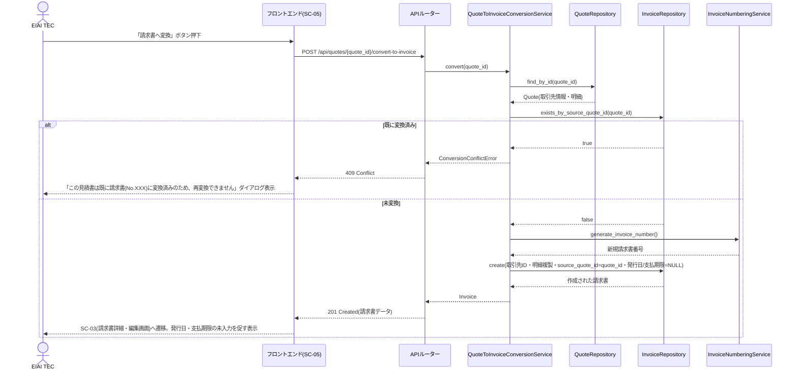
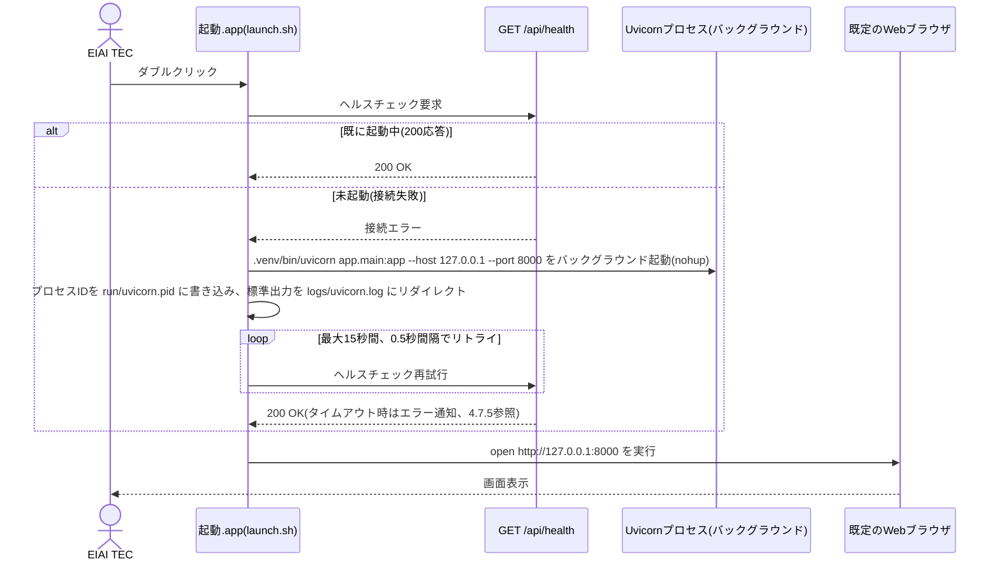
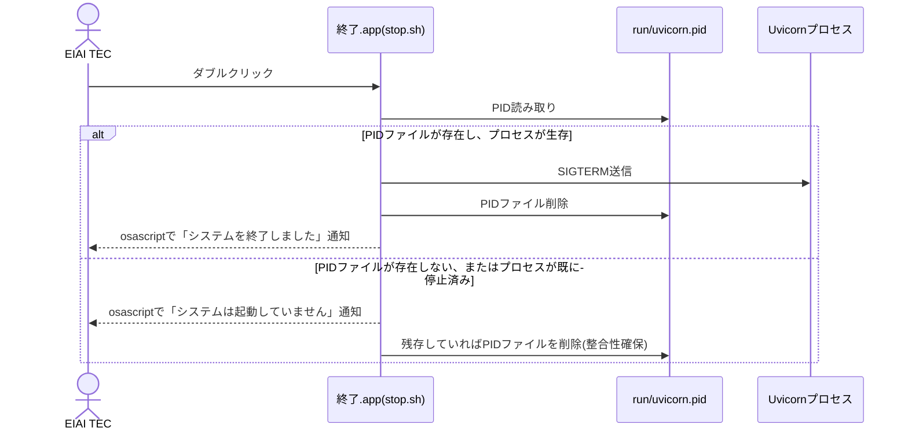
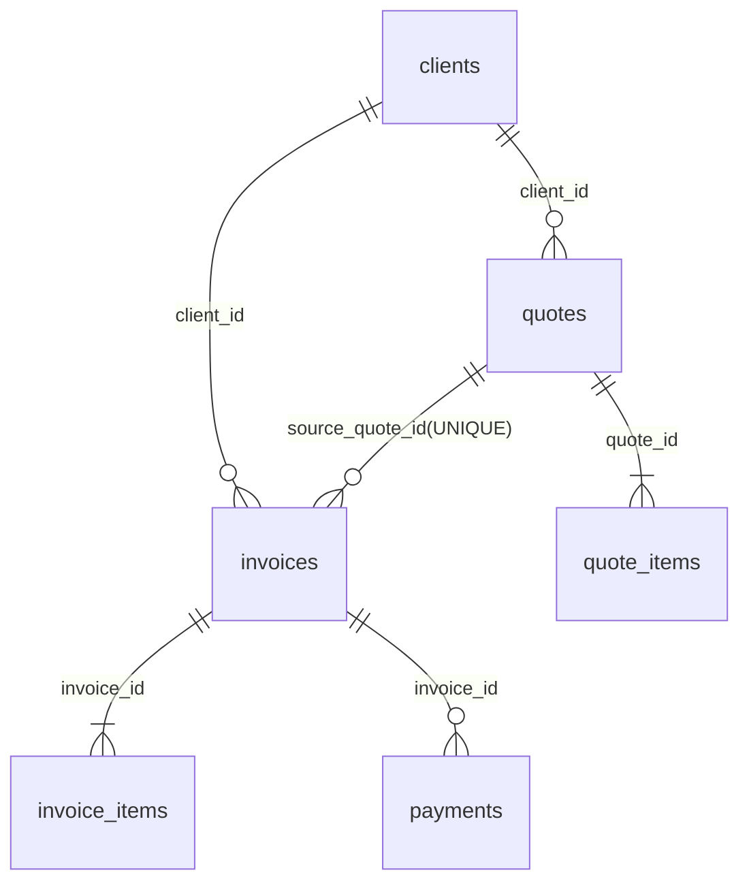

# 個人事業(EIAI TEC)向け事務管理システム 詳細設計書

## 1. 文書情報

- 作成日: 2026-09-15
- 版数: 1.1
- 参照元: `docs/02_architect/基本設計書.md`(版数1.1)
- 対応イテレーション: イテレーション1(初回。1.1は初回イテレーション内での確認事項反映)

---

## 2. 対象範囲

基本設計書で定義した画面SC-01〜SC-11、機能F-01〜F-06を対象とする。本書は次フェーズ(developer)がそのまま実装に着手できる粒度で、画面詳細・処理フロー・クラス設計・DB定義・API設計・エラーハンドリングを定める。

採用技術は基本設計書2.1章のとおり(Python 3.12 + FastAPI + SQLAlchemy 2.0 + SQLite、React 18 + TypeScript + Vite + MUI)。本書ではこれに基づき、実際のクラス名・関数名・型で設計を記述する。

実行環境はEIAI TEC本人のMac専用とする(Windows対応は行わない。基本設計書2.1章参照)。日常利用時の起動・終了はターミナル操作を伴わない`.app`バンドル(「起動.app」「終了.app」)のダブルクリックで行う。実現方式の詳細は4.7章を参照。データ保存場所(SQLiteファイル・添付ファイル・生成PDF)はプロジェクトフォルダ配下の`db/`・`data/`とする(基本設計書8.1章、本書6章参照)。

---

## 3. 画面詳細設計

各画面の入力項目定義表・操作定義表を示す。UI部品はすべてMUIコンポーネントを用いる。金額表示は3桁カンマ区切り、日付は`YYYY-MM-DD`形式で統一する。

### 3.1 SC-01 ホーム画面

表示専用画面のため入力項目定義表はなし。

**操作定義表**

| 操作 | 種別 | トリガー条件 | 対応する処理の節番号 |
|---|---|---|---|
| 画面初期表示 | 自動 | 画面遷移直後 | 4.6(F-06) |
| 各機能カードのクリック | 画面遷移 | クリック | 3.2/3.6/3.9/3.10 |
| システム設定リンクのクリック | 画面遷移 | クリック | 3.11 |

### 3.2 SC-02 請求書一覧画面

**入力項目定義表(検索条件)**

| 項目名 | UI要素 | 型・桁数 | 必須 | 初期値 | バリデーション |
|---|---|---|---|---|---|
| 取引先 | セレクトボックス(オートコンプリート) | 取引先ID(整数) | 任意 | 未選択(全件) | なし |
| 入金ステータス | セレクトボックス | 列挙値(UNPAID/PARTIALLY_PAID/PAID) | 任意 | 未選択(全件) | なし |

**操作定義表**

| 操作 | 種別 | トリガー条件 | 対応する処理の節番号 |
|---|---|---|---|
| 画面初期表示・検索条件変更 | 自動/API呼出 | 画面表示時、検索条件変更時 | 4.1 ステップ9 |
| 「新規作成」ボタン | 画面遷移 | クリック | 3.3 |
| 一覧行クリック | 画面遷移 | クリック | 3.3 |

### 3.3 SC-03 請求書詳細・編集画面

**入力項目定義表**

| 項目名 | UI要素 | 型・桁数 | 必須 | 初期値 | バリデーション |
|---|---|---|---|---|---|
| 取引先 | セレクト(オートコンプリート) | 取引先ID(整数) | 必須 | 未選択 | 必須選択。未選択時「取引先を選択してください」 |
| 発行日 | 日付ピッカー | 日付(YYYY-MM-DD) | 必須(注1) | 空欄。F-04変換時は空欄のまま作成される | 未入力時「発行日を入力してください」 |
| 支払期限 | 日付ピッカー | 日付(YYYY-MM-DD) | 必須(注1) | 空欄 | 未入力時「支払期限を入力してください」 |
| 請求書番号 | テキスト(表示専用) | 文字列(例: `2026-0001`) | - | 自動採番値 | 編集不可 |
| 品目名 | テキスト | 文字列(最大100文字) | 必須 | 空欄 | 未入力時「品目名を入力してください」 |
| 数量 | 数値入力 | 小数(小数第2位まで、10桁) | 必須 | 1 | 0以下または数値以外はエラー「数量は0より大きい数値で入力してください」 |
| 単価 | 数値入力 | 整数(円、最大10桁) | 必須 | 空欄 | 0以下または数値以外はエラー「単価は0より大きい数値で入力してください」 |
| 税区分 | セレクト | 列挙値(STANDARD_10/NON_TAXABLE/OUT_OF_SCOPE) | 必須 | STANDARD_10 | 未選択時エラー |
| 金額(行) | 数値(表示専用) | 整数 | - | 自動計算 | 編集不可 |
| 備考 | テキストエリア | 文字列(最大1000文字) | 任意 | 空欄 | 上限超過時エラー |
| 入金日(入金記録行) | 日付ピッカー | 日付 | 必須 | 当日 | 未入力時エラー |
| 入金額(入金記録行) | 数値入力 | 整数(円) | 必須 | 空欄 | 0以下または数値以外はエラー「入金額は0より大きい数値で入力してください」 |
| 入金備考 | テキスト | 文字列(最大200文字) | 任意 | 空欄 | なし |

(注1)発行日・支払期限は通常保存時は必須。ただしF-04変換直後に作成された請求書レコードは例外的にNULL状態で保存される(4.4章参照)。この場合、画面上に「発行日・支払期限が未設定です」という注意表示を行い、ユーザーが値を入力して保存した時点で通常のバリデーションが適用される。

**操作定義表**

| 操作 | 種別 | トリガー条件 | 対応する処理の節番号 |
|---|---|---|---|
| 数量・単価の変更 | 自動計算 | 入力値変更時 | 4.1 ステップ1〜5 |
| 「明細行を追加」ボタン | 画面内操作 | クリック | - |
| 明細行「削除」ボタン | 画面内操作 | クリック | - |
| 取引先「新規登録」リンク | 画面遷移 | クリック | 3.11(取引先マスタ管理) |
| 「保存」ボタン | API呼出(POST/PUT) | クリック | 4.1 ステップ6〜8 |
| 「PDF出力」ボタン | API呼出(GET) | クリック(保存済みの場合のみ活性) | 4.1 ステップ9 |
| 変換元見積書リンク | 画面遷移 | `source_quote_id`が設定されている場合に表示、クリック | 3.6 |
| 入金記録「追加」ボタン | API呼出(POST) | クリック | 4.5 |

### 3.4 SC-04 見積書一覧画面

**入力項目定義表(検索条件)**

| 項目名 | UI要素 | 型・桁数 | 必須 | 初期値 | バリデーション |
|---|---|---|---|---|---|
| 取引先 | セレクト(オートコンプリート) | 取引先ID | 任意 | 未選択 | なし |
| ステータス | セレクト | 列挙値(DRAFT/CONFIRMED) | 任意 | 未選択 | なし |

**操作定義表**

| 操作 | 種別 | トリガー条件 | 対応する処理の節番号 |
|---|---|---|---|
| 画面初期表示・検索 | 自動/API呼出 | 画面表示時、検索条件変更時 | 4.3 |
| 「新規作成」ボタン | 画面遷移 | クリック | 3.5 |
| 一覧行クリック | 画面遷移 | クリック | 3.5 |

### 3.5 SC-05 見積書詳細・編集画面

**入力項目定義表**

| 項目名 | UI要素 | 型・桁数 | 必須 | 初期値 | バリデーション |
|---|---|---|---|---|---|
| 取引先 | セレクト(オートコンプリート) | 取引先ID | 必須 | 未選択 | 未選択時エラー |
| 発行日 | 日付ピッカー | 日付 | 必須 | 空欄 | 未入力時エラー |
| 有効期限 | 日付ピッカー | 日付 | 必須 | 空欄 | 未入力時エラー |
| 見積書番号 | テキスト(表示専用) | 文字列(例: `2026-0001`) | - | 自動採番値 | 編集不可 |
| ステータス | セレクト(トグル) | 列挙値(DRAFT/CONFIRMED) | 必須 | DRAFT(作成中) | なし |
| 品目名・数量・単価・税区分 | SC-03に同じ | SC-03に同じ | SC-03に同じ | SC-03に同じ | SC-03に同じ |
| 備考 | テキストエリア | 文字列(最大1000文字) | 任意 | 空欄 | 上限超過時エラー |

**操作定義表**

| 操作 | 種別 | トリガー条件 | 対応する処理の節番号 |
|---|---|---|---|
| 品目明細入力 | 自動計算 | 入力値変更時 | 4.3 |
| 「保存」ボタン | API呼出 | クリック | 4.3 |
| ステータス切替 | 画面内操作 | クリック | 4.3 |
| 「PDF出力」ボタン | API呼出 | クリック(保存済みのみ活性) | 4.3 |
| 「請求書へ変換」ボタン | API呼出(POST) | クリック | 4.4(F-04) |

### 3.6 SC-06 経費一覧・検索画面

**入力項目定義表(検索条件)**

| 項目名 | UI要素 | 型・桁数 | 必須 | 初期値 | バリデーション |
|---|---|---|---|---|---|
| 勘定科目 | セレクト | 列挙値(13科目) | 任意 | 未選択 | なし |
| 支払方法 | セレクト | 列挙値(CASH/CREDIT_CARD/BANK_TRANSFER/OTHER) | 任意 | 未選択 | なし |
| 期間(From/To) | 日付ピッカー×2 | 日付 | 任意 | 未設定 | FromがToより後の場合エラー |

**操作定義表**

| 操作 | 種別 | トリガー条件 | 対応する処理の節番号 |
|---|---|---|---|
| 画面初期表示・検索 | 自動/API呼出 | 画面表示時、検索条件変更時 | 4.2 ステップ4 |
| 「新規登録」ボタン | 画面遷移 | クリック | 3.7 |
| 一覧行クリック | 画面遷移 | クリック | 3.7 |
| 領収書アイコンクリック | ファイル表示 | 添付ありの行でクリック | 4.2 ステップ6 |
| 「集計を見る」ボタン | 画面遷移 | クリック | 3.8 |

### 3.7 SC-07 経費登録・編集画面

**入力項目定義表**

| 項目名 | UI要素 | 型・桁数 | 必須 | 初期値 | バリデーション |
|---|---|---|---|---|---|
| 発生日 | 日付ピッカー | 日付 | 必須 | 当日 | 未入力時「発生日を入力してください」 |
| 勘定科目 | セレクト(13科目、「その他」選択時は自由入力欄を表示) | 文字列 | 必須 | 未選択 | 未選択時「勘定科目を選択してください」 |
| 金額 | 数値入力 | 整数(円、最大10桁) | 必須 | 空欄 | 0以下または数値以外はエラー「金額は0より大きい数値で入力してください」 |
| 税区分 | セレクト | 列挙値(STANDARD_10/NON_TAXABLE/OUT_OF_SCOPE/NOT_APPLICABLE) | 必須 | STANDARD_10 | 未選択時エラー |
| 支払先 | テキスト | 文字列(最大100文字) | 任意 | 空欄 | 上限超過時エラー |
| 支払方法 | セレクト | 列挙値(CASH/CREDIT_CARD/BANK_TRANSFER/OTHER) | 任意 | 未選択 | なし |
| メモ | テキストエリア | 文字列(最大500文字) | 任意 | 空欄 | 上限超過時エラー |
| 領収書ファイル | ファイル選択(ドラッグ&ドロップ対応) | ファイル(jpg/jpeg/png/pdf、最大10MB) | 任意 | なし | 対応形式外・サイズ超過はエラー「対応していないファイル形式、またはサイズが上限(10MB)を超えています」 |

**操作定義表**

| 操作 | 種別 | トリガー条件 | 対応する処理の節番号 |
|---|---|---|---|
| 「保存」ボタン | API呼出(POST/PUT、添付ありの場合は続けてPOST attachment) | クリック | 4.2 ステップ1〜3 |
| ファイル選択/ドロップ | 画面内バリデーション+API呼出 | ファイル選択時 | 4.2 ステップ2 |

### 3.8 SC-08 経費集計画面

**入力項目定義表(検索条件)**

| 項目名 | UI要素 | 型・桁数 | 必須 | 初期値 | バリデーション |
|---|---|---|---|---|---|
| 集計対象年月(From/To) | 月選択ピッカー×2 | 年月(YYYY-MM) | 任意 | 当月を含む直近12か月 | なし |

**操作定義表**

| 操作 | 種別 | トリガー条件 | 対応する処理の節番号 |
|---|---|---|---|
| 画面初期表示・期間変更 | 自動/API呼出 | 画面表示時、期間変更時 | 4.2 ステップ7 |

### 3.9 SC-09 売掛金一覧画面

入力項目(検索条件)はSC-02の入金ステータスに準ずる。

**操作定義表**

| 操作 | 種別 | トリガー条件 | 対応する処理の節番号 |
|---|---|---|---|
| 画面初期表示 | 自動/API呼出 | 画面表示時 | 4.5 |
| 一覧行クリック | 画面遷移 | クリック | 3.3 |

### 3.10 SC-10 取引先マスタ管理画面

**入力項目定義表**

| 項目名 | UI要素 | 型・桁数 | 必須 | 初期値 | バリデーション |
|---|---|---|---|---|---|
| 名称 | テキスト | 文字列(最大100文字) | 必須 | 空欄 | 未入力時「名称を入力してください」 |
| 郵便番号 | テキスト | 文字列(最大8桁、ハイフン任意) | 任意 | 空欄 | 数字とハイフン以外はエラー |
| 住所 | テキスト | 文字列(最大200文字) | 任意 | 空欄 | 上限超過時エラー |
| 担当者名 | テキスト | 文字列(最大50文字) | 任意 | 空欄 | 上限超過時エラー |
| 連絡先 | テキスト | 文字列(最大200文字) | 任意 | 空欄 | 上限超過時エラー |

**操作定義表**

| 操作 | 種別 | トリガー条件 | 対応する処理の節番号 |
|---|---|---|---|
| 「新規登録」ボタン | 画面内操作 | クリック | - |
| 「保存」ボタン | API呼出(POST/PUT) | クリック | - |

### 3.11 SC-11 システム設定画面(発行者情報)

**入力項目定義表**

| 項目名 | UI要素 | 型・桁数 | 必須 | 初期値 | バリデーション |
|---|---|---|---|---|---|
| 氏名 | テキスト | 文字列(最大50文字) | 必須 | 空欄 | 未入力時「氏名を入力してください」 |
| 屋号 | テキスト | 文字列(最大100文字) | 任意 | 空欄 | 上限超過時エラー |
| 住所 | テキスト | 文字列(最大200文字) | 任意 | 空欄 | 上限超過時エラー |
| 連絡先 | テキスト | 文字列(最大200文字) | 任意 | 空欄 | 上限超過時エラー |
| 登録番号 | テキスト | 文字列(`T`+数字13桁、任意) | 任意 | 空欄 | 入力時のみ形式チェック(`^T\d{13}$`)。空欄は許容 |

**操作定義表**

| 操作 | 種別 | トリガー条件 | 対応する処理の節番号 |
|---|---|---|---|
| 「保存」ボタン | API呼出(PUT) | クリック | - |

---

## 4. 処理フロー設計

### 4.1 F-01 請求書発行

税額計算ロジックはF-03(見積書)と共通(`TaxCalculationService`)。処理順序は以下のとおり。

1. 品目明細ごとに行金額を算出する。
   `amount_i = floor(quantity_i * unit_price_i)`(小数点以下切り捨て)
2. 税区分ごとに小計を集計する。
   `subtotal_by_tax[tax] = Σ amount_i (tax_i = tax であるものの合計)`
3. 消費税額を税区分ごとに計算する。標準10%区分のみ課税対象とし、非課税・不課税は0円とする。
   `tax_amount = floor(subtotal_by_tax[STANDARD_10] * 0.10)`(小数点以下切り捨て。要件定義書10章★2)
4. 小計合計を算出する。`subtotal_amount = Σ subtotal_by_tax`(全税区分の合計)
5. 合計金額を算出する。`total_amount = subtotal_amount + tax_amount`
6. 画面上に小計・消費税額(税区分別)・合計金額をリアルタイム表示する(サーバー呼び出し不要、フロントエンドで同一ロジックを再計算して表示。保存時にサーバー側でも同じロジックにより再計算し、サーバー側の計算結果を正とする)。
7. 「保存」実行時、以下を判定する。
   - 品目明細が0件 → エラー(3.3参照)
   - 取引先未選択 → エラー
   - いずれかの明細行で数量・単価が0以下または数値以外 → エラー
   - 通常保存(新規作成または既存編集)の場合、発行日・支払期限が未入力 → エラー。ただし4.4節のF-04変換による作成直後の初回状態はこの限りではない(発行日・支払期限NULLのまま作成される)
8. 新規作成時は`InvoiceNumberingService`により請求書番号を採番する(4.1.1参照)。
9. 上記1〜5の計算結果とともに、`invoices`・`invoice_items`テーブルへトランザクション内で保存する。
10. 「PDF出力」実行時、保存済みの請求書データと`company_profile`(発行者情報)を`PdfGenerationService`に渡し、Jinja2テンプレートをレンダリングした上でWeasyPrintによりPDFを生成する。生成したPDFはブラウザのダウンロード/印刷機能から保存・印刷できるようにする。PDFレイアウトには登録番号欄(未入力時は空欄表示)、税率ごとの区分記載(標準10%/非課税/不課税それぞれの小計・税額)、適用税率を含める。

#### 4.1.1 請求書番号・見積書番号の採番ルール

- 形式: `{年(西暦4桁)}-{連番(4桁ゼロ埋め)}`(例: `2026-0001`)。請求書番号と見積書番号は別カウンタとする。
- 「年」は、採番処理を実行した時点のシステム日付の年とする。F-04変換時点では発行日が未確定であるため、請求書の発行日ではなく採番実行時点の年を用いる解釈とした(実装レベルの体裁決定。機能仕様書に採番タイミングの厳密な定義がないため、architectureエージェントが本書にて確定する)。
- 連番は、対象年の既存の番号のうち最大値+1とする。年が変わった場合は1から再開する。
- 発行済みの番号は変更しない(機能仕様書F-01例外仕様)。

### 4.2 F-02 経費管理

1. 「保存」実行時、以下を判定する。
   - 金額が0以下または数値以外 → エラー(3.7参照)
   - 発生日・勘定科目が未入力 → エラー
2. 領収書ファイルが選択されている場合、以下を判定する。
   - 拡張子が`jpg`/`jpeg`/`png`/`pdf`以外 → エラー
   - ファイルサイズが10MBを超過 → エラー
   - 上記を満たす場合、まず経費レコード(`expenses`)を作成・更新し、確定した経費IDを用いて`POST /api/expenses/{id}/attachment`を呼び出し、ファイルをサーバーへアップロードする。サーバーは`backend/data/attachments/expenses/{expense_id}/{uuid4}_{元ファイル名}`にファイルを保存し、`expenses.attachment_path`(相対パス)・`attachment_original_name`を更新する。一連の処理はフロントエンドから見ると「保存」ボタン1回の操作で完結する。
3. 「保存」ボタン押下時の全体順序: (1)入力値バリデーション → (2)経費レコードの作成/更新 → (3)添付ファイルがあればアップロード実行、の順で行う。いずれかの段階でエラーが発生した場合は、それ以降の処理を行わず画面にエラーを表示する。
4. 経費一覧は`expense_date`の降順で取得する(機能仕様書F-02処理内容2)。検索条件(勘定科目・支払方法・期間)が指定された場合はSQL上の`WHERE`条件として付加する。
5. 領収書アイコンクリック時、`GET /api/expenses/{id}/attachment`でファイルを取得し、ブラウザでプレビュー表示またはダウンロードする。
6. 集計処理(SC-08)は、指定された期間内の経費を対象に以下を算出する。
   - 勘定科目別集計: `account_category`ごとの件数・金額合計
   - 期間別(月単位)集計: `strftime('%Y-%m', expense_date)`単位での金額合計

### 4.3 F-03 見積書作成

税額計算は4.1のステップ1〜6と共通ロジック(`TaxCalculationService`)を用いる。相違点は以下のとおり。

1. 保存時のバリデーション対象に発行日・有効期限の必須チェックを含む(見積書にはF-04のような未設定例外は存在しない)。
2. 新規作成時は`QuoteNumberingService`により見積書番号を採番する(採番ルールは4.1.1参照)。
3. ステータスは`DRAFT`(作成中)/`CONFIRMED`(確定)の2値のみとし、画面上のトグル操作で切替可能とする。ステータス変更に伴う特別な業務処理(承認フロー等)は行わない。
4. 「PDF出力」は4.1ステップ10と同様のロジックで見積書PDFを生成する。

### 4.4 F-04 見積→請求の自動変換

以下のシーケンスで処理する。



処理の要点は以下のとおり。

1. 変換元見積書のステータスが`DRAFT`(作成中)であっても変換は可能とする(機能仕様書F-04例外仕様)。
2. 複製対象は取引先ID・品目明細(品目名・数量・単価・税区分)のみとし、明細IDは新規採番する。
3. 変換により作成された請求書は、変換元見積書と完全に独立したレコードとして扱う。以後、一方を編集しても他方には影響しない。`invoices.source_quote_id`は参照情報としてのみ保持する。
4. 「変換済みかどうか」の判定は、`invoices`テーブルの`source_quote_id`が対象の`quote_id`と一致するレコードが存在するかどうかで行う。
5. 1対1制約はDB上の`invoices.source_quote_id`列に付与する`UNIQUE`制約によって保証する(6.3節参照)。アプリケーション層での事前チェック(上記ステップ)は、UNIQUE制約違反によるDBエラーを待たずにユーザーへ分かりやすいエラーメッセージを返すための冗長化である。

### 4.5 F-05 入金・売掛金管理

1. 入金記録保存時、以下を判定する。
   - 入金額が0以下または数値以外 → エラー(3.3参照)
   - 保存対象請求書の既存入金額合計 + 今回入金額 > 請求金額(`total_amount`) の場合 → 確認メッセージ「入金額の合計が請求金額を超過します。登録しますか?」を表示し、ユーザーが「はい」を選択した場合のみ登録する(機能仕様書F-05例外仕様)。
2. 入金ステータスの算出ロジック(`PaymentService.calculate_status(invoice)`)。
   ```
   paid_total = SUM(payments.amount WHERE payments.invoice_id = invoice.id)
   if paid_total == 0:
       status = UNPAID(未入金)
   elif paid_total < invoice.total_amount:
       status = PARTIALLY_PAID(一部入金)
   else:
       status = PAID(入金済み)
   ```
   このステータスはDBに保存せず、一覧・詳細取得のたびに都度算出する(算出元は常に`payments`テーブルの実データ)。
3. 支払期限超過判定(`PaymentService.is_overdue(invoice)`)。
   ```
   is_overdue = (invoice.due_date is not null)
                and (today > invoice.due_date)
                and (status in [UNPAID, PARTIALLY_PAID])
   ```
   「今日」はサーバー実行時点のシステム日付とする。
4. SC-02(請求書一覧)・SC-09(売掛金一覧)では、上記2・3の算出結果に基づき、支払期限超過の行を強調表示する。
5. アラートは画面表示のみとし、メール送信・デスクトップ通知等のプッシュ型通知は行わない(要件定義書10章★6)。

### 4.6 F-06 ホーム画面・共通UI

1. `GET /api/home/summary`呼び出し時、以下を算出して返却する。
   - `unpaid_count`: 入金ステータスが`UNPAID`または`PARTIALLY_PAID`である請求書の件数
   - `overdue_count`: 上記のうち、4.5ステップ3の`is_overdue`が真である請求書の件数
2. サマリー取得APIがエラーを返した場合、フロントエンドは該当エリアにエラー表示を行い、各機能への導線カードの表示・操作には影響させない(機能仕様書F-06例外仕様)。

### 4.7 アプリケーション起動・終了処理(共通、パッケージング設計)

基本設計書2.1章・3章のとおり、実行環境はEIAI TEC本人のMac専用とし、日常利用時の起動・終了はターミナル操作を伴わない`.app`バンドルのダブルクリックで行う。本節では、その実現方式・内部処理・ビルド手順を定める。

#### 4.7.1 方式選定の補足

- PyInstaller等によるPythonバックエンドの単一バイナリ化は採用しない。理由は基本設計書2.1章に記載のとおり、PDF生成ライブラリ(WeasyPrint)がPango/Cairo/GDK-PixBuf等のネイティブ共有ライブラリを実行時動的読み込み(dlopen)で利用する構成であり、PyInstallerの静的解析による依存同梱が不安定になりやすいためである。
- 代わりに、初回セットアップ時に構築したvenv環境(Homebrew導入済みのネイティブライブラリを利用可能な状態)を、`.app`バンドル内のシェルスクリプトから起動するだけの軽量な方式を採用する。バックエンド自体の実装(FastAPI/Uvicorn)は変更しない。

#### 4.7.2 ディレクトリ構成(起動関連の追加分)

```
back-office/
  backend/
    app/                   … 既存のFastAPIアプリケーション
    .venv/                 … 初回セットアップ時に作成するvenv(git管理外)
    run/
      uvicorn.pid           … 起動中プロセスのPIDファイル(git管理外)
    logs/
      uvicorn.log            … バックエンドの標準出力・エラーログ(git管理外)
    scripts/
      launch.sh              … 起動.appから呼び出されるランチャースクリプト
      stop.sh                 … 終了.appから呼び出されるストップスクリプト
  dist/
    起動.app/                … ビルド生成物(git管理外)。Contents/MacOS/launcher が scripts/launch.sh を実行
    終了.app/                … ビルド生成物(git管理外)。Contents/MacOS/stopper が scripts/stop.sh を実行
  scripts/
    build_apps.sh            … 起動.app/終了.appを生成するビルドスクリプト
```

`run/`・`logs/`・`dist/`・`.venv/`は`.gitignore`に追加し、バージョン管理対象外とする。

#### 4.7.3 起動処理(起動.app)



処理の要点は以下のとおり。

1. `launch.sh`はプロジェクトルートからの相対パスでバックエンドディレクトリを解決し、`GET http://127.0.0.1:8000/api/health`(5.1章・7章参照)への到達可否で起動済み判定を行う。
2. 未起動の場合のみ、`.venv/bin/uvicorn`をバックグラウンドプロセスとして起動する。二重起動を避けるため、起動判定と起動処理の間はスクリプト内で直列に実行する。
3. 起動確認後、`open http://127.0.0.1:8000`コマンドでEIAI TEC本人の既定Webブラウザを自動的に開く。
4. 起動確認が15秒でタイムアウトした場合は、`osascript`によるダイアログ表示で「起動に失敗しました。logs/uvicorn.logを確認してください」を通知し、ブラウザは開かない(4.7.5参照)。

#### 4.7.4 終了処理(終了.app)



- バックエンドプロセスは、ブラウザのタブを閉じただけでは終了しない(バックグラウンドで動作し続ける)。EIAI TEC本人が明示的に「終了.app」をダブルクリックすることで停止する運用とする。終了せずMacをシャットダウン・再起動した場合も、OS終了時にプロセスは停止する。

#### 4.7.5 ビルド・パッケージング手順(初回セットアップ時、ターミナルで実施)

以下は開発・導入時に1度だけ実施する手順であり、EIAI TEC本人の日常利用では発生しない(日常利用は4.7.3・4.7.4のダブルクリックのみ)。

1. Homebrewで、WeasyPrintの実行時依存ライブラリをインストールする: `brew install pango gdk-pixbuf libffi cairo`
2. バックエンドのvenvを作成し依存関係をインストールする: `python3.12 -m venv backend/.venv && backend/.venv/bin/pip install -r backend/requirements.txt`
3. フロントエンドをビルドする: `cd frontend && npm install && npm run build`(生成物をバックエンドの静的配信ディレクトリに配置し、`StaticFiles`で配信する)
4. `scripts/build_apps.sh`を実行し、`dist/起動.app`・`dist/終了.app`を生成する。当該スクリプトは、`Info.plist`(`CFBundleExecutable`に`launcher`/`stopper`を指定)と`Contents/MacOS/`配下の実行スクリプト(`scripts/launch.sh`/`scripts/stop.sh`を呼び出すラッパー)を含む最小限の`.app`バンドル構造を組み立てる。
5. 生成された`起動.app`・`終了.app`を、EIAI TEC本人が使いやすい場所(デスクトップ等)にコピーする。以降はダブルクリックのみで日常利用できる。

---

## 5. クラス設計

バックエンドは「ルーター層 → サービス層 → リポジトリ層 → モデル層」の4層構成とする。各機能で共通利用するロジック(税計算・採番)は独立したサービスクラスとして切り出し、複数機能から再利用する。クラス設計は本システムの中核ロジック(税計算・採番・入金判定・変換)を持つため必須章とし、省略しない。

### 5.1 ルーター層(FastAPI `APIRouter`)

| クラス/モジュール名 | 責務 | 主なエンドポイント | 関連処理フロー |
|---|---|---|---|
| `routers/clients.py` | 取引先マスタのCRUD API定義 | `GET/POST /api/clients`, `GET/PUT/DELETE /api/clients/{id}` | - |
| `routers/company_profile.py` | システム設定(発行者情報)API定義 | `GET/PUT /api/company-profile` | - |
| `routers/invoices.py` | 請求書のCRUD・PDF出力API定義 | `GET/POST /api/invoices`, `GET/PUT/DELETE /api/invoices/{id}`, `GET /api/invoices/{id}/pdf` | 4.1 |
| `routers/quotes.py` | 見積書のCRUD・PDF出力・変換API定義 | `GET/POST /api/quotes`, `GET/PUT/DELETE /api/quotes/{id}`, `GET /api/quotes/{id}/pdf`, `POST /api/quotes/{id}/convert-to-invoice` | 4.3, 4.4 |
| `routers/expenses.py` | 経費のCRUD・集計・添付API定義 | `GET/POST /api/expenses`, `GET/PUT/DELETE /api/expenses/{id}`, `GET /api/expenses/summary`, `POST/GET /api/expenses/{id}/attachment` | 4.2 |
| `routers/payments.py` | 入金記録API定義 | `GET/POST /api/invoices/{id}/payments`, `DELETE /api/payments/{id}` | 4.5 |
| `routers/home.py` | ホーム画面サマリーAPI定義 | `GET /api/home/summary` | 4.6 |
| `routers/health.py` | 稼働確認用ヘルスチェックAPI定義(起動.appの起動判定に使用) | `GET /api/health` | 4.7 |

### 5.2 サービス層

| クラス名 | 責務 | 主なメソッド | 関連処理フロー |
|---|---|---|---|
| `TaxCalculationService` | 品目明細の金額計算、税区分ごとの小計・消費税額計算(F-01/F-03共通) | `calculate_item_amount(quantity, unit_price) -> int`<br>`aggregate_by_tax_category(items) -> dict[TaxCategory, int]`<br>`calculate_tax_amount(subtotal_by_tax) -> int` | 4.1, 4.3 |
| `NumberingService` | 請求書番号・見積書番号の採番(共通ロジック、対象テーブル・プレフィックスを引数化) | `generate_number(target: Literal["invoice","quote"]) -> str` | 4.1.1 |
| `InvoiceService` | 請求書の作成・更新・取得・削除・バリデーション統括 | `create_invoice(dto) -> Invoice`<br>`update_invoice(id, dto) -> Invoice`<br>`get_invoice(id) -> Invoice`<br>`list_invoices(filters) -> list[Invoice]`<br>`delete_invoice(id) -> None` | 4.1 |
| `QuoteService` | 見積書の作成・更新・取得・削除・バリデーション統括 | `create_quote(dto) -> Quote`<br>`update_quote(id, dto) -> Quote`<br>`get_quote(id) -> Quote`<br>`list_quotes(filters) -> list[Quote]` | 4.3 |
| `QuoteToInvoiceConversionService` | 見積書から請求書への変換処理、1対1制約の事前チェック | `convert(quote_id) -> Invoice` | 4.4 |
| `ExpenseService` | 経費の作成・更新・取得・一覧・集計 | `create_expense(dto) -> Expense`<br>`update_expense(id, dto) -> Expense`<br>`list_expenses(filters) -> list[Expense]`<br>`get_summary_by_category(period) -> list[CategorySummary]`<br>`get_summary_by_month(period) -> list[MonthSummary]` | 4.2 |
| `AttachmentService` | 添付ファイルの拡張子/サイズ検証、保存、取得 | `validate(file) -> None`<br>`save(expense_id, file) -> str`<br>`get_file_path(expense_id) -> str` | 4.2 |
| `PaymentService` | 入金記録の登録、入金ステータス・支払期限超過の算出 | `record_payment(invoice_id, dto) -> Payment`<br>`calculate_status(invoice) -> PaymentStatus`<br>`is_overdue(invoice) -> bool` | 4.5 |
| `HomeSummaryService` | ホーム画面向けサマリー集計 | `get_summary() -> HomeSummaryDto` | 4.6 |
| `PdfGenerationService` | 請求書・見積書PDFの生成 | `render_invoice_pdf(invoice) -> bytes`<br>`render_quote_pdf(quote) -> bytes` | 4.1, 4.3 |
| `ClientService` | 取引先マスタのCRUD | `create_client(dto) -> Client`<br>`update_client(id, dto) -> Client`<br>`list_clients() -> list[Client]` | - |
| `CompanyProfileService` | システム設定(発行者情報)の取得・更新 | `get_profile() -> CompanyProfile`<br>`update_profile(dto) -> CompanyProfile` | - |

### 5.3 リポジトリ層(SQLAlchemy `Session`を介したDBアクセス)

| クラス名 | 責務 | 主なメソッド |
|---|---|---|
| `ClientRepository` | `clients`テーブルへのCRUD | `find_by_id`, `list_all`, `create`, `update` |
| `CompanyProfileRepository` | `company_profile`テーブル(単一行)へのアクセス | `get`, `upsert` |
| `InvoiceRepository` | `invoices`・`invoice_items`テーブルへのCRUD | `find_by_id`, `list_all(filters)`, `create`, `update`, `delete`, `exists_by_source_quote_id`, `max_number_seq(year)` |
| `QuoteRepository` | `quotes`・`quote_items`テーブルへのCRUD | `find_by_id`, `list_all(filters)`, `create`, `update`, `delete`, `max_number_seq(year)` |
| `ExpenseRepository` | `expenses`テーブルへのCRUD・集計クエリ | `find_by_id`, `list_all(filters)`, `create`, `update`, `aggregate_by_category(period)`, `aggregate_by_month(period)` |
| `PaymentRepository` | `payments`テーブルへのCRUD | `list_by_invoice(invoice_id)`, `create`, `delete`, `sum_by_invoice(invoice_id)` |

### 5.4 モデル層(SQLAlchemy宣言的モデル)

| クラス名 | 対応テーブル |
|---|---|
| `Client` | `clients` |
| `CompanyProfile` | `company_profile` |
| `Invoice` | `invoices` |
| `InvoiceItem` | `invoice_items` |
| `Quote` | `quotes` |
| `QuoteItem` | `quote_items` |
| `Expense` | `expenses` |
| `Payment` | `payments` |

### 5.5 スキーマ層(Pydanticモデル、`schemas/`)

リクエスト/レスポンスごとに`XxxCreateRequest` / `XxxUpdateRequest` / `XxxResponse`の命名規則で統一する(例: `InvoiceCreateRequest`, `InvoiceResponse`)。バリデーションルールは3章の入力項目定義表に準拠し、Pydanticの`Field`制約・カスタムバリデータ(`field_validator`)で実装する。

---

## 6. データベース詳細設計

DB製品はSQLite 3。日付・日時は`TEXT`型でISO8601形式(`YYYY-MM-DD`、日時は`YYYY-MM-DDTHH:MM:SS`)を用いる。金額は円単位の`INTEGER`。数量は小数第2位までを扱うため`NUMERIC(10,2)`(SQLAlchemy `Numeric(10,2)`によりPython側は`decimal.Decimal`として扱う)。起動時に`PRAGMA foreign_keys = ON`を設定する。

### 6.1 物理ER図



### 6.2 テーブル定義

#### clients(取引先マスタ)

| カラム名 | 型 | 制約 | 説明 |
|---|---|---|---|
| id | INTEGER | PRIMARY KEY AUTOINCREMENT | 取引先ID |
| name | TEXT | NOT NULL | 名称 |
| postal_code | TEXT | NULL | 郵便番号 |
| address | TEXT | NULL | 住所 |
| contact_person | TEXT | NULL | 担当者名 |
| contact_info | TEXT | NULL | 連絡先 |
| created_at | TEXT | NOT NULL | 作成日時 |
| updated_at | TEXT | NOT NULL | 更新日時 |

#### company_profile(発行者情報・システム設定、単一行)

| カラム名 | 型 | 制約 | 説明 |
|---|---|---|---|
| id | INTEGER | PRIMARY KEY, CHECK(id = 1) | 固定値1(単一行制約) |
| name | TEXT | NOT NULL | 氏名 |
| business_name | TEXT | NULL | 屋号 |
| address | TEXT | NULL | 住所 |
| contact_info | TEXT | NULL | 連絡先 |
| invoice_registration_number | TEXT | NULL | 適格請求書発行事業者登録番号 |
| updated_at | TEXT | NOT NULL | 更新日時 |

#### quotes(見積書)

| カラム名 | 型 | 制約 | 説明 |
|---|---|---|---|
| id | INTEGER | PRIMARY KEY AUTOINCREMENT | 見積書ID |
| quote_number | TEXT | NOT NULL, UNIQUE | 見積書番号 |
| client_id | INTEGER | NOT NULL, FOREIGN KEY → clients(id) | 見積先 |
| issue_date | TEXT | NULL | 発行日 |
| expiry_date | TEXT | NULL | 有効期限 |
| status | TEXT | NOT NULL, CHECK(status IN ('DRAFT','CONFIRMED')), DEFAULT 'DRAFT' | ステータス |
| subtotal_amount | INTEGER | NOT NULL, DEFAULT 0 | 小計 |
| tax_amount | INTEGER | NOT NULL, DEFAULT 0 | 消費税額 |
| total_amount | INTEGER | NOT NULL, DEFAULT 0 | 合計金額 |
| remarks | TEXT | NULL | 備考 |
| created_at | TEXT | NOT NULL | 作成日時 |
| updated_at | TEXT | NOT NULL | 更新日時 |

インデックス: `idx_quotes_client_id (client_id)`

#### quote_items(見積書明細)

| カラム名 | 型 | 制約 | 説明 |
|---|---|---|---|
| id | INTEGER | PRIMARY KEY AUTOINCREMENT | 明細ID |
| quote_id | INTEGER | NOT NULL, FOREIGN KEY → quotes(id) ON DELETE CASCADE | 紐づく見積書 |
| item_name | TEXT | NOT NULL | 品目名 |
| quantity | NUMERIC(10,2) | NOT NULL, CHECK(quantity > 0) | 数量 |
| unit_price | INTEGER | NOT NULL, CHECK(unit_price > 0) | 単価 |
| tax_category | TEXT | NOT NULL, CHECK(tax_category IN ('STANDARD_10','NON_TAXABLE','OUT_OF_SCOPE')) | 税区分 |
| amount | INTEGER | NOT NULL | 金額(数量×単価の切り捨て) |
| sort_order | INTEGER | NOT NULL, DEFAULT 0 | 表示順 |

インデックス: `idx_quote_items_quote_id (quote_id)`

#### invoices(請求書)

| カラム名 | 型 | 制約 | 説明 |
|---|---|---|---|
| id | INTEGER | PRIMARY KEY AUTOINCREMENT | 請求書ID |
| invoice_number | TEXT | NOT NULL, UNIQUE | 請求書番号 |
| client_id | INTEGER | NOT NULL, FOREIGN KEY → clients(id) | 請求先 |
| issue_date | TEXT | NULL | 発行日(F-04変換直後はNULL、4.1ステップ7参照) |
| due_date | TEXT | NULL | 支払期限(同上) |
| source_quote_id | INTEGER | NULL, UNIQUE, FOREIGN KEY → quotes(id) | 変換元見積書(1対1をUNIQUE制約で担保。将来の分割請求拡張時はこのUNIQUE制約を解除する) |
| subtotal_amount | INTEGER | NOT NULL, DEFAULT 0 | 小計 |
| tax_amount | INTEGER | NOT NULL, DEFAULT 0 | 消費税額 |
| total_amount | INTEGER | NOT NULL, DEFAULT 0 | 合計金額 |
| remarks | TEXT | NULL | 備考 |
| created_at | TEXT | NOT NULL | 作成日時 |
| updated_at | TEXT | NOT NULL | 更新日時 |

インデックス: `idx_invoices_client_id (client_id)`。`source_quote_id`のUNIQUE制約は自動的にインデックスを兼ねる。
備考: 入金ステータスはこのテーブルには保持しない(4.5節のとおり`payments`から都度算出する派生値のため)。

#### invoice_items(請求書明細)

quote_itemsと同様の構成。`quote_id`の代わりに`invoice_id`(FOREIGN KEY → invoices(id) ON DELETE CASCADE)を持つ。

| カラム名 | 型 | 制約 | 説明 |
|---|---|---|---|
| id | INTEGER | PRIMARY KEY AUTOINCREMENT | 明細ID |
| invoice_id | INTEGER | NOT NULL, FOREIGN KEY → invoices(id) ON DELETE CASCADE | 紐づく請求書 |
| item_name | TEXT | NOT NULL | 品目名 |
| quantity | NUMERIC(10,2) | NOT NULL, CHECK(quantity > 0) | 数量 |
| unit_price | INTEGER | NOT NULL, CHECK(unit_price > 0) | 単価 |
| tax_category | TEXT | NOT NULL, CHECK(tax_category IN ('STANDARD_10','NON_TAXABLE','OUT_OF_SCOPE')) | 税区分 |
| amount | INTEGER | NOT NULL | 金額 |
| sort_order | INTEGER | NOT NULL, DEFAULT 0 | 表示順 |

インデックス: `idx_invoice_items_invoice_id (invoice_id)`

#### expenses(経費)

| カラム名 | 型 | 制約 | 説明 |
|---|---|---|---|
| id | INTEGER | PRIMARY KEY AUTOINCREMENT | 経費ID |
| expense_date | TEXT | NOT NULL | 発生日 |
| account_category | TEXT | NOT NULL | 勘定科目(13科目の文字列。「その他」選択時は自由入力文字列をそのまま格納) |
| amount | INTEGER | NOT NULL, CHECK(amount > 0) | 金額 |
| tax_category | TEXT | NOT NULL, CHECK(tax_category IN ('STANDARD_10','NON_TAXABLE','OUT_OF_SCOPE','NOT_APPLICABLE')) | 税区分 |
| payee | TEXT | NULL | 支払先 |
| payment_method | TEXT | NULL, CHECK(payment_method IN ('CASH','CREDIT_CARD','BANK_TRANSFER','OTHER') OR payment_method IS NULL) | 支払方法 |
| memo | TEXT | NULL | メモ |
| attachment_path | TEXT | NULL | 領収書ファイルの保存先相対パス |
| attachment_original_name | TEXT | NULL | 領収書ファイルの元ファイル名 |
| created_at | TEXT | NOT NULL | 作成日時 |
| updated_at | TEXT | NOT NULL | 更新日時 |

インデックス: `idx_expenses_expense_date (expense_date)`, `idx_expenses_account_category (account_category)`

#### payments(入金記録)

| カラム名 | 型 | 制約 | 説明 |
|---|---|---|---|
| id | INTEGER | PRIMARY KEY AUTOINCREMENT | 入金ID |
| invoice_id | INTEGER | NOT NULL, FOREIGN KEY → invoices(id) ON DELETE CASCADE | 紐づく請求書 |
| payment_date | TEXT | NOT NULL | 入金日 |
| amount | INTEGER | NOT NULL, CHECK(amount > 0) | 入金額 |
| remarks | TEXT | NULL | 備考 |
| created_at | TEXT | NOT NULL | 作成日時 |

インデックス: `idx_payments_invoice_id (invoice_id)`

### 6.3 主要な制約・設計判断の補足

- `invoices.source_quote_id`のUNIQUE制約により、1件の見積書につき請求書は最大1件までしか変換作成できない(要件定義書10章★8)。将来イテレーションで分割請求・部分請求(1対多)へ拡張する際は、このUNIQUE制約を解除するのみでデータモデル上の変更が完結するよう設計している。`quotes`テーブル側には請求書との対応関係を制限する列・制約を一切持たせていない。
- `invoice_items`・`quote_items`の`tax_category`は3区分(標準10%/非課税/不課税)に限定するCHECK制約とし、`expenses.tax_category`は4区分(標準10%/非課税/不課税/対象外)を許容するCHECK制約とする。両者で許容値が異なる点に注意する。
- `company_profile`は`id = 1`固定のCHECK制約により、システム全体で1行のみを許容する(擬似シングルトン)。初期データとして`id=1`の空レコードをマイグレーション時に投入する。

---

## 7. API/インターフェース設計

ベースパスは`/api`。リクエスト/レスポンスはJSON形式。認証は行わない(要件定義書7章確定事項)。

| メソッド | パス | 概要 | 主なリクエスト | 主なレスポンス |
|---|---|---|---|---|
| GET | `/api/clients` | 取引先一覧取得 | - | `ClientResponse[]` |
| POST | `/api/clients` | 取引先新規登録 | `ClientCreateRequest` | `ClientResponse` |
| GET | `/api/clients/{id}` | 取引先詳細取得 | - | `ClientResponse` |
| PUT | `/api/clients/{id}` | 取引先更新 | `ClientUpdateRequest` | `ClientResponse` |
| GET | `/api/company-profile` | 発行者情報取得 | - | `CompanyProfileResponse` |
| PUT | `/api/company-profile` | 発行者情報更新 | `CompanyProfileUpdateRequest` | `CompanyProfileResponse` |
| GET | `/api/invoices` | 請求書一覧取得(入金ステータス算出値を含む) | クエリ: `client_id`, `payment_status` | `InvoiceListItemResponse[]` |
| POST | `/api/invoices` | 請求書新規作成 | `InvoiceCreateRequest` | `InvoiceResponse`(201) |
| GET | `/api/invoices/{id}` | 請求書詳細取得 | - | `InvoiceResponse` |
| PUT | `/api/invoices/{id}` | 請求書更新 | `InvoiceUpdateRequest` | `InvoiceResponse` |
| DELETE | `/api/invoices/{id}` | 請求書削除 | - | 204 |
| GET | `/api/invoices/{id}/pdf` | 請求書PDF取得 | - | `application/pdf` |
| GET | `/api/quotes` | 見積書一覧取得 | クエリ: `client_id`, `status` | `QuoteListItemResponse[]` |
| POST | `/api/quotes` | 見積書新規作成 | `QuoteCreateRequest` | `QuoteResponse`(201) |
| GET | `/api/quotes/{id}` | 見積書詳細取得 | - | `QuoteResponse` |
| PUT | `/api/quotes/{id}` | 見積書更新 | `QuoteUpdateRequest` | `QuoteResponse` |
| DELETE | `/api/quotes/{id}` | 見積書削除 | - | 204 |
| GET | `/api/quotes/{id}/pdf` | 見積書PDF取得 | - | `application/pdf` |
| POST | `/api/quotes/{id}/convert-to-invoice` | 見積→請求変換(4.4節) | - | `InvoiceResponse`(201)、変換済みの場合は409 |
| GET | `/api/expenses` | 経費一覧取得 | クエリ: `account_category`, `payment_method`, `date_from`, `date_to` | `ExpenseResponse[]` |
| POST | `/api/expenses` | 経費新規登録 | `ExpenseCreateRequest` | `ExpenseResponse`(201) |
| GET | `/api/expenses/{id}` | 経費詳細取得 | - | `ExpenseResponse` |
| PUT | `/api/expenses/{id}` | 経費更新 | `ExpenseUpdateRequest` | `ExpenseResponse` |
| DELETE | `/api/expenses/{id}` | 経費削除 | - | 204 |
| GET | `/api/expenses/summary` | 勘定科目別・期間別集計取得 | クエリ: `period_from`, `period_to` | `ExpenseSummaryResponse` |
| POST | `/api/expenses/{id}/attachment` | 領収書ファイルアップロード | `multipart/form-data` | `ExpenseResponse` |
| GET | `/api/expenses/{id}/attachment` | 領収書ファイル取得 | - | ファイル本体(`Content-Type`は実ファイルに応じる) |
| GET | `/api/invoices/{id}/payments` | 入金記録一覧取得 | - | `PaymentResponse[]` |
| POST | `/api/invoices/{id}/payments` | 入金記録登録 | `PaymentCreateRequest`(超過時は`force: bool`を含めてよい) | `PaymentResponse`(201) |
| DELETE | `/api/payments/{id}` | 入金記録削除 | - | 204 |
| GET | `/api/home/summary` | ホーム画面サマリー取得 | - | `HomeSummaryResponse`(`unpaid_count`, `overdue_count`) |
| GET | `/api/health` | ヘルスチェック(稼働確認。起動.appの起動判定に使用、4.7章参照) | - | `{"status": "ok"}`(200) |

---

## 8. エラーハンドリング設計

| 発生条件 | 判定タイミング | 表示内容 |
|---|---|---|
| 請求書/見積書の品目明細が0件 | 保存(POST/PUT)実行時、サーバー側バリデーション | 「品目明細を1件以上入力してください」というエラーメッセージを画面上部に表示し、保存を中断する |
| 数量・単価が0以下または数値以外 | 保存実行時(フロント側の入力時点でも即時警告表示) | 該当明細行に「数量/単価は0より大きい数値で入力してください」を表示 |
| 取引先が未選択 | 保存実行時 | 「取引先を選択してください」を取引先欄付近に表示し、保存を中断する |
| 通常保存時の発行日・支払期限(請求書)/発行日・有効期限(見積書)未入力 | 保存実行時 | 該当欄に「入力してください」を表示。ただしF-04変換直後の初回状態はこのチェックを適用しない(4.4節) |
| 発行済みの請求書番号・見積書番号を変更しようとする操作 | UI上、番号欄は編集不可(表示専用)のため発生しない | 該当なし(そもそも編集操作を提供しない) |
| 経費の金額が0以下または数値以外 | 保存実行時 | 「金額は0より大きい数値で入力してください」を表示 |
| 経費の発生日・勘定科目が未入力 | 保存実行時 | 「発生日/勘定科目を入力してください」を表示 |
| 領収書ファイルが対応形式外(jpg/jpeg/png/pdf以外)、またはサイズ上限(10MB)超過 | ファイル選択時、およびアップロードAPI呼出時 | 「対応していないファイル形式、またはサイズが上限(10MB)を超えています」を表示し、添付を受け付けない |
| 見積書からの変換で、変換元見積書が既に他の請求書に変換済み | 変換API(`POST /api/quotes/{id}/convert-to-invoice`)実行時、409応答 | 「この見積書は既に請求書(No.XXX)に変換済みのため、再変換できません」の確認ダイアログを表示する |
| 入金額が0以下または数値以外 | 入金記録保存実行時 | 「入金額は0より大きい数値で入力してください」を表示 |
| 入金額合計が請求金額を超過する入力 | 入金記録保存実行時 | 「入金額の合計が請求金額を超過します。登録しますか?」の確認メッセージを表示し、ユーザーの選択(はい/いいえ)に応じて登録可否を決定する(拒否ではなく確認) |
| ホーム画面のサマリー取得API失敗 | ホーム画面表示時 | サマリー表示エリアのみに「情報を取得できませんでした」を表示し、他の導線カードの表示・操作には影響させない |
| その他のサーバーエラー(500系) | 全API共通 | 「処理に失敗しました。しばらくしてから再度お試しください」という汎用エラーメッセージを表示する |
| 「起動.app」実行時、15秒以内にヘルスチェック(`GET /api/health`)が200を返さない(起動失敗) | 起動.app(launch.sh)実行時 | `osascript`によるダイアログで「起動に失敗しました。logs/uvicorn.logを確認してください」を通知し、ブラウザは開かない(4.7.3参照) |
| 「終了.app」実行時、PIDファイルが存在しない、またはプロセスが既に停止済み | 終了.app(stop.sh)実行時 | `osascript`によるダイアログで「システムは起動していません」を通知する(4.7.4参照) |

---

## 9. 要確認事項・未解決事項

基本設計書8章に整理したインフラ運用面の要確認事項(実行環境OS、データ保存場所、起動方法)は、いずれも2026-09-15にEIAI TEC本人から回答を得て確定済みである(基本設計書8.1章参照)。確定内容は本書2章・4.7章・7章・8章に反映済みであり、本書時点で新たに生じた未解決事項はない。

本書の作成過程で新たに生じた設計判断(採番タイミングの解釈、添付ファイル形式・サイズ上限、番号フォーマット等)は、いずれも機能仕様書・要件定義書で「設計フェーズで確定してよい」とされた実装レベルの事項であるため、4章・6章内に確定内容として明記し、要確認事項としては扱っていない。

---

## 10. 変更履歴

| 版数 | 日付 | 内容 | 対応イテレーション |
|---|---|---|---|
| 1.0 | 2026-09-15 | 初版作成。基本設計書1.0をもとに、SC-01〜SC-11の画面詳細設計、F-01〜F-06の処理フロー(税計算・採番・変換シーケンス・入金判定ロジックを含む)、クラス設計(4層構成)、データベース詳細設計(SQLite、8テーブル)、API設計(29エンドポイント)、エラーハンドリング設計を策定。 | イテレーション1(初回) |
| 1.1 | 2026-09-15 | 基本設計書1.1の確定内容(実行環境Mac専用、データ保存場所`db/`・`data/`、ダブルクリック起動の`.app`バンドル化)を反映。4.7章「アプリケーション起動・終了処理」を新設し、起動.app/終了.appの内部処理(シーケンス図)・ディレクトリ構成・ビルド手順・PyInstaller不採用の理由を具体化。ヘルスチェックAPI(`GET /api/health`)を5.1章・7章に追加。8章にランチャー関連のエラーハンドリングを追加。9章を更新(要確認事項はすべて確定済み)。 | イテレーション1(初回) |
